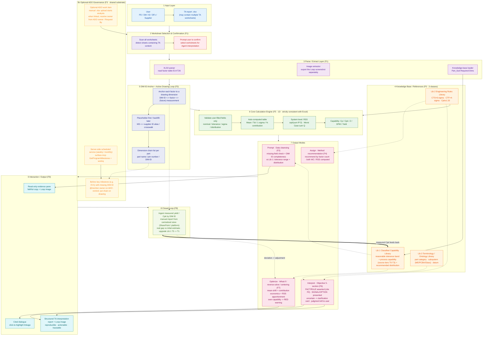

# System Architecture (V1)

> V1 end-to-end architecture of the Surface TA Analysis Agent.
> Scope: no drawing image recognition and no 3D VA for now. Data-to-drawing linking is done through DIM ID.

## Architecture Diagram

## Layer Notes

| Layer | User Story | Responsibility | Key points |
|---|---|---|---|
| 1 Input | — | Receive the user-uploaded `.xlsx` | May contain multiple TA worksheets |
| 2 Worksheet selection | F1 | Auto-detect worksheets with TA content and ask the user to confirm | Manual selection as a fallback |
| 3 Parse & extract | F1 | Read the factor table, extract the Loop screenshot, load the knowledge base | Factor table region is `E14:T26` |
| 4 Knowledge base | **F0** | Capability Library (Lib 1), Rules Library (Lib 2), Terminology Library (Lib 3) | Human-maintained; each entry carries source, confidence, and coverage; fed back by F8 |
| 5 DIM ID linking | **F3** | Link each factor to a drawing dimension via DIM ID and output a per-part dimension-chain list | Identifier-only linking, no image recognition; placeholder first, backfill later; grouped by category; locatable to the exact position |
| 5b ADO governance | **F3** | Optional ADO task link, owner assignment, server-side scheduled reminders, drawing reminders | Manual upload starts analysis; when ADO is linked, reminders use `surface-mcp` milestones and `workiq`, independent of the analysis |
| 6 Calculation engine | F5 | One-dimensional calculation, fully consistent with Excel formulas | Validates only user-filled fields |
| 7 Output modes | F2/F4/F6/F7 | Cleansing, method recommendation, objective interpretation, optimization | Interpretation must cite knowledge-base evidence; judgment left to the user; raises a clarification card when in doubt |
| 8 Closed loop | **F8** | Backfill measured Cpk by DIM ID, compare the real gap, and feed back into F0 | Manual import from a centralized store (SharePoint / platform) at first; auto-capture and write-back come later |
| 9 Interaction & output | **F9** | Read-only evidence pane, citable dialogue, structured report | Includes the Loop image; traceable and reproducible item by item |

> **Out of scope for now (may be merged into V1 later):** drawing image recognition and three-way consistency checks (user-filled values, drawing, knowledge base); automatic capture of measured data; automatically writing suggested specs back into Excel.

---
**Related docs:** [End-to-End Flow](02-end-to-end-flow.md) · [Differentiation](03-differentiation.md) · [Feature Breakdown](04-feature-breakdown.md) · [Design Decisions](05-design-decisions.md)
