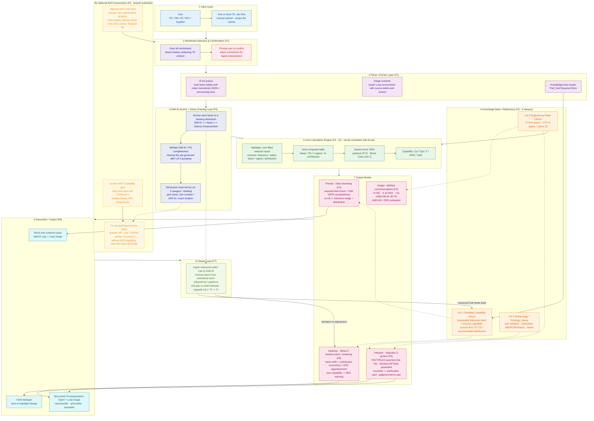

# System Architecture (V1)

> V1 end-to-end architecture of AI Assist Agent.
> Scope: no drawing image recognition and no 3D VA for now. Data-to-drawing linking is done through DIM ID.

## Architecture Diagram

## Layer Notes

| Layer | Feature | Responsibility | Key points |
|---|---|---|---|
| 1 Input | — | Receive one or more manually uploaded `.xlsx` files | File names must be unique; files may contain multiple TA worksheets |
| 2 Worksheet selection | F1 | Auto-detect worksheets with TA content and ask the user to confirm | Manual selection as a fallback |
| 3 Parse & extract | F1 | Read factor tables, extract Loop screenshots, and load the knowledge base | Retain normalized JSON, source labels, version, and processing trace |
| 4 Knowledge base | **F0** | Capability Library (Lib 1), Rules Library (Lib 2), Terminology Library (Lib 3) | Human-maintained; each entry carries source, confidence, and coverage; fed back by F7 |
| 5 DIM ID linking | **F3** | Link each factor to a drawing dimension and produce a drawing-governance list | Part Number currently equals Drawing Number. The formal key is `(Drawing Number, DIM ID)`; the same DIM ID may occur on different drawings, while duplicates on one drawing are conflicts. A one-digit numeric DIM ID is `suspected_invalid` and does not block TA. |
| 5b ADO governance | **F3** | Optional ADO link, owner assignment, Comment 0 update, and local-list fallback | F3 uses only Surface MCP. Every write follows `prepare -> confirm -> execute`; without ADO or required capabilities, the same confidential list is saved locally and TA continues. F3 does not read dates, evaluate deadline proximity, or run a scheduler. |
| 6 Calculation engine | F4 | One-dimensional calculation, fully consistent with Excel formulas | Validates only user-filled fields |
| 7 Output modes | F2/F4/F5/F6 | Cleansing, method recommendation, objective interpretation, and optimization | `<4` recommends WC; `4-10` recommends RSS; `>10` notifies DM for 3D VA while the engine still computes WC/RSS. Interpretation cites knowledge-base evidence; judgment remains with the user. |
| 8 Closed loop | **F7** | Backfill measured Cpk by DIM ID, compare the real gap, and feed back into F0 | Manual import from a centralized store (SharePoint / platform) at first; auto-capture and write-back come later |
| 9 Interaction & output | **F8** | Read-only evidence pane, citable dialogue, structured report | Includes the Loop image; traceable and reproducible item by item |

> **Out of scope for now:** drawing image recognition, DM-owned 3D variation analysis, automatic capture of measured data, and automatically writing suggested specs back into Excel.

---
**Related docs:** [End-to-End Flow](02-end-to-end-flow.md) · [Differentiation](03-differentiation.md) · [Feature Breakdown](04-feature-breakdown.md) · [Design Decisions](05-design-decisions.md)
