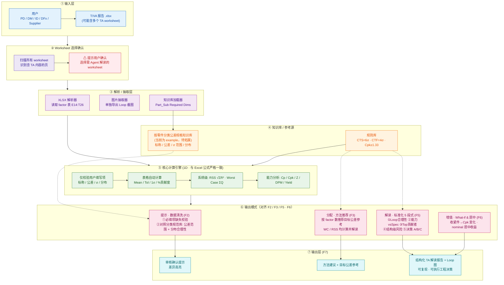

# System Architecture (V1) · 系统架构图

> Surface T/VA Analysis Agent — V1 端到端系统架构。
> 范围：不含图纸读取、不含 3D VA（见 V2 规划）。

## Architecture Diagram

## Layer Notes · 分层说明

| 层 | 职责 | 关键点 |
|---|---|---|
| ① 输入层 | 接收用户上传的 `.xlsx` | 可能含多个 TA worksheet |
| ② Worksheet 选择确认 | 自动识别含 TA 内容的页，提示用户确认 | 兜底人工选择 |
| ③ 解析 / 抽取层 | 读取 factor 表、抽取 Loop 截图、加载知识库 | factor 表区域 `E14:T26` |
| ④ 知识库 / 参考源 | 按零件分类规范库 + 规则库 | 规范库当前为 example，待拓展 |
| ⑤ 核心计算引擎 | 1D 计算，**与 Excel 公式严格一致** | 仅校验用户填写项，自动量不重算 |
| ⑥ 输出模式 | F2 清洗 / F3 方法推荐 / F5 解读 / F6 增值 | 对齐功能分解 |
| ⑦ 输出层 | 审核提示 / 方法建议 / 结构化解读报告 | 含 Loop 图，可复现可执行 |

> **V2 规划（本期不做）：** 图纸信息读取 → 三方一致性比对（用户值 ⇄ 图纸 ⇄ 知识库）。

---
**相关文档：** [端到端流程图](02-end-to-end-flow.md) · [差异化对比](03-differentiation.md) · [功能分解](04-feature-breakdown.md)
