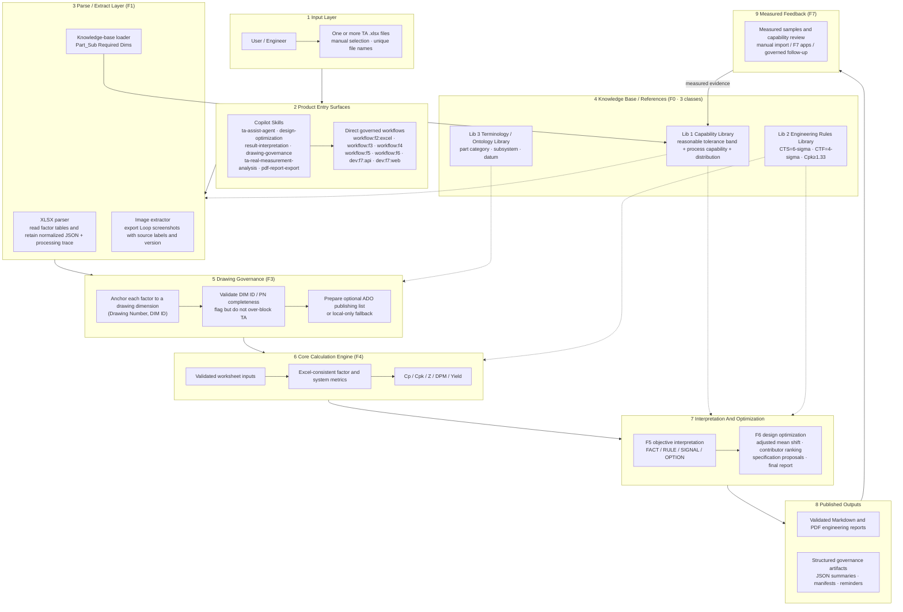

# System Architecture (Current)

> Current end-to-end architecture for TA Assist Agent after F8 and participant retirement.
> Supported product entry uses Copilot Skills or direct governed workflow scripts; no Workbench runtime or participant surface is required.

## Architecture Diagram

## Layer Notes

| Layer | Capability | Responsibility | Key points |
|---|---|---|---|
| 1 Input | — | Receive one or more manually provided `.xlsx` files | File names must be unique; files may contain multiple TA worksheets |
| 2 Entry surfaces | Skills + workflows | Start the governed product flow or a direct engineering phase | Supported product entry is Copilot Skills plus direct workflow scripts |
| 3 Parse & extract | F1 | Read factor tables, extract Loop screenshots, and retain worksheet evidence | Preserve normalized JSON, source labels, version, and processing trace |
| 4 Knowledge base | F0 | Capability, rules, and terminology libraries | Human-maintained; versioned; read-only during analysis |
| 5 Drawing governance | F3 | Link each factor to drawing evidence and manage optional ADO publication | Formal key is `(Drawing Number, DIM ID)`; missing IDs stay visible without rewriting workbook data |
| 6 Calculation engine | F4 | One-dimensional calculation fully consistent with Excel formulas | Validates only user-filled fields; computes both WC and RSS where in scope |
| 7 Interpretation and optimization | F5 / F6 | Governed interpretation, clarification gates, and optimization options | F5 owns baseline evidence; F6 owns ranked improvement outputs and final report publication |
| 8 Published outputs | Reports + artifacts | Publish validated Markdown/PDF plus governed summaries and manifests | Inputs remain read-only; fail-closed validation stays in place |
| 9 Measured feedback | F7 | Backfill measured capability by DIM ID and compare against baseline | Remains a separate follow-up workflow and application surface |

## Product Entry Surfaces

- **Complete workbook product run:** `ta-assist-agent` skill, which delegates to `design-optimization` and `pdf-report-export`.
- **Capability-specific skill entry:** `result-interpretation`, `drawing-governance`, `ta-real-measurement-analysis`, and related governed skills.
- **Direct engineering entry:** deterministic `workflow:f2:excel`, `workflow:f3`, `workflow:f4`, `workflow:f5`, `workflow:f6`, and the independent F7 applications.

No active documentation path requires a retired participant or F8 runtime.

## F5 and F6 Governance Boundary

F5 directly consumes controlled F0/F1/F3/F4 artifacts; a workbook-started run must first pass the F2 handoff gate. It owns baseline `FACT`/`RULE`/`SIGNAL`, clarifications, and optional v2 image evidence while retaining v1 read-only compatibility. Sections 4 and 5 remain `delegated_to_f6` in the detailed F5 report.

F6 then binds exact F2/F3/F4/F5 roots and selected worksheets. It generates target-driven scenarios only from caller-authorized targets, review-gated mean centering, target-Cpk reverse solves, governed RSS allocation policies, feasibility, impact ranking, and cost-gated ROI. Supplier, datum, or cost claims without bound evidence remain `insufficient_evidence`. F6 atomically publishes `Feature6-Report.md`, `Feature6-Optimization.json/.md`, `Feature6-Run-Summary.json`, and `manifest.json`; blocked worksheets appear only in workbook input validation.

> **Out of scope for now:** automatic extraction of drawing truth, DM-owned 3D variation analysis, automatic measured-data capture, and automatic workbook write-back.
