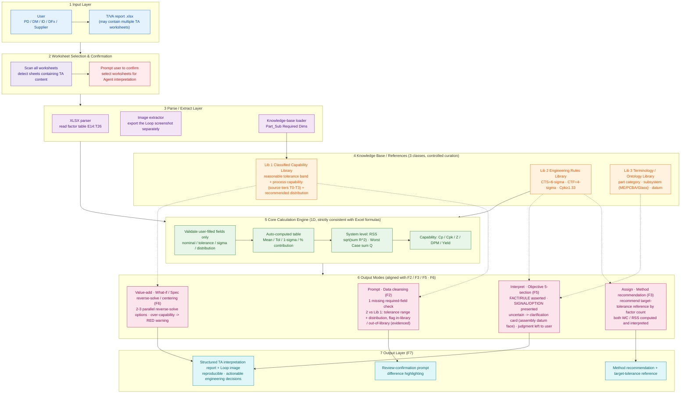

# System Architecture (V1)

> Surface T/VA Analysis Agent — V1 end-to-end system architecture.
> Scope: no drawing-content reading, no 3D VA (see V2 backlog).

## Architecture Diagram

## Layer Notes

| Layer | Responsibility | Key points |
|---|---|---|
| 1 Input | Receive the user-uploaded `.xlsx` | May contain multiple TA worksheets |
| 2 Worksheet selection | Auto-detect sheets with TA content, ask user to confirm | Manual fallback selection |
| 3 Parse / Extract | Read factor table, extract Loop screenshot, load knowledge base | Factor table region `E14:T26` |
| 4 Knowledge base | Lib 1 Classified Capability Library + Lib 2 Engineering Rules Library + Lib 3 Terminology / Ontology Library | Human-curated; entries carry source tier / confidence; coverage published |
| 5 Core engine | 1D calculation, **strictly consistent with Excel formulas** | Validates user-filled fields only; auto-computed quantities not recomputed |
| 6 Output modes | F2 cleansing / F3 method recommendation / F5 objective interpretation / F6 value-add reverse-solve | Interpretation only states evidence, judgment left to user; uncertain -> clarification card |
| 7 Output | Review prompt / method recommendation / structured interpretation report | Includes Loop image, per-item traceable, reproducible |

> **V2 backlog (out of scope this cycle):** Drawing-content reading -> three-way consistency check (user value ⇄ drawing ⇄ knowledge base); closed-loop knowledge-base feedback (feed measured Cpk back into Lib 1).

---
**Related docs:** [End-to-End Flow](02-end-to-end-flow.md) · [Differentiation](03-differentiation.md) · [Feature Breakdown](04-feature-breakdown.md) · [Design Decisions](05-design-decisions.md)
