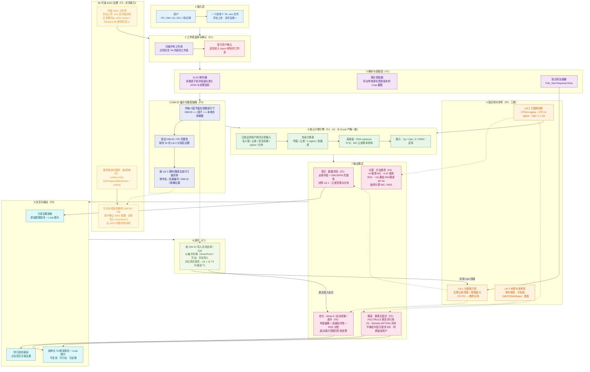

# 系统架构映射（V1）

> 本文是 [英文系统架构](01-architecture.md) 的中文映射版，逐项对应 V1 的输入、解析、知识库、DIM ID、可选 ADO 治理、计算、解读、输出和实测闭环。
> 范围：V1 不包含图纸图片识别或 3D VA 执行；数据与图纸通过 DIM ID 关联。

## 架构图

## 图层映射

| 图层 | Feature | 职责 | 关键说明 |
|---|---|---|---|
| 1 输入 | — | 接收手动上传的一个或多个 `.xlsx` 文件 | 文件名必须唯一；一个文件可包含多个 TA 工作表 |
| 2 工作表选择 | F1 | 自动识别含 TA 内容的工作表，并由用户确认 | 自动识别失败时支持手动选择 |
| 3 解析与提取 | F1 | 读取因子表、提取 Loop 截图、加载知识库 | 保留标准化 JSON、来源标签、版本和处理追踪 |
| 4 知识库 | **F0** | Lib 1 能力库、Lib 2 规则库、Lib 3 术语库 | 人工维护；每项带来源、置信度和覆盖范围；由 F7 回填 |
| 5 DIM ID 关联 | **F3** | 通过 DIM ID 关联因子与图纸尺寸，并为缺失 ID/PN 项生成尺寸链清单 | 仅标识符关联，不进行图片识别；按 Lib 3 类别/图纸分组并定位到精确位置 |
| 5b ADO 治理 | **F3** | 可选 ADO 关联、负责人解析、缺失 ID 提醒和本地清单回退 | 有 ADO 时用户确认提醒并将清单写入 Comment 0；无 ADO 时保存到本地；已关联 ADO 可独立执行里程碑提醒 |
| 6 计算引擎 | F4 | 与 Excel 公式一致的一维计算 | 仅使用经过验证的用户填写字段 |
| 7 输出模式 | F2/F4/F5/F6 | 清洗、方法推荐、客观解读和优化 | `<4` 推荐 WC；`4-10` 推荐 RSS；`>10` 通知 DM 跟进 3D VA，核心引擎仍计算 WC/RSS；最终判断由用户做出 |
| 8 闭环 | **F7** | 按 DIM ID 回填实测 Cpk、对比真实差异、回填 F0 | 初期从集中存储手动导入；自动采集和自动回写属于后续范围 |
| 9 交互与输出 | **F8** | 只读证据面板、可引用解读与结构化报告 | 包含 Loop 图片；逐项可追溯与可复现 |

> **当前不在范围内：** 图纸图片识别、由 DM 负责执行的 3D VA、自动采集实测数据，以及将建议规格自动写回 Excel。

---
**相关文档：** [英文架构](01-architecture.md) · [端到端流程](02-端到端流程.md) · [英文端到端流程](02-end-to-end-flow.md) · [功能拆分](04-feature-breakdown.md) · [设计决策](05-design-decisions.md)