# End-to-End Flow (V1)

> The full runtime flow, from a user uploading the `.xlsx` to producing a structured interpretation report, including the closed loop that feeds measured Cpk back into the knowledge base.
> The `(Fx)` labels in the diagram map to the Feature IDs in the [Feature Breakdown](04-feature-breakdown.md).

## Flow Diagram

```mermaid
flowchart TB
    A["Upload one or more TA .xlsx files (F1)<br>Manual upload is required · unique file names"] --> ADO{"Create or link ADO work item? (F3)"}
    ADO -- Yes --> ADO1["Create/link task and resolve project path + owner<br>Return ADO ID and hyperlink"]
    ADO -- No --> A1
    ADO1 --> A1["Scan all workbooks and worksheets for TA content (F1)<br>Batch process · list file, sheet, version/date, and tolerance-loop description"]
    A1 --> A2{"User confirms analysis scope<br>single select · multi-select · select all · cancel"}
    A2 -- Confirmed worksheets --> P["Parse factor tables in parallel (F1)<br>Read worksheet data and save debug JSON<br>Record file/sheet/version/date and processing time"]
    A2 -- Cancel --> X["End run without analysis"]
    A2 --> IMG["Extract Loop screenshot in parallel (F1)<br>Tag with file, worksheet, and loop description<br>Store with file/sheet/version/date"]
    P --> JOIN["Merge parsed factors and tagged Loop image"]
    IMG --> JOIN

    JOIN --> D{"Cleansing against F0 knowledge base (F2)<br>Required fields · DIM ID / PN completeness<br>Capability range and distribution check"}
    D --> REQ{"Nominal or tolerance missing?"}
    REQ -- Yes: blocking --> FIX["Show missing-field list and require Excel correction<br>User updates workbook and re-uploads"]
    FIX --> A
    REQ -- No --> DIFF{"Other differences?<br>out-of-library tolerance · distribution<br>missing DIM ID or PN"}
    DIFF -- No --> LINK
    DIFF -- Yes --> REVIEW["Flag differences and show user review choices"]
    REVIEW --> CHOICE{"Resolve the difference?"}
    CHOICE -- Edit source Excel --> FIX
    CHOICE -- Continue with recorded exception --> LINK

    LINK{"DIM ID or PN missing?"}
    LINK -- No --> GROUP["Group by Lib 3 part category / drawing (F3)<br>Create per-part dimension-chain list<br>part name · join number · DIM ID · exact location"]
    LINK -- Yes --> PLACE["Create placeholder and track missing DIM ID / PN (F3)<br>Analysis may continue"]
    PLACE --> GROUP
    PLACE -. ADO work item linked .-> NOW["Immediate ADO reminder<br>@mention owner to complete DIM IDs and drawing markup"]
    NOW --> SCHED["Scheduled governance (F3)<br>weekly/monthly: surface-mcp milestones + workiq open items<br>Before EV1 or other key milestone, remind owner on ADO"]
    SCHED --> STATE["Record state and history on ADO<br>placeholder → DIM ID filled → marked on drawing"]
    STATE -. completed IDs .-> GROUP

    GROUP --> G{"Method recommendation (F4)<br>based on factor count"}
    G -- &lt; 4 factors --> H1["Recommend Worst Case<br>sum of tolerance"]
    G -- 4 to 10 factors --> H2["Recommend 1D RSS<br>sqrt(sum R^2)"]
    G -- &gt; 10 factors --> H3["Refer to DM team for 3D VA<br>not in V1"]
    H3 --> DM["End this automated 1D analysis path<br>DM team owns the 3D VA follow-up"]
    H1 --> I["Core calculation engine (F5)<br>Compute both WC and RSS"]
    H2 --> I
    I --> J["Capability analysis<br>Cp · Cpk · Z · DPM · Yield"]
    J --> CC{"Evidence sufficient?<br>datum face / stack start / cross-subsystem"}
    CC -- No --> CQ["Clarification card: stop dependent conclusions<br>Continue after engineer confirmation"]
    CQ --> L
    CC -- Yes --> L["Objective interpretation (F6)<br>FACT and RULE cite F0 entries<br>SIGNAL and OPTION are unranked"]
    L --> M1["Loop validity"]
    L --> M2["Capability vs. spec"]
    L --> M3["Top contributors"]
    L --> M4["Structural risk"]
    L --> M5["Parallel options"]
    L --> M6["Optimization (F7)<br>centering · contribution economics · RSS apportionment<br>reverse-solve 2-3 options"]
    M1 --> N["Read-only evidence pane + cited report + Loop image (F9)<br>Traceable and reproducible per item"]
    M2 --> N
    M3 --> N
    M4 --> N
    M5 --> N
    M6 --> N

    N --> R{"Measured yield / Cpk available?"}
    R -- No: wait for later measurement --> WAIT["Baseline report remains available<br>Await later measured-data import"]
    R -- Yes: manual import by DIM ID --> CL["Closed loop (F8)<br>Compare estimate vs. actual and recompute real capability<br>Upgrade Lib 1 evidence tier T3 to T1"]
    CL -. Significant gap .-> M6
    CL ==>|Feed measured evidence| KB["Knowledge Base (F0)"]

    A:::start
    ADO:::dec
    ADO1:::orch
    A1:::proc
    A2:::dec
    P:::proc
    IMG:::proc
    JOIN:::proc
    X:::done
    D:::dec
    REQ:::dec
    FIX:::warn
    DIFF:::dec
    REVIEW:::warn
    CHOICE:::dec
    LINK:::dec
    PLACE:::warn
    NOW:::orch
    SCHED:::orch
    STATE:::orch
    GROUP:::link
    G:::dec
    H1:::proc
    H2:::proc
    H3:::oos
    DM:::oos
    I:::proc
    J:::proc
    CC:::dec
    CQ:::warn
    L:::proc
    M1:::proc
    M2:::proc
    M3:::proc
    M4:::proc
    M5:::proc
    M6:::proc
    N:::done
    R:::dec
    WAIT:::done
    CL:::loop
    KB:::loop
    classDef start fill:#e3f2fd,stroke:#1565c0,color:#0d47a1
    classDef proc fill:#e8f5e9,stroke:#2e7d32,color:#1b5e20
    classDef dec fill:#fff3e0,stroke:#ef6c00,color:#e65100
    classDef warn fill:#ffebee,stroke:#c62828,color:#b71c1c
    classDef oos fill:#fffde7,stroke:#f9a825,color:#f57f17
    classDef link fill:#e8eaf6,stroke:#3949ab,color:#1a237e
    classDef loop fill:#f1f8e9,stroke:#558b2f,color:#33691e
    classDef done fill:#c8e6c9,stroke:#2e7d32,color:#1b5e20
    classDef orch fill:#fff8e1,stroke:#f9a825,color:#f57f17
```

## Key Decision Points

| Node | Decision | Branches |
|---|---|---|
| ADO orchestration | Whether an ADO task is created or linked | Optional ADO task → resolve owner, return its ID/link, and enable reminders; no task → run the analysis without ADO governance |
| Worksheet confirmation | Which worksheets go into interpretation | User selects one, many, or all detected TA worksheets; cancelling ends the run |
| Required fields | Whether nominal and tolerance are present | Missing → block the run until the user corrects and re-uploads the workbook; present → continue |
| Cleansing consistency | Whether the capability library, distribution, DIM ID, and PN align | Out-of-library or incomplete items are flagged; the user can edit the source or continue with a recorded exception |
| DIM ID linking | Whether the factor is already linked to a drawing dimension | Linked → generate the dimension-chain list; missing → create a placeholder and continue analysis |
| ADO governance | Whether a linked ADO item has missing identifiers near a milestone | Send an immediate owner reminder, then scheduled milestone-based reminders; track `placeholder → DIM ID filled → marked on drawing` |
| Method recommendation | Number of factors | `<4` use WC; `4–10` use RSS; `>10` refer to the DM team |
| Uncertainty confirmation | Whether the assembly datum face or cross-subsystem is ambiguous | Raise a clarification card and stop to confirm first |
| Measured feedback | When measured Cpk arrives later | Compare estimated vs. real gap and upgrade the capability-library entry |

> Multiple worksheets can be processed in parallel for speed, but review is still done page by page and gated by a human.
> Interpretation gives only `FACT` (computed result) and `RULE` (threshold check), citing knowledge-base entries; `SIGNAL` (a flag) and `OPTION` (alternatives) are presented in parallel and not ranked — the final judgment is left to the user.

---
**Related docs:** [Architecture](01-architecture.md) · [Differentiation](03-differentiation.md) · [Feature Breakdown](04-feature-breakdown.md) · [Design Decisions](05-design-decisions.md)
