```mermaid
flowchart TB
    A["Upload one or more TA .xlsx files (F1)<br>Manual upload is required · unique file names"] --> ADO{"Create or link an ADO work item? (F3)"}
    ADO -- Yes --> ADO1["Create or link task (F3)<br>Resolve project path and owner<br>Output: ADO ID, hyperlink, storage location, and version history"]
    ADO -- No --> A1["Scan all workbooks and worksheets for TA content (F1)<br>Output: file name, worksheet, version/date, tolerance-loop description, and worksheet list"]
    ADO1 --> A1
    A1 --> A2{"Confirm analysis scope (F1)<br>Single select · multi-select · select all · cancel"}
    A2 -- Confirmed worksheets --> P["Parse factor tables in parallel (F1)<br>Output: normalized JSON and processing trace"]
    A2 -- Cancel --> X["End run without analysis"]
    A2 --> IMG["Extract Loop screenshots in parallel (F1)<br>Add source labels and retain by version"]
    P --> JOIN["Merge factor data and tagged Loop images"]
    IMG --> JOIN
    JOIN --> D{"Clean data against the F0 knowledge base (F2)<br>Check required fields, DIM ID/PN, capability range, and distribution"}
    D --> REQ{"Are required fields complete? (F2)<br>Nominal, tolerance, safety factor, sigma level, distribution, factor description, and part name"}
    REQ -- Yes --> DIFF{"Any other differences? (F2)<br>Outside knowledge-base range · unreasonable distribution · missing DIM ID/PN<br>Show all reminders at once"}
    REQ -- No --> FIX["Summarize missing fields and request Excel correction (F2)<br>User re-uploads the workbook"]
    FIX --> A
    DIFF -- No --> LINK{"Is DIM ID or PN missing? (F3)"}
    DIFF -- Yes --> REVIEW["Flag differences and show handling options (F2)"]
    REVIEW --> CHOICE{"How should the difference be handled? (F2)"}
    CHOICE -- Edit source Excel --> FIX
    CHOICE -- Continue with recorded exception --> LINK
    LINK -- No --> G{"Method recommendation (F4)<br>Based on factor count"}
    LINK -- Yes --> GROUP["Group by Lib 3 part category / drawing (F3)<br>Output: dimension-chain list with part, join number, DIM ID, exact location, and part category"]
    GROUP --> ADOREM{"Was an ADO work item created or linked? (F3)<br>Use the prior user choice internally"}
    ADOREM -- Yes --> NOW["After user confirmation, send ADO reminder (F3)<br>@mention owner to complete DIM ID and write the missing list to Comment 0"]
    ADOREM -- No --> LOCAL["Save the missing DIM ID / PN list locally (F3)"]
    NOW --> G
    LOCAL --> G
    G -- Fewer than 4 factors --> H1["Recommend Worst Case (WC) (F4)<br>Arithmetic tolerance sum"]
    G -- 4 to 10 factors --> H2["Recommend 1D RSS (F4)<br>sqrt(sum R^2)"]
    G -- More than 10 factors --> DM["Notify DM team for 3D VA follow-up (F4)<br>Flag cumulative tolerance risk"]
    H1 --> I["Core calculation engine (F4)<br>Calculate both WC and RSS"]
    H2 --> I
    DM --> I
    I --> J["Capability analysis (F4)<br>Cp · Cpk · Z · DPM · Yield"]
    J --> CC{"Is evidence sufficient? (F5)<br>Assembly datum face / stack start / cross-subsystem"}
    CC -- No --> CQ["Clarification card (F5): pause only conclusions dependent on the missing information<br>Engineer confirms before continuing"]
    CQ --> L["Objective interpretation (F5)<br>FACT and RULE cite F0 entries<br>SIGNAL and OPTION are unranked"]
    CC -- Yes --> L
    L --> M1["Loop validity (F5)<br>Optional: further investigate image-model effectiveness"]
    L --> M2["Capability versus specification (F5)"]
    L --> M3["Top contributors (F5)"]
    L --> M4["Structural risks (F5)"]
    L --> M5["Parallel improvement options (F5)<br>Provide multiple options when targets are not met"]
    L --> M6["Optimization (F6)<br>Centering · contribution economics · RSS apportionment<br>Reverse-solve 2-3 options; real-time bar feedback<br><br>With ADO: link ADO and save date, milestone, version, and attachment1<br>Without ADO: save locally"]
    M1 --> N["User view (F8)<br>Read-only evidence pane, cited report, and Loop images<br>Traceable and reproducible"]
    M2 --> N
    M3 --> N
    M4 --> N
    M5 --> N
    N --> M6
    M6 --> R{"Is measured yield / Cpk available? (F7)"}
    R -- No: wait for later measurement --> WAIT["Retain baseline report (F7)<br>Await later measured-data import"]
    R -- Yes: manual import by DIM ID --> CL["Closed loop (F7)<br>Compare estimate with actual and recompute real capability<br>Upgrade Lib 1 evidence tier from T3 to T1<br><br>Output actual tolerance range and optimization report: attachment2"]
    CL -->|Feed measured evidence| KB["Knowledge Base (F0)"]

    A:::start
    ADO:::dec
    ADO1:::orch
    A1:::proc
    A2:::dec
    P:::proc
    X:::done
    IMG:::proc
    JOIN:::proc
    D:::dec
    REQ:::dec
    FIX:::warn
    DIFF:::dec
    LINK:::dec
    REVIEW:::warn
    CHOICE:::dec
    G:::dec
    GROUP:::link
    ADOREM:::dec
    NOW:::orch
    LOCAL:::warn
    H1:::proc
    H2:::proc
    DM:::oos
    I:::proc
    J:::proc
    CC:::dec
    CQ:::warn
    L:::proc
    M1:::proc
    M2:::proc
    M3:::proc
    M4:::proc
    M5:::proc
    M6:::proc
    N:::done
    R:::dec
    WAIT:::done
    CL:::loop
    KB:::loop
    classDef start fill:#e3f2fd,stroke:#1565c0,color:#0d47a1
    classDef proc fill:#e8f5e9,stroke:#2e7d32,color:#1b5e20
    classDef dec fill:#fff3e0,stroke:#ef6c00,color:#e65100
    classDef warn fill:#ffebee,stroke:#c62828,color:#b71c1c
    classDef oos fill:#fffde7,stroke:#f9a825,color:#f57f17
    classDef link fill:#e8eaf6,stroke:#3949ab,color:#1a237e
    classDef loop fill:#f1f8e9,stroke:#558b2f,color:#33691e
    classDef done fill:#c8e6c9,stroke:#2e7d32,color:#1b5e20
    classDef orch fill:#fff8e1,stroke:#f9a825,color:#f57f17
```

```mermaid
flowchart TB
    A["Upload one or more TA .xlsx files (F1)<br>Manual upload is required · unique file names"] --> ADO{"Create or link ADO work item? (F3)"}
    ADO -- Yes --> ADO1["Create/link task and resolve project path + owner<br>Return ADO ID and hyperlink"]
    ADO -- No --> A1
    ADO1 --> A1["Scan all workbooks and worksheets for TA content (F1)<br>Batch process · list file, sheet, version/date, and tolerance-loop description"]
    A1 --> A2{"User confirms analysis scope<br>single select · multi-select · select all · cancel"}
    A2 -- Confirmed worksheets --> P["Parse factor tables in parallel (F1)<br>Read worksheet data and save debug JSON<br>Record file/sheet/version/date and processing time"]
    A2 -- Cancel --> X["End run without analysis"]
    A2 --> IMG["Extract Loop screenshot in parallel (F1)<br>Tag with file, worksheet, and loop description<br>Store with file/sheet/version/date"]
    P --> JOIN["Merge parsed factors and tagged Loop image"]
    IMG --> JOIN

    JOIN --> D{"Cleansing against F0 knowledge base (F2)<br>Required fields · DIM ID / PN completeness<br>Capability range and distribution check"}
    D --> REQ{"Nominal or tolerance missing?"}
    REQ -- Yes: blocking --> FIX["Show missing-field list and require Excel correction<br>User updates workbook and re-uploads"]
    FIX --> A
    REQ -- No --> DIFF{"Other differences?<br>out-of-library tolerance · distribution<br>missing DIM ID or PN"}
    DIFF -- No --> LINK
    DIFF -- Yes --> REVIEW["Flag differences and show user review choices"]
    REVIEW --> CHOICE{"Resolve the difference?"}
    CHOICE -- Edit source Excel --> FIX
    CHOICE -- Continue with recorded exception --> LINK

    LINK{"DIM ID or PN missing?"}
    LINK -- No --> GROUP["Group by Lib 3 part category / drawing (F3)<br>Create per-part dimension-chain list<br>part name · join number · DIM ID · exact location"]
    LINK -- Yes --> PLACE["Create placeholder and track missing DIM ID / PN (F3)<br>Analysis may continue"]
    PLACE --> GROUP
    PLACE -. ADO work item linked .-> NOW["Surface MCP Comment 0 update (F3)<br>prepare diff → explicit user confirmation → execute once"]
    NOW --> STATE["Record the controlled Comment 0 version and content hash<br>without ADO/capability, keep the same confidential list locally"]
    STATE -. completed IDs .-> GROUP

    GROUP --> G{"Method recommendation (F4)<br>based on factor count"}
    G -- &lt; 4 factors --> H1["Recommend Worst Case<br>sum of tolerance"]
    G -- 4 to 10 factors --> H2["Recommend 1D RSS<br>sqrt(sum R^2)"]
    G -- &gt; 10 factors --> H3["Refer to DM team for 3D VA<br>not in V1"]
    H3 --> DM["End this automated 1D analysis path<br>DM team owns the 3D VA follow-up"]
    H1 --> I["Core calculation engine (F4)<br>Compute both WC and RSS"]
    H2 --> I
    I --> J["Capability analysis (F4)<br>Cp · Cpk · Z · DPM · Yield"]
    J --> CC{"Evidence sufficient? (F5)<br>datum face / stack start / cross-subsystem"}
    CC -- No --> CQ["Clarification card (F5): stop dependent conclusions<br>Continue after engineer confirmation"]
    CQ --> L
    CC -- Yes --> L["Objective interpretation (F5)<br>FACT and RULE cite F0 entries<br>SIGNAL and OPTION are unranked"]
    L --> M1["Loop validity (F5)"]
    L --> M2["Capability vs. spec (F5)"]
    L --> M3["Top contributors (F5)"]
    L --> M4["Structural risk (F5)"]
    L --> M5["Parallel options (F5)"]
    L --> M6["Optimization (F6)<br>centering · contribution economics · RSS apportionment<br>reverse-solve 2-3 options"]
    M1 --> N["Read-only evidence pane + cited report + Loop image (F8)<br>Traceable and reproducible per item"]
    M2 --> N
    M3 --> N
    M4 --> N
    M5 --> N
    M6 --> N

    N --> R{"Measured yield / Cpk available? (F7)"}
    R -- No: wait for later measurement --> WAIT["Baseline report remains available (F7)<br>Await later measured-data import"]
    R -- Yes: manual import by DIM ID --> CL["Closed loop (F7)<br>Compare estimate vs. actual and recompute real capability<br>Upgrade Lib 1 evidence tier T3 to T1"]
    CL -. Significant gap .-> M6
    CL ==>|Feed measured evidence| KB["Knowledge Base (F0)"]

    A:::start
    ADO:::dec
    ADO1:::orch
    A1:::proc
    A2:::dec
    P:::proc
    IMG:::proc
    JOIN:::proc
    X:::done
    D:::dec
    REQ:::dec
    FIX:::warn
    DIFF:::dec
    REVIEW:::warn
    CHOICE:::dec
    LINK:::dec
    PLACE:::warn
    NOW:::orch
    STATE:::orch
    GROUP:::link
    G:::dec
    H1:::proc
    H2:::proc
    H3:::oos
    DM:::oos
    I:::proc
    J:::proc
    CC:::dec
    CQ:::warn
    L:::proc
    M1:::proc
    M2:::proc
    M3:::proc
    M4:::proc
    M5:::proc
    M6:::proc
    N:::done
    R:::dec
    WAIT:::done
    CL:::loop
    KB:::loop
    classDef start fill:#e3f2fd,stroke:#1565c0,color:#0d47a1
    classDef proc fill:#e8f5e9,stroke:#2e7d32,color:#1b5e20
    classDef dec fill:#fff3e0,stroke:#ef6c00,color:#e65100
    classDef warn fill:#ffebee,stroke:#c62828,color:#b71c1c
    classDef oos fill:#fffde7,stroke:#f9a825,color:#f57f17
    classDef link fill:#e8eaf6,stroke:#3949ab,color:#1a237e
    classDef loop fill:#f1f8e9,stroke:#558b2f,color:#33691e
    classDef done fill:#c8e6c9,stroke:#2e7d32,color:#1b5e20
    classDef orch fill:#fff8e1,stroke:#f9a825,color:#f57f17
```

# End-to-End Flow (V1)

> The complete runtime flow, from an engineer uploading `.xlsx` files to producing a structured interpretation report, including the closed loop that feeds measured Cpk back into the knowledge base.
> The `(Fx)` labels in the diagram map to the Feature IDs in the [Feature Breakdown](04-feature-breakdown.md).

## Flow Diagram

## Key Decision Points

| Node | Decision | Branch handling |
|---|---|---|
| ADO orchestration | Whether an ADO task is created or linked | ADO is optional. When linked, resolve the owner, return its ID/link, and enable reminders; without ADO, analysis still runs. |
| Worksheet confirmation | Which worksheets enter the analysis | The prompt returns options and a workbook content hash. The user explicitly confirms one or more worksheets against that hash; a changed workbook makes the confirmation stale and fails closed. |
| Required fields | Whether factor inputs, cross-section evidence, Lower Spec Limit, Upper Spec Limit, and Target σ Level are complete | Missing evidence blocks only the affected worksheet. Ready worksheets continue and each emits exactly one F4 handoff. Drawing Number, DIM ID, and Part Number remain non-blocking governance signals. |
| Cleansing consistency | Whether the capability library, distribution, DIM ID, and PN align | Out-of-library or incomplete items are flagged at once. The user can edit the source Excel or continue with a recorded exception. |
| DIM ID association | Whether the factor is linked to a drawing dimension | Linked factors go directly to method recommendation; missing IDs are grouped by Lib 3 category/drawing before governance. |
| ADO governance | Whether a grouped missing-item list has an ADO work item | Reuse the upload-stage ADO choice. With ADO, the user confirms a reminder and the list is added to Comment 0; otherwise, save the list locally. |
| Method recommendation | Factor count | `<4` recommends WC; `4-10` recommends RSS; `>10` notifies the DM team for 3D VA. The core engine always calculates both WC and RSS. |
| Evidence sufficiency | Whether datum-face, stack-start, or cross-subsystem evidence is ambiguous | Show a clarification card and pause only conclusions that depend on the missing information. |
| Optimization and versioning | Whether design or capability changes are needed | Provide centering, contribution, tolerance, and specification options with real-time feedback. Save the version to linked ADO or locally. |
| Measured data feedback | Whether measured Cpk is available after optimization | Compare estimated and actual capability, output actual tolerance range and optimization report, and upgrade the capability-library entry; otherwise retain the baseline report. |

> Multiple worksheets can be processed in parallel for speed, but review is still completed page by page with a human gate.
> Interpretation states only `FACT` (calculated result) and `RULE` (threshold check), citing knowledge-base entries. `SIGNAL` (attention item) and `OPTION` (alternative) are presented in parallel and unranked; the ME engineer makes the final decision.

---
**Related docs:** [Architecture](01-architecture.md) · [Differentiation](03-differentiation.md) · [Feature Breakdown](04-feature-breakdown.md) · [Design Decisions](05-design-decisions.md)# End-to-End Flow (V1)

> The full runtime flow, from a user uploading the `.xlsx` to producing a structured interpretation report, including the closed loop that feeds measured Cpk back into the knowledge base.
> The `(Fx)` labels in the diagram map to the Feature IDs in the [Feature Breakdown](04-feature-breakdown.md).

## Flow Diagram

## Key Decision Points

| Node | Decision | Branches |
|---|---|---|
| ADO orchestration | Whether an ADO task is created or linked | Optional ADO task → resolve owner, return its ID/link, and enable reminders; no task → run the analysis without ADO governance |
| Worksheet confirmation | Which worksheets go into interpretation | The prompt returns options and a workbook content hash; explicit confirmation is hash-bound, and stale confirmation fails closed |
| Required fields | Whether factor inputs, cross-section evidence, Lower Spec Limit, Upper Spec Limit, and Target σ Level are present | Missing evidence blocks only that worksheet; each ready worksheet emits exactly one F4 handoff. Drawing Number, DIM ID, and Part Number are non-blocking governance signals |
| Cleansing consistency | Whether the capability library, distribution, DIM ID, and PN align | Out-of-library or incomplete items are flagged; the user can edit the source or continue with a recorded exception |
| DIM ID linking | Whether the factor is already linked to a drawing dimension | Linked → generate the dimension-chain list; missing → create a placeholder and continue analysis |
| ADO governance | Whether an ADO item is linked and Surface MCP has the required capabilities | Prepare a Comment 0 diff, require explicit user confirmation, then execute once. Without ADO/capability, save the same confidential list locally and continue TA. F3 does not read dates, evaluate deadline proximity, or run a scheduler. |
| Method recommendation | Number of factors | `<4` use WC; `4–10` use RSS; `>10` refer to the DM team |
| Uncertainty confirmation | Whether the assembly datum face or cross-subsystem is ambiguous | Raise a clarification card and stop to confirm first |
| Measured feedback | When measured Cpk arrives later | Compare estimated vs. real gap and upgrade the capability-library entry |

> Multiple worksheets can be processed in parallel for speed, but review is still done page by page and gated by a human.
> Interpretation gives only `FACT` (computed result) and `RULE` (threshold check), citing knowledge-base entries; `SIGNAL` (a flag) and `OPTION` (alternatives) are presented in parallel and not ranked — the final judgment is left to the user.
> F3 treats Part Number as Drawing Number for the current contract. Its formal identity is `(Drawing Number, DIM ID)`: reuse across drawings is valid, duplicates within one drawing conflict, and a one-digit numeric DIM ID is nonblocking `suspected_invalid`.

---
**Related docs:** [Architecture](01-architecture.md) · [Differentiation](03-differentiation.md) · [Feature Breakdown](04-feature-breakdown.md) · [Design Decisions](05-design-decisions.md)
