# End-to-End Flow (V1)

> The complete runtime flow from the user uploading `.xlsx` to producing a structured interpretation report, with the measured-Cpk closed loop feeding back into the knowledge base.
> The `(Fx)` labels on nodes map to the User Story IDs in the [Feature Breakdown](04-feature-breakdown.md).

## Flow Chart

```mermaid
flowchart TD
    A["User creates ADO work item + attaches .xlsx (S3)<br/>auto-trigger · owner from ADO owner / Request By"] --> A1["Scan worksheets, detect TA content (S1)"]
    A1 --> A2{"User confirmation<br/>select worksheets for TA analysis"}
    A2 --> B["Parse selected worksheets, read factor specs (S1)"]
    B --> C["Extract the dimension-chain Loop screenshot (S1)"]
    C --> D{"Data cleansing (S2)<br/>missing-field + DIM ID completeness<br/>vs Classified Capability Library"}
    D --> E{"Consistent?"}
    E -->|"Inconsistent"| E1["Flag differences<br/>prompt user to review and confirm"]
    E1 --> E2{"How to handle the difference?"}
    E2 -->|"User edits Excel"| E3a["User updates the sheet and re-uploads"]
    E2 -->|"Agent edits data and recomputes"| E3b["Agent adjusts data, re-analyzes"]
    E3a --> LK
    E3b --> LK
    E -->|"Consistent"| LK["Anchor factors to drawing dims by DIM ID (S3)<br/>placeholder-first if no ID yet"]
    LK --> LG["Group by part category (Lib 3 ontology) + per-part dimension-chain list (S3)<br/>part name / join number / DIM ID"]
    LK -.->|"placeholder / missing DIM ID"| SCH["Server-side scheduled service weekly / monthly (S3)<br/>surface-mcp milestones + workiq"]
    SCH -.->|"near EV1"| RM["@mention owner on ADO (S3)<br/>backfill DIM ID · put chain on drawing"]
    LG --> F["Proceed to method recommendation"]
    F --> G{"Method recommendation (S4)<br/>by factor count"}
    G -->|"&lt; 4 factors"| H1["Recommend Worst Case<br/>sum of Tolerance"]
    G -->|"4 - 10 factors"| H2["Recommend 1D RSS<br/>sqrt(sum R^2)"]
    G -->|"&gt; 10 factors"| H3["Suggest 3D VA<br/>(not in V1 -&gt; refer to DM team)"]
    H1 --> I["Core engine calculation (S5)<br/>both WC and RSS output"]
    H2 --> I
    I --> J["Capability analysis<br/>Cp · Cpk · Z · DPM · Yield"]
    J --> K{"Target judgment<br/>Cpk&ge;1.33 / sigma met?"}
    K -->|"PASS / FAIL"| CC{"Uncertain items?<br/>assembly datum face / cross-subsystem"}
    CC -->|"Ambiguous -&gt; clarification card"| CQ["Stop and ask the user<br/>dependent conclusions unlock after confirmation (fail-closed)"]
    CQ --> L
    CC -->|"Evidence sufficient"| L["Objective 5-section interpretation (S6)<br/>each RULE cites its S0 entry"]
    L --> M1["1 Loop validity"]
    L --> M2["2 Capability vs Spec"]
    L --> M3["3 Top contributors"]
    L --> M4["4 Structural risk (SIGNAL, flag only)"]
    L --> M5["5 Options (OPTION, not ranked)"]
    L --> M6["Tolerance optimization (S7)<br/>centering + contribution economics + RSS apportionment<br/>reverse-solve 2-3 options · over-capability -&gt; RED warning"]
    M1 & M2 & M3 & M4 & M5 & M6 --> N["Read-only evidence pane + cited report + Loop image (S9)<br/>per-item traceable · reproducible"]
    H3 --> N
    N --> R{"Measured data available later?"}
    R -->|"Yes: measured yield / Cpk by DIM ID<br/>manual import from centralized store (SharePoint / platform)"| CL["Closed loop (S8)<br/>real gap vs estimate · upgrade Lib 1 T3 -&gt; T1"]
    CL -.->|"deviation -> adjustment"| M6
    CL ==>|"feeds back"| KB["Knowledge Base (S0)"]
    classDef start fill:#e3f2fd,stroke:#1565c0,color:#0d47a1
    classDef proc fill:#e8f5e9,stroke:#2e7d32,color:#1b5e20
    classDef dec fill:#fff3e0,stroke:#ef6c00,color:#e65100
    classDef warn fill:#ffebee,stroke:#c62828,color:#b71c1c
    classDef oos fill:#fffde7,stroke:#f9a825,color:#f57f17
    classDef link fill:#e8eaf6,stroke:#3949ab,color:#1a237e
    classDef loop fill:#f1f8e9,stroke:#558b2f,color:#33691e
    classDef done fill:#c8e6c9,stroke:#2e7d32,color:#1b5e20
    classDef orch fill:#fff8e1,stroke:#f9a825,color:#f57f17
    class A,B,C start
    class A2,D,E,E2,G,K,CC,R dec
    class A1 proc
    class F,H1,H2,I,J,L,M1,M2,M3,M4,M5,M6,E3a,E3b proc
    class LK,LG link
    class SCH,RM orch
    class E1,CQ warn
    class H3 oos
    class CL,KB loop
    class N done
```

## Key Decision Points

| Node | Decision | Branches |
|---|---|---|
| Entry trigger | How the run starts | ADO work item + xlsx attached → auto-run; owner from ADO owner / Request By |
| Worksheet confirmation | Which sheets to interpret | User confirms / manual fallback selection |
| Cleansing consistency | Required fields + DIM ID + Capability Library match | Consistent → continue; inconsistent → flag differences |
| DIM ID anchor | Factor has a drawing dimension? | Linked / placeholder-first, backfill later |
| Scheduled reminder (server-side) | Near EV1 with missing DIM ID? | Yes → @mention owner on ADO + drawing reminder |
| Difference handling | Who fixes it | User edits Excel / Agent edits data and recomputes |
| Method recommendation | Factor count | `<4` WC · `4-10` RSS · `>10` refer to DM |
| Target judgment | Cpk≥1.33 / sigma met | Both PASS / FAIL proceed to interpretation |
| Uncertainty confirmation | Assembly datum face / cross-subsystem ambiguous | Stop and raise clarification card (fail-closed) |
| Measured data feedback | Real Cpk arrives later | Real gap vs estimate → closed loop upgrades S0 Lib 1 |

> Multi-sheet reports can be **processed in parallel for speed**, but review is still per-page and human-gated.
> Interpretation only states `FACT`/`RULE` (each citing an S0 entry); `SIGNAL`/`OPTION` are presented in parallel, not ranked — **judgment is left to the user**.

---
**Related docs:** [Architecture](01-architecture.md) · [Differentiation](03-differentiation.md) · [Feature Breakdown](04-feature-breakdown.md) · [Design Decisions](05-design-decisions.md)
