# End-to-End Flow (V1)

> The complete runtime flow, from an engineer uploading `.xlsx` files to producing a structured interpretation report, including the closed loop that feeds measured Cpk back into the knowledge base.
> The `(Fx)` labels in the diagram map to the Feature IDs in the [Feature Breakdown](04-feature-breakdown.md).

## F1 to F2 Evidence Contract

F1 is the sole producer and physical owner of worksheet image evidence. F2 stores the validated F1-relative path, worksheet identity, and content hash, then renders a relative Markdown link; it never copies or regenerates the image. System-specification display labels are preserved from F1 `sourceLabel` evidence. Calculated columns such as `1σ` and `% Cont. to σ` are projected from cached worksheet formula values and are not recalculated by F2.

## F5 Governed Interpretation Contract

F5 directly consumes the controlled F0 rule snapshot plus F1, F3, and F4 artifacts. When the entry is a workbook, F2 is a mandatory upstream gate before those artifacts may enter F5. The supported entries are `workflow:f5` and the phrase `使用F5分析报告`. The fixed report presents five sections: F5 owns loop validity, capability versus specification, and top contributors; structural risks and parallel improvement options are delegated to F6.

F1 remains the sole physical owner of each worksheet image. A missing F1 `imageReference` or physical image fails that worksheet closed. When the image and reference are verified but observation mode is unavailable, skipped, or produces no artifact, F5 continues deterministic interpretation with image evidence marked `not_evaluated` and an explicit clarification. Any observation is visible evidence, not drawing truth; it carries confidence and remains subject to ME review. F5 emits only `FACT`, `RULE`, `SIGNAL`, and unranked `OPTION`, preserves each F0 rule version and scope, and records assumptions without silently treating them as facts. It neither auto-publishes to ADO nor writes back to the workbook.

## Flow Diagram

```mermaid
flowchart TB
    A["Upload one or more TA .xlsx files (F1)<br>Manual upload is required · unique file names"] --> ADO{"Create or link an ADO work item? (F3)"}
    ADO -- Yes --> ADO1["Create or link task (F3)<br>Resolve project path and owner<br>Output: ADO ID, hyperlink, storage location, and version history"]
    ADO -- No --> A1["Scan all workbooks and worksheets for TA content (F1)<br>Output: file name, worksheet, version/date, tolerance-loop description, and worksheet list"]
    ADO1 --> A1
    A1 --> A2{"Confirm analysis scope (F1)<br>Single select · multi-select · select all · cancel"}
    A2 -- Confirmed worksheets --> P["Parse factor tables in parallel (F1)<br>Output: normalized JSON and processing trace"]
    A2 -- Cancel --> X["End run without analysis"]
    A2 --> IMG["Extract Loop screenshots in parallel (F1)<br>Add source labels and retain by version"]
    P --> JOIN["Merge factor data and tagged Loop images"]
    IMG --> JOIN
    JOIN --> D{"Clean data against the F0 knowledge base (F2)<br>Check required fields, DIM ID/PN, capability range, and distribution"}
    D --> REQ{"Are required fields complete? (F2)<br>Nominal, tolerance, safety factor, sigma level, distribution, factor description, and part name"}
    REQ -- Yes --> DIFF{"Any other differences? (F2)<br>Outside knowledge-base range · unreasonable distribution · missing DIM ID/PN<br>Show all reminders at once"}
    REQ -- No --> FIX["Summarize missing fields and request Excel correction (F2)<br>User re-uploads the workbook"]
    FIX --> A
    DIFF -- No --> LINK{"Is DIM ID or PN missing? (F3)"}
    DIFF -- Yes --> REVIEW["Flag differences and show handling options (F2)"]
    REVIEW --> CHOICE{"How should the difference be handled? (F2)"}
    CHOICE -- Edit source Excel --> FIX
    CHOICE -- Continue with recorded exception --> LINK
    LINK -- No --> G{"Method recommendation (F4)<br>Based on factor count"}
    LINK -- Yes --> GROUP["Group by Lib 3 part category / drawing (F3)<br>Output: dimension-chain list with part, join number, DIM ID, exact location, and part category"]
    GROUP --> ADOREM{"Was an ADO work item created or linked? (F3)<br>Use the prior user choice internally"}
    ADOREM -- Yes --> NOW["After user confirmation, send ADO reminder (F3)<br>@mention owner to complete DIM ID and write the missing list to Comment 0"]
    ADOREM -- No --> LOCAL["Save the missing DIM ID / PN list locally (F3)"]
    NOW --> G
    LOCAL --> G
    G -- Fewer than 4 factors --> H1["Recommend Worst Case (WC) (F4)<br>Arithmetic tolerance sum"]
    G -- 4 to 10 factors --> H2["Recommend 1D RSS (F4)<br>sqrt(sum R^2)"]
    G -- More than 10 factors --> DM["Notify DM team for 3D VA follow-up (F4)<br>Flag cumulative tolerance risk"]
    H1 --> I["Core calculation engine (F4)<br>Calculate both WC and RSS"]
    H2 --> I
    DM --> I
    I --> J["Capability analysis (F4)<br>Cp · Cpk · Z · DPM · Yield"]
    J --> CC{"Is evidence sufficient? (F5)<br>Assembly datum face / stack start / cross-subsystem"}
    CC -- No --> CQ["Clarification card (F5): pause only conclusions dependent on the missing information<br>Engineer confirms before continuing"]
    CQ --> L["Objective interpretation (F5)<br>FACT and RULE cite F0 entries<br>SIGNAL and OPTION are unranked"]
    CC -- Yes --> L
    L --> M1["Loop validity (F5)<br>Optional image observation is review-gated visible evidence"]
    L --> M2["Capability versus specification (F5)"]
    L --> M3["Top contributors (F5)"]
    L --> M4["Structural risks (delegated F6)<br>Not synthesized by F5"]
    L --> M5["Parallel improvement options (delegated F6)<br>Not synthesized by F5"]
    M4 -. Future optional path .-> M6["Optimization (F6 · inactive)<br>F6 is unavailable and returns feature_not_available<br>No optimization calculation runs and no optimization evidence is saved for the current run"]
    M5 -. Future optional path .-> M6
    M1 --> N["User view (F8)<br>Read-only evidence pane, cited report, and Loop images<br>Traceable and reproducible"]
    M2 --> N
    M3 --> N
    M4 --> N
    M5 --> N
    N --> R{"Is measured yield / Cpk available? (F7)"}
    R -- No: wait for later measurement --> WAIT["Retain baseline report (F7)<br>Await later measured-data import"]
    R -- Yes: manual import by DIM ID --> CL["Closed loop (F7)<br>Compare estimate with actual and recompute real capability<br>Upgrade Lib 1 evidence tier from T3 to T1<br><br>Output actual tolerance range and optimization report: attachment2"]
    CL -->|Feed measured evidence| KB["Knowledge Base (F0)"]

    A:::start
    ADO:::dec
    ADO1:::orch
    A1:::proc
    A2:::dec
    P:::proc
    X:::done
    IMG:::proc
    JOIN:::proc
    D:::dec
    REQ:::dec
    FIX:::warn
    DIFF:::dec
    LINK:::dec
    REVIEW:::warn
    CHOICE:::dec
    G:::dec
    GROUP:::link
    ADOREM:::dec
    NOW:::orch
    LOCAL:::warn
    H1:::proc
    H2:::proc
    DM:::oos
    I:::proc
    J:::proc
    CC:::dec
    CQ:::warn
    L:::proc
    M1:::proc
    M2:::proc
    M3:::proc
    M4:::proc
    M5:::proc
    M6:::proc
    N:::done
    R:::dec
    WAIT:::done
    CL:::loop
    KB:::loop
    classDef start fill:#e3f2fd,stroke:#1565c0,color:#0d47a1
    classDef proc fill:#e8f5e9,stroke:#2e7d32,color:#1b5e20
    classDef dec fill:#fff3e0,stroke:#ef6c00,color:#e65100
    classDef warn fill:#ffebee,stroke:#c62828,color:#b71c1c
    classDef oos fill:#fffde7,stroke:#f9a825,color:#f57f17
    classDef link fill:#e8eaf6,stroke:#3949ab,color:#1a237e
    classDef loop fill:#f1f8e9,stroke:#558b2f,color:#33691e
    classDef done fill:#c8e6c9,stroke:#2e7d32,color:#1b5e20
    classDef orch fill:#fff8e1,stroke:#f9a825,color:#f57f17
```

## Key Decision Points

| Node | Decision | Branch handling |
|---|---|---|
| ADO orchestration | Whether an ADO task is created or linked | ADO is optional. When linked, resolve the owner, return its ID/link, and enable reminders; without ADO, analysis still runs. |
| Worksheet confirmation | Which worksheets enter the analysis | The prompt returns options and a workbook content hash. The user explicitly confirms one or more worksheets against that hash; a changed workbook makes the confirmation stale and fails closed. |
| Required fields | Whether factor inputs, cross-section evidence, Lower Spec Limit, Upper Spec Limit, and Target σ Level are complete | Missing evidence blocks only the affected worksheet. Ready worksheets continue and each emits exactly one F4 handoff. Drawing Number, DIM ID, and Part Number remain non-blocking governance signals. |
| Cleansing consistency | Whether the capability library, distribution, DIM ID, and PN align | Out-of-library or incomplete items are flagged at once. The user can edit the source Excel or continue with a recorded exception. |
| DIM ID association | Whether the factor is linked to a drawing dimension | Linked factors go directly to method recommendation; missing IDs are grouped by Lib 3 category/drawing before governance. |
| ADO governance | Whether a grouped missing-item list has an ADO work item | Reuse the upload-stage ADO choice. With ADO, the user confirms a reminder and the list is added to Comment 0; otherwise, save the list locally. Current F3 provides no scheduler, no milestone timer, no date-triggered reminder, and no F4 calculation/handoff mutation. |
| Method recommendation | Factor count | `<4` recommends WC; `4-10` recommends RSS; `>10` notifies the DM team for 3D VA. The core engine always calculates both WC and RSS. |
| Evidence sufficiency | Whether the required F1 image exists and datum-face, stack-start, or cross-subsystem evidence is ambiguous | Missing physical image/reference fails the worksheet closed. Skipped optional observation produces `not_evaluated`; ambiguity creates an assumption and clarification that pause only dependent conclusions. |
| Optimization and versioning | Whether design or capability changes are needed | Current F5 behavior is limited to `delegated_to_f6`. Invoking F6 returns `feature_not_available`; F5 does not generate centering, contribution, tolerance, or specification options or provide real-time feedback. Future F6 capability will generate those options and provide real-time feedback. Future roadmap: any ADO date/milestone/version persistence intent remains outside current F3 scope. |
| Measured data feedback | Whether measured Cpk is available after optimization | Compare estimated and actual capability, output actual tolerance range and optimization report, and upgrade the capability-library entry; otherwise retain the baseline report. |

## F3 Governed ADO Publishing Contract

- User entry is the project Skill `.github/skills/f3-analysis/SKILL.md`.
- Before a new F3 run, the user must select at least one worksheet from the F2 `ready` set; F3 analyzes only that selected subset.
- The local F3 Markdown links `Device Level Dim`, `Dimension Description`, and `Factor Description` to the corresponding F1 worksheet image. F1 remains the only image owner; `Source Evidence` shows worksheet, table, row, and field-to-cell mappings.
- Question call 1 - publishing mode: choose exactly one:
    - Create a new ADO work item
    - Use an existing ADO work item
    - Do not publish to ADO
- Surface MCP entity calls may start only after Question call 1 returns.
- Existing mode requires one HTTPS Azure DevOps work item URL. F3 parses organization, project, and ID from the URL, verifies the same target through Surface MCP, and does not persist the URL.
- Surface MCP-only validation scope is `organization/project/type or ID`, with candidate correction before write.
- New work item type default is `Default: Task` when user does not pick a type.
- A complete preview is required before final write.
- Question call 2 - final write confirmation is a separate explicit step.
- ADO comment template text is fixed English and local reminder template text is fixed English.
- Exact fixed 11-column contract header:
    `Device Level Dim | Dimension Description | Part / Subsystem | Drawing Number | Dim ID | Factor Description | Nominal | Upper Tolerance (+) | Lower Tolerance (-) | σ Level | Governance issue`
- If user declines, capability is missing, or verification fails, write local fallback `Feature3-ADO-Reminder.md` with governed reason code: `user_declined_write`, `surface_mcp_comment_body_unsupported`, or `write_verification_failed`.
- If a bodyless Surface schema is detected for the direct comment tool, F3 may use the Surface MCP `update_work_item` `System.History` channel only when its real schema supports one fixed `add /fields/System.History` patch. Direct comments use `confirmedMarkdownBody` from `Feature3-ADO-Reminder.md`; System.History uses `confirmedHistoryHtml` from `Feature3-ADO-History.html`, and raw Markdown must never be sent to System.History. Snapshot comment IDs before preview; after one write, require exactly one new comment with matching work item ID, comment format `html`, 11 headers and the expected factor row count. ADO-safe canonical HTML text and SHA-256 must match after removing only trailing line endings and ADO-injected whitespace before controlled closing tags. If the route is unavailable or verification fails, use the governed local fallback; never empty comment.
- Never use Azure DevOps MCP/REST/browser/shell HTTP fallback.
- F3 has no scheduler, no milestone timer, no date-triggered reminder, and no F4 calculation/handoff mutation.

> Multiple worksheets can be processed in parallel for speed, but review is still completed page by page with a human gate.
> Interpretation uses four statement types: `FACT` (calculated or directly observed evidence), `RULE` (an applicable F0 rule with version and scope), `SIGNAL` (attention item), and `OPTION` (unranked alternative). The ME engineer makes the final decision.

---
**Related docs:** [Architecture](01-architecture.md) · [Differentiation](03-differentiation.md) · [Feature Breakdown](04-feature-breakdown.md) · [Design Decisions](05-design-decisions.md)
