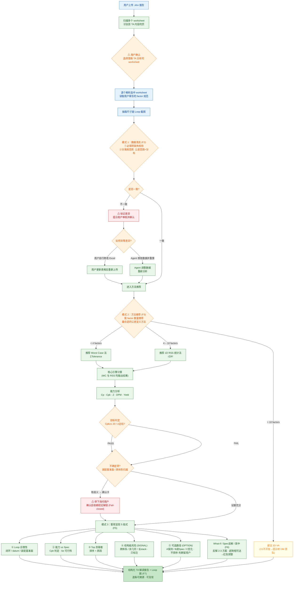

# End-to-End Flow (V1) · 端到端流程图

> 从用户上传 `.xlsx` 到产出结构化解读报告的完整运行时流程。
> 节点标签中的 `(Fx)` 对应[功能分解](04-feature-breakdown.md)中的 Feature 编号。

## Flow Chart

## Key Decision Points · 关键判定

| 节点 | 判定 | 分支 |
|---|---|---|
| Worksheet 确认 | 哪些页需解读 | 用户确认 / 兜底人工选择 |
| 数据清洗一致性 | 必填项 + 分类公差能力库匹配 | 一致 → 继续；不一致 → 标记差异（库内/库外有据）|
| 差异处理 | 由谁修正 | 用户改 Excel / Agent 改数据重算 |
| 方法推荐 | factor 数量 | `<4` WC · `4–10` RSS · `>10` 转 DM |
| 目标判定 | Cpk≥1.33 / σ 达标 | PASS / FAIL 均进入解读 |
| 不确定项确认 | 装配基准面 / 跨体系归属有歧义 | 停下弹确认卡，确认后依赖结论解锁（Fail-closed）|

> 多页报告可**并行加速处理**，但审核仍逐页人工把关。
> 解读只陈述 `FACT`/`RULE`，`SIGNAL`/`OPTION` 平行呈现、不排序——**判断留用户**。

---
**相关文档：** [系统架构图](01-architecture.md) · [差异化对比](03-differentiation.md) · [功能分解](04-feature-breakdown.md) · [设计决策](05-design-decisions.md)
