# End-to-End Flow (Current)

> The complete governed flow from workbook intake to final **Design Optimization** report publication, plus the separate F7 measured-feedback follow-up.
> `(Fx)` labels map to the active F0-F7 capability set.

## F1 to F2 Evidence Contract

F1 is the sole producer and physical owner of worksheet image evidence. F2 stores the validated F1-relative path, worksheet identity, and content hash, then renders a relative Markdown link; it never copies or regenerates the image. System-specification display labels are preserved from F1 `sourceLabel` evidence. Calculated columns such as `1σ` and `% Cont. to σ` are projected from cached worksheet formula values and are not recalculated by F2.

## F5 Governed Interpretation Contract

F5 directly consumes the controlled F0 rule snapshot plus F1, F3, and F4 artifacts. When the entry is a workbook, F2 is a mandatory upstream gate before those artifacts may enter F5. The supported development entry is `workflow:f5`; the supported product entry is the `ta-assist-agent` skill orchestrating the governed sequence `F0 -> F1 -> F2 -> F3 -> F4 -> F5 -> F6`.

Historical `f5-image-observation-v1` artifacts remain read-only compatible; new image-mode runs create only `f5-image-observation-v2`. For every selected worksheet, v2 records exactly `tolerance_loop_closure`, `datum_chain`, `assembly_datum_face`, `stack_start`, and `direction`, plus a context snapshot of all active factor rows. The snapshot preserves original `partName`/`factorName`, mapped `partSubsystem`/`factorDescription`, numeric inputs, and source-cell provenance.

Purely visual, confidence-gated evidence may produce an image `FACT`. Image-plus-text assessment produces only an `image_text_context_review` `SIGNAL` with `requiresEngineeringReview: true`; direction-to-row mapping requires structured `linkedVisualLabels` and never free-text inference. V2 validation is all-or-nothing across the selected worksheet set, five scopes, image hashes, snapshot rows, and provenance. An observation-only failure discards the whole v2 artifact and continues deterministic F5 with clarification; baseline F1/F3/F4 identity or required-image errors fail closed.

F6 continues directly after F5. The product path may collect optional Analysis Context and Optimization Targets in order. Valid inputs require separate confirmations; neither may be combined with the F3 ADO confirmation. The skill preserves two worksheet confirmations: the first fixes F1/F2 parsing scope against the workbook hash, and the second chooses the exact downstream set only from F2-ready worksheets with valid F1 image provenance. Downstream execution must run and validate current-run F3, then continue through F4, F5, and F6; `governance_required` remains a visible non-blocking F3 result and does not trigger an early ADO interaction. Declined or rejected context continues with explicit gaps.

F6 binds exact F2/F3/F4/F5 artifact roots and one or more unique `--worksheet` selections. Direct CLI roots are positional; the app CLI names them with `--f2-artifacts` through `--f5-artifacts` and fixes output under the governed run root. Both support controlled `--analysis-context` and `--optimization-targets` inputs after their independent confirmations. F6 owns adjusted-mean assessment, contributor priorities, F4-verified specification proposals, and the final `Feature6-Report.md` plus `Feature6-Report.pdf`; F5 owns baseline interpretation and evidence. Supplier, datum, and cost behavior is evidence-limited. Missing or mismatched support remains explicitly unavailable. After the F6 report passes validation, every validated F3 result enters an optional ADO publishing gate that reuses the full F3 confirmation protocol; publication is never automatic or implicit. New image mode creates only immutable `f5-image-observation-v2` evidence. F6 atomically publishes the validated report set and fail-closed manifests.

## Flow Diagram

```mermaid
flowchart TB
    A["Provide one or more TA .xlsx files"] --> A1["Scan workbook and detect TA worksheets (F1)"]
    A1 --> A2{"Confirm analysis scope against workbook hash"}
    A2 -- Confirmed --> P["Parse factor tables and extract Loop images (F1)"]
    A2 -- Cancel --> X["End run without analysis"]
    P --> D{"Clean data against F0 knowledge (F2)"}
    D --> REQ{"Are required fields complete?"}
    REQ -- No --> FIX["Request workbook correction and re-upload"]
    FIX --> A
    REQ -- Yes --> DIFF{"Any non-blocking differences or governance signals?"}
    DIFF --> G["Record differences and exceptions (F2)"]
    G --> LINK{"Is drawing governance needed? (F3)"}
    LINK -- Yes --> GOV["Validate DIM ID / Drawing Number and prepare local or ADO list"]
    LINK -- No --> H["Proceed with current worksheet set"]
    GOV --> H
    H --> M{"Method recommendation (F4)"}
    M --> CALC["Compute WC / RSS metrics and capability results"]
    CALC --> OBS{"Run governed image evaluation? (F5)"}
    OBS -- Yes --> F5["Create or validate image observation v2, then interpret"]
    OBS -- No --> F5
    F5 --> CTX{"Collect Analysis Context?"}
    CTX --> TARGETS{"Collect Optimization Targets?"}
    TARGETS --> F6["Run governed optimization and publish validated Markdown/PDF reports"]
    F6 --> ADO{"Publish confirmed F3 governance output to ADO?"}
    ADO -- Yes --> WRITE["Prepare -> confirm -> execute -> verify via Surface MCP"]
    ADO -- No --> LOCAL["Keep local governance reminder"]
    WRITE --> OUT["Review validated reports and governed artifacts"]
    LOCAL --> OUT
    OUT --> R{"Is measured capability available later? (F7)"}
    R -- No --> WAIT["Retain baseline report for later follow-up"]
    R -- Yes --> F7["Run measured-data analysis and compare actual vs estimated capability"]
    F7 --> KB["Feed measured evidence back to F0 knowledge"]
```

## F8 Workbench Confirmation Order

The governed order is unchanged after F8 retirement:

`validate workbook/F0 -> initial worksheet confirmation -> F1/F2 -> downstream ready-worksheet confirmation -> F3 -> F4 -> image decision -> F5 -> Analysis Context decision -> Optimization Targets decision -> F6 -> optional Surface MCP publication -> final report review`

No skill reply, direct command, or optional follow-up may merge or bypass these confirmations.

## Key Decision Points

| Decision | Branch handling |
|---|---|
| Worksheet confirmation | The prompt returns options and a workbook content hash. The user explicitly confirms one or more worksheets against that hash; a changed workbook makes the confirmation stale and fails closed. |
| Required fields | Missing factor inputs, cross-section evidence, LSL/USL, or Target σ Level block only the affected worksheet. Ready worksheets continue and each emits one F4 handoff. |
| Cleansing consistency | Out-of-library or incomplete items are flagged at once. The user can edit the source Excel or continue with a recorded exception. |
| DIM ID association | Linked factors go directly to method recommendation; missing IDs are grouped for governance without mutating calculation input. |
| ADO governance | Every validated F3 result reaches the optional post-report gate. With ADO, the user confirms the prepared list and it is added through Surface MCP; otherwise, the same list is saved locally and TA continues. |
| Method recommendation | `<4` recommends WC; `4-10` recommends RSS; `>10` notifies the DM team for 3D VA while the engine still computes governed in-scope outputs. |
| Evidence sufficiency | Missing physical image/reference fails the worksheet closed. Ambiguity creates an assumption and clarification that pause only dependent conclusions. |
| Optimization | F6 generates deterministic centering/tolerance/reverse/RSS options from bound F2-F5 evidence. Supplier, datum, and cost gaps remain explicit. |
| Measured feedback | When measured capability becomes available, F7 compares estimated and actual results and proposes governed knowledge feedback; otherwise the baseline report remains the authoritative output. |

## Drawing Governance ADO Publishing Contract

- User entry is the project skill `.github/skills/drawing-governance/SKILL.md` or the governed F3 handoff inside `ta-assist-agent` / `design-optimization`.
- Before a new F3 run, the user must select at least one worksheet from the F2 `ready` set; F3 analyzes only that selected subset.
- The local F3 Markdown links `Device Level Dim`, `Dimension Description`, and `Factor Description` to the corresponding F1 worksheet image. F1 remains the only image owner; `Source Evidence` shows worksheet, table, row, and field-to-cell mappings.
- Publishing keeps the two explicit confirmations: choose publishing mode first, then confirm the final write separately.
- Question call 1 - publishing mode:
  - Create a new ADO work item
  - Use an existing ADO work item
  - Do not publish to ADO
- Surface MCP entity calls may start only after Question call 1 returns.
- Existing-target validation is Surface MCP-only on `organization/project/type or ID` and may offer candidate correction; never persist the source URL.
- Future roadmap items such as scheduler, milestone timer, or date-triggered reminder behavior remain outside current F3 scope.
- The governed path must build a complete preview before Question call 2 - final write confirmation.
- If the user declines, capability is missing, or verification fails, write the local fallback artifact with the governed reason code to `Feature3-ADO-Reminder.md` instead of attempting an uncontrolled retry.
- Bodyless direct comment schemas may use the schema-qualified Surface MCP `System.History` channel. Direct comments use `confirmedMarkdownBody`; System.History uses `confirmedHistoryHtml` from `Feature3-ADO-History.html`.
- Governed publishing requires one write that produces exactly one new comment with comment format `html`, one 12-header payload, counted rows marked `data-f3-factor-row=true`, excluded rows marked `data-f3-group-row=true`, matching the ADO-safe canonical HTML body/hash and unchanged `top: 200` readback scope. This write is verified by governed readback before completion.
- Never use Azure DevOps MCP/REST/browser/shell HTTP. This boundary also means no scheduler, no milestone timer, no date-triggered reminder execution, and no F4 calculation/handoff mutation.
