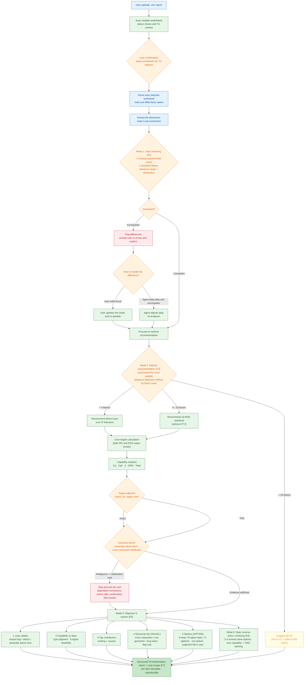

# End-to-End Flow (V1)

> The complete runtime flow from the user uploading `.xlsx` to producing a structured interpretation report.
> The `(Fx)` labels on nodes map to the Feature IDs in the [Feature Breakdown](04-feature-breakdown.md).

## Flow Chart

## Key Decision Points

| Node | Decision | Branches |
|---|---|---|
| Worksheet confirmation | Which sheets to interpret | User confirms / manual fallback selection |
| Cleansing consistency | Required fields + Classified Capability Library match | Consistent -> continue; inconsistent -> flag differences (in-library / out-of-library evidenced) |
| Difference handling | Who fixes it | User edits Excel / Agent edits data and recomputes |
| Method recommendation | Factor count | `<4` WC · `4-10` RSS · `>10` refer to DM |
| Target judgment | Cpk&ge;1.33 / sigma met | Both PASS / FAIL proceed to interpretation |
| Uncertainty confirmation | Assembly datum face / cross-subsystem attribution ambiguous | Stop and raise clarification card; dependent conclusions unlock after confirmation (fail-closed) |

> Multi-sheet reports can be **processed in parallel for speed**, but review is still per-page and human-gated.
> Interpretation only states `FACT`/`RULE`; `SIGNAL`/`OPTION` are presented in parallel, not ranked — **judgment is left to the user**.

---
**Related docs:** [Architecture](01-architecture.md) · [Differentiation](03-differentiation.md) · [Feature Breakdown](04-feature-breakdown.md) · [Design Decisions](05-design-decisions.md)
