# 端到端流程（V1）

> 完整运行流程：从工程师上传 `.xlsx` 文件，到生成结构化解读报告，并通过实测 Cpk 回填知识库形成闭环。
> 图中的 `(Fx)` 标签对应 [功能拆分](04-feature-breakdown.md) 中的 Feature ID。

## F1 到 F2 证据契约

F1 是 worksheet 图片证据的唯一生产者和物理所有者。F2 保存已校验的 F1 相对路径、worksheet identity 和 content hash，并在 Markdown 中生成相对链接；F2 不复制或重新生成图片。系统规格显示名称原样使用 F1 `sourceLabel` evidence。`1σ` 与 `% Cont. to σ` 等计算列从 worksheet 公式 cached values 投影，F2 不重新计算。

## F5 受治理解读契约

F5 直接消费受控的 F0 规则快照以及 F1、F3、F4 工件。从 workbook 启动时，F2 是这些工件进入 F5 前的必要上游门禁。受支持入口为 `workflow:f5` 和触发短语“使用F5分析报告”。固定报告展示五章节：公差链有效性、能力与规格、主要贡献因子由 F5 负责；结构性风险和并列改善方案委派给 F6。

历史 `f5-image-observation-v1` artifact 保持只读兼容；新的 image mode 只创建 `f5-image-observation-v2`。每个 selected worksheet 必须且只能各记录一次 `tolerance_loop_closure`、`datum_chain`、`assembly_datum_face`、`stack_start` 和 `direction`，并保存全部 active factor rows 的 context snapshot。Snapshot 同时保留原始 `partName`/`factorName`、映射后的 `partSubsystem`/`factorDescription`、数值输入和 source-cell provenance。

纯视觉且通过 confidence gate 的证据最多生成 image `FACT`；图片与 worksheet 文字的联合判断只能生成带 `requiresEngineeringReview: true` 的 `image_text_context_review` `SIGNAL`。Direction 到 row 的映射必须使用结构化 `linkedVisualLabels`，禁止依据自由文本推断。V2 对 selected worksheet set、五项 scope、图片 hash、snapshot rows 和 provenance 执行 all-or-nothing 校验：仅 observation 失败时丢弃整个 v2，并带 clarification 继续确定性 F5；F1/F3/F4 baseline identity 或必需图片错误仍 fail closed。

F1 仍是图片唯一物理 owner。新 v2 artifact 在 UUID-scoped 位置单次创建、不可覆盖，并在 invocation 前 readback。F5 loader 校验 exact content against schema、workbook/worksheet identity 与 selected set、snapshot/source provenance、携带的 `imageReference` identity，并重新校验物理 F1 image SHA-256。Observation artifact 不存在可预先校验的自身 digest；接受后由 workflow runner 计算其 SHA-256 并记录到 `Feature5-Run-Summary`。F5 仅输出 `FACT`、`RULE`、`SIGNAL` 和未排序 `OPTION`，不自动发布 ADO，也不回写 workbook。现有 F5 详细报告及其 F6 delegation 不变；已启用的 F6 workflow 接受受治理的 F5 v1 baseline 与可选 v2 observation evidence。

### F6 受治理优化契约

Agent Skill 触发语“使用F6分析报告”启动 `F0 -> F1 -> F2 -> F3 -> F4 -> F5 -> F6` 受治理 workbook 流程，用户无需手工拼接命令。Skill 保留 two worksheet confirmations：第一次依据 workbook hash 固定 F1/F2 解析范围，第二次只从 F2 ready 且 F1 图片 provenance 有效的 worksheets 中确认下游精确范围。后续必须执行并验证 current-run F3；仅当结果为 `governance_required` 时进入复用 F3 双确认协议的 optional ADO publishing gate，发布 never automatic or implicit。之后按 F4、F5、F6 顺序执行；新 image mode 只创建 immutable `f5-image-observation-v2`。

F5 后，Skill 按顺序收集可选 `f6-analysis-context-v1` 与 `f6-optimization-targets-v1` artifact。合法工件分别通过 `Confirm analysis context` 和 `Confirm optimization targets` 两次独立确认；两次确认互不合并，也不与 F3 ADO 确认合并。Context 拒绝或缺失时保留显式缺口；caller-target scenario 在 target 确认前不得计算。独立的 `f6-top3-tolerance-policy-v1` 仅在 worksheet 的 CpkL 或 CpkU 低于该 worksheet Target Cpk 时自动运行固定 OP1/OP2/OP3 F4 重算；通过且无 targets 的 worksheet 保持 candidate-only。

全部验证完成后，Skill 展示 F1-F6 output ledger、F0 受控版本和 Context/Targets decisions。每个阶段只有通过 contract、containment、identity、manifest 与 recorded hashes 后才算完成。缺少 supplier 或 datum evidence 时 feasibility 保持 `insufficient_evidence`；缺少受治理 cost coverage 时 ROI 保持 `not_computed`。输入已有当前 F6 artifact 时只验证并展示五文件 run，不重跑上游；V1 artifact 不受支持。

F6 精确绑定 F2/F3/F4/F5 artifact roots 和至少一个唯一 `--worksheet`。直接 CLI 使用四个顺序固定的 positional roots；app CLI 使用 `--f2-artifacts` 到 `--f5-artifacts`，并固定输出到 `test/demo-output/f6-runs/<F5-root-name>/<UTC-run-id>/`。两者在独立确认后支持受控 `--analysis-context` 和 `--optimization-targets` 输入。

F5 负责 baseline interpretation/evidence；F6 负责 target-driven options、reverse solve、RSS apportionment、feasibility、impact ranking 和最终 `Feature6-Report.md`。只有 caller-authorized targets 才生成量化 scenario；F6 不存在默认百分比场景。Reverse solve 与选定 RSS policy 都必须经 F4 kernel 回算验证。

Supplier、datum 与 cost 均受 evidence limit。缺失或不匹配时为 `insufficient_evidence`；仅当全部 supported ranked options 都有已知正数治理成本时 ROI 才为 computed。F6 原子发布五个 confidential artifacts：`Feature6-Report.md`、`Feature6-Optimization.json/.md`、`Feature6-Run-Summary.json` 和 `manifest.json`。Run Summary 保存结构化 Workbook/Worksheet dispositions；最终报告包含 workbook summary 与每个 ready worksheet 的固定 sections，工程结论为 `PASS`、`CONDITIONAL_PASS`、`FAIL`、`INCOMPLETE` 四态；F2 blocked worksheet 只进入 input integrity。源 workbook 只读；确定性 F3/F6 runners 和直接 CLI 不执行 ADO、网络或 workbook write，可选外部副作用只属于 agent 的受治理 publishing gate。identity、hash、association、schema、controlled-root、staging、atomic 与 post-commit identity 门禁均 fail closed。

## 流程图

```mermaid
flowchart TB
    A["上传一个或多个 TA .xlsx 文件（F1）<br>必须手动上传 · 文件名不可重复"] --> ADO{"是否创建或关联 ADO 工作项？（F3）"}
    ADO -- 是 --> ADO1["创建或关联任务（F3）<br>解析项目路径和负责人<br>输出：ADO ID、超链接、存储位置和历史版本"]
    ADO -- 否 --> A1["扫描所有工作簿和工作表，识别 TA 内容（F1）<br>输出：文件名、工作表名、版本/日期、公差链描述和工作表清单"]
    ADO1 --> A1
    A1 --> A2{"确认分析范围（F1）<br>单选 · 多选 · 全选 · 取消"}
    A2 -- 已确认工作表 --> P["并行解析因子表（F1）<br>输出：标准化 JSON 和处理追踪信息"]
    A2 -- 取消 --> X["结束本次运行，不执行分析"]
    A2 --> IMG["并行提取 Loop 截图（F1）<br>添加来源标签并按版本保存"]
    P --> JOIN["合并因子数据与已标注的 Loop 图片"]
    IMG --> JOIN
    JOIN --> D{"依据 F0 知识库清洗数据（F2）<br>检查必填字段、DIM ID/PN、能力范围和分布"}
    D --> REQ{"必填字段是否完整？（F2）<br>名义值、公差、安全系数、sigma level、distribution、factor description、part name"}
    REQ -- 是 --> DIFF{"是否存在其他差异？（F2）<br>超出知识库范围 · 分布不合理 · DIM ID/PN 缺失<br>所有提醒一次性提供"}
    REQ -- 否 --> FIX["汇总缺失字段并提示修正 Excel（F2）<br>用户重新上传工作簿"]
    FIX --> A
    DIFF -- 否 --> LINK{"是否缺少 DIM ID 或 PN？（F3）"}
    DIFF -- 是 --> REVIEW["标记差异并展示处理选项（F2）"]
    REVIEW --> CHOICE{"如何处理差异？（F2）"}
    CHOICE -- 修改源 Excel --> FIX
    CHOICE -- 记录例外后继续 --> LINK
    LINK -- 否 --> G{"方法推荐（F4）<br>依据因子数量"}
    LINK -- 是 --> GROUP["按 Lib 3 零件类别/图纸分组（F3）<br>输出：零件、连接编号、DIM ID、精确位置和 part-category 的尺寸链清单"]
    GROUP --> ADOREM{"是否已创建或关联 ADO 工作项？（F3）<br>根据之前用户的选项内部判断"}
    ADOREM -- 是 --> NOW["Surface MCP 更新 Comment 0（F3）<br/>准备差异 → 用户明确确认 → 单次执行"]
    ADOREM -- 否 --> LOCAL["将同一份 confidential 图纸治理清单保存到本地（F3）<br/>TA 继续"]
    NOW --> G
    LOCAL --> G
    G -- 少于 4 个因子 --> H1["推荐最坏情况法（WC）（F4）<br>公差算术求和"]
    G -- 4 至 10 个因子 --> H2["推荐一维 RSS（F4）<br>sqrt(sum R^2)"]
    G -- 多于 10 个因子 --> DM["提醒 DM 团队跟进 3D VA（F4）<br>同时标记累计公差风险"]
    H1 --> I["核心计算引擎（F4）<br>同时计算 WC 和 RSS"]
    H2 --> I
    DM --> I
    I --> J["能力分析（F4，可合并）<br>Cp · Cpk · Z · DPM · 良率<br>输出"]
    J --> CC{"证据是否充分？（F5）<br>装配基准面 / 堆叠起点 / 跨子系统"}
    CC -- 否 --> CQ["澄清卡片（F5）：暂停依赖该信息的结论<br>工程师确认后继续；仅作提醒"]
    CQ --> L["进程：客观解读（F5）<br>FACT 和 RULE 引用 F0 条目<br>SIGNAL 和 OPTION 不作排序"]
    CC -- 是 --> L
    L --> M1["公差链有效性（F5）<br>可选图片 observation 是受评审门控制的可见证据"]
    L --> M2["能力与规格对比（F5）"]
    L --> M3["主要贡献因子（F5）"]
    L --> M4["结构性风险（委派 F6）<br>F5 不合成该章节"]
    L --> M5["并列改善方案（委派 F6）<br>F5 不合成该章节"]
    M4 --> M6["F5 后受治理优化（F6）<br>options · reverse solve · RSS apportionment<br>feasibility · Highest Impact · 成本门控 ROI"]
    M5 --> M6
    M6 --> N
    M1 --> N["用户视角<br>只读证据面板 + 带引用的报告 + Loop 图片（F8）<br>逐项可追溯、可复现"]
    M2 --> N
    M3 --> N
    M4 --> N
    M5 --> N
    N --> R{"是否已有实测良率 / Cpk？（F7）"}
    R -- 否：等待后续测量 --> WAIT["保留基线报告（F7）<br>等待后续导入实测数据"]
    R -- 是：按 DIM ID 手动导入 --> CL["闭环（F7）<br>比较估算值与实际值，并重新计算实际能力<br>将 Lib 1 证据等级从 T3 升级到 T1<br><br>能力水平是否达标，以及修改方向<br>真实测量值形成的公差范围和优化报告：attachment2"]
    CL -->|回填实测证据| KB["知识库（F0）"]

     A:::start
     ADO:::dec
     ADO1:::orch
     A1:::proc
     A2:::dec
     P:::proc
     X:::done
     IMG:::proc
     JOIN:::proc
     D:::dec
     REQ:::dec
     FIX:::warn
     DIFF:::dec
     LINK:::dec
     REVIEW:::warn
     CHOICE:::dec
     G:::dec
     GROUP:::link
     ADOREM:::dec
     NOW:::orch
     LOCAL:::warn
     H1:::proc
     H2:::proc
     DM:::oos
     I:::proc
     J:::proc
     CC:::dec
     CQ:::warn
     L:::proc
     M1:::proc
     M2:::proc
     M3:::proc
     M4:::proc
     M5:::proc
     M6:::proc
     N:::done
     R:::dec
     WAIT:::done
     CL:::loop
     KB:::loop
    classDef start fill:#e3f2fd,stroke:#1565c0,color:#0d47a1
    classDef proc fill:#e8f5e9,stroke:#2e7d32,color:#1b5e20
    classDef dec fill:#fff3e0,stroke:#ef6c00,color:#e65100
    classDef warn fill:#ffebee,stroke:#c62828,color:#b71c1c
    classDef oos fill:#fffde7,stroke:#f9a825,color:#f57f17
    classDef link fill:#e8eaf6,stroke:#3949ab,color:#1a237e
    classDef loop fill:#f1f8e9,stroke:#558b2f,color:#33691e
    classDef done fill:#c8e6c9,stroke:#2e7d32,color:#1b5e20
    classDef orch fill:#fff8e1,stroke:#f9a825,color:#f57f17
```

## F8 Workbench 独立确认顺序

本地 Workbench 保持受治理顺序：上传/F0 验证 -> 初次 worksheet 确认 -> F1/F2 -> 下游 ready worksheet 确认 -> F3 -> 可选 Surface MCP validation 与独立 final write -> F4 -> 图片决定 -> F5 -> Analysis Context 决定 -> Optimization Targets 决定 -> F6 -> 证据审阅与一个 What-if Draft。浏览器或聊天消息不能合并或绕过这些确认。

What-if 必须重放当前已验证的 F2/F4 lineage，并调用 F4 kernel；绝不写回源 workbook。只有 tolerance-only change 可生成独立 F6 targets preview，nominal/mean-shift 仍停留在 `WHAT_IF`。F7 保持 `feature_not_available / in_development`，第一版 Workbench 不显示 measured import 或结果控件。

## 关键决策点

| 节点 | 决策内容 | 分支处理 |
|---|---|---|
| ADO 编排 | 是否创建或关联 ADO 任务 | ADO 为可选项：关联后解析负责人、返回 ID/链接并启用提醒；未关联时不启用 ADO 治理，但仍可执行分析 |
| 工作表确认 | 哪些工作表进入解读 | Prompt phase 返回 worksheet options 与 workbook content hash；用户必须基于该 hash 显式确认一个或多个工作表。文件变化后旧确认以 `stale_worksheet_selection` fail closed |
| 必填字段 | 因子输入、截面证据、Lower Spec Limit、Upper Spec Limit 和 Target σ Level 是否完整 | 缺失只阻断对应 worksheet；其余 ready worksheet 继续，并各生成一个 F4 handoff。Drawing Number、DIM ID 和 Part Number 缺失保持非阻断治理语义 |
| 清洗一致性 | 能力库、分布、DIM ID 和 PN 是否一致 | 超出知识库或信息不完整时进行标记；必要信息在同一次修正中补全；用户可以修改源文件，或记录例外后继续 |
| DIM ID 关联 | 因子是否已关联图纸尺寸 | 已关联时直接进入方法推荐；缺失时按 Lib 3 类别/图纸生成尺寸链清单，再执行后续治理 |
| ADO 治理 | 是否关联 ADO 且 Surface MCP 具备所需能力 | 先准备 Comment 0 差异，用户明确确认后单次执行；无 ADO 或能力不足时保存同一份 confidential 清单并继续 TA。当前 F3 不提供 scheduler、不提供里程碑计时器、不提供日期触发提醒，且不发生 F4 计算/交接变更。 |
| 方法推荐 | 因子数量 | `<4` 推荐 WC；`4–10` 推荐 RSS；`>10` 转交 DM 团队进行 3D VA；核心引擎始终同时运行 WC 和 RSS |
| 不确定性确认 | 所需 F1 图片是否存在，以及装配基准面、堆叠起点或跨子系统信息是否存在歧义 | 缺少物理图片/reference 时对应 worksheet fail closed；跳过可选观察时输出 `not_evaluated`；歧义生成 assumption 与 clarification，仅暂停依赖该信息的结论。 |
| 优化与版本 | 是否需要调整设计或能力 | F5 保持 `delegated_to_f6`；已启用的 F6 workflow 基于绑定的 F2-F5 evidence 生成确定性居中、公差、reverse 与 RSS 方案。Supplier/datum/cost 缺口保持显式；只有历史 comparison placeholder 返回 `feature_not_available`。未来路线图：任何日期/Milestone/版本写入 ADO 的意图仍不在当前 F3 范围。 |
| 实测数据反馈 | 优化后是否取得实测 Cpk | 有数据则比较估算值与实际值、输出真实公差范围与优化报告并升级能力库条目；暂无数据则保留基线报告，等待后续导入 |

## F3 受治理 ADO 发布契约

- 用户入口为项目 Skill `.github/skills/f3-analysis/SKILL.md`。
- 新运行 F3 前，用户必须从 F2 的 `ready` worksheets 中至少选择一个；F3 只分析所选子集。
- F3 本地 Markdown 的 `Device Level Dim`、`Dimension Description` 和 `Factor Description` 链接到对应的 F1 worksheet 图片。F1 是唯一图片所有者；`Source Evidence` 显示 worksheet、table、row 及字段到单元格的映射。
- Question call 1 - publishing mode：三选一。
    - Create a new ADO work item
    - Use an existing ADO work item
    - Do not publish to ADO
- Surface MCP entity calls may start only after Question call 1 returns。
- existing 模式只接收一个 HTTPS Azure DevOps work item URL；F3 从 URL 解析 organization、project 和 ID，通过 Surface MCP 校验同一目标，并且不持久化 URL。
- 仅允许 Surface MCP（Surface MCP-only）执行组织/项目/类型或 ID 校验（organization/project/type or ID），并在写入前完成 candidate correction。
- 新建工作项默认类型为 `Default: Task`。
- 必须先给出完整预览（complete preview），再进入最终写入确认。
- Question call 2 - final write confirmation 必须与 Question call 1 分离并显式确认。
- ADO comment template text is fixed English，local reminder template text is fixed English。
- 固定 11 列表头（exact fixed 11-column header）：
    `Device Level Dim | Dimension Description | Part / Subsystem | Drawing Number | Dim ID | Factor Description | Nominal | Upper Tolerance (+) | Lower Tolerance (-) | σ Level | Governance issue`
- 当用户拒绝、能力不足或写入校验失败时，生成本地回退文件 `Feature3-ADO-Reminder.md`，原因码使用：`user_declined_write`、`surface_mcp_comment_body_unsupported`、`write_verification_failed`。
- direct comment 的 Surface schema 无 body 时，仅当 Surface MCP `update_work_item` 的真实 schema 支持单个 `add /fields/System.History` patch，F3 才可使用 `System.History` 通道。direct comment 使用 `Feature3-ADO-Reminder.md` 的 `confirmedMarkdownBody`；System.History 使用 `Feature3-ADO-History.html` 的 `confirmedHistoryHtml`，禁止向 System.History 写入原始 Markdown。预览前保存 comment IDs；单次写入后必须恰好一个新增评论，并验证 Work Item ID、comment format `html`、11 个表头和预期 factor 行数。只允许移除末尾换行与受控关闭标签前由 ADO 注入的空格，规范化后的 ADO-safe canonical HTML 正文与 SHA-256 必须完全一致。通道不可用或校验失败时使用受治理的本地回退；禁止空评论（never empty comment）。
- Never use Azure DevOps MCP/REST/browser/shell HTTP fallback。
- F3 无 scheduler、无 milestone timer、无 date-triggered reminder，且 no F4 calculation/handoff mutation。

> 多个工作表可以并行处理以提升速度，但仍需逐页进行人工审核与把关。
> 解读使用四种 statement：`FACT`（计算结果或直接观察证据）、`RULE`（带版本与适用范围的 F0 规则）、`SIGNAL`（提示）和 `OPTION`（未排序备选方案）；最终工程判断始终由 ME 用户做出。
> 当前契约中 Part Number 等同 Drawing Number。F3 正式键为 `(Drawing Number, DIM ID)`：跨图纸相同 DIM ID 合法，同图纸重复产生冲突；一位纯数字为不阻塞 TA 的 `suspected_invalid`。

---
**相关文档：** [架构](01-architecture.md) · [差异化](03-differentiation.md) · [功能拆分](04-feature-breakdown.md) · [设计决策](05-design-decisions.md)