# 端到端流程（V1）

> 完整运行流程：从工程师上传 `.xlsx` 文件，到生成结构化解读报告，并通过实测 Cpk 回填知识库形成闭环。
> 图中的 `(Fx)` 标签对应 [功能拆分](04-feature-breakdown.md) 中的 Feature ID。

## 流程图

```mermaid
flowchart TB
    A["上传一个或多个 TA .xlsx 文件（F1）<br>必须手动上传 · 文件名不可重复"] --> ADO{"是否创建或关联 ADO 工作项？（F3）"}
    ADO -- 是 --> ADO1["创建或关联任务（F3）<br>解析项目路径和负责人<br>输出：ADO ID、超链接、存储位置和历史版本"]
    ADO -- 否 --> A1["扫描所有工作簿和工作表，识别 TA 内容（F1）<br>输出：文件名、工作表名、版本/日期、公差链描述和工作表清单"]
    ADO1 --> A1
    A1 --> A2{"确认分析范围（F1）<br>单选 · 多选 · 全选 · 取消"}
    A2 -- 已确认工作表 --> P["并行解析因子表（F1）<br>输出：标准化 JSON 和处理追踪信息"]
    A2 -- 取消 --> X["结束本次运行，不执行分析"]
    A2 --> IMG["并行提取 Loop 截图（F1）<br>添加来源标签并按版本保存"]
    P --> JOIN["合并因子数据与已标注的 Loop 图片"]
    IMG --> JOIN
    JOIN --> D{"依据 F0 知识库清洗数据（F2）<br>检查必填字段、DIM ID/PN、能力范围和分布"}
    D --> REQ{"必填字段是否完整？（F2）<br>名义值、公差、安全系数、sigma level、distribution、factor description、part name"}
    REQ -- 是 --> FIX["汇总缺失字段并提示修正 Excel（F2）<br>用户重新上传工作簿"]
    FIX --> A
    REQ -- 否 --> DIFF{"是否存在其他差异？（F2）<br>超出知识库范围 · 分布不合理 · DIM ID/PN 缺失<br>所有提醒一次性提供"}
    DIFF -- 否 --> LINK{"是否缺少 DIM ID 或 PN？（F3）"}
    DIFF -- 是 --> REVIEW["标记差异并展示处理选项（F2）"]
    REVIEW --> CHOICE{"如何处理差异？（F2）"}
    CHOICE -- 修改源 Excel --> FIX
    CHOICE -- 记录例外后继续 --> LINK
    LINK -- 否 --> G{"方法推荐（F4）<br>依据因子数量"}
    LINK -- 是 --> GROUP["按 Lib 3 零件类别/图纸分组（F3）<br>输出：零件、连接编号、DIM ID、精确位置和 part-category 的尺寸链清单"]
    GROUP --> ADOREM{"是否已创建或关联 ADO 工作项？（F3）<br>根据之前用户的选项内部判断"}
    ADOREM -- 是 --> NOW["Surface MCP 更新 Comment 0（F3）<br/>准备差异 → 用户明确确认 → 单次执行"]
    ADOREM -- 否 --> LOCAL["将同一份 confidential 图纸治理清单保存到本地（F3）<br/>TA 继续"]
    NOW --> G
    LOCAL --> G
    G -- 少于 4 个因子 --> H1["推荐最坏情况法（WC）（F4）<br>公差算术求和"]
    G -- 4 至 10 个因子 --> H2["推荐一维 RSS（F4）<br>sqrt(sum R^2)"]
    G -- 多于 10 个因子 --> DM["提醒 DM 团队跟进 3D VA（F4）<br>同时标记累计公差风险"]
    H1 --> I["核心计算引擎（F4）<br>同时计算 WC 和 RSS"]
    H2 --> I
    DM --> I
    I --> J["能力分析（F4，可合并）<br>Cp · Cpk · Z · DPM · 良率<br>输出"]
    J --> CC{"证据是否充分？（F5）<br>装配基准面 / 堆叠起点 / 跨子系统"}
    CC -- 否 --> CQ["澄清卡片（F5）：暂停依赖该信息的结论<br>工程师确认后继续；仅作提醒"]
    CQ --> L["进程：客观解读（F5）<br>FACT 和 RULE 引用 F0 条目<br>SIGNAL 和 OPTION 不作排序"]
    CC -- 是 --> L
    L --> M1["公差链有效性（F5）<br>可选：需要进一步调查 image model 的效果"]
    L --> M2["能力与规格对比（F5）"]
    L --> M3["主要贡献因子（F5）"]
    L --> M4["结构性风险（F5）"]
    L --> M5["并列改善方案（F5）<br>若不达标，提供多种可选方案"]
    L --> M6["优化（F6）<br>居中调整 · 贡献经济性 · RSS 分配<br>反向求解 2-3 个方案<br>1. 均值偏移：调整增减环名义值，补偿偏移量<br>2. 根据 contributor 调整公差范围<br>3. 放宽 target spec<br>4. 设计上减少 loop；制程上提高装配精度<br>5. 某一组成环变成灵活项，可选择分 bin 方式<br>实时反馈：bar 拖拽时颜色显示<br><br>如果有 ADO，则链接 ADO 并保存版本：日期 / Milestone / 版本 / attachment1<br>如果没有 ADO，则保存在用户本地"]
    M1 --> N["用户视角<br>只读证据面板 + 带引用的报告 + Loop 图片（F8）<br>逐项可追溯、可复现"]
    M2 --> N
    M3 --> N
    M4 --> N
    M5 --> N
    N --> M6
    M6 --> R{"是否已有实测良率 / Cpk？（F7）"}
    R -- 否：等待后续测量 --> WAIT["保留基线报告（F7）<br>等待后续导入实测数据"]
    R -- 是：按 DIM ID 手动导入 --> CL["闭环（F7）<br>比较估算值与实际值，并重新计算实际能力<br>将 Lib 1 证据等级从 T3 升级到 T1<br><br>能力水平是否达标，以及修改方向<br>真实测量值形成的公差范围和优化报告：attachment2"]
    CL -->|回填实测证据| KB["知识库（F0）"]

     A:::start
     ADO:::dec
     ADO1:::orch
     A1:::proc
     A2:::dec
     P:::proc
     X:::done
     IMG:::proc
     JOIN:::proc
     D:::dec
     REQ:::dec
     FIX:::warn
     DIFF:::dec
     LINK:::dec
     REVIEW:::warn
     CHOICE:::dec
     G:::dec
     GROUP:::link
     ADOREM:::dec
     NOW:::orch
     LOCAL:::warn
     H1:::proc
     H2:::proc
     DM:::oos
     I:::proc
     J:::proc
     CC:::dec
     CQ:::warn
     L:::proc
     M1:::proc
     M2:::proc
     M3:::proc
     M4:::proc
     M5:::proc
     M6:::proc
     N:::done
     R:::dec
     WAIT:::done
     CL:::loop
     KB:::loop
    classDef start fill:#e3f2fd,stroke:#1565c0,color:#0d47a1
    classDef proc fill:#e8f5e9,stroke:#2e7d32,color:#1b5e20
    classDef dec fill:#fff3e0,stroke:#ef6c00,color:#e65100
    classDef warn fill:#ffebee,stroke:#c62828,color:#b71c1c
    classDef oos fill:#fffde7,stroke:#f9a825,color:#f57f17
    classDef link fill:#e8eaf6,stroke:#3949ab,color:#1a237e
    classDef loop fill:#f1f8e9,stroke:#558b2f,color:#33691e
    classDef done fill:#c8e6c9,stroke:#2e7d32,color:#1b5e20
    classDef orch fill:#fff8e1,stroke:#f9a825,color:#f57f17
```

## 关键决策点

| 节点 | 决策内容 | 分支处理 |
|---|---|---|
| ADO 编排 | 是否创建或关联 ADO 任务 | ADO 为可选项：关联后解析负责人、返回 ID/链接并启用提醒；未关联时不启用 ADO 治理，但仍可执行分析 |
| 工作表确认 | 哪些工作表进入解读 | 用户可选择一个、多个或全部已识别的 TA 工作表；取消则结束本次运行 |
| 必填字段 | 名义值、公差、安全系数、sigma level、distribution、factor description 和 part name 是否完整 | 缺失则阻塞运行，用户修正并重新上传工作簿；完整则继续 |
| 清洗一致性 | 能力库、分布、DIM ID 和 PN 是否一致 | 超出知识库或信息不完整时进行标记；必要信息在同一次修正中补全；用户可以修改源文件，或记录例外后继续 |
| DIM ID 关联 | 因子是否已关联图纸尺寸 | 已关联时直接进入方法推荐；缺失时按 Lib 3 类别/图纸生成尺寸链清单，再执行后续治理 |
| ADO 治理 | 是否关联 ADO 且 Surface MCP 具备所需能力 | 先准备 Comment 0 差异，用户明确确认后单次执行；无 ADO 或能力不足时保存同一份 confidential 清单并继续 TA。F3 不读取日期、不做截止临近判断，也不运行 scheduler。 |
| 方法推荐 | 因子数量 | `<4` 推荐 WC；`4–10` 推荐 RSS；`>10` 转交 DM 团队进行 3D VA；核心引擎始终同时运行 WC 和 RSS |
| 不确定性确认 | 装配基准面或跨子系统信息是否存在歧义 | 展示澄清卡片作纯提醒，在确认前暂停依赖该信息的结论 |
| 优化与版本 | 是否需要调整设计或能力 | 输出居中、贡献、公差、规格等并列方案；支持实时反馈，并可关联 ADO 保存日期、Milestone、版本和附件 |
| 实测数据反馈 | 优化后是否取得实测 Cpk | 有数据则比较估算值与实际值、输出真实公差范围与优化报告并升级能力库条目；暂无数据则保留基线报告，等待后续导入 |

> 多个工作表可以并行处理以提升速度，但仍需逐页进行人工审核与把关。
> 解读只直接陈述 `FACT`（计算结果）和 `RULE`（阈值检查），并引用知识库条目；`SIGNAL`（提示）与 `OPTION`（备选方案）并列展示、不排序，最终工程判断始终由用户做出。
> 当前契约中 Part Number 等同 Drawing Number。F3 正式键为 `(Drawing Number, DIM ID)`：跨图纸相同 DIM ID 合法，同图纸重复产生冲突；一位纯数字为不阻塞 TA 的 `suspected_invalid`。

---
**相关文档：** [架构](01-architecture.md) · [差异化](03-differentiation.md) · [功能拆分](04-feature-breakdown.md) · [设计决策](05-design-decisions.md)