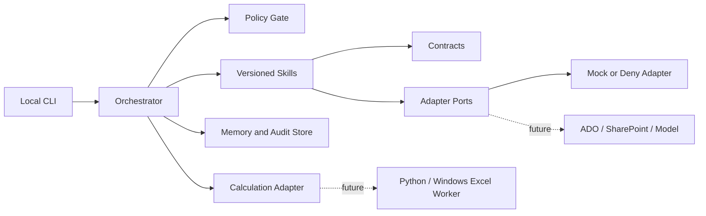

# AI Assist Agent Foundation Design

**Date:** 2026-07-22

## Purpose and Scope

Build Phase 0, a local-first engineering foundation for AI Assist Agent. It must
support the future F0-F8 product roadmap without pretending that unfinished
features exist. Phase 0 establishes a TypeScript monorepo, a CLI entry point,
versioned contracts, an Agent + Skill runtime, local memory and audit records,
data-governance controls, verification fixtures, and GitHub collaboration
standards.

Phase 0 does not implement real TA workbook parsing, Excel calculation, a
knowledge-base decision engine, external model calls, ADO or SharePoint calls,
scheduled reminders, real measurement-data imports, or a web UI. Each deferred
capability must have an explicit adapter contract, Feature Register entry, and
`feature_not_available` response.

## Decisions

- **Architecture:** TypeScript monorepo as the product, orchestration, Skill,
  contract, integration, and future UI layer.
- **Calculation boundary:** a future Python/Windows Excel Worker is the only
  path to strict template-consistent calculation. The TypeScript system uses a
  versioned calculation adapter and never directly manipulates a TA workbook.
- **Execution:** local Windows development first. External integrations default
  to `deny`; tests may use explicit `mock` adapters.
- **Memory:** retain complete work records locally when enabled, but never
  retain or attempt to recover a model's raw internal chain of thought. Record
  user-visible outputs, decisions, evidence references, tool events, hashes,
  and auditable decision summaries instead.
- **Collaboration:** provide repository standards, GitHub templates, local
  quality checks, and an administrator checklist. Do not require organization
  administrator permissions during Phase 0.

## Architecture



### Module Boundaries

| Module | Responsibility | Phase 0 state |
|---|---|---|
| `apps/cli` | Start, inspect, export, and purge runs | Implement |
| `packages/contracts` | Versioned schemas for requests, results, errors, and events | Implement |
| `packages/orchestrator` | Run lifecycle, Skill selection, retry, and recovery | Implement |
| `packages/skill-sdk` | Skill manifests, permission checks, and execution wrappers | Implement |
| `packages/skills` | Smoke, policy-check, and feature-placeholder Skills | Implement |
| `packages/memory` | Local conversation, decision, artifact, export, and purge records | Implement |
| `packages/audit` | Append-only events, manifests, hashes, and bundle verification | Implement |
| `packages/governance` | Data classification, retention, and Feature Register | Implement |
| `packages/adapters` | Typed external ports with deny and mock implementations | Implement |
| `workers/calculation` | Future Excel-consistent calculation Worker | Contract and stub only |
| `fixtures/public` | Anonymous, Git-safe test fixtures | Implement |

## Agent and Skill Model

The Agent only selects and orchestrates registered Skills. It cannot directly
read or write files, access a network, call external systems, or persist memory.
Those actions must go through a Skill and a Policy Gate.

Every Skill manifest must declare:

- Stable Skill ID and version.
- Versioned input and output schemas.
- Allowed data classifications.
- File, network, external-service, and write permissions.
- Idempotency and retry behavior.
- Required audit event types.
- Anonymous acceptance fixture and check.
- Owning F0-F8 Feature ID and GitHub Issue link placeholder.

Each run receives a `run_id`. The system records the Skill and contract
versions, configuration, input and output hashes, policy decisions, user
confirmations, evidence references, artifacts, and failures associated with it.

## Data Governance, Memory, and Audit

### Data Classification

| Classification | Examples | Handling |
|---|---|---|
| `public` | Anonymous fixtures, schemas, docs | May be committed |
| `internal` | Non-sensitive configuration and metadata | Local; submission checks apply |
| `confidential` | TA workbooks, DIM IDs, suppliers, Cpk, ADO content | Git prohibited; no default console output; persistence requires explicit choice |
| `secret` | Tokens, passwords, connection strings, certificates | Environment variables or system credential store only; never in memory or audit logs |

### Local Run Records

```text
runtime/
  projects/<project_id>/
    sessions/<session_id>/
      runs/<run_id>/
        manifest.json
        transcript.jsonl
        decisions.jsonl
        events.jsonl
        artifacts/
```

The manifest stores hashes, classifications, origins, versions, and artifact
references rather than raw confidential data. The transcript stores complete
user and user-visible system messages only when retention is enabled. The
decision log stores user confirmations, explicit assumptions, evidence
references, and reviewable decision summaries, not raw internal reasoning.

### Retention, Export, and Purge

- All records are scoped by project, user, session, and run.
- Confidential artifact retention is opt-in at run creation; otherwise only
  hashes and required metadata are retained.
- Records include a `retention_until` value. Purge first displays a scoped
  deletion plan, requires confirmation, removes scoped artifacts, and writes a
  cleanup audit event.
- Export produces a classification manifest. It rejects secrets and requires
  explicit confirmation before including confidential artifacts.
- Error events contain classifications, aliases, hashes, and error codes, not
  workbook content, DIM IDs, supplier names, or environment values.

## Feature Register and Deferred Capability Contracts

The register tracks F0-F8 as engineering work items rather than ambiguous
placeholders. Each entry has:

- Feature ID, title, status, owner, and GitHub Issue link.
- Dependencies and external prerequisites.
- Input and output contract IDs.
- Highest data classification handled.
- Acceptance checks and anonymous fixture location.
- Rollback or disable behavior.

At runtime, unavailable Features must return `feature_not_available` with the
Feature ID, unmet dependencies, and activation requirements.

## Error Model

| Error code | Meaning | Required behavior |
|---|---|---|
| `validation_error` | Invalid data or incompatible schema | Stop the affected Skill and provide field-level remediation |
| `policy_denied` | Missing authorization or disallowed data action | Do not execute a substitute action; audit the denial |
| `feature_not_available` | Deferred or unconfigured Feature | Return dependency and enablement detail |
| `dependency_error` | External service or calculation Worker unavailable | Preserve safe context and allow retry only when declared safe |
| `transient_error` | Temporary lock or timeout | Use limited exponential retry and audit every attempt |
| `internal_error` | Unexpected failure | Produce a safe diagnostic linked to `run_id` without exposing confidential data |

All errors include `code`, `run_id`, a user-readable summary, retryability,
suggested action, and affected input references.

## GitHub Collaboration Standard

The repository must provide:

```text
.github/
  ISSUE_TEMPLATE/
    feature.yml
    bug.yml
    governance-change.yml
  pull_request_template.md
  CODEOWNERS.example
  workflows/
    ci.example.yml
docs/governance/
  development-standard.md
  github-admin-checklist.md
  data-classification.md
  feature-register.md
```

The development standard requires that work starts from a GitHub Issue and is
developed in a branch created from current `main`. Direct development on `main`
is prohibited. Branches use `feature/`, `fix/`, or `docs/` prefixes. Pull
requests must link their issue, state contract and privacy impact, show test
evidence, and state rollback behavior.

Real TA data, supplier data, DIM IDs, ADO data, measured data, secrets, local
runtime records, and `.env` files must not be committed. Changes to contracts,
governance, memory, or calculation require schema, fixture, documentation, and
specialist-review updates. The administrator checklist describes the later
GitHub branch-protection configuration: pull requests, reviews, required
checks, restricted bypasses, force-push prevention, and optional CODEOWNERS.

## Verification

Every Skill and Feature uses the same acceptance package:

```text
Input fixture
-> schema validation result
-> expected output or expected policy error
-> audit-event assertions
-> data-leak assertion
-> run-bundle integrity assertion
```

The Phase 0 smoke workflow must:

1. Create an anonymous run and execute at least two registered mock Skills.
2. Produce schema-valid output, an audit trail, and an exportable run manifest.
3. Reject unconfigured network access, confidential writes, secret persistence,
   and unavailable Features with typed errors.
4. Purge a scoped test run and verify artifacts are removed while the cleanup
   audit event remains available.
5. Verify controlled runtime paths, `.env` files, and confidential fixtures are
   excluded from Git.

## Delivery Phases

| Phase | Scope | Preconditions |
|---|---|---|
| 0 | Foundation described in this document | Local Node.js/TypeScript tooling |
| 1 | F0, F1, F2, F4, and F8 first-pass TA workflow | Approved anonymous calculation fixtures and calculation Worker validation |
| 2 | F3 DIM ID and drawing governance | Canonical-ID policy, ADO permissions, and milestone source |
| 3 | F5/F6 objective interpretation and comparable options | Versioned knowledge libraries and validated calculation results |
| 4 | F7 measured-Cpk loop | Stable DIM ID anchors and an approved centralized measurement store |

## Phase 0 Definition of Done

- The project installs, builds, lints, type-checks, and tests on local Windows.
- The CLI completes the smoke workflow and produces verifiable run records.
- Policy controls block unauthorized adapters, network use, secret persistence,
  and data leakage.
- Export and purge enforce classification and produce audit evidence.
- At least two Skills prove the manifest, schema, permission, fixture, and
  audit path end to end.
- The Feature Register covers F0-F8 with contracts, dependencies, sensitivity,
  acceptance checks, and GitHub placeholders.
- The repository includes the collaboration standard, templates, local checks,
  and GitHub administrator checklist.