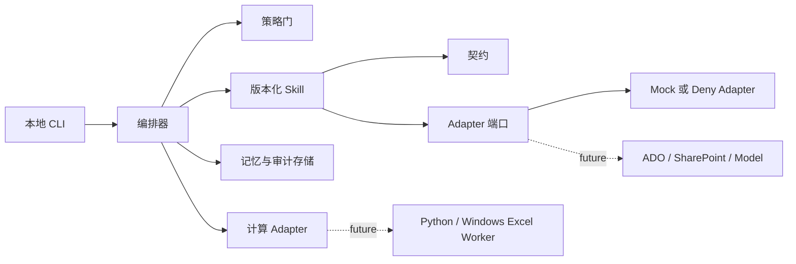

# AI Assist Agent 工程基座设计

**日期：**2026-07-22

## 目标与范围

构建 Phase 0，即 AI Assist Agent 的本地优先工程基座。它必须支持未来
F0-F8 的产品路线图，但不得将未完成的功能伪装成已存在。Phase 0 建立
TypeScript Monorepo、CLI 入口、版本化契约、Agent + Skill 运行时、本地记忆
与审计记录、数据治理控制、验证 fixture 以及 GitHub 协作规范。

Phase 0 不实现真实 TA 工作簿解析、Excel 计算、知识库决策引擎、外部模型
调用、ADO 或 SharePoint 调用、定时提醒、真实测量数据导入或 Web UI。每个
延后能力都必须有明确的 adapter 契约、Feature Register 条目和
`feature_not_available` 响应。

## 已确认决策

- **架构：**采用 TypeScript Monorepo 作为产品、编排、Skill、契约、集成和
  未来 UI 的主系统。
- **计算边界：**未来的 Python/Windows Excel Worker 是实现与模板严格一致
  计算的唯一途径。TypeScript 系统通过版本化 calculation adapter 调用它，
  不得直接操作 TA 工作簿。
- **运行方式：**本地 Windows 开发优先。外部集成默认 `deny`；测试可显式
  使用 `mock` adapter。
- **记忆：**在启用时本地保留完整工作记录，但绝不保留或尝试恢复模型原始
  内部思维链。应保存用户可见输出、决策、证据引用、工具事件、哈希和可审计
  的决策摘要。
- **协作：**提供仓库规范、GitHub 模板、本地质量检查和管理员清单。Phase 0
  不要求组织管理员权限。
- **文档语言：**本项目的计划、实施、执行和验收说明默认使用中文。代码、
  路径、命令、错误码、协议和契约标识保留英文，以确保技术精确性与兼容性。

## 架构



### 模块边界

| 模块 | 职责 | Phase 0 状态 |
|---|---|---|
| `apps/cli` | 启动、查看、导出和清理运行记录 | 实现 |
| `packages/contracts` | 请求、结果、错误和事件的版本化 schema | 实现 |
| `packages/orchestrator` | run 生命周期、Skill 选择、重试和恢复 | 实现 |
| `packages/skill-sdk` | Skill manifest、权限检查和执行封装 | 实现 |
| `packages/skills` | smoke、policy-check 和 feature-placeholder Skill | 实现 |
| `packages/memory` | 本地对话、决策、工件、导出和清理记录 | 实现 |
| `packages/audit` | 追加式事件、manifest、哈希和 bundle 校验 | 实现 |
| `packages/governance` | 数据分类、保留策略和 Feature Register | 实现 |
| `packages/adapters` | 类型化外部端口及 deny/mock 实现 | 实现 |
| `workers/calculation` | 未来 Excel 一致性计算 Worker | 仅契约和 stub |
| `fixtures/public` | 匿名且可安全提交的测试 fixture | 实现 |

## Agent 与 Skill 模式

Agent 只能选择和编排已注册的 Skill，不能直接读写文件、访问网络、调用外部
系统或持久化记忆。此类动作必须经过 Skill 和策略门。

每个 Skill manifest 必须声明：

- 稳定的 Skill ID 与版本。
- 版本化的输入与输出 schema。
- 允许处理的数据分类。
- 文件、网络、外部服务和写入权限。
- 幂等性与重试行为。
- 必需的审计事件类型。
- 匿名验收 fixture 与检查。
- 所属 F0-F8 Feature ID 和 GitHub Issue 链接占位。

每次运行都有 `run_id`。系统必须记录与其关联的 Skill 和契约版本、配置、
输入和输出哈希、策略决策、用户确认、证据引用、工件及失败信息。

## 数据治理、记忆与审计

### 数据分类

| 分类 | 示例 | 处理方式 |
|---|---|---|
| `public` | 匿名 fixture、schema、文档 | 可提交 |
| `internal` | 非敏感配置和元数据 | 本地保存；提交前检查 |
| `confidential` | TA 工作簿、DIM ID、供应商、Cpk、ADO 内容 | 禁止提交到 Git；默认不输出到控制台；持久化须显式选择 |
| `secret` | Token、密码、连接字符串、证书 | 仅环境变量或系统凭据存储；不得进入记忆或审计日志 |

### 本地运行记录

```text
runtime/
  projects/<project_id>/
    sessions/<session_id>/
      runs/<run_id>/
        manifest.json
        transcript.jsonl
        decisions.jsonl
        events.jsonl
        artifacts/
```

`manifest` 保存哈希、分类、来源、版本和工件引用，而不是原始机密数据。仅在
启用保留时，`transcript` 保存完整用户消息和用户可见的系统消息。`decisions`
保存用户确认、明确假设、证据引用和可复核的决策摘要，而非原始内部推理。

审计根目录必须是每个 run 独立、进程私有且在单次 run 期间不可被不受信任主体修改的
本地目录；只有受控的进程身份可以写入。Phase 0 使用根目录内的排他锁，使多个受控
`AuditStore` 实例或进程共享同一根目录时，`append` 的“检查未封存并追加”以及
`seal` 的“检查未封存、计算哈希并原子发布”各自成为完整事务。锁文件记录持有者，
并在受控本机确认持有进程已退出后回收，避免崩溃后永久阻塞。

该完整性保证以私有目录和操作系统访问控制为条件。Phase 0 在读取工件后检查其解析
路径仍位于该根目录内，以降低意外符号链接替换风险；它不把路径检查或文件锁当作对
共享、非受信任文件系统，或符号链接、junction、锁文件和工件被恶意并发修改的安全
边界。此类部署必须在进入审计 API 前提供操作系统级隔离或不可变存储。

### 保留、导出与清理

- 所有记录均按项目、用户、会话和 run 隔离。
- 在创建 run 时，机密工件保留必须由用户显式选择；否则仅保留哈希和必要
  元数据。
- 记录包含 `retention_until`。清理先展示有明确作用域的删除计划，获得确认
  后移除相应工件，并写入清理审计事件。
- 导出生成分类 manifest。它拒绝导出 secret；包含机密工件前必须显式确认。
- 错误事件仅包含分类、别名、哈希和错误码，不得包含工作簿内容、DIM ID、
  供应商名称或环境变量值。

## Feature Register 与延后能力契约

Register 将 F0-F8 作为工程工作项进行跟踪，而不是模糊的占位符。每个条目
包含：

- Feature ID、标题、状态、责任人和 GitHub Issue 链接。
- 依赖项和外部前置条件。
- 输入和输出契约 ID。
- 可处理的最高数据分类。
- 验收检查和匿名 fixture 位置。
- 回滚或禁用行为。

运行时，未可用的 Feature 必须返回 `feature_not_available`，并提供 Feature
ID、未满足依赖和启用要求。

## 错误模型

| 错误码 | 含义 | 必需行为 |
|---|---|---|
| `validation_error` | 数据无效或 schema 不兼容 | 停止受影响的 Skill，并提供字段级修复说明 |
| `policy_denied` | 缺少授权或数据操作不被允许 | 不执行替代动作；审计此次拒绝 |
| `feature_not_available` | Feature 被延后或尚未配置 | 返回依赖和启用细节 |
| `dependency_error` | 外部服务或计算 Worker 不可用 | 保留安全上下文，仅在声明安全时允许重试 |
| `transient_error` | 临时锁定或超时 | 有限指数退避；审计每次尝试 |
| `internal_error` | 非预期失败 | 生成关联 `run_id` 的安全诊断，且不暴露机密数据 |

所有错误均包含 `code`、`run_id`、用户可读摘要、是否可重试、建议操作和受影响
的输入引用。

## GitHub 协作标准

仓库必须提供：

```text
.github/
  ISSUE_TEMPLATE/
    feature.yml
    bug.yml
    governance-change.yml
  pull_request_template.md
  CODEOWNERS.example
  workflows/
    ci.example.yml
docs/governance/
  development-standard.md
  github-admin-checklist.md
  data-classification.md
  feature-register.md
```

开发标准要求工作从 GitHub Issue 开始，并在基于当前 `main` 创建的分支上开发。
禁止直接在 `main` 开发。分支使用 `feature/`、`fix/` 或 `docs/` 前缀。Pull
Request 必须关联 Issue，说明契约和隐私影响，给出测试证据并声明回滚行为。

真实 TA 数据、供应商数据、DIM ID、ADO 数据、测量数据、secret、本地 runtime
记录和 `.env` 文件不得提交。对 contracts、governance、memory 或 calculation
的修改必须同步更新 schema、fixture、文档和专项审查。管理员清单描述后续
GitHub 分支保护配置：Pull Request、审查、必需检查、受限绕过、禁止 force push
和可选 CODEOWNERS。

## 验证

每个 Skill 和 Feature 使用相同的验收包：

```text
输入 fixture
-> schema 验证结果
-> 预期输出或预期策略错误
-> 审计事件断言
-> 数据泄露断言
-> run bundle 完整性断言
```

Phase 0 smoke workflow 必须：

1. 创建匿名 run，并执行至少两个已注册的 mock Skill。
2. 生成 schema 有效的输出、审计轨迹和可导出的 run manifest。
3. 对未配置网络访问、机密写入、secret 持久化和未可用 Feature 返回类型化错误。
4. 清理一个有明确作用域的测试 run，并验证工件已删除而清理审计事件仍可用。
5. 验证受控 runtime 路径、`.env` 文件和机密 fixture 被 Git 排除。

## 交付阶段

| 阶段 | 范围 | 前置条件 |
|---|---|---|
| 0 | 本文定义的工程基座 | 本地 Node.js/TypeScript 工具链 |
| 1 | F0、F1、F2、F4 和 F8 的首轮 TA 工作流 | 已批准的匿名计算 fixture 和 calculation Worker 验证 |
| 2 | F3 DIM ID 和图纸治理 | Canonical ID 策略、ADO 权限和里程碑来源 |
| 3 | F5/F6 客观解释和可比较选项 | 版本化知识库和已验证计算结果 |
| 4 | F7 实测 Cpk 闭环 | 稳定 DIM ID 锚点和已批准的集中测量数据存储 |

## Phase 0 完成定义

- 项目可在本地 Windows 上安装、构建、lint、类型检查和测试。
- CLI 能完成 smoke workflow 并产生可验证的运行记录。
- 策略控制能阻止未授权 adapter、网络访问、secret 持久化和数据泄露。
- 导出和清理遵循数据分类，并产生审计证据。
- 至少两个 Skill 端到端验证 manifest、schema、权限、fixture 和审计路径。
- Feature Register 覆盖 F0-F8，包含契约、依赖、敏感级别、验收检查和 GitHub
  占位。
- 仓库包含协作标准、模板、本地检查和 GitHub 管理员清单。