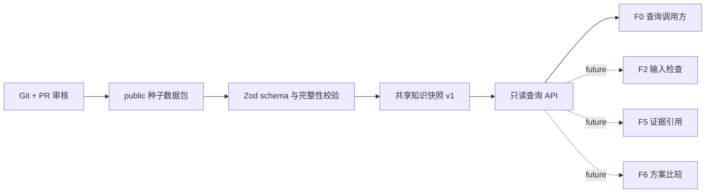

# F0 知识库首版设计

**日期：**2026-07-22

## 目标与范围

F0 为后续 TA 检查、解读与方案比较提供受控、可追溯的参考知识。首版交付三类
本地只读知识库：能力库、规则库和术语库。它们作为同一个版本化快照发布，以匿名
公开种子数据完成端到端验收。

本设计只实现知识数据的校验、加载、查询和版本引用，不实现 TA 工作簿解析、Excel
计算、真实工程数据导入、运行时编辑、模型调用、外部数据库、Web UI 或 F2/F5/F6
的业务判断。真实工程条目、供应商信息、DIM ID、图纸内容和实测 Cpk 均不属于 F0
首版数据范围。

## 已确认决策

- 初始内容为可提交到 Git 的匿名、公开种子数据。
- 数据维护仅通过 Git 分支和 Pull Request；运行时没有新增、修改或删除接口。
- 三类库共同使用一个发布版本，例如 `v1`。任一库变更均发布新的完整快照。
- F0 首版覆盖能力库、规则库和术语库的最小只读查询闭环。
- 能力未知或覆盖不足必须返回 T0：`制程能力未知，请与供应商确认`。它不是可行性
  判断，也不得被调用方解释为通过或失败。
- F0 数据最大分类为 `public`；包含 `internal`、`confidential` 或 `secret` 的数据
  一律不能进入首版受控包。

## 架构与模块边界

新增 `@ai-assist/knowledge-base` workspace package。它依赖既有
`@ai-assist/contracts` 提供的版本化 schema 和类型化错误模型，并使用
`@ai-assist/governance` 的 Feature Register 表示能力状态。它不直接写入
audit、memory 或 runtime 路径。



数据包是代码仓库内受控的静态输入，而不是可由调用方指定的文件路径或 URL。加载器
只接受已打包的公共快照标识，拒绝网络地址、任意本地路径、上传内容和运行时写入。
这使 F0 不会绕过既有分类和仓库敏感路径检查。

## 共享版本与 manifest

每份发布快照都包含一个 manifest，至少记录：

- `knowledgeBaseVersion`，首版为 `v1`。
- 数据分类 `public`、发布日期和中文变更说明。
- 三类库的稳定库 ID、条目数、覆盖范围与内容哈希。
- 每个库 schema 的契约 ID 和版本。

加载时，manifest 版本、各库版本和内容哈希必须相互一致。任何不一致、缺库或校验
失败均返回 `validation_error` 并拒绝创建快照；不得忽略错误后使用部分数据。查询
响应始终回传 `knowledgeBaseVersion` 和被引用的条目 ID，以便未来的 F2、F5、F6 将
结论绑定到同一知识快照。

## 数据模型

所有条目拥有稳定 ID、来源、置信度、负责人、生效版本、覆盖范围和简短中文变更
说明。稳定 ID 在同一库内不可重复；F7 将来把 T3 经验条目升级为 T1 实测条目时，必须
发布新快照并保留历史，不能原地覆盖已发布的 `v1`。

### 能力库

能力条目至少包含：

- 零件类别和可选子系统/基准上下文。
- 合理公差范围及单位。
- 推荐分布。
- 制程能力等级 `T0`、`T1`、`T2` 或 `T3`。
- 来源、置信度、负责人和覆盖范围。

首版匿名条目只能使用概念化类别和演示数据。公差下限必须小于或等于上限，单位、
分布和能力等级必须来自枚举。查询只有在类别与范围均被明确覆盖时返回 `matched`；
未知类别、未覆盖范围或缺少足够上下文时返回 `unknown`、`T0` 和固定确认提示。T0
响应不带推荐能力数值，且没有 `feasible`、`pass` 或 `fail` 字段。

### 规则库

规则条目至少包含稳定 `ruleId`、规则类型、阈值、单位或适用条件、来源、负责人和
覆盖范围。首版包括 CTS 的 `6 sigma`、CTF 的 `4 sigma` 与默认 Cpk 目标 `1.33`。
规则库只提供受控常量和引用证据；它不执行计算、风险判定或工程决策。

### 术语库

术语条目至少包含稳定 ID、术语类型、规范名称、可选别名、定义、允许的父子关系、
覆盖范围和负责人。首版覆盖零件类别、子系统和基准名称。所有父子引用必须解析到
当前快照中的现有条目，且同一类型内的规范名称和别名不能产生歧义。

## 只读查询契约

`@ai-assist/knowledge-base` 对外提供以下最小 API：

```ts
loadKnowledgeBase({ version: "v1" })
findCapability({ partCategory, tolerance, unit, subsystem?, datum? })
getEngineeringRule({ ruleId })
resolveTerminology({ termType, value })
getKnowledgeBaseManifest()
```

`loadKnowledgeBase` 只接受受支持的打包版本；未知版本返回 `feature_not_available` 或
`validation_error`，由实现根据“未发布”或“已发布但内容无效”区分。查询缺少必填字段
或字段格式不合法时返回 `validation_error`。规则或术语未命中返回显式的未命中结果，
不猜测近似匹配；能力未命中遵循上述 T0 回退语义。

API 返回深拷贝且冻结的 DTO。调用方修改返回对象不得改变已加载快照，也不得影响后续
查询。所有对外错误必须继续使用既有类型化错误契约，错误摘要不得包含数据包原文或
潜在敏感输入。

## 数据质量、隐私与治理

加载器使用 Zod 验证所有 manifest 与条目，并至少拒绝以下内容：

- 重复稳定 ID、空来源/负责人、无效等级或分布、倒置公差范围。
- 版本、契约 ID 或条目数不一致；缺失库；hash 不匹配。
- 无法解析或循环的术语关系；冲突的规范名称或别名。
- 标记为 `internal`、`confidential` 或 `secret` 的条目。
- 疑似真实工程内容，包括 `.xlsx`/`.xlsm` 引用、DIM ID、供应商名称、项目代码或
  其他仓库治理规则认定的敏感标识。

Git 是唯一变更轨迹。任何数据包调整必须在 PR 中同时更新共享版本、manifest 哈希、
中文变更说明、对应 fixture 与测试。审阅必须确认内容仍为匿名 public 数据，并检查
未来 F7 的 T3 到 T1 升级不会改变历史快照。

F0 的静态公共数据不创建业务 run，因此不额外生成 audit/memory 记录。未来在某个
编排 run 中使用 F0 时，调用方必须把 `knowledgeBaseVersion`、条目 ID、规则 ID 和
查询结果状态写入该 run 的既有审计证据，且不得记录真实未脱敏输入。

## Feature Register 更正

当前 Phase 0 Feature Register 将 F0 误标为“TA 工作簿基础解析”，与产品功能拆分
不一致。实施 F0 时必须把它更正为“知识库”，并将其状态改为 `available`，但该状态
严格仅表示匿名 `public`、本地、只读的 `knowledge-base-v1` 数据包与查询 API 可用。

F0 的条目应使用 `knowledge-base-query-request-v1` 和
`knowledge-base-query-result-v1` 契约，依赖 `knowledge-base-v1`，最大分类为
`public`，验收检查为三库匿名 fixture、未知能力 T0 fixture 和数据包完整性检查。
F5/F6 已有的 `knowledge-base-v1` 依赖保持不变；它们仍为 `unavailable`，不得因
F0 可用而被错误启用。相关治理文档与测试必须同步更新。

## 验收与测试

F0 的实现至少覆盖下列可执行验证：

1. 共享 `v1` 的三类匿名种子数据均可加载，manifest 返回正确版本、覆盖范围、条目数
   和内容哈希。
2. 每个库至少有一个正向查询：能力查询返回来源、置信度和推荐分布；规则和术语查询
   返回稳定 ID 与快照版本。
3. 未知类别、未覆盖公差、无效上下文均返回 `unknown`、T0 和固定供应商确认提示，
   且不存在可行性断言。
4. 重复 ID、倒置范围、非法分布、版本或 hash 不一致、术语冲突及敏感标记均被拒绝。
5. 任一查询结果的修改不会污染后续查询或已加载快照。
6. Feature Register、治理文档和匿名 fixture 一致地描述 F0 为 public、只读且可用；
   F1-F7 的状态不因此改变。
7. 根目录 `build`、`lint`、`test` 和 `check:repository` 全部通过。

## 不在本次范围内

- 真实工程知识、供应商数据、DIM ID、PPAP 或实际 Cpk 的导入和维护。
- 本地编辑器、审批工作流、数据库、远程同步和运行时导入/导出。
- 对 TA 内容进行解析、清洗、计算、风险解释或优化。
- 将 F0 查询自动接入编排器、Skill 或 CLI；后续 Feature 仅可通过版本化契约使用它。
- F7 将 T3 升级为 T1 的实际回填流程。

## 完成定义

F0 首版完成时，匿名 public 的共享 `v1` 知识快照可在本地严格加载，三类库均可通过
只读 API 查询，所有异常或未知能力均按安全语义失败或降级。所有内容变更可通过 Git
历史和 manifest 追溯；没有任何实现路径会把该首版宣称为真实工程知识、工程决策或
后续 Feature 的已交付能力。