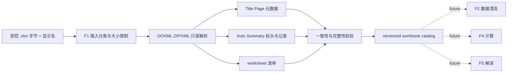

# F1 TA 工作簿目录首版设计

**日期：**2026-07-23

## 目标与范围

F1 首版从受控的 TA `.xlsx` 工作簿创建只读、可追溯的分析目录。目录识别需要进行
TA 分析的 worksheet，并将每项与 `Auto Summary` 中的公差链描述，以及 `Title Page`
中的文档版本元数据关联。它为后续 F2 数据清洗、F4 计算和 F5 解读提供稳定的结构化
输入，但本身不解析因子表、不计算、不做工程判断、不提取图片，也不访问 Loop、ADO、
SharePoint 或模型服务。

实际基准文件 `Maera_cosmetic_critical_TA - Rev E.xlsx` 仅用于本地只读结构验证，绝不
进入 Git、fixture、日志、普通控制台输出或 F0 公共知识库。该文件是 `confidential`。

## 已确认业务映射

F1 的目录规则以实际基准工作簿确认：

- `Auto Summary` 包含需要 TA 分析的 worksheet 清单。
- `Device Level Dim` 的值是待分析项的 `worksheetName`。
- `Tolerance Loop Description` 是该项的 `toleranceLoopDescription`。
- `Title Page` 的 `Document No.`、`Revision:` 和 `Date:` 是整个工作簿的版本元数据。
- 每个非空 `Device Level Dim` 都纳入目录；不按 `Pass/Fail`、Cpk、Milestone、Priority
  或其他状态列过滤。
- 基准文件的 `Auto Summary` 标头位于第 8 行，`Device Level Dim` 在 A 列、
  `Tolerance Loop Description` 在 D 列；实现不得依赖这些固定行列，应按标头文本查找。
- 基准文件有 30 条分析项，全部唯一、全部匹配实际 worksheet、且全部有描述；这仅是
  本地验证观察，不是生产实现中硬编码的数量要求。

## 已确认技术决策

- 新增 `@ai-assist/workbook-catalog` TypeScript workspace package。
- 使用 OOXML ZIP/XML 的只读解析，而不使用 Excel COM、Python Worker、网络服务或任意
  本地路径 API。
- 调用方传入受控的工作簿字节流与安全显示名；API 不接受路径、URL、文件句柄或工作簿
  对象。
- F1 的最大数据分类为 `confidential`。原始字节只在调用时的受控内存中处理；默认输出
  仅包含内容 hash、受控目录、分类及源单元格引用。
- `Title Page!Date` 为公式时，读取 OOXML 中上次 Excel 计算保存的缓存值，并保留公式
  与源单元格引用；没有缓存值时 fail closed，绝不使用扫描当天日期替代。

## 架构与数据流



解析器只访问 `.xlsx` 中必要的 OOXML 部件：`[Content_Types].xml`、workbook relationship、
worksheet 名称及关系、shared strings、`Title Page` 和 `Auto Summary` 工作表 XML。它不
解析 VBA、外部链接、图片、公式依赖图、图表或因子表。加密、损坏、压缩炸弹、缺少必要
部件或无法解析的 XML 必须返回类型化错误，不进行猜测或部分成功输出。

## 输入与输出契约

输入为 `workbook-catalog-request-v1`：

```ts
{
  contractVersion: "v1",
  fileName: "user-visible-name.xlsx",
  inputClassification: "confidential",
  workbookBytes: Uint8Array
}
```

`fileName` 只用于用户可见显示与安全引用，不能被解释为路径。字节必须是单一 `.xlsx`
ZIP 容器，并受显式的最大压缩与解压大小限制。`secret` 输入在任何解析、hash 或审计前
以 `policy_denied` 拒绝。

成功输出为 `workbook-catalog-result-v1`：

```ts
{
  contractVersion: "v1",
  workbook: {
    fileName: "user-visible-name.xlsx",
    classification: "confidential",
    contentHash: "sha256 lowercase hex",
    metadata: {
      documentNo: "M1160113",
      revision: "E",
      date: {
        value: "2026-07-23",
        formula: "=TODAY()",
        sourceCell: "Title Page!B11"
      }
    }
  },
  analyses: [
    {
      worksheetName: "TP_Gap_X",
      toleranceLoopDescription: "DIM307, TP to C bucket Gap in X",
      source: {
        summarySheet: "Auto Summary",
        summaryRow: 11,
        worksheetAnchor: "TP_Gap_X!A1"
      }
    }
  ]
}
```

实际值不会写入目录的错误摘要。内容 hash、工作表名 hash 或受控的行号可用于安全诊断；
机密描述、DIM 内容、项目名、供应商信息和原始单元格文本不得出现在错误摘要、普通日志
或未确认导出中。

## 解析与校验规则

1. 验证 request schema、`confidential` 分类和字节大小，再计算原始字节 SHA-256。
2. 验证 XLSX ZIP 中的 ZIP64、压缩率、条目数、单个解压条目大小和总解压大小均在
   明确定义的安全上限内；拒绝路径穿越、重复 ZIP 条目及 XML entity/DTD。
3. 从 workbook relationship 解析全部 worksheet 的显示名和 XML 部件，不按物理文件名
   假设工作表顺序。
4. 查找显示名精确为 `Title Page` 和 `Auto Summary` 的 worksheet；任一缺失时返回
   `validation_error`。
5. 在 `Title Page` 已使用的单元格中查找规范化标签 `Document No.`、`Revision:`、
   `Date:`，并读取右侧最近的非空值及其单元格引用。标签重复、值缺失或值歧义均拒绝。
6. `Date` 若为公式，读取其 cached value；缓存必须可转换为 ISO `YYYY-MM-DD`。输出保存
   原公式和源单元格。固定日期同样规范化为 ISO 值，但不包含 `formula` 字段。
7. 在 `Auto Summary` 中按规范化标头查找同一行的 `Device Level Dim` 与
   `Tolerance Loop Description`。表头重复、缺失、在不同表头行或列重复均拒绝。
8. 对表头之后每个 `Device Level Dim` 非空行创建候选项，不应用任何状态筛选。描述必须
   非空，worksheet 名称必须唯一且精确存在于 workbook sheet list；任一不满足即拒绝整个
   catalog。
9. 每个分析项保存 `Auto Summary` 行号、`Auto Summary` 名称和 `<worksheetName>!A1`。
   目录按 `Auto Summary` 原始行顺序输出。
10. 输出和错误对象均为深拷贝、冻结的 DTO；调用方不能污染以后调用或改变已验证目录。

## 错误、隐私与审计

- 无效输入、工作簿结构、缺失标签/列、日期缓存缺失、重复或未匹配 worksheet 都返回
  `validation_error`。错误包含类型化 `run_id`、安全摘要、建议操作和受影响的安全引用。
- `secret` 分类、非法权限或不允许的持久化返回 `policy_denied`，且不得开始解析或写入
  审计。
- 超出解压/资源上限或无法读取受控依赖时返回 `dependency_error`；格式错误不作为重试
  候选。
- 未来经编排器调用时，审计事件只记录文件 hash、分类、F1 版本、目录条目数和安全源
  引用。原始 workbook、完整描述与 cell value 的保留继续遵循 confidential opt-in。
- F1 首版不生成调试 JSON 文件、不创建图片工件、不写 Excel、不将输入内容写入 Git。

## Feature Register 更正

当前 Feature Register 将 F1 错误标记为 `TA 数据质量检查`，但产品文档定义 F1 为
`TA 报告解析与资产准备`。F1 实施时必须将其名称、依赖和契约更新为：

```ts
{
  featureId: "F1",
  title: "TA 报告解析与资产准备",
  status: "available",
  dependsOn: ["workbook-catalog-v1"],
  inputContractId: "workbook-catalog-request-v1",
  outputContractId: "workbook-catalog-result-v1",
  maximumClassification: "confidential",
  acceptanceChecks: [
    "anonymous-workbook-catalog-fixture",
    "dynamic-date-cache-fixture",
    "workbook-catalog-privacy-check"
  ],
  externalPrerequisites: ["approved-ooxml-parser"],
  disableBehavior: "return feature_not_available"
}
```

F2-F7 的状态和契约均不因 F1 可用而变化。F8 仅维持其现有匿名 public workflow fixture
可用状态，不能据此处理 confidential 工作簿。

## 测试与验收

测试 fixture 必须为匿名、可提交的 `.xlsx` 或等价 OOXML ZIP 字节，不含真实产品、项目、
DIM、供应商、版本值或描述。fixture 应复现实际基准中的结构特征，而非内容。

最小验收包括：

1. 成功解析一个匿名 workbook：目录包含多个按 summary 行顺序排列的唯一 worksheet，
   并包含 document/revision/日期/描述/source anchor。
2. 动态日期 fixture 的公式和 cached ISO 日期均被读取；公式无缓存时拒绝。
3. 固定日期、Excel serial 日期和 shared-string 日期均按既定规则规范化或拒绝。
4. 缺少 `Title Page`、`Auto Summary`、任一标题标签、任一 required summary 标头时拒绝。
5. 空描述、重复 summary worksheet 名称、未匹配 worksheet 和重复表头时拒绝整个目录。
6. 含 DTD/entity、路径穿越、重复 ZIP entry、超过解压限制或无效 XLSX 的输入 fail closed。
7. `secret` 请求不读取字节；所有错误、目录 DTO 和日志断言均不泄漏匿名 fixture 中的
   隐私标记文本。
8. Feature Register、治理文档与匿名 fixture 一致地将 F1 说明为受控 confidential
   workbook catalog；F2-F7 仍然 `unavailable`。
9. 根目录 `build`、`lint`、`test`、`check:repository` 和干净 `npm ci` 全部通过。

## 不在本次范围内

- 因子表、名义值、公差、分布、Cpk、Pass/Fail 或其他 TA 数值的读取与校验。
- Excel 公式计算、Excel COM、Python Worker、工作簿修改或写回。
- Loop 截图、图片/图表提取、调试 JSON 文件、ADO/SharePoint/网络集成。
- 多工作簿合并、运行时本地路径 API、用户上传 UI 和完整 F8 confidential 工作流。
- F2 清洗、F4 计算、F5 解读、F6 优化或 F7 反馈闭环。

## 完成定义

F1 首版完成时，系统可在受控内存中读取 confidential `.xlsx` 字节，严格验证 TA workbook
目录结构，并生成只读、可版本化、可审计的 worksheet catalog。目录完整保留工作表、
公差链描述和版本元数据之间的来源关系；它不会把实际 workbook 内容误认为 public
fixture，也不会将解析成功误表述为数据清洗、计算或工程结论。