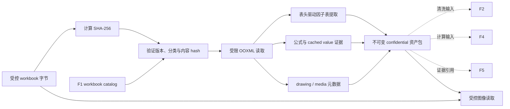

# F1.1 TA 工作表分析资产提取设计

**日期：**2026-07-24

## 目标

F1.1 在 F1 `workbook-catalog` 已确认的 TA worksheet 范围内，创建只读、可追溯、
不可变的 `worksheet-analysis-assets` 资产包。资产包把因子表、单元格中的公式与其
Excel 保存的 cached value，以及 OOXML 内嵌图像的证据元数据关联到同一份 confidential
workbook 内容 hash。

F1.1 是 F2、F4、F5 的受控输入准备层，不是数据质量、计算或工程判断层：

- F2 负责数据清洗、完整性/阻断判定与异常处置。
- F4 负责正式计算、公式重算和单位换算。
- F5 负责对计算结果的工程风险解读与行动建议。

真实 TA workbook、图片、因子值、公式、cached value、sheet 名称和描述都是
`confidential`。它们不得写入 Git、fixture、普通日志、错误摘要或不受控导出。

## 已确认范围

F1.1 首版具有以下固定边界：

1. 请求必须同时携带受控 `.xlsx` 字节和 F1 `workbook-catalog-result-v1`；两者的
   workbook 内容 SHA-256 必须完全一致，否则以 `validation_error` 拒绝。
2. 只读取 F1 catalog 已确认的 TA worksheet；不重新判断、扩展或缩小分析 worksheet
   范围。
3. 因子表以受控的标准表头集合定位，可允许表头所在行列变化。一个 worksheet 中匹配到
   多张候选表时，全部作为独立 `factorTable` 输出，不推断主表或表间工程关系。
4. 每张候选因子表从表头下一行开始，连续读取至第一个完全空白行；空白行以下的区域不
   属于该表。
5. 字段采用逐字段状态。成功字段正常输出；缺失、重复、格式无效、无歧义映射失败或
   缓存缺失时输出 `unavailable` 与安全原因及来源，不因单个字段失败而拒绝整个
   worksheet。
6. 对可定位的完整计算输入集，尝试提取因子、名义值、上/下公差、规格限、单位、分布/
   假设、贡献度、敏感度、均值、标准差、Cpk 与装配方向。
7. 每个字段保留原始单元格文本和单元格来源；只有数值和单位可无歧义解析时，才附加
   结构化数值和单位。F1.1 不做单位换算。
8. 公式只作为证据读取：输出公式文本及 Excel 保存的 cached value。没有 cached value
   时标记 `unavailable`，绝不自行计算或补值。
9. 所有 OOXML 内嵌图片均作为证据资产登记，包括 `png`、`jpeg`、`gif`、`bmp`、
   `tiff`、`emf`、`wmf` 和其他可安全读取的内嵌媒体。F1.1 不 OCR、不渲染、不转换，
   也不判断图像是否是尺寸链图。
10. 资产包只包含图像元数据；原始图像二进制通过独立的受控读取接口取得。读取时必须
    再次提交 workbook 字节和图像 hash，并重新验证 workbook 内容 hash。

## 架构与数据流

F1.1 扩展现有 `@ai-assist/workbook-catalog` package，而不是引入新的工作簿读取技术栈。
它复用 F1 已实施的受限 ZIP/OOXML 读取器、命名空间校验和资源预算；新增的解析面只读取
已批准 worksheet 的 cell 数据、drawing relationship 和媒体部件。



`createWorksheetAnalysisAssets(request: unknown)` 负责产出资产包。图像读取使用独立的
`readWorksheetImageAsset(request: unknown)`；该接口不接受路径、URL、文件句柄、图像
文件名或任意持久化句柄。

## 契约

### 请求

`worksheet-analysis-assets-request-v1` 的最小结构如下：

```ts
{
  contractVersion: "v1",
  inputClassification: "confidential",
  workbookBytes: Uint8Array,
  workbookCatalog: WorkbookCatalogResult
}
```

`workbookCatalog` 必须通过运行时 schema 验证，且其 `workbook.classification` 必须为
`confidential`。F1.1 重新计算 `workbookBytes` 的 SHA-256，要求其等于 catalog 的
`workbook.contentHash`；不信任调用方传入的 hash、worksheet 清单或图像引用。

成功读取图像的请求为：

```ts
{
  contractVersion: "v1",
  inputClassification: "confidential",
  workbookBytes: Uint8Array,
  workbookContentHash: "sha256 lowercase hex",
  imageContentHash: "sha256 lowercase hex"
}
```

接口重新计算 workbook hash，并只在其等于 `workbookContentHash` 后读取媒体；若没有唯一
匹配的媒体 hash，则返回 `validation_error`。图像二进制以新建的 `Uint8Array` 返回，不能
与解析器内部缓冲区共享。

### 成功结果

`worksheet-analysis-assets-result-v1` 是单一 workbook 级 DTO，至少包含：

```ts
{
  contractVersion: "v1",
  workbook: {
    classification: "confidential",
    contentHash: "sha256 lowercase hex",
    catalogContractVersion: "v1"
  },
  worksheets: [
    {
      worksheetName: "catalog-confirmed worksheet name",
      toleranceLoopDescription: "catalog value",
      factorTables: [
        {
          tableId: "stable hash-derived identifier",
          headerRow: 12,
          dataRange: { startRow: 13, endRow: 25 },
          columns: [
            {
              semanticField: "factorName",
              headerText: "Factor",
              sourceColumn: "B"
            }
          ],
          rows: [
            {
              sourceRow: 13,
              fields: {
                factorName: {
                  status: "available",
                  rawText: "confidential cell text",
                  sourceCell: "worksheet!B13"
                },
                nominalValue: {
                  status: "available",
                  rawText: "1.25 mm",
                  numericValue: 1.25,
                  unit: "mm",
                  sourceCell: "worksheet!C13"
                }
              }
            }
          ]
        }
      ],
      formulaCells: [
        {
          sourceCell: "worksheet!K13",
          formula: "=...",
          cachedValue: { status: "available", rawText: "..." }
        }
      ],
      imageAssets: [
        {
          contentHash: "sha256 lowercase hex",
          mediaType: "image/png",
          byteLength: 12345,
          sourcePart: "xl/media/image1.png",
          drawingSourcePart: "xl/drawings/drawing1.xml",
          anchor: { from: "C3", to: "K20" }
        }
      ]
    }
  ]
}
```

示例仅说明字段形状，绝不构成真实 fixture 内容。所有结果、嵌套数组、来源对象和可用字段
均须深度冻结。`unavailable` 字段不包含机密原文，只包含固定的失败类别、已知安全来源和
可选安全单元格引用。

### 标准表头与字段映射

实现维护一个明确、版本化的受控别名表。例如 `Factor`/`Factor Name` 只映射到
`factorName`，`Nominal`/`Nominal Value` 只映射到 `nominalValue`。别名匹配按 trim、
空白折叠与不区分大小写进行；不得使用包含匹配、模糊匹配、LLM 推断或外部配置。

每张候选表至少需要一个 `factorName` 表头才能登记。其他已知字段独立映射；一个候选表中
某语义字段出现多个列、一个表头映射多个语义字段，或表头值无法唯一归类时，对该字段记录
`unavailable`。这不改变表的行边界，也不选择其中一个值作为主值。

单元格字段采用如下状态：

- `available`：具有原始文本、来源单元格，且在适用时有无歧义解析的数值/单位或公式缓存。
- `unavailable`：包含固定 `reasonCode`、worksheet/表/行上下文及可确定的安全来源；不把
  原始错误数据写入错误摘要。

对独立的非表格公式单元格，F1.1 输出其来源、公式和 cached value 状态。对因子行中的
公式字段，同一条证据在字段对象内表达，避免重复读取造成不一致。

## OOXML 解析与证据关联

1. 先验证 F1 catalog 契约、分类、版本和内容 hash，再打开 workbook；失败时不继续读取
   worksheet、drawing 或媒体。
2. 从 catalog 的 `analyses` 按原有顺序获取唯一 worksheet 名称，并通过 workbook relationship
   解析其对应 worksheet XML；不按 zip 路径、worksheet 序号或物理 sheet 顺序推断。
3. 对每个已批准 worksheet，在受现有 cell/DOM 资源预算限制的已使用单元格中扫描受控
   表头。每个匹配表头行生成一个 `factorTable`，并记录表头行、列映射和连续数据区间。
4. “完全空白行”是该表头映射列中所有单元格均缺失或规范化文本为空的首行。它是表的
   终止行，不能被样式、合并单元格、公式文本或未映射旁列绕过。
5. 每个字段保留 `sourceCell`。空、错误、公式无缓存、重复映射和数值/单位解析歧义都以
   字段状态表示，不伪造值。
6. 解析 worksheet 的 drawing relationship；只接受在 worksheet 关系链上可达的 internal
   drawing/media 目标。拒绝外部 relationship、路径穿越、重复部件和不受控关系类型。
7. 解析二单元格锚点和单单元格锚点为 worksheet 坐标范围。没有可识别锚点的媒体仍可作为
   worksheet 关联的 `unavailable` 证据项登记，绝不猜测位置。
8. 媒体 hash 从实际原始媒体字节计算。资产元数据的 `sourcePart` 和 `drawingSourcePart`
   仅作为 confidential provenance，不作为可由调用方直接读取的路径 API。

F1.1 保留 F1 的 ZIP64、CRC、压缩率、XML、DOM、shared-string、工作表行列和总资源上限。
此外，对 drawing 和 media 增加明确预算：每 worksheet 最多 64 个图像关系、每 workbook
最多 256 个图像关系；单一媒体部件和全部媒体部件总量仍受安全解压上限约束。超过任一
限制时返回 `dependency_error`，不产出部分资产包。

## 错误、隐私与不可变性

- request schema、catalog schema、分类或 hash 不匹配返回 `validation_error`，使用固定安全
  摘要，且不暴露机密 sheet 名、表头、单元格文本或媒体名称。
- `secret` 分类、路径/URL/外部 relationship、持久化尝试或未批准的输入通道返回
  `policy_denied`，并且不得开始 workbook 内容解析。
- 损坏 ZIP/XML、超出资源上限、CRC 失败、加密、ZIP64、无法满足内部 relationship 约束
  或无法处理安全依赖时返回 `dependency_error`。
- `unavailable` 是成功资产包内的字段级证据状态，不能被误报告为全局 parser 成功后的数据
  质量结论。
- 正常审计只可记录 workbook hash、分类、契约版本、worksheet/表/图像的数量及固定
  reason code；不记录原始文本、公式、cached value、图片二进制、真实路径或媒体名称。
- 输入 bytes、图像 bytes 和输出 DTO 都必须防御性复制；所有公开返回对象深度冻结，防止
  调用方修改已验证的证据链。

## 测试与验收

所有测试仅使用匿名的内存 OOXML archive。不得新增真实 `.xlsx`、真实尺寸链截图、产品名、
DIM、供应商、版本或任何机密内容到 Git。

最小验收包括：

1. 匿名 workbook 与匹配 F1 catalog 能产出多 worksheet 的单一、深度冻结资产包，且各
   worksheet 只来自 catalog 清单。
2. hash 不匹配、catalog 分类不正确、篡改 catalog worksheet 名称和不受支持的契约版本都
   在读取 worksheet 前 fail closed。
3. 表头行列移动仍被识别；同一 worksheet 的多个候选表均独立输出，并保留不同来源范围。
4. 连续行规则在首个完全空白行停止，不把下面的注释或第二个区域并入同一张表。
5. 每个标准语义字段的可用、缺失、重复、无效格式和无歧义映射失败状态均可验证，且不因
   单个字段失败丢弃整个 worksheet。
6. 原始文本与来源总是保留；可解析数值和单位同时输出，歧义单位不换算且标记不可用。
7. 公式及 cached value 被读取；缺少 cached value 只标记字段不可用，绝不计算公式。
8. 多种内部媒体格式、锚点和 drawing relationship 可登记为元数据；输出不内联媒体字节，
   不 OCR 或渲染。
9. 图像受控读取在 workbook hash 与 image hash 都匹配时返回防御性字节副本；hash 不匹配、
   找不到或重复 hash、外部 relationship 和超限媒体均被拒绝。
10. 错误、审计断言和冻结测试证明不会泄漏匿名机密标记文本，也不能通过修改返回对象影响
    后续调用。
11. 根目录 `build`、`lint`、`test`、`check:repository`、干净 `npm ci` 与 `git diff --check`
    全部通过。

## 不在本次范围内

- F2 数据清洗、必填/分布/能力规则、阻断或放行判定。
- F4 公式重算、统计计算、单位换算、Excel/COM/Python 计算引擎。
- F5 工程风险、行动建议、`FACT`/`RULE`/`SIGNAL`/`OPTION` 解释输出。
- 图像 OCR、文字/箭头/尺寸/方向识别、图片语义分类、预览、渲染、转换或导出。
- 任意 workbook 写回、路径 API、外部服务、ADO/SharePoint/Loop 集成或 confidential UI。
- 调用方可配置的字段映射、模糊表头匹配、任意自定义单位词典和多 workbook 合并。

## 完成定义

F1.1 完成时，同一份受控 confidential workbook 与经验证的 F1 catalog 能生成唯一、不可变、
可审计的 worksheet 分析资产包。资产包完整保留因子、公式缓存和图像证据的来源关系，
但不会把提取行为误称为清洗、计算、图像理解或工程结论，也不会让原始机密图片通过普通
结构化结果被无意复制。