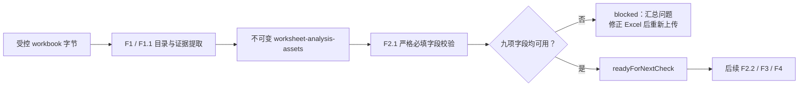

# F2.1 TA 必填字段严格校验设计

**日期：**2026-07-27

## 目标

F2.1 在 F1.1 `worksheet-analysis-assets` 提供的只读证据之上，对每个 TA 因子行执行
严格的必填字段校验。任何必填字段缺失或不可用时，F2.1 返回完整、可追溯的阻断问题清单，
要求工程师修正源 Excel 后重新上传；它不修改 workbook，也不允许以记录例外绕过阻断。

该设计落实 [端到端流程](../../02-端到端流程.md) 中 `REQ` 的必填字段决策：必填项不完整时
进入修正与重新上传路径；只有完整时才进入后续 F2 一致性检查、F3 标识符治理和 F4 计算。
它也遵循 [功能拆分](../../04-功能拆分.md) 的 F2 定义：在计算前确保输入完整，而不是计算、
工程解释或工作簿编辑功能。

## 范围和非范围

### 已确认范围

1. F2.1 只接收 `worksheet-analysis-assets-result-v1`，不接收 workbook bytes、路径、URL、
   文件句柄或图像数据，也不重新扫描 OOXML。
2. 对每个 F1.1 factor table 的每一个因子行，严格检查九项必填字段：
   `factorName`、`partName`、`partCategory`、`nominalValue`、`upperTolerance`、
   `lowerTolerance`、`longTermSafetyFactor`、`standardDeviation` 和 `distribution`。
3. 任一必填字段为空、格式无效、重复映射、无歧义映射失败或公式没有 Excel saved cached value
   时，均输出阻断问题。F2.1 不推断、重算、修复或从其他 worksheet/table/row 继承值。
4. F2.1 对所有行和字段完整检查，不在第一个问题处停止。
5. `drawingNumber` 和 `dimCharacteristicId` 仅输出非阻断提示。它们保留来源，供未来 F3
   DIM ID/图纸治理使用，但绝不改变 F2.1 的阻断状态。
6. F1.1 必须保留每个已识别的 factor table，即使其表头下没有数据行；F2.1 将空的
   factor table 作为阻断问题，避免零行候选表被误报为可继续。

### 明确排除

- F2.2 的能力库公差范围、单位和推荐 distribution 比对。
- F2.3 的人工例外记录、确认或继续运行；必填字段阻断不能被例外绕过。
- F2.4 的 DIM ID/Part Number 格式、重复和跨系统映射冲突检查。
- F3 的 ADO、负责人、提醒、图纸包和 DIM ID 治理。
- F4 的方法推荐、公式计算、单位换算或因子计数结论。
- F5 的风险解释、工程结论或行动建议。
- OCR、图像理解、Excel 写回、外部服务、持久化真实 workbook 或真实工程数据。

## 架构和数据流

F1.1 保持证据提取职责。为支持 F2.1，它扩展受控表头别名表和 factor row 字段，而不产生
数据质量结论。F2.1 是纯校验服务，仅消费已验证的 F1.1 资产。



F2.1 不调用 `loadKnowledgeBase`。能力库匹配属于 F2.2，因此 F2.1 的结果不表达
`in-library`、`out-of-library`、能力可行性、风险或推荐。

## F1.1 证据扩展

F1.1 的 `FieldName` 和公开 runtime schema 新增以下 semantic field：

| F1.1 字段 | 受控表头别名 | F2.1 作用 |
|---|---|---|
| `partName` | `Part Name` | 必填阻断 |
| `partCategory` | `Part Category` | 必填阻断 |
| `longTermSafetyFactor` | `Long Term Factor`、`Safety Factor`、`Long Term/Safety Factor` | 必填阻断 |
| `drawingNumber` | `Drawing Number` | 非阻断提示 |
| `dimCharacteristicId` | `DIM ID`、`Characteristic ID`、`DIM/Characteristic ID` | 非阻断提示 |

现有字段在 F2.1 中的对应关系为：`factorName` 对应 Factor Description、`nominalValue`
对应 Design Nominal、`upperTolerance`/`lowerTolerance` 对应正负 Tolerance、
`standardDeviation` 对应 sigma Level，`distribution` 对应 Distribution。

别名匹配继续采用 F1.1 已有的 trim、空白折叠和不区分大小写规则；不得使用包含匹配、
模糊匹配、LLM 推断或运行时外部配置。`Long Term Factor`、`Safety Factor` 和
`Long Term/Safety Factor` 是同一语义字段。若一个候选表中匹配到多个该字段列，F1.1 必须
输出 `unavailable`，不能任选一个列值。

F1.1 对已匹配唯一 `factorName` 表头的候选表，必须始终输出 table metadata 和 `rows` 数组；
`rows` 可以为空。它不能因零数据行而省略该 table，否则 F2.1 无法区分“没有候选表”与
“已识别但没有因子行”的阻断场景。

`longTermSafetyFactor` 和 `standardDeviation` 使用 F1.1 数值字段规则：只有无歧义数值
解析成功时才可用。F2.1 不接受仅有原文但没有有效数值的字段。其他必填字段以 F1.1
`available` 状态和非空规范化文本为准。

## 请求和结果契约

### 请求

`required-field-check-request-v1`：

```ts
{
  contractVersion: "v1",
  inputClassification: "confidential",
  worksheetAnalysisAssets: WorksheetAnalysisAssetsResult
}
```

服务必须以 Zod runtime schema 验证请求、分类、F1.1 contract version 和资产对象形状。
TypeScript 类型断言、部分手工构造的行对象或非 `confidential` 输入一律不可作为可信输入。

### 成功结果

业务数据不完整是 F2.1 的正常结果，不能以异常形式掩盖完整的问题清单：

```ts
{
  contractVersion: "v1",
  inputClassification: "confidential",
  status: "blocked" | "readyForNextCheck",
  blockingIssues: [
    {
      issueCode: "required_field_unavailable" | "factor_table_has_no_rows",
      worksheetName: "confidential source name",
      tableId: "F1.1 table identifier",
      sourceRow: 13,
      field: "nominalValue",
         reasonCode: "missing" | "invalid_format" | "duplicate_mapping"
        | "ambiguous_mapping" | "missing_cached_value",
      sourceCell: "confidential source reference"
    }
  ],
  advisoryIssues: [
    {
      issueCode: "optional_identifier_unavailable",
      worksheetName: "confidential source name",
      tableId: "F1.1 table identifier",
      sourceRow: 13,
      field: "drawingNumber" | "dimCharacteristicId",
      reasonCode: "missing" | "duplicate_mapping" | "ambiguous_mapping"
        | "missing_cached_value",
      sourceCell: "confidential source reference"
    }
  ],
  summary: {
    worksheetsChecked: 1,
    factorTablesChecked: 1,
    factorRowsChecked: 12,
    blockingIssueCount: 2,
    advisoryIssueCount: 1
  }
}
```

实际 DTO 中 `sourceRow` 和 `sourceCell` 仅在 F1.1 已安全确定时出现。`unavailable` 字段
没有可安全来源时，F2.1 不伪造来源。结果中的 worksheet 名、table ID、行号和 source cell
均是 confidential provenance，只能留在受控运行时结果中，不能写入普通日志、Git fixture
或错误摘要。

### 状态与问题规则

1. `blockingIssues` 非空时，`status` 必为 `blocked`。
2. 只有 `blockingIssues` 为空时，`status` 才是 `readyForNextCheck`。这只表示可进入下一
   校验或后续功能，不代表工程、能力库或风险结论已通过。
3. `advisoryIssues` 永远不改变状态。它们将来供 F3 使用。
4. F1.1 factor table 没有数据行时产生一条 `factor_table_has_no_rows` 阻断问题；此问题没有
   `field`、`sourceRow` 或 `sourceCell`。
5. 每一数据行缺少表头映射的必填字段时，F2.1 为该行产生 `required_field_unavailable`。
   它不得将其他行、表或 worksheet 的值视为默认值。
6. F1.1 已产生的字段 `unavailable.reasonCode` 原样映射到 F2.1 issue，不重新解析原文、
   不扩展错误细节、也不暴露被拒绝候选列的机密内容。
7. F1.1 字段为 `available` 但 `rawText` 规范化为空，或数值必填字段缺少 finite
   `numericValue`，F2.1 以固定 `missing` 或 `invalid_format` 阻断。

## 错误、隐私和不可变性

- 请求、版本或 F1.1 资产结构不合法时返回 `validation_error`，不把它伪装为业务 `blocked`。
- 非 `confidential` 分类、secret 输入或非受控输入通道返回 `policy_denied`。
- F2.1 不读取 bytes，因此不会扩大 F1.1 的 ZIP/XML/relationship 攻击面；F1.1 的安全解析
  边界仍是唯一 workbook 读取边界。
- 正常审计只记录 contract version、分类、workbook content hash、计数和固定 issue code。
  不记录真实单元格文本、工作表名、图片、路径或原始 workbook bytes。
- 公共 DTO 使用 structured clone 后递归冻结；调用方不能通过修改嵌套数组、issue、summary
  或来源对象影响其他调用或内部状态。

## 测试与验收

1. 为新增 F1.1 字段的每个受控别名添加匿名 in-memory OOXML fixture 测试，并验证来源与
   数值/文本状态；不得加入真实 `.xlsx`、`.xlsm` 或机密 workbook 内容。
2. 验证 `Long Term Factor`、`Safety Factor` 与 `Long Term/Safety Factor` 单独出现时均映射为
   `longTermSafetyFactor`；同表多列匹配必须是 `unavailable`。
3. 九项必填字段逐项缺失均产生阻断；多行、多字段问题必须一次性完整返回。
4. 验证空白、`invalid_numeric`、`duplicate_mapping`、`ambiguous_mapping` 和
   `missing_cached_value` 都阻断；没有可用 numeric value 的数值字段不得通过。
5. 验证 `drawingNumber` 和 `dimCharacteristicId` 缺失或不可用时只返回 advisory，其他九项
   完整时结果仍为 `readyForNextCheck`。
6. 验证零行 factor table 阻断，且不伪造行/字段来源。
7. 验证请求篡改、错误 F1.1 contract version、错误分类和未知字段被运行时 schema 拒绝。
8. 验证返回对象深冻结，且日志/错误摘要/fixture 中没有机密原文或真实 workbook 内容。
9. 更新 exports、治理 Feature Register 和 policy tests，使 F2.1 可用但 F2.2-F2.4、F3-F7
   仍保持 `unavailable`。

## 实施顺序

1. 扩展 contracts 与 F1.1 表头/字段提取，保留零行候选表；先以测试锁定所有新增字段、
   零行表和重复映射语义。
2. 新增独立 F2.1 required-field service、契约、严格阻断和 advisory 结果测试。
3. 导出公共 API，更新治理 register、README/docs 和 repository privacy regression tests。
4. 执行 package-level 测试、全仓 build/test/lint/policy check；确认未实现 F2.2-F2.4、F3-F7
   的任何行为。