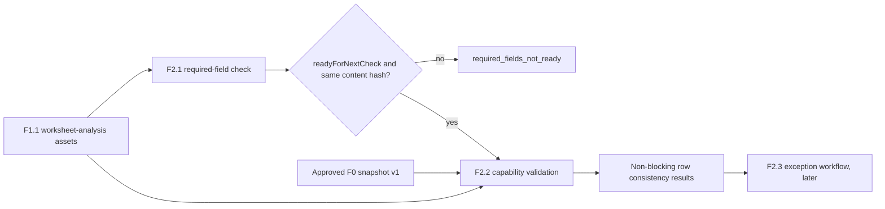

# F2.2 Capability Library and Distribution Validation Design

**Date:** 2026-07-27

## Goal

F2.2 compares each complete TA factor-row evidence record with an approved public F0
Capability Library snapshot. It reports whether the row's total tolerance is represented
by a matching category/unit/range entry and whether the supplied distribution agrees with
that entry's recommended distribution.

F2.2 is a non-blocking consistency check that can run only after F2.1 has confirmed all
required fields are ready. It creates no engineering-feasibility conclusion, no exception
record, no calculation, and no workbook modification.

## Scope and Boundaries

### In scope

1. Consume validated F1.1 worksheet-analysis assets and a ready F2.1 required-field result.
2. Bind the F2.1 result to the same F1.1 workbook evidence using its confidential content hash.
3. Load an explicitly requested, approved public knowledge-base snapshot through F0.
4. For each factor row, compare total tolerance against the matching Capability Library range.
5. Compare a recognized, normalized input distribution with the matched entry's recommended
   distribution.
6. Return confidential, immutable, provenance-preserving row results and summaries.

### Explicitly out of scope

- Reopening or parsing OOXML, accepting workbook bytes, paths, URLs, images, or external data.
- Required-field validation, data repair, unit conversion, fuzzy matching, or inferred values.
- Cpk, feasibility, tolerance-stack calculations, engineering recommendations, or risk scoring.
- F2.3 exception creation, approval, persistence, or a decision to continue despite a difference.
- F2.4 identifier governance, F3 DIM governance, and all later workflow behavior.
- Network calls, external capability-library updates, or persistence of confidential workbook data.

## Data Flow



F2.2 is implemented as a pure `createCapabilityValidation(request)` service in
`@ai-assist/workbook-catalog`. It calls the public `loadKnowledgeBase({ version })` API from
`@ai-assist/knowledge-base`; it does not import embedded seed data directly. The only currently
approved version is `v1`, and F0 rejects any unavailable version with its existing typed error.

## Input Contract and Gate

The confidential request contains:

```ts
{
  contractVersion: "v1",
  inputClassification: "confidential",
  knowledgeBaseVersion: "v1",
  worksheetAnalysisAssets: WorksheetAnalysisAssetsResult,
  requiredFieldCheck: RequiredFieldCheckResult
}
```

F2.2 requires F2.1 result status `readyForNextCheck`. If F2.1 is blocked, F2.2 returns a
normal confidential result with status `required_fields_not_ready`, no row conclusions, and
the supplied F2.1 blocking/advisory counts. It does not recreate or reinterpret F2.1 issues.

F2.1's current public result does not identify the F1.1 assets it checked. To make the gate
auditable and prevent a ready result for one workbook being used with a different asset set,
F2.1 will add `workbookContentHash`, copied from
`worksheetAnalysisAssets.workbook.contentHash`, to its result contract. F2.2 validates it against
the F1.1 asset hash before examining rows. A mismatch is a `validation_error`, not a business
consistency conclusion.

Malformed requests, schema version mismatches, unavailable knowledge-base versions, and forged
F2.1/F1.1 binding data are rejected through typed errors. Inputs that are not `confidential` are
rejected by the policy boundary.

## Row Semantics

### Tolerance lookup

For a row with finite numeric upper and lower tolerances, F2.2 computes the total tolerance band:

$$
\text{totalTolerance} = \text{upperTolerance} - \text{lowerTolerance}
$$

For example, $+0.10/-0.05$ becomes $0.15$. F2.2 passes this value, the exact `partCategory`, and
the normalized unit to F0 `findCapability`. F0 matches only when category and unit are equal and
the tolerance is within the entry's inclusive range. F2.2 does not convert units, relax category
matching, select a nearest range, or use an entry from another row, table, or worksheet.

The current F0 capability contract accepts only `mm`. F2.2 treats a missing, unavailable,
blank, or non-`mm` unit as a non-blocking `unable_to_validate` outcome. It does not claim either
in-library or out-of-library in that case.

### Capability states

- `in_library`: F0 returns a matched capability entry. The result retains the entry ID,
  recommended distribution, capability tier, and F0 version as public evidence.
- `out_of_library`: F0 returns `unknown`, meaning no exact category/unit/tolerance match exists.
  This is distinct from a matched entry whose tier is `T0`.
- `unable_to_validate`: a required F2.2 comparison input is unusable, including the unit cases
  above or an invalid non-negative computed tolerance. This is non-blocking and does not invent a
  library conclusion.

`capabilityTier: "T0"` on an `in_library` result only records that the matched library entry has
unknown capability. F2.2 must not call it feasible, infeasible, accepted, rejected, or otherwise
derive an engineering conclusion.

### Distribution comparison

F2.2 compares distribution only when the capability state is `in_library`. It applies one
controlled, local normalization table before an exact comparison:

| Accepted input spelling | Canonical distribution |
|---|---|
| `normal`, `gaussian`, `正态分布` | `normal` |
| `uniform`, `均匀分布` | `uniform` |
| `triangular`, `三角分布` | `triangular` |
| `trapezoidal`, `梯形分布` | `trapezoidal` |
| `elliptical`, `椭圆分布` | `elliptical` |
| `beta`, `贝塔分布` | `beta` |

Normalization trims surrounding whitespace and uses locale-independent case folding before the
explicit alias lookup. It does not use substring, fuzzy, model-based, or configurable matching.

The resulting distribution check is one of:

- `matches_recommendation`: canonical input equals the entry's recommended distribution.
- `distribution_mismatch`: both values are recognized but differ.
- `unable_to_validate`: input distribution is missing, unavailable, blank, or not one of the
  controlled aliases.
- `not_applicable`: no matched capability entry is available for comparison.

All distribution outcomes are non-blocking. A distribution mismatch is a consistency signal for
subsequent F2.3 handling, not an exception record and not an engineering conclusion.

## Result Contract

The F2.2 result is confidential and includes a status, F0 version evidence, a row result for every
F1.1 factor row reached through the ready gate, and counts. Each row keeps only the necessary
confidential worksheet/table/row/factor provenance required to locate the issue in the controlled
source. It does not echo raw confidential values or rejected candidate mappings.

```ts
{
  contractVersion: "v1",
  inputClassification: "confidential",
  status: "completed" | "required_fields_not_ready",
  knowledgeBaseVersion: "v1",
  workbookContentHash: "sha256 hex hash",
  rows: [{
    worksheetName: "confidential source name",
    tableId: "F1.1 table identifier",
    sourceRow: 13,
    factorName: "confidential factor label",
    tolerance: {
      status: "in_library" | "out_of_library" | "unable_to_validate",
      totalTolerance: 0.15,
      unit: "mm",
      capabilityEntryId: "public entry ID",
      capabilityTier: "T0" | "T1" | "T2" | "T3"
    },
    distribution: {
      status: "matches_recommendation" | "distribution_mismatch"
        | "unable_to_validate" | "not_applicable",
      actual: "normal",
      recommended: "normal"
    }
  }],
  summary: {
    factorRowsChecked: 1,
    inLibraryCount: 1,
    outOfLibraryCount: 0,
    toleranceUnableToValidateCount: 0,
    distributionMatchCount: 1,
    distributionMismatchCount: 0,
    distributionUnableToValidateCount: 0,
    distributionNotApplicableCount: 0
  }
}
```

The final schema will use discriminated unions so state-specific fields cannot be supplied for an
incompatible outcome. Summary counts must exactly match the row results. A gate result has an empty
row array and zero row-derived summary counts.

F2.2 deep-clones and recursively freezes all public DTOs. It returns no mutable references to
inputs, F0 entries, or internal arrays.

## Privacy, Audit, and Governance

- F1.1/F2.1/F2.2 data remains confidential. The F0 snapshot and its manifest are public.
- Normal logs may contain contract version, F0 version, content hash, and aggregate counts, but
  not raw cell text, worksheet names, source cells, workbook paths, bytes, or images.
- Anonymous in-memory OOXML fixtures remain the only workbook inputs in tests; no real workbook
  artifact is committed.
- Governance exposes F2.2 as available only after this implementation is complete. Root F2,
  F2.3, F2.4, and F3-F7 remain unavailable.

## Tests and Acceptance

1. Strict request/result contract parsing, unknown-key rejection, discriminated state invariants,
   summary invariants, F2.1 content-hash binding, and deep-freeze behavior.
2. A blocked F2.1 result returns the gate status with no row conclusions; a hash mismatch is
   rejected rather than treated as a gate result.
3. Inclusive lower/upper tolerance-range boundaries, category mismatch, and no exact range match
   distinguish `in_library` from `out_of_library`.
4. A matched `T0` entry remains `in_library`; no feasibility field or conclusion is emitted.
5. Missing, blank, unsupported, or unavailable units produce only non-blocking
   `unable_to_validate` tolerance results.
6. Total tolerance uses the approved upper-minus-lower rule, including asymmetric tolerances.
7. Every controlled distribution alias normalizes correctly; unknown distributions produce
   `unable_to_validate`; recognized unequal values produce `distribution_mismatch`.
8. Multi-worksheet/table/row fixtures validate complete aggregation and exact summary counts.
9. F2.2 never accepts workbook bytes or reparses OOXML; no test requires external services or
   real engineering data.
10. Public exports, feature registration, policy tests, root documentation, and the feature
   register reflect F2.2's non-blocking scope without enabling F2.3 or later features.