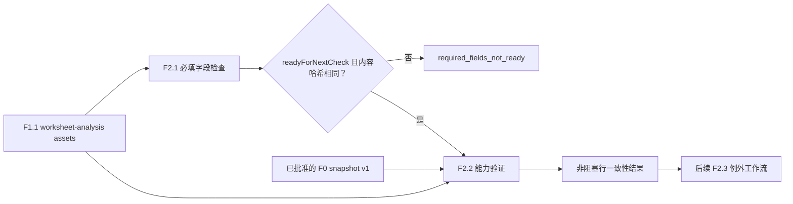

# F2.2 能力库与分布验证设计

**日期：** 2026-07-27

## 目标

F2.2 将每条完整的 TA 因子行证据记录与已批准的公开 F0 Capability Library 快照进行比较。它报告该行的总公差是否由类别、单位和范围均匹配的条目表示，以及所提供的分布是否符合该条目的推荐分布。

F2.2 是一项非阻塞一致性检查，只有在 F2.1 确认所有必填字段就绪后才能运行。它不生成工程可行性结论、例外记录、计算结果，也不修改 workbook。

## 范围与边界

### 范围内

1. 使用已验证的 F1.1 worksheet-analysis assets 和就绪的 F2.1 required-field 结果。
2. 使用其机密内容哈希，将 F2.1 结果绑定到同一份 F1.1 workbook 证据。
3. 通过 F0 加载显式请求且已批准的公开 knowledge-base 快照。
4. 针对每个因子行，将总公差与匹配的 Capability Library 范围进行比较。
5. 将已识别、已规范化的输入分布与匹配条目的推荐分布进行比较。
6. 返回机密、不可变且保留溯源信息的行结果和摘要。

### 明确不在范围内

- 重新打开或解析 OOXML，接受 workbook 字节、路径、URL、图像或外部数据。
- 必填字段验证、数据修复、单位换算、模糊匹配或推断值。
- Cpk、可行性、公差叠加计算、工程建议或风险评分。
- F2.3 例外创建、批准、持久化，或在存在差异时继续的决策。
- F2.4 标识符治理、F3 DIM 治理及所有后续工作流行为。
- 网络调用、外部能力库更新或机密 workbook 数据的持久化。

## 数据流



F2.2 在 `@ai-assist/workbook-catalog` 中实现为纯 `createCapabilityValidation(request)` 服务。它调用 `@ai-assist/knowledge-base` 的公开 `loadKnowledgeBase({ version })` API；不直接导入嵌入式种子数据。目前唯一获批准的版本为 `v1`，F0 会通过其现有类型化错误拒绝任何不可用版本。

## 输入契约与门禁

机密请求包含：

```ts
{
  contractVersion: "v1",
  inputClassification: "confidential",
  knowledgeBaseVersion: "v1",
  worksheetAnalysisAssets: WorksheetAnalysisAssetsResult,
  requiredFieldCheck: RequiredFieldCheckResult
}
```

F2.2 要求 F2.1 结果状态为 `readyForNextCheck`。如果 F2.1 被阻塞，F2.2 会返回状态为 `required_fields_not_ready` 的常规机密结果，不包含行结论，但包含所提供的 F2.1 阻塞/建议计数。它不会重新创建或重新解释 F2.1 问题。

F2.1 当前的公开结果未标识其检查的 F1.1 assets。为使门禁可审计，并防止某个 workbook 的就绪结果被用于不同的资产集，F2.1 将在其结果契约中添加从 `worksheetAnalysisAssets.workbook.contentHash` 复制的 `workbookContentHash`。F2.2 会在检查行之前将其与 F1.1 asset 哈希进行验证。哈希不匹配属于 `validation_error`，而非业务一致性结论。

格式错误的请求、schema 版本不匹配、不可用的 knowledge-base 版本和伪造的 F2.1/F1.1 绑定数据均通过类型化错误拒绝。非 `confidential` 的输入由策略边界拒绝。

## 行语义

### 公差查找

对于具有有限数值上、下公差的行，F2.2 会计算总公差带：

$$
\text{totalTolerance} = \text{upperTolerance} - \text{lowerTolerance}
$$

例如，$+0.10/-0.05$ 会得到 $0.15$。F2.2 将此值、精确的 `partCategory` 和规范化单位传递给 F0 `findCapability`。仅当类别和单位相等，且公差处于条目的包含边界范围内时，F0 才会匹配。F2.2 不进行单位换算、放宽类别匹配、选择最近范围，也不使用其他行、表或 worksheet 中的条目。

当前 F0 capability 契约仅接受 `mm`。F2.2 将缺失、不可用、空白或非 `mm` 的单位视为非阻塞的 `unable_to_validate` 结果。在该情况下，它不会声称结果在库内或库外。

### 能力状态

- `in_library`：F0 返回匹配的 capability 条目。结果会保留条目 ID、推荐分布、capability 层级和 F0 版本，作为公开证据。
- `out_of_library`：F0 返回 `unknown`，表示不存在精确的类别/单位/公差匹配。这不同于层级为 `T0` 的已匹配条目。
- `unable_to_validate`：必需的 F2.2 比较输入不可用，包括上述单位情形或无效的非负计算公差。此结果是非阻塞的，且不会虚构库结论。

`in_library` 结果上的 `capabilityTier: "T0"` 仅记录匹配的库条目具有未知能力。F2.2 不得称其为可行、不可行、已接受、已拒绝，也不得以其他方式推导工程结论。

### 分布比较

F2.2 仅在 capability 状态为 `in_library` 时比较分布。在精确比较前，它应用一个受控的本地规范化表：

| 接受的输入拼写 | 规范分布 |
|---|---|
| `normal`, `gaussian`, `正态分布` | `normal` |
| `uniform`, `均匀分布` | `uniform` |
| `triangular`, `三角分布` | `triangular` |
| `trapezoidal`, `梯形分布` | `trapezoidal` |
| `elliptical`, `椭圆分布` | `elliptical` |
| `beta`, `贝塔分布` | `beta` |

规范化会修剪周围空白，并在显式别名查找前使用与区域设置无关的大小写折叠。它不使用子字符串、模糊、基于模型或可配置的匹配。

所得分布检查为以下之一：

- `matches_recommendation`：规范输入等于条目的推荐分布。
- `distribution_mismatch`：两个值均已识别，但彼此不同。
- `unable_to_validate`：输入分布缺失、不可用、空白，或不属于受控别名。
- `not_applicable`：没有可供比较的匹配 capability 条目。

所有分布结果均为非阻塞。分布不匹配是供后续 F2.3 处理的一致性信号，不是例外记录，也不是工程结论。

## 结果契约

F2.2 结果为机密，包含状态、F0 版本证据、每个通过就绪门禁到达的 F1.1 因子行的行结果和计数。每行仅保留在受控源中定位问题所必需的机密 worksheet/table/row/factor 溯源信息。它不会回显原始机密值或被拒绝的候选映射。

```ts
{
  contractVersion: "v1",
  inputClassification: "confidential",
  status: "completed" | "required_fields_not_ready",
  knowledgeBaseVersion: "v1",
  workbookContentHash: "sha256 hex hash",
  rows: [{
    worksheetName: "confidential source name",
    tableId: "F1.1 table identifier",
    sourceRow: 13,
    factorName: "confidential factor label",
    tolerance: {
      status: "in_library" | "out_of_library" | "unable_to_validate",
      totalTolerance: 0.15,
      unit: "mm",
      capabilityEntryId: "public entry ID",
      capabilityTier: "T0" | "T1" | "T2" | "T3"
    },
    distribution: {
      status: "matches_recommendation" | "distribution_mismatch"
        | "unable_to_validate" | "not_applicable",
      actual: "normal",
      recommended: "normal"
    }
  }],
  summary: {
    factorRowsChecked: 1,
    inLibraryCount: 1,
    outOfLibraryCount: 0,
    toleranceUnableToValidateCount: 0,
    distributionMatchCount: 1,
    distributionMismatchCount: 0,
    distributionUnableToValidateCount: 0,
    distributionNotApplicableCount: 0
  }
}
```

最终 schema 将使用判别联合，以免为不兼容的结果提供状态专属字段。摘要计数必须与行结果完全匹配。门禁结果包含空行数组和零行派生摘要计数。

F2.2 对所有公开 DTO 进行深度克隆并递归冻结。它不会返回对输入、F0 条目或内部数组的可变引用。

## 隐私、审计与治理

- F1.1/F2.1/F2.2 数据保持机密。F0 快照及其 manifest 是公开的。
- 常规日志可包含契约版本、F0 版本、内容哈希和汇总计数，但不得包含原始单元格文本、worksheet 名称、源单元格、workbook 路径、字节或图像。
- 匿名内存中 OOXML fixture 仍是测试中唯一的 workbook 输入；不提交真实 workbook 工件。
- 仅在该实现完成后，治理才将 F2.2 标记为可用。根 F2、F2.3、F2.4 和 F3-F7 保持不可用。

## 测试与验收

1. 严格的请求/结果契约解析、未知键拒绝、判别状态不变量、摘要不变量、F2.1 内容哈希绑定和深度冻结行为。
2. 被阻塞的 F2.1 结果返回不包含行结论的门禁状态；哈希不匹配会被拒绝，而非视为门禁结果。
3. 包含边界的公差范围下限/上限、类别不匹配和不存在精确范围匹配，可区分 `in_library` 与 `out_of_library`。
4. 匹配的 `T0` 条目仍为 `in_library`；不产生可行性字段或结论。
5. 缺失、空白、不支持或不可用的单位仅产生非阻塞的 `unable_to_validate` 公差结果。
6. 总公差使用已批准的上限减下限规则，包括非对称公差。
7. 每个受控分布别名均可正确规范化；未知分布产生 `unable_to_validate`；已识别但不相等的值产生 `distribution_mismatch`。
8. 多 worksheet/table/row fixture 验证完整聚合和精确摘要计数。
9. F2.2 绝不接受 workbook 字节或重新解析 OOXML；任何测试均不需要外部服务或真实工程数据。
10. 公开导出、Feature 注册、策略测试、根文档和 Feature register 反映 F2.2 的非阻塞范围，且不会启用 F2.3 或后续 Feature。