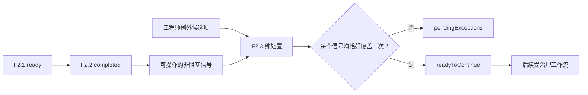

# F2.3 非阻塞例外处置设计

**日期：** 2026-07-27

## 目标

F2.3 允许工程师在后续工作流继续之前，显式处理每个非阻塞 F2.2 一致性信号。它验证并组装不可变的例外处置证据；不会绕过 F2.1、计算工程可行性、修改 workbook 或持久化数据。

F2.3 实现已记录的纠正路径：工程师可以纠正并重新上传源 workbook，或仅在为每个当前非阻塞差异记录可审计例外后继续。必填字段阻塞项仍不在此路径内。

## 范围与边界

### 范围内

1. 使用机密、已完成的 F2.2 `CapabilityValidationResult`。
2. 为每个可操作的 F2.2 信号接受一项由工程师编写的例外候选项。
3. 针对当前 F2.2 结果验证候选项的覆盖度、唯一性、原因文本、记录者身份、时间戳和源绑定。
4. 生成包含已接受记录、待处理信号和精确继续状态的不可变机密处置 DTO。

### 明确不在范围内

- F2.1 必填字段的绕过、修复或覆盖。
- 重新打开 OOXML，接受 workbook 字节、路径、URL、图像或外部值。
- 重新运行 F2.2、加载 F0、进行单位换算、选择备选 capability 条目，或生成工程可行性、风险或建议结论。
- F2.4 或 F3 中的 DIM ID/Part Number 治理。
- 审计/run-store 持久化、身份验证、网络调用、批准工作流、外部 adapter 或 workbook 回写。

## 架构与数据流

F2.3 在 `@ai-assist/workbook-catalog` 中实现为纯 `createExceptionResolution(request)` 服务。它仅使用已验证的 F2.2 DTO 和候选例外数据。后续受治理的运行时可决定是否以及如何持久化返回的处置 DTO。



F2.3 将 F2.2 `required_fields_not_ready` 输入作为验证错误拒绝。它绝不会将该门禁转换为可继续状态。

## 可操作信号

对于每个 F2.2 行，F2.3 推导以下可操作信号：

| 行结果 | 可操作信号 |
|---|---|
| `tolerance.status: "out_of_library"` | `tolerance_out_of_library` |
| `tolerance.status: "unable_to_validate"` | `tolerance_unable_to_validate` |
| `distribution.status: "distribution_mismatch"` | `distribution_mismatch` |
| `distribution.status: "unable_to_validate"` | `distribution_unable_to_validate` |

`in_library` 和 `matches_recommendation` 没有例外要求。`not_applicable` 源自无法产生库内比较的公差结果，因此不会产生第二项例外要求。

可操作信号引用是规范的并与源绑定：

```text
workbookContentHash + worksheetName + tableId + sourceRow + signalKind
```

F2.3 从 F2.2 推导该引用；调用方不得提供任意 worksheet/table/row 坐标或原始 workbook 标识符。

## 请求契约

严格的机密请求具有以下结构：

```ts
{
  contractVersion: "v1",
  inputClassification: "confidential",
  capabilityValidation: CapabilityValidationResult,
  candidates: [{
    signalRef: "canonical F2.2 signal reference",
    recordedBy: "controlled runtime engineer identifier",
    recordedAt: "2026-07-27T10:15:30.000Z",
    rationale: "non-empty engineering rationale"
  }]
}
```

`recordedAt` 是调用方提供的受控运行时证据，采用 ISO-8601 UTC 格式。F2.3 不读取时钟或验证 `recordedBy`；这些职责属于后续受治理的运行时。候选数据是机密的，不得输出到常规日志。

## 处置规则

1. F2.2 结果必须 schema 有效且为 `completed`；其 workbook 内容哈希和 knowledge-base 版本定义当前处置上下文。
2. 候选项必须恰好引用一个当前可操作信号。未知、过期、格式错误或源不匹配的引用均为无效候选项。
3. 每个候选项均需要非空 `recordedBy`、非空且已修剪的 `rationale` 和有效 UTC 时间戳。
4. 一个信号只能由一项有效候选项覆盖。针对同一信号的重复候选项无效；它们绝不静默覆盖其他 rationale。
5. 每个没有有效候选项的可操作信号保持待处理状态。
6. 仅当不存在待处理信号和无效候选项时，`readyToContinue` 才为 true。这是数据整洁度的继续状态，而非工程批准、可行性或风险接受。

## 结果契约

结果为机密、已克隆且递归冻结：

```ts
{
  contractVersion: "v1",
  inputClassification: "confidential",
  status: "readyToContinue" | "pendingExceptions",
  readyToContinue: boolean,
  workbookContentHash: "sha256 hash",
  knowledgeBaseVersion: "v1",
  acceptedExceptions: [{
    signalRef: "canonical reference",
    recordedBy: "engineer identifier",
    recordedAt: "2026-07-27T10:15:30.000Z",
    rationale: "engineer rationale",
    snapshot: {
      worksheetName: "confidential source name",
      tableId: "F1.1 table identifier",
      sourceRow: 13,
      factorName: "confidential factor label",
      signalKind: "distribution_mismatch",
      signal: "F2.2 state-specific evidence"
    }
  }],
  pendingExceptions: [{
    signalRef: "canonical reference",
    reasonCode: "missing_candidate" | "duplicate_candidate" | "invalid_candidate",
    snapshot: "F2.2 state-specific evidence"
  }],
  summary: {
    actionableSignalCount: 1,
    acceptedExceptionCount: 1,
    pendingExceptionCount: 0,
    invalidCandidateCount: 0
  }
}
```

最终运行时 schema 将对信号快照和结果状态使用判别联合。状态、`readyToContinue`、数组和摘要计数必须保持相互一致。

## 隐私、审计与治理

- F2.2 行溯源信息、F2.3 rationale、身份、时间戳和结果 DTO 均为机密。
- F0 版本和公开 capability 条目元数据仅可在已存在于 F2.2 信号快照的情况下包含；F2.3 不查询或扩充 F0 数据。
- 常规日志可包含固定契约版本和汇总计数，但不得包含源名称、单元格、因子标签、原始值、rationale 文本或身份。
- 返回的 DTO 是可审计记录载荷，而非持久化存储。未来受治理的运行时必须根据自身身份验证、保留和审计策略以原子方式持久化它。
- 仅在实现和测试完成后，F2.3 才变为可用。根 F2、F2.4 和 F3-F7 保持不可用。

## 测试与验收

1. 严格请求/结果解析、未知键拒绝、判别联合有效性、摘要/状态不变量、克隆输出和深度冻结。
2. F2.2 未完成输入会被拒绝，而非视为例外处理机会。
3. 每个可操作的公差/分布状态均推导一项规范信号；`not_applicable` 不重复产生公差例外要求。
4. 完整且唯一的覆盖返回 `readyToContinue`；覆盖缺失返回 `pendingExceptions`。
5. 重复、未知、格式错误、过期、空 rationale、空记录者和无效时间候选项均列为待处理/无效，且无法允许继续。
6. 多 worksheet/table/row 匿名 fixture 验证计数聚合和源绑定。
7. F2.3 绝不接受字节、路径、URL、图像或外部服务；不提交真实 workbook 或机密 fixture。
8. 治理、文档和策略测试使 F2.3 可用，同时保留根 F2、F2.4 和 F3-F7 为不可用。