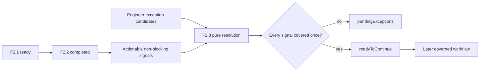

# F2.3 Non-Blocking Exception Resolution Design

**Date:** 2026-07-27

## Goal

F2.3 lets an engineer explicitly account for every non-blocking F2.2 consistency signal before a
later workflow may continue. It validates and assembles immutable exception-resolution evidence; it
does not bypass F2.1, calculate engineering feasibility, modify a workbook, or persist data.

F2.3 implements the documented correction path: an engineer may correct and re-upload the source
workbook, or proceed only after recording an auditable exception for each current non-blocking
difference. Required-field blockers remain outside this path.

## Scope and Boundaries

### In scope

1. Consume a confidential, completed F2.2 `CapabilityValidationResult`.
2. Accept one engineer-authored exception candidate for each actionable F2.2 signal.
3. Validate candidate coverage, uniqueness, reason text, recorder identity, timestamp, and source
   binding against the current F2.2 result.
4. Produce an immutable confidential resolution DTO with accepted records, pending signals, and a
   precise continuation status.

### Explicitly out of scope

- F2.1 required-field bypass, repair, or override.
- Reopening OOXML, accepting workbook bytes, paths, URLs, images, or external values.
- Re-running F2.2, loading F0, converting units, selecting alternate capability entries, or
  producing engineering feasibility, risk, or recommendation conclusions.
- DIM ID/Part Number governance in F2.4 or F3.
- Audit/run-store persistence, identity authentication, network calls, approval workflow, external
  adapters, or workbook writeback.

## Architecture and Data Flow

F2.3 is a pure `createExceptionResolution(request)` service in
`@ai-assist/workbook-catalog`. It consumes the validated F2.2 DTO and candidate exception data only.
The next governed runtime may decide whether and how to persist the returned resolution DTO.



F2.3 rejects F2.2 `required_fields_not_ready` input as a validation error. It never turns that gate
into a continuable state.

## Actionable Signals

For each F2.2 row, F2.3 derives the following actionable signals:

| Row result | Actionable signal |
|---|---|
| `tolerance.status: "out_of_library"` | `tolerance_out_of_library` |
| `tolerance.status: "unable_to_validate"` | `tolerance_unable_to_validate` |
| `distribution.status: "distribution_mismatch"` | `distribution_mismatch` |
| `distribution.status: "unable_to_validate"` | `distribution_unable_to_validate` |

`in_library` and `matches_recommendation` have no exception requirement. `not_applicable` is derived
from a tolerance result that could not produce an in-library comparison, so it does not create a
second exception requirement.

An actionable signal reference is canonical and source-bound:

```text
workbookContentHash + worksheetName + tableId + sourceRow + signalKind
```

F2.3 derives this reference from F2.2; callers must not provide arbitrary worksheet/table/row
coordinates or a raw workbook identifier.

## Request Contract

The strict confidential request has the following shape:

```ts
{
  contractVersion: "v1",
  inputClassification: "confidential",
  capabilityValidation: CapabilityValidationResult,
  candidates: [{
    signalRef: "canonical F2.2 signal reference",
    recordedBy: "controlled runtime engineer identifier",
    recordedAt: "2026-07-27T10:15:30.000Z",
    rationale: "non-empty engineering rationale"
  }]
}
```

`recordedAt` is caller-supplied controlled runtime evidence in ISO-8601 UTC form. F2.3 does not
read a clock or authenticate `recordedBy`; those responsibilities belong to the later governed
runtime. Candidate data is confidential and must not be emitted to normal logs.

## Resolution Rules

1. The F2.2 result must be schema-valid and `completed`; its workbook content hash and knowledge-base
   version define the current resolution context.
2. A candidate must reference exactly one currently actionable signal. Unknown, stale, malformed, or
   source-mismatched references are invalid candidates.
3. Every candidate requires a non-empty `recordedBy`, non-empty trimmed `rationale`, and valid UTC
   timestamp.
4. A signal may be covered by exactly one valid candidate. Repeated candidates for the same signal are
   invalid; they never silently overwrite another rationale.
5. Each actionable signal without one valid candidate remains pending.
6. `readyToContinue` is true only if there are no pending signals and no invalid candidates. This is a
   data-cleanliness continuation state, not engineering approval, feasibility, or risk acceptance.

## Result Contract

The result is confidential, cloned, and recursively frozen:

```ts
{
  contractVersion: "v1",
  inputClassification: "confidential",
  status: "readyToContinue" | "pendingExceptions",
  readyToContinue: boolean,
  workbookContentHash: "sha256 hash",
  knowledgeBaseVersion: "v1",
  acceptedExceptions: [{
    signalRef: "canonical reference",
    recordedBy: "engineer identifier",
    recordedAt: "2026-07-27T10:15:30.000Z",
    rationale: "engineer rationale",
    snapshot: {
      worksheetName: "confidential source name",
      tableId: "F1.1 table identifier",
      sourceRow: 13,
      factorName: "confidential factor label",
      signalKind: "distribution_mismatch",
      signal: "F2.2 state-specific evidence"
    }
  }],
  pendingExceptions: [{
    signalRef: "canonical reference",
    reasonCode: "missing_candidate" | "duplicate_candidate" | "invalid_candidate",
    snapshot: "F2.2 state-specific evidence"
  }],
  summary: {
    actionableSignalCount: 1,
    acceptedExceptionCount: 1,
    pendingExceptionCount: 0,
    invalidCandidateCount: 0
  }
}
```

The final runtime schema will use discriminated unions for signal snapshots and result status. The
status, `readyToContinue`, arrays, and summary counts must remain mutually consistent.

## Privacy, Audit, and Governance

- F2.2 row provenance, F2.3 rationales, identities, timestamps, and result DTOs are confidential.
- F0 version and public capability entry metadata may be included only where already present in the
  F2.2 signal snapshot; F2.3 does not query or enrich F0 data.
- Normal logs may include fixed contract versions and aggregate counts, but not source names, cells,
  factor labels, raw values, rationale text, or identities.
- The returned DTO is an auditable record payload, not durable storage. A future governed runtime
  must persist it atomically with its own authentication, retention, and audit policy.
- F2.3 becomes available only after implementation and tests. Root F2, F2.4, and F3-F7 remain
  unavailable.

## Tests and Acceptance

1. Strict request/result parsing, unknown-key rejection, discriminated-union validity, summary/status
   invariants, cloned output, and deep freeze.
2. F2.2 non-completed input is rejected rather than treated as an exception opportunity.
3. Each actionable tolerance/distribution state derives one canonical signal; `not_applicable` does
   not duplicate a tolerance exception requirement.
4. Complete unique coverage returns `readyToContinue`; missing coverage returns `pendingExceptions`.
5. Duplicate, unknown, malformed, stale, blank-rationale, blank-recorder, and invalid-time candidates
   are listed as pending/invalid and cannot permit continuation.
6. Multi-worksheet/table/row anonymous fixtures verify count aggregation and source binding.
7. F2.3 never accepts bytes, paths, URLs, images, or external services; no real workbook or
   confidential fixture is committed.
8. Governance, documentation, and policy tests make F2.3 available while preserving root F2, F2.4,
   and F3-F7 as unavailable.