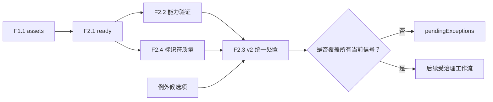

# F2.4 标识符质量与统一例外处置设计

**日期：** 2026-07-27

## 目标

F2.4 仅验证源自 F1.1 的 `dimCharacteristicId` 和 `drawingNumber` 证据的质量。它生成非阻塞、机密且不可变的质量信号。随后，版本化的 F2.3 v2 resolver 会在后续工作流继续之前，使用由工程师编写的例外处理 F2.2 与 F2.4 的组合当前信号。

F2.4 不解析新的 Part Number 字段、不发明规范 DIM ID 规则、不解析供应商到 Microsoft 的映射、不链接图纸、不计算工程可行性、不读取 workbook、不持久化数据，也不回写 workbook。

## 依赖关系与流程

F2.4 要求 F2.1 为 `readyForNextCheck`，并要求相同的 F1.1 workbook 内容哈希。由于它既不查询 F0，也不依赖能力/分布结论，因此可与 F2.2 并行运行。



被阻塞的 F2.1 输入绝不会变为可继续。F2.1 未就绪时，F2.4 返回不含信号的门禁结果；F2.3 v2 会拒绝未完成的 F2.2 或未完成的 F2.4 输入。

## F2.4 输入与结果

严格的机密请求为：

```ts
{
  contractVersion: "v1",
  inputClassification: "confidential",
  worksheetAnalysisAssets: WorksheetAnalysisAssetsResult,
  requiredFieldCheck: RequiredFieldCheckResult,
}
```

该请求会在检查行之前验证 F1.1/F2.1 哈希相等。结果包括 F1.1 workbook 内容哈希、`status: "completed" | "required_fields_not_ready"`、严格的信号数组和行派生摘要计数。结果会被克隆并递归冻结。

F2.4 仅检查 `drawingNumber` 和 `dimCharacteristicId` 字段。一条源记录仅包含推导出的 worksheet/table 绑定、字段和受影响源行。原始机密标识符值不会出现在常规日志中。需要进行源绑定候选匹配时，重复 DIM ID 快照可仅在机密 DTO 中保留规范化标识符；它绝不记录到日志中。

## 质量信号

以下信号种类穷尽 F2.4 v1：

| 信号种类 | 字段 | 聚合键 | 含义 |
|---|---|---|---|
| `identifier_missing` | DIM ID 或 Drawing Number | `worksheetName + tableId + field` | 字段可用但修剪后为空，或该字段在某行中缺失。包含所有受影响行。 |
| `identifier_evidence_unavailable` | DIM ID 或 Drawing Number | `worksheetName + tableId + field + reasonCode` | F1.1 将证据标记为不可用。它保留原始 F1.1 原因代码和所有受影响行。它不会被重新归类为缺失或格式错误的文本。 |
| `identifier_text_invalid` | DIM ID 或 Drawing Number | `worksheetName + tableId + field` | 一个可用值包含控制字符或不可打印字符。包含所有受影响行。 |
| `dim_id_duplicate` | 仅 DIM ID | `worksheetName + tableId + normalizedDimId` | 同一表内至少两个可用且有效的 DIM ID 值比较后相等。包含所有冲突行。 |

`normalizedDimId` 仅应用 `trim()`，且保持区分大小写。因此，在未来获批准的规范 ID 策略另有规定之前，`dim-01` 与 `DIM-01` 不会被视为重复。Drawing Number 可以重复，且绝不会发出重复信号。

F2.4 不对标识符命名使用临时正则表达式。除空白和控制/不可打印字符检测外，它不声称某个值在语法或语义上有效。

## F2.3 v2 统一处置

F2.3 v1 继续受支持，并持续处置已完成的 F2.2 结果。F2.3 v2 是一项新的显式契约，以避免静默破坏 v1 调用方：

```ts
{
  contractVersion: "v2",
  inputClassification: "confidential",
  capabilityValidation: CapabilityValidationResult, // completed
  identifierQualityCheck: IdentifierQualityCheckResult, // completed
  candidates: ExceptionCandidate[],
}
```

两个结果输入必须具有相同的 workbook 内容哈希。F2.3 v2 按源顺序自行推导所有 F2.2 和 F2.4 信号引用。F2.4 引用包含 workbook 哈希、worksheet/table 绑定、信号种类、字段和聚合区分符。调用方只能提供：

```ts
{
  signalRef: "canonical derived reference",
  recordedBy: "controlled runtime identifier",
  recordedAt: "2026-07-27T10:15:30.000Z",
  rationale: "non-empty rationale",
}
```

resolver 从已验证的结果生成每个快照、受影响行集、字段名和不可用原因代码。它不信任调用方提供的溯源信息或快照。

每个当前 F2.2 或 F2.4 信号均需要恰好一个语义有效候选项。缺失、重复或无效候选项会生成待处理记录。未知或过期候选引用会增加 `invalidCandidateCount`，但绝不创建伪造的源绑定信号。仅当两个输入结果集均已完成、每个当前信号均恰好被接受一次且 `invalidCandidateCount` 为零时，`readyToContinue` 才为 true。

结果快照包含 `source: "capability_validation" | "identifier_quality"`，摘要计数可区分来源合计，同时保留一个机密、不可变的已接受/待处理结果和一个继续状态。

## 隐私与错误

- 显式非机密输入会以 `policy_denied` 拒绝。
- 未知键、未完成的依赖项、不兼容的哈希绑定、无效 schema 和格式错误的结果状态均返回 `validation_error`。
- F2.4 和 F2.3 v2 不接受 workbook 字节、路径、URL、图像、外部数据、持久化目标、身份/auth adapter、网络 adapter、F0 数据或时钟。
- 常规日志仅可使用固定版本和汇总计数；不得输出源名称、源行、字段文本、DIM ID、Drawing Number、候选 rationale、记录者身份或时间戳。

## 测试与治理

匿名内存中 fixture 覆盖 F2.4 门禁、F1.1/F2.1 哈希绑定、缺失/空白聚合、不可用证据聚合、控制/不可打印文本、仅 trim 且区分大小写的 DIM 重复检测、允许的 Drawing Number 重复、摘要不变量、克隆、冻结和 ESM 导出。

F2.3 v2 测试覆盖完整 F2.2/F2.4 覆盖、任一来源的缺失覆盖、不一致哈希、所有 F2.4 信号种类、重复/未知/无效候选项、来源归属和 F2.3 v1 回归。

仅在实现后，治理才使用 `identifier-quality-check-request-v1` 和 `identifier-quality-check-result-v1` 将 F2.4 标记为可用，其依赖项为 F1.1、F2.1 和 `identifier-quality-check-v1`。F2.3 的可用注册迁移至显式 v2 统一契约，同时保留 v1 package 兼容性。根 F2、F3-F7 和跨系统规范 ID 治理保持不可用。
