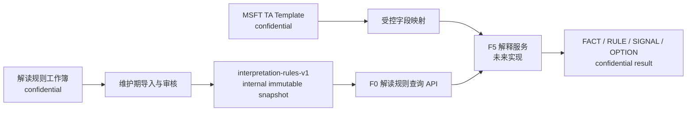

# F0 TA 结果解读规则库设计

**日期：** 2026-07-29

## 目标

将内部工作簿中整理的一维公差分析指标、判断逻辑、候选根因和改善方案转换为 F0 的
只读、版本化知识模块，供后续 F5 客观结果解释和 F6 方案比较使用。新增模块与现有
`public/v1` 知识库及 `internal-v1` 制程公差指导库并列存在，不替换、不扩展或改变其
查询语义。

## 已确认决策

- 新模块使用独立标识与版本 `interpretation-rules-v1`。
- 通用派生规则分类为 `internal`；原始 MSFT TA 模板、规则工作簿和具体案例继续按
  `confidential` 管理，不提交到 Git。
- 具体 TA 案例不进入生产知识快照，只用于受控人工审核。仓库测试使用独立编写的匿名
  合成 fixture，不复制案例值、项目标识或原文。
- Cpk 等目标值优先使用 F5 请求中经验证的模板/项目目标；缺失时才查询受控 F0 默认
  规则。来源工作簿中的 `1.00` 仅视为案例值，不作为全局默认值。
- 根因只能作为待验证信号，不能表述为已证实原因；改善方案作为可比较选项返回，不
  自动排序、不自动推荐，也不替代工程师判断。

## 方案选择

采用在 `@ai-assist/knowledge-base` 内增加独立命名空间的方案。它复用现有快照校验、
内容哈希、不可变 DTO 和本地只读加载模式，同时通过独立 schema、版本和 API 防止两类
知识发生语义串用。

未采用以下方案：

- 将解读规则加入 `internal-v1` 联合类型：会把“推荐最大公差带筛查”和“结果解读”
  耦合，并增加既有 F2 消费者误用规则的风险。
- 新建独立 npm package：隔离更强，但当前数据量和单一消费边界不足以抵消额外发布、
  依赖和治理成本。

## 架构与数据流



导入只发生在知识维护与发布阶段。运行时不得打开模板或规则 Excel；F5 从 F4 的受控
计算结果取得事实和项目目标，再以结构化输入查询 F0。F0 只返回命中规则及其证据，F5
负责把事实、规则、信号和选项组装为最终解释结果。

## 知识模型

快照采用可辨识联合类型，避免把定义、判断、信号和行动压入同一种记录：

```ts
type InterpretationKnowledgeEntry =
  | MetricDefinitionEntry
  | PerformanceRuleEntry
  | RootCauseSignalEntry
  | ImprovementOptionEntry
  | DecisionPolicyEntry;

interface InterpretationEntryBase {
  entryId: string;
  entryType:
    | "metric-definition"
    | "performance-rule"
    | "root-cause-signal"
    | "improvement-option"
    | "decision-policy";
  title: string;
  description: string;
  applicability: {
    analysisDimension: "one-dimensional";
    method?: "rss" | "worst-case";
  };
  relatedEntryIds: string[];
  provenance: InterpretationRuleProvenance;
}

interface InterpretationRuleProvenance {
  classification: "internal";
  sourceAlias: string;
  sourceFileHash: string;
  sourceVersion: string;
  sheetName: string;
  sourceRange: string;
  owner: string;
  confidence: number;
  effectiveVersion: "interpretation-rules-v1";
  changeSummary: string;
}
```

各分型职责如下：

- `metric-definition`：定义 Cpk、目标 sigma、贡献度等指标的名称、单位、适用条件和解释
  边界，不重新计算 F4 已产生的数值。
- `performance-rule`：比较实际值与经解析的项目目标，产生中性的达标、未达标或信息不足
  规则命中。规则不得内嵌来源案例的 `1.00` 作为默认目标。
- `root-cause-signal`：根据贡献度集中、目标差距或方法差异等事实返回候选调查方向，状态
  固定为 `hypothesis`，并附所需验证证据。
- `improvement-option`：描述可能调整的输入、预期影响、代价/风险及验证步骤。选项不含
  排名字段，F0 不选择“最佳方案”。
- `decision-policy`：约束 F5/F6 如何组合条目，例如信息不足时停止推断、目标冲突时请求
  澄清，以及每个 signal/option 必须引用触发它的 FACT 和 RULE。

动态计算器和 fallback 计算器中的公式不作为知识条目发布。需要的计算应由 F4 的受测
计算契约实现；计算器仅作为维护期交叉检查材料。来源登记表用于形成 manifest 和
provenance，不直接成为可查询规则。

## 查询契约

公共入口拟为：

```ts
loadInterpretationRules({ version: "interpretation-rules-v1" })
  .evaluateInterpretationRules({
    analysisDimension: "one-dimensional",
    method: "rss",
    facts: {
      cpk: 1.21,
      targetCpk: 1.33,
      achievedSigma: 3.8,
      targetSigma: 4,
      contributors: [
        { reference: "controlled-factor-reference", contributionPercent: 42 },
      ],
    },
  });
```

输入只接受 F4/F5 已验证的结构化事实，不接受 workbook 字节、任意单元格文本、公式或
自然语言。可选事实缺失时只跳过依赖该事实的规则；必需目标缺失且没有受控默认规则时，
返回信息不足，不猜测阈值。

结果是递归冻结的 DTO：

```ts
interface InterpretationRuleEvaluation {
  knowledgeBaseVersion: "interpretation-rules-v1";
  status: "matched" | "insufficient-facts" | "not-applicable";
  factsUsed: string[];
  matchedRules: Array<{
    entryId: string;
    entryType: "performance-rule" | "root-cause-signal" | "improvement-option";
    relatedFactReferences: string[];
    evidence: {
      sourceAlias: string;
      sheetName: string;
      sourceRange: string;
      sourceFileHash: string;
    };
  }>;
  missingFacts: string[];
}
```

F0 不生成面向用户的最终自然语言结论。后续 F5 输出必须区分：

- `FACT`：来自计算结果的客观值。
- `RULE`：F0 中命中的受控判断依据。
- `SIGNAL`：尚待验证的根因假设。
- `OPTION`：未排序的改善方案。

## 阈值与冲突规则

目标值按以下顺序解析：

1. 当前请求中经验证的模板/项目目标。
2. 与项目上下文明确匹配的受控 F0 默认规则。
3. 无目标；返回 `insufficient-facts` 并列出缺失字段。

请求目标与默认规则不一致时，请求目标优先，同时在结果中记录采用的目标来源。多个同
优先级默认规则、规则依赖循环、引用不存在的条目或同一条件产生互斥结论时，加载器拒绝
整个快照，不进行部分加载。边界值必须由显式比较运算符定义；相等情形不得依赖规则顺序。

## 来源与治理

原始模板和规则工作簿留在受访问控制的内部文档位置。仓库仅保存经人工审核、去除项目
案例后的通用规则、来源别名、SHA-256、版本、工作表和单元格范围。manifest 记录条目数、
各类型计数、来源 hash 和快照内容 hash。

生产快照为 `internal`。当 F5 将其与 `confidential` TA 事实组合时，组合结果保持
`confidential`；审计仅可记录规则 ID、版本、hash 和受控引用，不记录 workbook 原文、
因子名称、项目值或最终解释文本。

## 错误处理

- 加载时发现 schema、hash、manifest 计数、交叉引用或版本不一致，使用
  `dependency_error` 拒绝整个快照。
- 查询含未知字段、非有限数值、非法百分比或不支持的方法时，使用 `validation_error`。
- 合法但事实不足时返回 `insufficient-facts`，不得把它升级为异常或生成推测性信号。
- 合法但不适用于一维分析或受支持方法时返回 `not-applicable`。
- 任一结果均不得包含原始规则工作簿文本或具体案例内容。

## 实现范围

- 在 `@ai-assist/contracts` 增加解读条目、manifest、加载请求、查询请求和结果 schema。
- 在 `@ai-assist/knowledge-base` 增加独立目录、快照校验、确定性规则求值和只读 loader。
- 将审核后的通用内容转换为 `interpretation-rules-v1` 数据快照；不提交原始 Excel。
- 增加匿名合成 fixture，覆盖目标优先级、缺失事实、边界值、信号引用和未排序选项。
- 更新 Feature Register 与数据分类文档，将新模块登记为 F0 能力和 F5/F6 的未来依赖。
- F5 本轮仍保持 `unavailable`；本模块发布不等于启用解释服务。

## 非范围

- 修改现有 `public/v1` 或 `internal-v1` 数据、schema、匹配顺序和查询结果。
- 在 F0 中重算 Excel 公式、生成最终解释文本、自动选择根因或推荐最佳改善方案。
- 提交真实 TA 模板、规则工作簿、worked examples 或其逐字转录。
- 启用 F5/F6、写回工作簿、调用模型或访问网络。

## 验收标准

1. 三个知识模块可在同一进程独立加载，版本、类型和 API 不可互换。
2. 现有 `public/v1` 和 `internal-v1` 测试及 110 条制程指导规则保持不变。
3. 每条生产解读条目均具有稳定 ID、类型、适用范围、来源 hash、工作表和范围证据。
4. 模板/项目目标覆盖受控默认值；`1.00` 不作为全局 Cpk 默认值。
5. 缺少必要事实时不产生根因信号或改善选项，并明确返回缺失字段。
6. 根因条目只返回 `hypothesis`，改善方案不包含排名或自动推荐字段。
7. manifest/hash/交叉引用不一致时拒绝整个快照；所有成功结果均防御性复制并递归冻结。
8. Git 不追踪原始 Excel 或具体案例；测试 fixture 为匿名合成数据。
9. F5 保持 `unavailable`，但 Feature Register 将 `interpretation-rules-v1` 登记为未来依赖。
10. 根目录 `build`、`lint`、`test`、`check:repository` 和 `git diff --check` 全部通过。