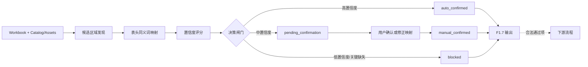

# F1.7 语义化因子表识别与人工确认设计

**日期：**2026-07-29

## 目标

F1.7 针对不同版本 TA Excel 布局差异，提供“非固定坐标”的语义识别能力，并在不匹配或不确定时触发用户确认，避免系统沿错误方向继续处理。

核心目标：

1. 不依赖固定单元格区域读取因子表。
2. 基于表头与内容特征识别候选因子表。
3. 对识别结果输出置信度与不确定原因。
4. 在关键不确定条件下阻断下游，要求用户确认后继续。
5. 保持与 F1.6 资产格式兼容，保证 traceability 链接可追溯。

## 已确认范围

F1.7 首版边界如下：

1. 输入仍是 confidential workbook 与既有目录/资产结果；不引入外部网络、LLM 推断或 OCR。
2. 只做候选表识别、字段映射置信度判断与确认闸门；不引入 F2/F4 的工程计算和结论逻辑。
3. 首版支持受控同义词表与结构化评分，不使用模糊自然语言推断。
4. 若关键字段映射不确定，必须进入 pending_confirmation 或 blocked，不允许静默继续。
5. 用户确认仅作用于当前 run record，不做跨工作簿长期学习。

## 方案选择

本设计采用“规则 + 评分”的方案（方案 2），而不是纯固定规则或纯模板指纹。

选择原因：

1. 可解释：每个结论能给出原因码和证据。
2. 可控：阈值可配置，便于逐步收敛。
3. 可扩展：后续可平滑接入模板指纹，不推翻当前结构。

## 架构与数据流

## 核心设计

### 1. 候选区域发现

在 worksheet 已使用区域内，按行扫描可能的表头行，生成候选表：

1. 行内命中关键表头数量达到最小阈值（例如至少 3 个核心字段别名）。
2. 命中列在空间上聚集（列距离不超过阈值，避免跨区域误拼）。
3. 候选表数据区从表头下一行开始，到“映射列全部空白”的首行结束。

候选表可以有多个，禁止先验假设“只有一张主表”。

### 2. 字段映射

对每个候选表，按受控别名映射语义字段（示意）：

1. factorName: Factor, Factor Name
2. partName: Part Name
3. partCategory: Part Category
4. nominalValue: Nominal, Nominal Value, Design Nominal
5. upperTolerance: + Tolerance, Upper Tol
6. lowerTolerance: - Tolerance, Lower Tol
7. longTermSafetyFactor: Long Term Factor, Safety Factor, Long Term/Safety Factor
8. distribution: Distribution
9. drawingNumber: Drawing Number
10. dimCharacteristicId: DIM ID, Characteristic ID, DIM/Characteristic ID

映射规则：

1. 精确归一化匹配（trim、空白折叠、不区分大小写）。
2. 单字段多列命中记为 duplicate_mapping。
3. 表头可命中多个语义时记为 ambiguous_mapping。
4. 未命中记为 missing。

### 3. 置信度评分模型

每个候选表输出一个 0-100 的 confidenceScore。

建议初始公式：

$$
Score = HeaderScore + TypeScore + CompletenessScore - Penalty
$$

其中：

1. HeaderScore（0-45）：核心字段命中覆盖率。
2. TypeScore（0-25）：数值列可解析率（nominal/tolerance/sigma 等）。
3. CompletenessScore（0-20）：前 N 行中 required 字段可用率。
4. Penalty（0-30）：duplicate/ambiguous/header_conflict 等惩罚。

初始阈值：

1. score >= 80: auto_confirmed。
2. 60 <= score < 80: pending_confirmation。
3. score < 60 或关键字段缺失: blocked。

关键字段建议：factorName、nominalValue、upperTolerance、lowerTolerance、distribution。

### 4. 决策闸门与状态机

新增识别状态：

1. auto_confirmed: 自动确认，可继续。
2. pending_confirmation: 等待人工确认，不可继续下游。
3. manual_confirmed: 用户确认后可继续。
4. blocked: 明确不可用，停止下游。

状态流转：

1. discover -> map -> score -> auto_confirmed | pending_confirmation | blocked。
2. pending_confirmation 经用户确认可转 manual_confirmed。
3. blocked 仅在用户更换候选区域或修正映射后可重新评估。

### 5. 用户确认负载

当 pending_confirmation 或 blocked 时，输出确认包供用户决策：

1. worksheetName、candidateId、headerRow、dataRange。
2. 字段映射明细（字段 -> 列 -> 表头文本）。
3. confidenceScore 与 reasonCodes。
4. 采样数据（例如前 3 行脱敏结构化摘要）。
5. 推荐动作：confirm_as_is、remap_fields、select_another_candidate、skip_sheet。

### 6. 失败即提醒，不埋头继续

以下条件触发“立即提醒并阻断”策略：

1. 关键字段缺失或 duplicate/ambiguous。
2. 样本数据类型冲突严重（例如 tolerance 列大比例非数值）。
3. 候选表得分低于下限阈值。

阻断后只产出诊断与确认负载，不进入后续计算/解释流程。

## 输入输出契约建议

### 输入（与 F1.6 对齐）

1. workbook bytes（confidential）。
2. workbook-catalog result。
3. worksheet-analysis-assets result（如已存在，可复用其表头/行证据）。
4. 可选：manual selection payload（用户对候选的确认或修正）。

### 输出（F1.7）

每个 worksheet 至少包含：

1. recognitionStatus: auto_confirmed | pending_confirmation | manual_confirmed | blocked。
2. confidenceScore 与 confidenceBreakdown。
3. selectedCandidate（若已确认）。
4. uncertaintyReasons（reasonCodes 列表）。
5. requiresUserConfirmation（布尔）。
6. confirmationPayload（仅 pending/blocked 必填）。
7. traceabilityRef（沿用 1.6 的 sheet md、image、row traceability 引用）。

## 与 1.6 的衔接

1. 1.6 的图片与行级链接仍作为证据层输出，不被 1.7 打破。
2. 1.7 决定的是“哪些 sheet/候选表可以合法继续”。
3. 对于已 manual_confirmed 的候选表，1.6 链接继续沿用并写入同一 run record。

## 错误与隐私

1. 错误摘要必须使用安全 reasonCode，不泄露 confidential 原文。
2. 允许记录的审计信息：content hash、worksheet 名、候选数量、状态计数、reasonCode 计数。
3. 禁止把真实单元格内容写入普通日志或仓库 fixture。

## 验收标准

1. 对两个不同版本 TA workbook，不依赖固定区域即可识别候选因子表。
2. 至少一个不规则布局触发 pending_confirmation 或 blocked，而不是误判通过。
3. 用户确认后可继续输出，且 run record 明确记录确认来源（auto/manual）与确认时间。
4. 未确认的异常 sheet 不得进入下游流程。
5. 1.6 已有 traceability 与图片链接在 1.7 流程后仍可用。

## 实施顺序建议

1. 先实现识别状态与评分骨架（不改下游逻辑）。
2. 再接入用户确认 payload 与状态流转。
3. 最后将闸门接入下游入口，并补全回归测试。

## 非目标

1. 不在 F1.7 内做单位换算、统计计算、工程风险结论。
2. 不做跨运行自学习或模板自动写回。
3. 不引入外部 AI 服务对表头做自由语义推断。
