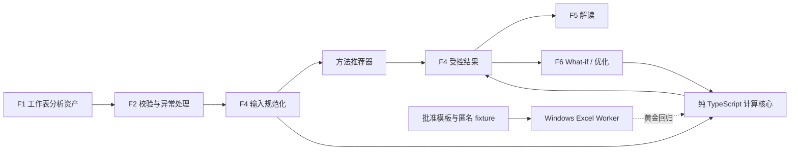

# F4 方法推荐与 Excel 一致计算引擎设计

**日期：** 2026-07-30

## 目标

F4 接收 F1/F2 已解析并验证的结构化 TA 因子，按有效因子数量给出一维分析方法建议，并产出与批准 Excel 模板核心结果高精度一致、可追溯且可重复计算的结果。

F4 同时服务两类调用：

- 首次 TA 计算，为 F5 解读和判断提供受控数值事实。
- F6 What-if 重算，在不重新解析工作簿的情况下快速评估因子变化。

F4 不替代工程师判断，也不静默修改源工作簿。

## 已确认决策

- 采用 TypeScript 纯计算核心，并以 Windows Excel Worker 作为黄金回归裁判。
- 核心数值与 Excel 的绝对或相对误差不超过 `1e-12`；显示值和 PASS/FAIL 必须完全一致。
- 少于 4 个有效因子推荐 Worst Case（WC）。
- 4 至 10 个有效因子推荐一维 RSS。
- 多于 10 个有效因子建议 DM 团队跟进 3D Variation Analysis；F4 仍计算 WC 和 RSS。
- CTS/CTF 仅增加风险标记，不覆盖因子数量规则，也不阻止 WC/RSS 计算。
- F4 只消费验证后的结构化数据；运行时不从任意单元格重新推断语义。
- Excel Worker 不在生产请求热路径中。它用于批准模板回归、发布门禁和差异诊断。

## 责任边界

### F4 负责

- 验证计算请求、上游 readiness 和工作簿哈希绑定关系。
- 识别有效计算因子并统计数量。
- 生成方法建议和风险标记。
- 计算因子级均值、半公差、标准差和贡献度。
- 计算系统级设计名义值、均值、WC、RSS 和附加均值偏移。
- 计算 Cp、Lower Cpk、Upper Cpk、Cpk、Lower/Upper Z、DPM、Yield 和 PASS/FAIL。
- 保留输入字段、源单元格、公式版本和结果之间的追溯关系。
- 对同一基础请求应用显式覆盖，执行确定性的 What-if 重算。

### F4 不负责

- 工作簿表格识别、字段映射和公式缓存提取，这些属于 F1。
- 必填字段、能力库差异、异常解决和标识符质量治理，这些属于 F2。
- DIM ID 与图纸关联，这些属于 F3。
- 对结果作工程解释或最终判断，这些属于 F5。
- 生成优化方案或反向求解，这些属于 F6。
- 在生产计算中打开、修改或保存用户工作簿。
- 3D Variation Analysis、相关性建模或 Monte Carlo 仿真。

## 架构

### 组件

1. **F4 contracts**：定义严格、机密、版本化的请求、场景覆盖和结果 schema。
2. **Input normalizer**：从上游证据生成不可变的计算模型，统一空值、符号、单位和分布名称。
3. **Method recommender**：依据有效因子数量返回 WC、RSS 或 3D VA referral 建议，并附 CTS/CTF 风险标记。
4. **Calculation kernel**：不访问文件、网络、时钟或随机数的纯函数。
5. **Trace builder**：将每个结果绑定到输入因子、源单元格和公式 ID。
6. **Excel regression adapter**：在批准的 Windows 环境中对模板副本写入 fixture、强制全量重算并读取白名单结果单元格。

## 输入模型

F4 请求保留现有受控引用，并新增以下受控内容：

- `worksheetAnalysisAssets`：F1 提取的因子字段、源单元格和工作簿内容哈希。
- `requiredFieldCheck`：必须为 `readyForNextCheck`，并与同一工作簿哈希绑定。
- `exceptionResolution`：所有阻塞计算的差异必须已解决或按批准策略接受。
- `worksheetSelection`：明确本次计算的工作表和因子表，禁止隐式计算全部候选表。
- `systemSpecification`：设计名义值、下规格限、上规格限、目标 Sigma、目标 Cpk 和可选附加均值偏移。
- `criticality`：可选 CTS/CTF 标记，仅影响风险提示。
- `scenarioOverrides`：可选 What-if 覆盖，每项通过稳定的工作表、表和源行引用定位因子。

每个有效因子至少包含：

- 稳定来源引用和因子名称。
- 设计名义值。
- 上公差与下公差。
- 长期/安全系数。
- Sigma level。
- 分布类型。
- 单位。

缺少任一计算必需字段的命名行不计入可计算因子，并使请求阻塞；不能通过忽略该行来改变方法建议。

## 方法建议

方法建议使用通过 readiness 门禁后的有效计算因子数：

| 因子数 | 建议 | 附加动作 |
| --- | --- | --- |
| `1-3` | `worst_case` | 展示 WC 与 RSS，WC 为推荐参考 |
| `4-10` | `rss_1d` | 展示 WC 与 RSS，RSS 为推荐参考 |
| `>10` | `refer_3d_variation_analysis` | 通知 DM 团队，继续展示 WC 与 RSS |

零因子请求返回验证错误。CTS/CTF 返回独立的 `criticalityRisk`，不改变表中建议。

## 计算语义

### 分布系数

批准模板使用以下系数：

| 分布 | 系数 |
| --- | ---: |
| Normal | `1` |
| Uniform | `1.732` |
| Triangular | `1.225` |
| Trapezoidal | `1.369` |
| Elliptical | `1.5` |
| Beta | `2.023` |

未知分布不能回退为零或 Normal，必须返回验证错误。

### 因子级计算

为保持与批准模板一致，先复现模板的符号规则，再执行系统聚合。对因子 $i$：

$$
t_i = \frac{U_i-L_i}{2}
$$

$$
\sigma_i = t_i \times \frac{S_i}{Z_i} \times D_i
$$

其中 $U_i$、$L_i$ 为上下公差，$S_i$ 为长期/安全系数，$Z_i$ 为因子 Sigma level，$D_i$ 为分布系数。因子均值严格复现模板对正负设计名义值及非对称公差的处理。

令 $N_i$ 为设计名义值，模板的因子均值为：

$$
\mu_i =
\begin{cases}
N_i - \dfrac{U_i+L_i}{2}, & N_i < 0 \\
N_i + \dfrac{U_i+L_i}{2}, & N_i \ge 0
\end{cases}
$$

### 系统级计算

$$
\mu = \sum_i \mu_i + \Delta\mu
$$

$$
WC_{upper} = \sum_i U_i, \qquad WC_{lower} = \sum_i L_i
$$

$$
\sigma_{RSS} = \sqrt{\sum_i \sigma_i^2}
$$

$$
contribution_i = \frac{\sigma_i^2}{\sigma_{RSS}^2}
$$

当 $\sigma_{RSS}=0$ 时不产生无穷值或 NaN，而返回明确的不可计算错误。

### 能力指标

令 $LSL$ 和 $USL$ 为系统规格限：

$$
Cp = \frac{USL-LSL}{6\sigma_{RSS}}
$$

$$
Cpk_{lower} = \frac{\mu-LSL}{3\sigma_{RSS}}, \qquad
Cpk_{upper} = \frac{USL-\mu}{3\sigma_{RSS}}
$$

$$
Cpk = \min(Cpk_{lower}, Cpk_{upper})
$$

$$
Z_{lower} = \frac{\mu-LSL}{\sigma_{RSS}}, \qquad
Z_{upper} = \frac{USL-\mu}{\sigma_{RSS}}
$$

令 $\Phi$ 为标准正态累积分布函数。DPM 和 Yield 严格复现模板：

$$
DPM_{lower} = (1-\Phi(Z_{lower})) \times 1{,}000{,}000
$$

$$
DPM_{upper} = (1-\Phi(Z_{upper})) \times 1{,}000{,}000
$$

$$
DPM_{total}=DPM_{lower}+DPM_{upper}, \qquad
Yield=1-\frac{DPM_{total}}{1{,}000{,}000}
$$

结果分别保留下侧、上侧、合计 DPM、超规比例和 Yield。PASS/FAIL 复现模板边界运算符，不自行引入工程余量。

## 输出模型

成功结果包含：

- `status: "completed"`、工作簿哈希、受控引用和计算版本。
- 因子数量、推荐方法、推荐原因、3D VA referral 和 CTS/CTF 风险标记。
- 因子级规范化输入、均值、半公差、Sigma、贡献度及来源证据。
- 系统级设计名义值、调整均值、WC 上下界和 RSS Sigma。
- Cp、上下 Cpk、Cpk、上下 Z、DPM、Yield、目标值及 PASS/FAIL。
- 场景 ID、被覆盖字段、基线结果引用和结果差值。
- 每个输出字段使用的公式 ID 与公式版本。

所有成功结果通过 schema 二次验证、克隆并递归冻结。不得包含原始工作簿字节、任意单元格内容或无关个人/项目数据。

## What-if

What-if 不复制另一套公式。它对已验证的基线计算模型应用有限覆盖后，调用同一 calculation kernel。

V1 允许覆盖：

- 因子设计名义值。
- 上公差与下公差。
- 长期/安全系数。
- Sigma level。
- 分布。
- 系统附加均值偏移。
- 系统规格限和目标值。

覆盖后执行完整校验和完整重算。结果不得复用受影响的中间值。批量场景按输入顺序返回，并设置显式数量上限，避免无界计算。

## 错误处理

- 非机密输入：`policy_denied`。
- schema、未知字段、单位或分布无效：`validation_error`。
- F1/F2 哈希不一致：`evidence_mismatch`。
- 必填字段或异常处理未就绪：`prerequisite_not_ready`。
- 零因子、零 Sigma、无效规格范围：`calculation_not_possible`。
- Excel 回归环境或模板版本未批准：发布门禁失败，不影响已批准版本的生产计算。
- TypeScript 与 Excel 超出容差：`regression_mismatch`，记录公式 ID、输入 fixture 和差异字段，不自动放宽容差。

所有错误使用现有 `createTypedError` 结构，不记录机密输入值。

## Excel 黄金回归

Windows Excel Worker 只操作临时模板副本：

1. 校验批准模板的 SHA-256、文档版本和公式映射版本。
2. 写入白名单输入单元格，不改公式、保护设置或源模板。
3. 执行 `CalculateFullRebuild`。
4. 读取白名单因子级与系统级结果单元格。
5. 与 TypeScript 结果按字段比较。
6. 删除临时副本并输出不含原始值的回归摘要。

工作表坐标只存在于模板映射适配器中，不进入 calculation kernel。新模板必须新增映射和批准回归，不能静默复用旧坐标。

## 验收与测试

### 单元测试

- 因子数 `1`、`3`、`4`、`10`、`11` 的建议边界。
- 六种批准分布系数及未知分布拒绝。
- 正负名义值、对称/非对称/单侧公差。
- 3-Sigma、4-Sigma、负 Cpk、临界 PASS/FAIL 和零 Sigma。
- WC、RSS、贡献度、Cp/Cpk、Z、DPM、Yield。
- What-if 不修改基线、完整重算且结果确定。
- schema 严格性、分类门禁、哈希绑定、冻结和隐私错误。

### 黄金回归

- `M1160113_ REV_G Tolerance Analysis Template.xlsx` 的 `Example_TA`：Cpk `0.739600261633636`，显示约 `0.74`，FAIL。
- `Mauna_Loa_TP_Step_20260611.xlsx`：覆盖 3/4/20 因子、3/4 Sigma、Normal/Uniform、负 Cpk 和 Study What-if 场景。
- 核心数值按绝对或相对误差 `1e-12` 比较；格式化文本与 PASS/FAIL 精确比较。
- 10/11 因子和尚无真实文件的分布先由匿名合成 fixture 覆盖，收到批准样例后加入黄金回归。

真实机密工作簿不得提交为新的公共 fixture。CI 使用匿名化或合成 fixture；批准环境可以引用受控文件路径和哈希。

## 治理与发布

F4 在以下条件全部满足后才从 `unavailable` 切换为 `available`：

- 新请求和结果契约通过严格 schema 与隐私测试。
- TypeScript calculation kernel 的单元和属性测试通过。
- 两个已批准工作簿的黄金回归通过。
- Windows Excel Worker、模板哈希和公式映射已批准。
- F5/F6 消费方通过契约测试或继续保持不可用。
- 功能注册表、README 和验收文档同步更新。

发布后，公式或模板映射变化必须提升计算版本并重跑全部黄金回归。

## 延后范围

- 3D Variation Analysis 实现。
- Monte Carlo、因子相关性和非线性传播。
- 反向求解与自动优化策略。
- 自动识别 CTS/CTF。
- Excel 模板写回和 UI。
- 用真实样例扩展尚未覆盖的分布与 10/11 因子边界。