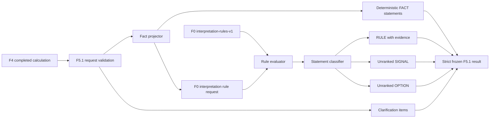

# F5.1 客观结果解读设计

**日期：** 2026-07-31

## 目标

F5.1 消费已完成且通过 schema 验证的 F4 `excel-ta-v1` 计算结果，将数值输出转换为结构化、可追溯且不替代工程判断的解读结果。解读尽量复用 F0 `interpretation-rules-v1` 已批准的规则与逻辑，不在 F5 内复制阈值、贡献集中条件或改善选项。

F5.1 是根 F5 的可独立验收子能力。F5.1 完成后可登记为 `available`；根 F5 继续保持 `unavailable`，直到图纸、公差链有效性、结构性风险和完整澄清流程均具备受控证据。

## 范围

### 本次负责

- 接受一个 F4 `calculation-result-v1` 完成结果，不重新读取或计算 workbook。
- 从 F4 结果生成 Cpk、Cp、RSS sigma、DPM、Yield、规格限、推荐方法和因子贡献度 `FACT`。
- 将 F4 Cpk、目标 Cpk、达成 Sigma、目标 Sigma 和贡献因子投影为 F0 解读规则事实。
- 仅在 F0 规则适用时生成带知识库版本、条目 ID、来源别名、工作表、范围和来源 hash 的 `RULE`、`SIGNAL`、`OPTION`。
- 保留 F4 公式追踪引用，使每个计算事实可以追溯至 F4 输出字段。
- 对规则不适用、事实不足或缺少图纸证据的内容生成结构化澄清项。
- 对输出执行严格 schema 二次验证、克隆和递归冻结。

### 本次不负责

- 公差链闭合、基准链、装配基准面、堆叠起点、加减方向或跨子系统判断。
- 图片模型、OCR 或 Loop 图片语义推断。
- F6 What-if、反向求解、方案量化、方案排序或推荐。
- 修改 F4 计算结果、知识库条目、源 workbook 或外部系统。
- 为 WC 或 3D VA 场景自行新增 F0 未批准的规则。

## 方案选择

采用“F5 编排器调用 F0 规则引擎”的方案：F5.1 只负责事实投影、陈述分类、证据绑定与澄清，不维护规则副本。

未采用以下方案：

- 在 F5 内硬编码 Cpk 与贡献度逻辑：会造成 F0 与 F5 双重规则来源。
- 由自由文本模型直接生成报告：无法保证规则引用、确定性和不越权判断。
- 扩展到完整 F5：当前缺少 F3 和图纸语义证据，会迫使实现产生无依据结论。

## 架构



组件职责：

1. **F5.1 contracts**：定义严格请求、事实陈述、规则证据、澄清项和完成结果。
2. **Fact projector**：只从 F4 结果选择并格式化数值事实，不重新计算。
3. **Rule adapter**：把 F4 字段转换为 `interpretationRuleEvaluationRequestSchema`，调用 F0 loader。
4. **Statement classifier**：将 `performance-rule` 映射为 `RULE`，`root-cause-signal` 映射为 `SIGNAL`，`improvement-option` 映射为 `OPTION`，保持 F0 返回顺序且不做排名。
5. **Clarification builder**：描述未覆盖证据和不适用规则，不阻塞已经有充分证据的能力结论。

## 契约

### 请求

`interpretation-request-v1` 调整为：

```ts
{
  contractVersion: "v1";
  inputClassification: "confidential";
  calculationResult: CalculationCompletedResult;
}
```

请求只接受 `status: "completed"` 的 F4 结果。项目、运行、workbook hash 和 worksheet 选择均从 F4 结果继承，禁止调用方再次提供并造成引用不一致。

### 完成结果

```ts
{
  contractVersion: "v1";
  outputClassification: "confidential";
  featureId: "F5.1";
  status: "completed";
  interpretationVersion: "objective-interpretation-v1";
  projectReference: string;
  runReference: string;
  workbookContentHash: string;
  worksheetSelection: { worksheetName: string; tableId: string };
  calculationVersion: "excel-ta-v1";
  knowledgeBaseVersion: "interpretation-rules-v1";
  ruleEvaluationStatus: "matched" | "insufficient-facts" | "not-applicable";
  statements: InterpretationStatement[];
  clarifications: ClarificationItem[];
}
```

`InterpretationStatement` 的公共字段为稳定 `statementId`、`type`、`section` 和结构化 `content`。V1 不生成自由文本工程结论。

- `FACT`：公式输出保留 F4 `outputField` 与对应公式追踪；输入配置只记录受控 `inputField`，不得伪造公式 trace；派生值记录全部源公式输出字段及其真实 trace（例如 `achievedSigma` 保留 `capability.lowerZ` 和 `capability.upperZ`）。
- `RULE`：包含 F0 `entryId`、相关事实引用和完整知识库来源证据。
- `SIGNAL`：结构与 `RULE` 相同，但明确 `requiresEngineeringReview: true`。
- `OPTION`：结构与 `RULE` 相同，并明确 `rank: null`，禁止排序和推荐字段。

V1 `section` 只使用：`calculation-summary`、`capability-vs-specification`、`major-contributors`、`parallel-options`。本轮不得生成 `structural-evidence` statement；未评估的结构范围只由 drawing evidence clarification 表达。

陈述类型与 section 严格对应：

| 类型/FACT metric | section |
| --- | --- |
| FACT `cp`、`rss_sigma`、`total_dpm`、`yield`、`recommended_method`、`achieved_sigma`、`target_sigma` | `calculation-summary` |
| FACT `cpk`、`target_cpk`、`lower_spec_limit`、`upper_spec_limit` | `capability-vs-specification` |
| FACT `factor_contribution` | `major-contributors` |
| RULE | `capability-vs-specification` |
| SIGNAL | `major-contributors` |
| OPTION | `parallel-options` |

F5.1 消费或输出的公式 trace 必须同时验证 `outputField` 与 `formulaId`：`capability.cpk` → `cpk-v1`、`capability.cp` → `cp-v1`、`system.rssSigma` → `rss-v1`、`capability.totalDpm` → `dpm-total-v1`、`capability.yield` → `yield-v1`、`capability.lowerZ` → `z-lower-v1`、`capability.upperZ` → `z-upper-v1`、`factors[N].contribution` → `contribution-v1`。contract 和服务 trace index 均执行该约束。

FACT provenance 中每个 `sourceCells` 项只允许以下引用，不允许任意原始文本：

- 复用 worksheet source cell 格式 `Sheet!A1`，工作表名可包含空格。
- 白名单内的 `request:systemSpecification.<field>`。
- 严格的 F4 中间输出引用，包括 `factors[N].mean/halfTolerance/sigma/contribution`、`system.*` 和 `capability.*` 的已定义字段。

## F4 到 F0 的事实映射

仅当 F4 推荐方法为 `rss_1d` 时调用 F0 的 `method: "rss"`：

| F0 fact | F4 source |
| --- | --- |
| `cpk` | `capability.cpk` |
| `targetCpk.value` | `capability.targetCpk` |
| `targetCpk.source` | `project` |
| `achievedSigma` | `min(capability.lowerZ, capability.upperZ)`，此值作为事实投影而非新工程规则 |
| `targetSigma.value` | `capability.targetSigmaLevel` |
| `targetSigma.source` | `project` |
| `contributors[].reference` | `factors[index].source` 的 worksheet/table/row 稳定引用 |
| `contributors[].contributionPercent` | `factors[index].contribution * 100` |

当 F4 方法为 `worst_case` 或 `refer_3d_variation_analysis` 时，不把结果伪装为 F0 RSS 规则输入。规则状态为 `not-applicable`，保留所有确定性 `FACT`，并增加方法适用性澄清项。

## 陈述与证据规则

- `FACT` 只陈述 F4 已有结果；除了 `achievedSigma = min(lowerZ, upperZ)` 和贡献百分比换算，不产生新的计算指标。
- 每个 `RULE` 必须引用一个 F0 `performance-rule` 条目及完整来源证据。
- 每个 `SIGNAL` 必须引用一个 F0 `root-cause-signal` 条目，并标记需要工程确认。
- 每个 `OPTION` 必须引用一个 F0 `improvement-option` 条目，保持并列，不提供 rank、score、recommended 或 preferred。
- F0 返回 `insufficient-facts` 时，不生成规则类陈述，并把 `missingFacts` 转为澄清项。
- F0 返回 `not-applicable` 时，不生成规则类陈述，并保留可验证的 F4 `FACT`。

## 澄清策略

V1 始终且恰好添加一个 `drawing_evidence_not_evaluated` 澄清项，范围无重复地完整包含公差链闭合、基准链、装配基准面、堆叠起点、方向和跨子系统判断。该项不阻塞能力与规格、主要贡献因子等已有数值证据的陈述。

额外澄清原因：

- `rule_method_not_applicable`：F4 方法不在 F0 RSS 规则覆盖范围内。
- `rule_facts_insufficient`：F0 返回缺失事实列表。
- `three_dimensional_follow_up_required`：F4 推荐转交 3D VA。

## 错误处理与隐私

- 非 `confidential` 输入：`policy_denied`。
- schema、未知字段或非完成 F4 结果：`validation_error`。
- F0 loader/evaluator 未通过其受控 schema：传播为不包含机密值的 typed error。
- 错误信息只包含 contract ID、错误码和建议动作，不序列化 F4 数值或项目引用。
- 输出不得包含 workbook bytes、任意源单元格内容或规则描述自由文本。

## 治理

新增 F5.1 Feature Register 条目：

- 状态：`available`
- 依赖：`calculation-service-v1`、`knowledge-base-v1`、`interpretation-rules-v1`、`objective-interpretation-v1`
- 输入/输出：`interpretation-request-v1` / `interpretation-result-v1`
- 最大分类：`confidential`
- 验收：`anonymous-interpretation-fixture`、`interpretation-rule-traceability-check`、`interpretation-privacy-check`
- 外部前置条件：`approved-knowledge-base`

根 F5 继续 `unavailable`，其登记说明必须指出 F5.1 可用不代表完整 F5 已完成。

## 测试与验收

1. 契约拒绝未知字段、非机密输入、非完成 F4 结果、错误 statement 分类和缺失规则证据。
2. RSS 且 Cpk 低于目标时，输出 F4 `FACT`、F0 below-target `RULE`、贡献集中 `SIGNAL` 和未排序 `OPTION`。
3. RSS 且 Cpk 达标时，只输出匹配的 performance `RULE`，不生成无依据 SIGNAL/OPTION。
4. WC 结果保留 FACT，规则状态为 `not-applicable` 并生成方法澄清。
5. 3D referral 结果增加 3D 跟进澄清，不套用 RSS 规则。
6. 输出稳定、递归冻结、通过结果 schema，并从 built ESM 入口导出。
7. 错误和序列化结果不泄漏 workbook bytes、任意单元格文本或无关输入值。
8. 治理测试确认 F5.1 `available`、根 F5 `unavailable`。
9. 聚焦测试、build、lint、repository check 和 `git diff --check` 通过；完整测试中既有基线失败单独记录，不归入本功能修改。
