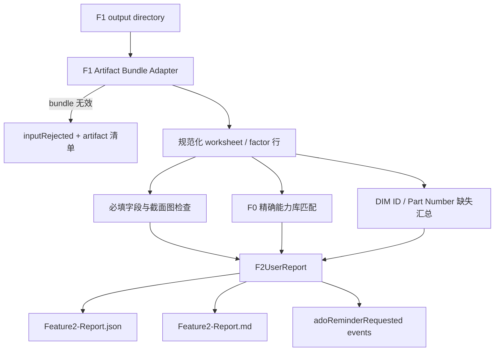

# F2 Artifact 输入与用户报告优化设计

**日期：** 2026-08-03

## 背景与问题

现有 F2 CLI 接收原始 Excel，并在内存中重新执行 F0/F1。它没有消费 F1 已落盘的 JSON、MD
和 images，因此 F1 与 F2 之间缺少可见、可复查的文件交接。现有 Markdown 又直接展开内部
`blockingIssues`、`mappingRecords`、`capabilityChecks` 和 `governanceSignals`：同一 factor 缺少
多个字段时会生成多条技术记录，用户无法在熟悉的 F1 raw-data 行中判断缺什么、为什么阻塞、
应该修改哪里。

本设计将 F2 收敛为一个面向工程师的 artifact consumer。F2 只读取完整 F1 输出目录，以 F1
逐工作表 raw-data 表为主视图，标记缺失字段并追加能力库推荐列。底层审计证据继续保留在 JSON
中，但不再支配 Markdown 的阅读结构。

## 目标

1. F2 的正式输入是 F1 输出的 JSON、MD 和 images，不再读取或重新解析 Excel。
2. 用户首先看到与 F1 raw data 相同的一行一个 factor 表格，而不是内部 issue 列表。
3. 所有业务必填字段和截面图一次性检查，并以中文、工作表、factor、源行和字段清单表述。
4. 在 raw-data 表中直接显示缺失值、能力库内外状态和推荐公差/分布。
5. DIM ID 与独立 Part Number 缺失不阻塞，形成按 category 汇总的系统清单和 ADO 提醒接口。
6. 输出一份严格 JSON 和一份用户可读 Markdown，二者来自同一报告模型。

## 非目标

- 不开发 ADO 网络连接、认证、负责人查找或实际创建提醒。
- 不检查重复 ID、ID 格式、供应商到 Microsoft ID 映射冲突；这些规则保持待定。
- 不实现记录例外后继续，也不自动修改 Excel。
- 不使用模糊匹配或 LLM 猜测能力库条目。
- 不把 `Drawing Number` 当作 `Part Number`。

## F1 Artifact Bundle 输入

F2 CLI 接收一个 F1 workbook 输出目录，例如：

```text
test/demo-output/feature1-output/<workbook-name>/
  Feature1-Report.json
  Feature1-Report.md
  sheets/<workbook-file-name>/
    README.md
    json/<worksheet>.task1.5.sheet.full.json
    md/<worksheet>.task1.5.sheet.md
    images/<worksheet>__<hash>.<extension>
```

### 数据源优先级

- `Feature1-Report.json`：workbook 身份、content hash、选择的工作表及汇总信息。
- `sheets/.../README.md`：worksheet 到 JSON、MD、images 的 manifest。
- 每 worksheet JSON：F2 唯一计算数据源和源单元格证据。
- 每 worksheet MD：F1 用户输出完整性证据；F2 不从 Markdown 反向解析结构化值。
- images：截面图完整性与可访问性证据；F2 不执行 OCR。

### Bundle 验证

F2 在业务检查前验证：

1. 根 JSON、根 MD 和 manifest 均存在。
2. manifest 中每个已选择 worksheet 的 JSON 与 MD 均存在。
3. worksheet JSON 可由受支持的 F1 runtime schema 解析。
4. workbook 名称、content hash、worksheet 名称及 artifact 路径一致。
5. image manifest 指向的文件存在、扩展名受支持且文件非空。

Bundle 本身不完整时，F2 返回 `inputRejected` 和 artifact 缺失清单，不把它误报为用户 Excel
字段缺失。F2 不回退到读取原始 workbook。

## 字段与阻塞规则

### 业务必填字段

每个有效 factor 行检查：

| 用户显示名 | 语义字段 | 缺失时行为 |
|---|---|---|
| Factor Description | `factorName` | 阻塞 worksheet |
| Part Name | `partName` | 阻塞 worksheet |
| Part Category | `partCategory` | 阻塞 worksheet |
| Design Nominal | `nominalValue` | 阻塞 worksheet |
| + Tolerance | `upperTolerance` | 阻塞 worksheet |
| - Tolerance | `lowerTolerance` | 阻塞 worksheet |
| Long Term/Safety Factor | `longTermSafetyFactor` | 阻塞 worksheet |
| Sigma Level | `standardDeviation` | 阻塞 worksheet |
| Distribution | `distribution` | 阻塞 worksheet |

每个已选择 worksheet 还必须具有有效截面图；缺失、文件为空、格式不支持或 manifest 无法关联时
阻塞该 worksheet。F2 一次返回全部缺失项，不在首个错误处停止。

### 标识符字段

F1 schema 新增独立可选字段 `partNumber`。`drawingNumber` 保持图纸编号原义，不作为 Part Number
的别名。以下字段缺失时不阻塞：

- `dimCharacteristicId`
- `partNumber`

它们在增强表格中显示 `（缺失）`，并进入 ADO 提醒候选清单。重复、格式和映射冲突暂不检查。

## 能力库比较

只有业务必填字段完整的 factor 才进入能力库比较。F2 使用受控 category 和 item 规则做确定性
精确匹配：

- 唯一匹配：标记 `库内`，显示知识库推荐公差范围和推荐分布，并显示实际值是否位于推荐范围。
- category 未定义、item 未匹配或匹配歧义：统一面向用户标记 `库外`，推荐列显示 `—`；JSON
  保留内部原因用于治理。
- 缺少比较所需字段：标记 `无法检查`，不重复制造能力库错误。

能力库差异在本阶段是清晰展示的非阻塞差异。用户可据此修改源 Excel；“记录例外后继续”保持
待定，不进入本次实现。F2 不把库外表述为通过，也不猜测推荐值。

推荐列固定为两列：

1. `能力库结果`：`库内-符合推荐`、`库内-超出推荐`、`库内-分布不同`、`库外` 或 `无法检查`。
2. `知识库推荐`：`<min>–<max> <unit> / <distribution>`；无可靠推荐时显示 `—`。

## 用户报告模型

JSON 与 Markdown 共享一个版本化 `F2UserReport` 模型，而不是由 Markdown 再解释内部 workflow
结果。顶层状态为：

- `inputRejected`：F1 artifact bundle 不完整或不一致。
- `blocked`：全部 worksheet 因业务必填字段或截面图缺失而阻塞。
- `partiallyBlocked`：部分 worksheet 被阻塞。
- `completed`：没有业务必填或截面图缺失；能力库差异和标识符缺失不改变此状态。

每个增强 factor 行包含：

- workbook、worksheet、table、source row 和安全的 source-cell 引用；
- F1 raw-data 全部用户列及其原始显示值；
- 缺失字段数组；
- `capabilityStatus`、推荐范围、推荐分布和内部匹配原因；
- `adoReminderRequested`，仅当 DIM ID 或 Part Number 任一缺失时为 `true`。

## Markdown 信息架构

### 1. 执行摘要

报告开头只回答用户关心的结论：

| 项目 | 结果 |
|---|---|
| 当前状态 | 需要修改 Excel / 可继续 |
| 工作表 | 总数、阻塞数、可继续数 |
| 必填缺失 | factor 行数、字段总数 |
| 截面图缺失 | 工作表数 |
| 能力库 | 库内、库外、超出推荐、分布不同 |
| 标识符提醒 | DIM ID、Part Number 缺失数 |

阻塞时紧接一句固定操作说明：请按下表修正 TA Excel 源文件并重新运行 F1，然后将新的 F1 输出
目录提交给 F2。

### 2. 缺失字段统计

单独表格按 worksheet 和字段汇总，不使用内部 issue code：

| Worksheet | 缺失字段 | 影响 factor 数 | 源行 |
|---|---|---:|---|

截面图缺失作为字段 `截面图` 出现在同一统计表中。

### 3. 增强 Raw Data

每个 worksheet 一张表，保留 F1 raw-data 列顺序，并追加两列：

| Row | Factor Description | Part Name | Part Number | DIM ID | Part Category | Design Nominal | + Tol | - Tol | LT/SF | Sigma | Distribution | 能力库结果 | 知识库推荐 |
|---:|---|---|---|---|---|---:|---:|---:|---:|---:|---|---|---|

任何不可用字段直接显示 `（缺失）`。缺失字段名与源单元格保留在 JSON，Markdown 不重复展开为
多条技术记录。

### 4. 标识符提醒清单

按 Part Category 汇总 DIM ID 与 Part Number 缺失：

| Category | DIM ID 缺失 | Part Number 缺失 | Factor 行 | ADO 状态 |
|---|---:|---:|---|---|

ADO 状态固定为 `待触发`。报告不得声称已经发送提醒。

### 5. 技术追溯

文末仅保留 workbook hash、F1 contract version、F0 version、mapping rule version、F1 artifact 根路径
和生成时间。详细内部原因只存在于 JSON，不在 Markdown 主体逐条展开。

## ADO 提醒接口

F2 生成确定性事件数组，不执行网络调用：

```json
{
  "eventType": "adoReminderRequested",
  "category": "Display",
  "worksheetName": "Example_TA",
  "missingFields": ["dimCharacteristicId", "partNumber"],
  "factorRows": [27, 28],
  "workbookContentHash": "..."
}
```

事件按 workbook、category、worksheet 聚合，顺序稳定，可由后续 adapter 幂等消费。事件不得包含
本阶段尚未定义的 ADO project、assignee、area path 或凭据。

## 数据流



## 兼容与迁移

- 现有 `createF2InitialWorkflow` 可保留为内部检查器或兼容 API，但其内部 issue DTO 不再直接
  用作用户报告。
- 新增 artifact adapter 和 user-report composer；CLI 参数从 workbook path 改为 F1 output directory。
- 如需保留旧 CLI，必须使用显式 legacy 命令名，不能在新入口中静默重跑 F1。
- 旧设计中“Drawing Number 等同 Part Number”“F2 贯通必须从 workbook 重跑”的条款由本设计
  替代。

## 测试与验收

### 原子测试

1. 缺少根 JSON、根 MD、worksheet JSON、worksheet MD 或 image 时返回明确 artifact 错误。
2. F1 bundle workbook hash、worksheet 或 manifest 不一致时拒绝输入。
3. 九个业务字段逐项缺失均在原 factor 行显示 `（缺失）` 并阻塞该 worksheet。
4. 截面图缺失在 worksheet 统计中显示一次并阻塞，不为每个 factor 重复。
5. DIM ID 或 Part Number 缺失不阻塞，并生成按 category 聚合的 ADO 事件。
6. 唯一能力库匹配显示推荐范围/分布；未匹配显示 `库外 / —`；缺字段显示 `无法检查 / —`。
7. 能力库超范围和分布不同作为非阻塞差异显示。

### 报告测试

1. JSON 通过严格 runtime schema，汇总计数与增强行一致。
2. Markdown 不包含 `required_field_unavailable`、`tableId` 等内部术语。
3. Markdown 每个 factor 只出现一条增强 raw-data 行。
4. JSON 与 Markdown 的状态、工作表计数、缺失计数和能力库计数一致。
5. 输出顺序固定，重复运行产生除时间字段外一致的结果。

### 真实 Demo

使用受控真实 F1 目录运行：

```text
test/demo-output/feature1-output/Maera_gap_TP_brkt_and-_battery_20260305V1/
```

生成：

```text
test/demo-output/feature2-output/Maera_gap_TP_brkt_and-_battery_20260305V1/
  Feature2-Report.json
  Feature2-Report.md
```

验收时必须证明 F2 未读取原始 Excel、两份报告来自同一个 `F2UserReport`、所有缺失项在行级表格
显示、能力库未匹配明确显示 `库外 / —`、标识符事件仅为 `待触发`，且生成物不进入 Git。