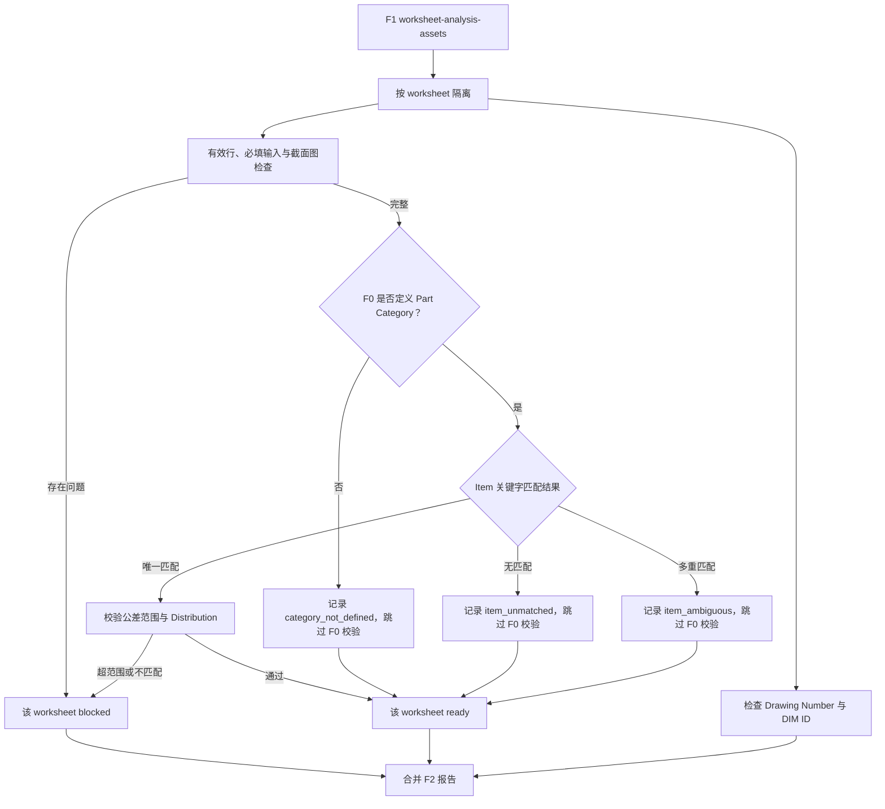

# F2 Initial 数据清洗工作流设计

**日期：** 2026-08-03

## 目标

F2 Initial 在 F1 生成的只读 `worksheet-analysis-assets` 上执行工作表级数据清洗，并使用
F0 能力库验证可可靠匹配的因子。它一次性返回缺失输入、公差超范围、分布不匹配以及
Drawing Number / DIM ID 治理信号，同时保证一张工作表被阻塞时，其他合格工作表仍可继续。

本设计新增正式 F2 workflow/facade，复用现有 F2 原子检查能力，但以本设计确认的工作流规则
决定最终状态。既有 F2.1、F2.2、F2.3 和 F2.4 API 在兼容性需要下可保留；F2 Initial 不使用
通用“记录例外后继续”路径。

## 已确认规则

### Factor Table 字段

F2 使用 F1 从真实 TA Factor Table 表头解析出的语义字段：

| 真实表头 | 语义字段 | F2 Initial 规则 |
|---|---|---|
| Factor Description (TA Loop) | `factorName` | 用户输入，必填 |
| Part Name | `partName` | 用户输入，必填；参与 F0 Item 匹配 |
| Drawing Number | `drawingNumber` | 可选；缺失或异常生成非阻塞治理信号 |
| Dim / Characteristic ID | `dimCharacteristicId` | 可选；缺失、异常或重复生成非阻塞治理信号 |
| Part Category | `partCategory` | 用户输入，必填；F0 一级匹配键 |
| Design Nominal | `nominalValue` | 用户输入，必填有限数值 |
| + Tolerance | `upperTolerance` | 用户输入，必填有限数值 |
| - Tolerance | `lowerTolerance` | 用户输入，必填有限数值 |
| Long Term/Safety Factor | `longTermSafetyFactor` | 用户输入，必填有限数值 |
| sigma Level | `standardDeviation` | 用户输入，必填有限数值 |
| Distribution | `distribution` | 用户输入，必填；唯一 F0 Item 匹配后校验 |
| Mean | `mean` | Excel 计算列，不参与必填阻塞 |
| Tolerance | 派生/显示字段 | Excel 计算列，不参与必填阻塞 |
| 1 sigma | 派生/显示字段 | Excel 计算列，不参与必填阻塞 |
| % Cont. to sigma | `contribution` | Excel 计算列，不参与必填阻塞 |
| Notes | 非分析备注 | 可选，不参与阻塞 |

文档中的 Part Number / PN 在 F2 Initial 中按真实模板的 `Drawing Number` 处理，不新增
`partNumber` 字段。

### 有效因子行

完全空白的模板预留行不参与检查。只要一行的任一用户输入列存在内容，该行即为有效因子行，
并对全部必填用户输入列执行检查。F1 应负责从 Factor Table 中排除纯空白模板行，F2 仍需
防御性忽略无任何用户输入证据的行。

### 截面图

每张已选择 TA 工作表必须包含 `Include the tolerance path (screen shot) below` 对应的有效截面图
证据。缺少图片、图片格式不可用或锚点无法解析均阻塞该工作表，问题代码统一归入
`cross_section_image_unavailable`，并保留具体原因。

### 单位

当前模板没有 Unit 列。F2 Initial 对该受支持模板使用 `mm` 作为公差单位，并在结果中记录
`unitAssumption: "mm"`。该假设不得静默扩展到尚未确认的其他模板布局。

## F0 两级匹配与验证

### 一级：Part Category

F2 首先以规范化的 `Part Category` 限定 F0 Capability Library 候选集合。

- F0 未定义该 Category，例如 `Assembly`、`Other`：不做公差或分布判断，返回
  `category_not_defined` Mapping 记录，不阻塞。
- F0 定义该 Category：进入 Item 关键字匹配。

Category 规范化只能使用 F0 已批准的术语或别名，不使用模糊模型推断。

### 二级：Item 关键字

在同一 Category 内，使用规范化后的 `Factor Description` 和 `Part Name` 与 F0 Item 的受控
关键字、名称或别名匹配：

- 唯一匹配：使用该 Item 的公差范围和推荐 Distribution 进行验证。
- 无匹配：跳过验证，记录 `item_unmatched`，不阻塞。
- 多重匹配：不得自动选择，跳过验证，记录 `item_ambiguous` 和候选 Item，不阻塞。

初始关键字 Mapping 不是完整工程分类。所有未匹配和歧义结果必须进入待优化记录，以便后续
补充关键字、别名、优先级或更精确规则；不得因规则不足判定用户填写错误。

### 公差与 Distribution

仅在唯一匹配到 F0 Item 后执行：

1. 使用 `upperTolerance - lowerTolerance` 得到总公差带，单位为 `mm`。
2. 总公差位于 F0 Item 的包含边界内时通过。
3. 总公差超出 F0 Item 范围时阻塞该工作表，要求修改源 Excel 后重新上传。
4. Distribution 先按受控别名规范化，再与 F0 Item 推荐值比较。
5. Distribution 不匹配时阻塞该工作表，要求修改源 Excel 后重新上传。

F2 Initial 不允许通过人工例外绕过公差超范围、Distribution 不匹配、必填缺失或截面图缺失。

## 工作表级数据流



每个工作表独立生成 `blocked` 或 `readyForNextFeature` 状态。整次运行可为
`completed`、`partiallyBlocked` 或 `blocked`：

- `completed`：所有已选择工作表均可继续。
- `partiallyBlocked`：至少一张工作表被阻塞，且至少一张可继续。
- `blocked`：所有已选择工作表均被阻塞。

阻塞仅停止该工作表进入后续 Feature，不取消其他工作表，也不丢弃已发现的问题。
标识符检查独立执行，因此必填或能力检查已阻塞的工作表仍会产出可发现的非阻塞治理信号。

## 问题与记录分类

### 阻塞问题

- `required_field_unavailable`
- `factor_table_has_no_rows`
- `cross_section_image_unavailable`
- `tolerance_out_of_range`
- `distribution_mismatch`

每项问题包含 workbook content hash、worksheet、table、源行/单元格（适用时）、字段、固定原因、
F0 版本和匹配 Item 证据（适用时）。结果要求用户修正 Excel 并重新上传。

### 非阻塞治理信号

- Drawing Number 缺失或证据异常
- DIM ID 缺失、证据异常或重复

这些信号不改变 F2 工作表状态。F2 只生成系统级治理清单；ADO 提醒、负责人解析、Comment 0
和图纸治理由 F3 负责。

### Mapping 待优化记录

每条记录至少包含：

- workbook content hash、worksheet、table、源行
- `Part Category`、`Factor Description`、`Part Name`
- 状态：`category_not_defined`、`item_unmatched` 或 `item_ambiguous`
- 候选 Item、命中关键字和匹配来源（适用时）
- F0 版本和 Mapping 规则版本

Mapping 记录不阻塞，不得被表述为公差通过或失败，也不得自动写回 F0。

## 工作流契约方向

新增严格、版本化的 F2 workflow 请求与结果契约。请求只接收 F1 资产、F0 版本、支持的模板
单位策略和可选的 Mapping 规则版本，不接收 workbook bytes、路径、URL 或可变外部规则。

结果包含：

- workbook content hash、F0 版本、Mapping 规则版本和 `unitAssumption`
- 每张工作表的状态、阻塞问题、标识符治理信号和 Mapping 待优化记录
- 唯一匹配行的 F0 Item、总公差和 Distribution 校验证据
- 整次运行状态及可继续/被阻塞工作表计数

所有 DTO 必须经过 runtime schema 验证、structured clone 和递归冻结。机密来源和值仅存在于受控
结果，不进入普通日志；日志只允许版本、内容哈希、固定状态和汇总计数。

## 现有模块兼容策略

现有 F2.1/F2.2/F2.3/F2.4 是已发布的原子 API。F2 Initial workflow 应优先组合或局部扩展这些
模块，避免无关破坏，但最终行为以本设计为准：

- F2.1 需忽略纯空白模板行，并新增工作表级截面图阻塞。
- F2.2 现有“精确 Category + tolerance”查询不足以区分同 Category Item；workflow 必须增加两级
  Mapping，并将唯一匹配后的范围/分布差异提升为阻塞。
- F2.3 通用例外处置不进入 F2 Initial 主路径。
- F2.4 标识符质量继续产生非阻塞信号；其系统级汇总供 F3 使用。

若复用现有结果会模糊新语义，应新增版本化契约或 workflow 专属 DTO，不静默改变既有调用者。

## 测试与验收

### 原子测试

1. 每个必填用户输入字段逐项缺失或格式无效时阻塞；Drawing Number、DIM ID、Notes 和计算列
   缺失不阻塞。
2. 纯空白模板行被忽略；部分填写行触发完整必填检查。
3. 截面图缺失、格式异常和锚点不可解析分别阻塞。
4. F0 未定义 Category 返回 `category_not_defined`，不执行范围或分布判断。
5. 同 Category 下 Item 唯一匹配、无匹配和多重匹配分别产生确定结果。
6. 无匹配/歧义只产生 Mapping 记录；唯一匹配后的公差边界内通过，超范围阻塞。
7. 唯一匹配后的 Distribution 匹配通过，不匹配阻塞。
8. 标识符信号不改变工作表状态。

### 工作流测试

1. 多工作表中一张阻塞、另一张合格时，运行状态为 `partiallyBlocked`，合格页仍可继续。
2. 所有页阻塞和所有页通过时，汇总状态与计数一致。
3. 所有问题一次性返回，不在首个问题处停止。
4. F0、Mapping 和 workbook content hash 可追溯，结果不可变且不泄漏机密日志。

### F0/F1/F2 贯通测试

每次 F2 模块验收必须从真实受控 workbook 运行完整 `F0 -> F1 -> F2` 链路，而不是只使用手工
构造的 F1 DTO。贯通运行应复用现有单工作簿 Feature 1 入口并生成隔离输出：

```text
test/demo-output/feature2-output/<workbook-base-name>/
  Feature2-Report.json
  Feature2-Report.md
```

报告必须列出工作表状态、阻塞问题、F0 匹配证据、Mapping 待优化记录和标识符治理清单；不得
覆盖既有 `feature1-output` 或共享 `feature1-validation` 结果。JSON 和 Markdown 中的行级结果
必须保留 workbook、worksheet、table、source row 和 F1 可安全确定的 source cell。单元测试仍
使用匿名 fixture，真实 workbook 只用于本地受控贯通验收，不作为新的 Git fixture 提交。

## 非目标

- F3 的 ADO 提醒、负责人解析、供应商到 Microsoft DIM ID 映射和图纸包。
- F4 的 WC/RSS、Cp/Cpk、Z、DPM、良率及计算列重算。
- 对未知 Category/Item 作工程可行性声明。
- 自动修改或回写 Excel、自动更新 F0、使用 LLM 猜测 Item。
- 自动批准 Mapping 建议或以 Mapping 记录替代知识库治理。