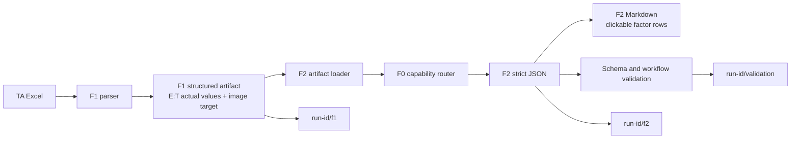

# F2 完整 Artifact 与一键分析优化设计

**日期：** 2026-08-05

## 背景

当前 F2 已能消费 F1 artifact 并通过 F0 路由判断能力指导，但仍有四个影响后续流程的问题：

1. F2 factor 行没有像 F1 一样链接到对应 worksheet 的尺寸堆叠图片。
2. F2 只保留部分语义字段，遗漏 factor table E:T 中的计算值和 Notes，不能作为无损的下游输入。
3. F2 JSON 使用 `displayedFields`，把 Excel 显示文本当作业务值。
4. F1、F0/F2 和验收命令分散，单次测试没有一个独立目录保留完整证据。

此外，F0 查询引擎已支持显式 `fallbackEntryId` 链，但当前发布的 `internal-v1` seed 没有配置
fallback 链。文件名包含 `Fallback Rule` 不能作为运行时已有 fallback 的证据。

## 目标

1. F2 每个 factor 的 Factor Description 和 Part Name 都链接到该 worksheet 的尺寸堆叠图片。
2. F1 worksheet JSON 和 F2 JSON 完整保留 factor table E:T 的 16 列数据。
3. F2 机器数据只保留 Excel 实际值，不保留显示值，不从 Markdown 反向解析数据。
4. F2 只消费 F0 明确发布、带来源证据的 fallback，不自行选择最严或最宽规则。
5. 提供单工作簿一键流程：F1 → F0/F2 → 严格验证，并为每次运行保留独立 debug 目录。
6. 支持命令和自然语言别名“帮我用F2分析下excel”。

## 非目标

- F2 不重新读取 Excel，也不通过 Markdown 恢复结构化数据。
- 不依据 factor/part 文本猜测板厚、材料族、制程等级或特征类型。
- 不把某工艺族的最小或最大公差带自动定义成 fallback。
- 不覆盖或删除之前的一键分析运行目录。
- 不在 F2 中修改源 Excel 或 F0 数据。

## 总体架构



F1 是 Excel 数据和图片的唯一提取者。F2 只接受经过验证的 F1 artifact。F0 router 是能力判断
的唯一入口。runner 只负责编排和保存证据，不复制业务规则。

## F1 结构化 E:T 数据

### 列契约

每个有效 factor 行保留以下 16 列：

| Excel 列 | F2 字段 | 值类型 |
|---|---|---|
| E | `factorName` | `string \| null` |
| F | `partName` | `string \| null` |
| G | `drawingNumber` | `string \| number \| null` |
| H | `dimCharacteristicId` | `string \| number \| null` |
| I | `partCategory` | `string \| null` |
| J | `nominalValue` | `number \| string \| null` |
| K | `upperTolerance` | `number \| string \| null` |
| L | `lowerTolerance` | `number \| string \| null` |
| M | `longTermSafetyFactor` | `number \| string \| null` |
| N | `sigmaLevel` | `number \| string \| null` |
| O | `distribution` | `string \| null` |
| P | `mean` | `number \| string \| null` |
| Q | `tolerance` | `number \| string \| null` |
| R | `oneSigma` | `number \| string \| null` |
| S | `percentContributionToSigma` | `number \| string \| null` |
| T | `notes` | `string \| number \| null` |

F1 从 Excel Value2/公式 cached value 生成 `actualFields`。数字保持 JSON number，文本保持 string，
真正空白或不可用值为 `null`。F2 不输出 `displayValue`、`A:/D:` 组合文本或中文缺失占位符。
缺失状态通过 `null`、`missingRequiredFields` 和 `sourceCells` 表达。

现有语义字段 `standardDeviation` 迁移为用户和 Excel 表头一致的 `sigmaLevel`。F0 router 只读取其
需要的 category、nominal、上下公差和 distribution，不依赖展示格式。

### 兼容边界

F1 worksheet JSON 增加一个严格的 actual-only factor table 表示；原有 F1 dual Markdown 继续用于
人工审阅，但不是 F2 数据源。F2 loader 对旧 artifact 明确返回 `invalid_contract`，避免静默丢列。

## 图片链接与路径

F1 worksheet artifact 继续保存图片文件、相对路径、content hash 和 traceability。F2 loader 必须：

1. 确认图片路径位于 F1 artifact 根目录内。
2. 验证文件存在、非空、媒体类型受支持且 SHA-256 一致。
3. 将验证后的图片复制到本次 F2 输出的 `images/`，或使用 runner 内可移植的相对路径。
4. 在每个 F2 factor JSON 行保存同一 worksheet 的 `imageTarget`：相对路径和 content hash。

F2 Markdown 的 Factor Description 和 Part Name 都使用 `imageTarget.relativePath` 创建链接。链接必须
相对 F2 Markdown 可解析，移动整个 run-id 目录后仍可用。没有有效图片时不生成伪链接，并继续按
现有规则阻塞 worksheet。

## F0 显式 Fallback

### 数据事实

F0 查询引擎已有 `fallbackEntryId`、`fallbackPriority` 和 `fallbackApplied` 语义。当前
`internal-v1` 的 110 条发布规则全部为直接规则，没有 fallback 链。因此本次实施先审计六份受控
能力矩阵及 importer 输出：

- 如果矩阵存在明确标识的 fallback 规则，则导入为独立 entry，保留 source file hash、sheet 和
  range，并由入口规则通过 `fallbackEntryId` 指向它。
- 如果矩阵没有明确 fallback 规则，则该工艺族保持没有 fallback；F2 返回 `F0 信息不足`。

### 调用规则

F2 不绕过 `assessToleranceGuidance` 读取 seed，也不聚合工艺族的最严/最宽规则。只有 F0 返回
`within-guidance` 或 `guidance-exceeded` 且 `fallbackApplied=true`，F2 才显示“F0 兜底指导”。
报告同时保留 assessed total band、maximum recommended total band、matched entry ID 和证据位置。

对于 Sheetmetal、Die cut 等缺少上下文的行，router 可以提交 F1 确实拥有的字段；不能构造板厚、
材料族、制程方法、等级或 feature type。显式 fallback 仍无法匹配时，状态保持
`f0_information_insufficient`。

## F2 输出契约

每个 factor 行至少包含：

```ts
{
  worksheetName: string;
  tableId: string;
  sourceRow: number;
  actualFields: {
    factorName: string | null;
    // ...完整 E:T，类型见列契约
    notes: string | number | null;
  };
  sourceCells: Record<string, string>;
  imageTarget?: {
    relativePath: string;
    contentHash: string;
  };
  missingRequiredFields: string[];
  capabilityStatus: string;
  recommendation?: object;
}
```

`actualFields` 替代 `displayedFields`，后者从新 F2 schema 删除。Markdown 表格显示完整 E:T，并追加
`能力库结果` 和 `知识库推荐` 两列。Markdown 可以使用 `—` 表示 null，但 JSON 只能保存 null。

## 一键 F2 分析

### 调用

支持以下入口：

```powershell
npm run workflow:f2:excel -- "path/to/report.xlsx"
node apps/cli/dist/index.js feature2 --workbook "path/to/report.xlsx" --root .
```

自然语言别名“帮我用F2分析下excel”映射到同一 feature2 command。若调用上下文没有唯一 Excel
路径，入口必须要求用户提供或选择一个路径，不能扫描并猜测目标文件。

### 输出布局

每次运行使用 UTC run-id：

```text
test/demo-output/f2-runs/<workbook-name>/<run-id>/
  run-manifest.json
  f1/
    Feature1-Report.json
    Feature1-Report.md
    sheets/...
  f2/
    Feature2-Report.json
    Feature2-Report.md
    images/...
  validation/
    validation.json
    validation.md
```

runner 不依赖现有固定 `feature1-output`/`feature2-output` 目录进行数据交接。它把 F1 输出根目录直接
传给 F2，并记录每一步的开始/结束时间、退出状态、输出相对路径和 schema 验证结果。失败时保留已
生成的阶段输出，`run-manifest.json` 标记失败阶段，便于 debug。

## 错误处理

- F1 失败：停止 F2，保留 F1 日志和 validation 记录。
- F1 artifact 不完整：F2 输出 `inputRejected`，runner 记录 artifact issues。
- F0 无明确 fallback：不是系统错误，输出 `F0 信息不足`。
- 图片复制或 hash 校验失败：对应 worksheet 阻塞，不生成失效链接。
- F2 schema 验证失败：runner 失败并保留原始 F1/F2 输出，不覆盖历史 run。
- 路径越界、重复参数、非 `.xlsx` 输入：在读取工作簿前失败。

## 测试与验收

### 自动测试

1. F1 fixture 证明 E:T 16 列 actual value 全部进入 worksheet JSON，display value 不进入该结构。
2. F2 loader 拒绝缺少完整 E:T 的旧 artifact，并接受完整 actual-only artifact。
3. F2 schema 证明数字保持 number、空值保持 null、未知字段被拒绝。
4. F2 Markdown 证明 Factor Description 和 Part Name 链接到可访问图片。
5. 路径安全测试证明越界图片和 hash 不一致被拒绝。
6. F0 测试证明直接匹配、显式 fallback、无 fallback 三种结果互不混淆。
7. runner 测试证明 F1、F2、validation 输出位于同一 run-id，失败时也保留已有阶段输出。
8. CLI 测试证明 `feature2` 和中文别名调用同一 runner。

### 真实工作簿验收

使用当前 Maera 工作簿执行一次完整流程，验证：

- 7 个 worksheet、50 个 factor 行仍全部保留。
- 每行 JSON 具有完整 E:T `actualFields`，不存在 `displayedFields`。
- 每个具有图片的 factor 在 Markdown 中有可打开的链接。
- CNC 继续通过 F0 internal-v1 判断。
- Sheetmetal 和 Die cut 仅在显式 fallback 实际命中时显示兜底指导，否则保持信息不足。
- run-id 目录同时包含完整 F1、F2 和 validation 输出。

## 完成标准

只有在严格契约、聚焦测试、强制 TypeScript 构建、一键 runner fixture 和真实工作簿验收均通过后，
本优化才算完成。不得以 Markdown 看起来完整替代 JSON 无损性验证，也不得以推导规则替代 F0 明确
发布的 fallback。