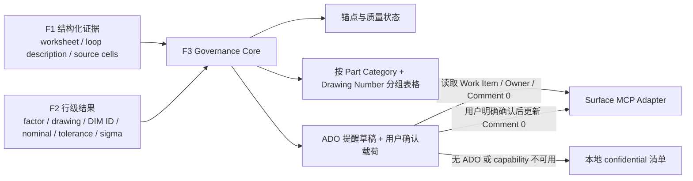

# F3 DIM ID 与图纸治理设计

**日期：** 2026-08-05

## 目标

F3 将每次提交中的 TA 因子关联到图纸尺寸，生成可追溯的尺寸链治理清单，并在用户明确确认后通过 Surface MCP 将缺失信息写入关联 ADO Work Item 的首条 discussion comment（`Comment 0`）。

本阶段不读取图纸图片、不执行 OCR、不修改源 Excel，也不因 Drawing Number 或 DIM ID 的治理问题阻塞 TA 计算。

## 已确认的业务定义

1. 当前阶段的 `Part Number` 与 `Drawing Number` 是同一业务字段，不新增独立 Part Number 输入列。
2. 图纸尺寸身份由组合键 `(Drawing Number, DIM ID)` 确定。
3. 不同 Drawing Number 可以使用相同 DIM ID，不产生重复信号。
4. 同一 Drawing Number 内相同 DIM ID 产生 `duplicate_conflict` 治理信号。
5. 一位纯数字 DIM ID（例如 `1`、`2`、`3`、`4`）标记为 `suspected_invalid`。它保留原值、不阻塞 TA，但不能视为治理完成。
6. EV1 或其他关键里程碑前补齐 Drawing Number 和 DIM ID 是工程流程要求。本阶段不读取里程碑、不计算临近窗口、不发送按日期触发的提醒，也不实现后台 scheduler。
7. 项目内真实 ADO 集成测试固定使用 Feature `1102392`，不创建测试子项。
8. `Comment 0` 指 ADO Work Item 的首条 discussion comment，不是 Description，也不是普通追加评论。

## 范围

### 包含

- 从结构化 F1/F2 artifact 创建稳定的因子实例锚点。
- 检查 Drawing Number 和 DIM ID 的缺失、疑似格式异常及同图纸重复。
- 按 Part Category 和 Drawing Number 生成尺寸链表格。
- 保存精确到 worksheet、table、row 和 source cell 的来源证据。
- 允许用户不关联 ADO、创建新 Work Item 或关联已有 Work Item。
- 通过 Surface MCP 读取 Work Item、解析负责人、读取和更新 Comment 0。
- 在任何 ADO 写入前展示差异并要求用户明确确认。
- Surface MCP 或 ADO 能力不可用时保存本地 confidential 清单。
- 提供 Surface MCP 安装检测和 capability 报告。

### 不包含

- Azure DevOps MCP 依赖或配置。
- Surface 项目里程碑读取、EV1 日期判断、提醒窗口或周期任务。
- 图纸 OCR、图像识别、自动图纸标注或 3D VA。
- 供应商 DIM ID 到 Microsoft DIM ID 的 crosswalk。
- 自动修改或回写上传的 Excel。
- 自动发送未经用户确认的 ADO 提醒。
- F7 实测数据导入；F3 只提供未来可引用的锚点。

## 架构

采用“确定性治理核心 + Surface MCP adapter + 本地工件 adapter”的边界。



F3 Governance Core 是无网络、无文件写入、无时钟和无随机数的确定性模块。Surface MCP 和本地文件系统均通过显式 adapter contract 接入，不能进入组合键、质量判断或分组规则内部。

## 输入边界

F3 消费结构化 F1/F2 artifact，不重新读取 Excel，也不从 Markdown 反向解析数据。

F3 所需字段如下：

| F3 字段 | 结构化来源 |
|---|---|
| Device Level Dim | F1/F2 `worksheetName` |
| Dimension Description | F1 `toleranceLoopDescription` |
| Part / Subsystem | F2 `partName` |
| Part Category | F2 `partCategory`，仅用于分组和组标题 |
| Drawing Number | F2 `drawingNumber` |
| Dim ID | F2 `dimCharacteristicId` |
| Factor Description | F2 `factorName` |
| Nominal | F2 `nominalValue` |
| Upper Tolerance (+) | F2 `upperTolerance` |
| Lower Tolerance (-) | F2 `lowerTolerance` |
| σ Level | F2 `sigmaLevel` |
| Source Location | workbook hash、worksheet、table、row 和 source cells |

当前 F2 report 未携带 `toleranceLoopDescription`。实施时必须通过版本化结构化契约将该字段传入 F3；不得解析 F1/F2 Markdown 获取该值。`partCategory` 是 F2 业务必填字段；缺失时由 F2 阻塞该 worksheet，F3 不对缺失类别发明分组名称，也不处理该 worksheet。

F1/F2 workbook hash、worksheet 集合、table 和 source row 绑定不一致时，F3 返回 `input_rejected`，不生成可能错误关联的锚点。

## 锚点模型

### 因子实例身份

每个提交中的每个 factor 使用以下字段形成稳定实例身份：

```text
factorInstanceId = hash(
  workbookContentHash,
  worksheetName,
  tableId,
  sourceRow
)
```

该身份用于关联当前 F3 记录、来源证据和未来 F7 实测数据路由记录。它不以 Factor Description 文本作为唯一键。

### 图纸尺寸身份

仅当 Drawing Number 非空且 DIM ID 状态为 `valid` 时生成正式图纸尺寸键：

```text
drawingDimensionKey = hash(
  normalizedDrawingNumber,
  normalizedDimId
)
```

规范化只用于比较和生成键：去除首尾空白，并对 Drawing Number 做稳定大小写归一。报告和 ADO 清单始终展示源值，不用规范化值覆盖用户输入。

Drawing Number 或 DIM ID 缺失、疑似异常或冲突时，仍创建 `factorInstanceId`，但不生成正式 `drawingDimensionKey`，图纸尺寸关联保持待治理状态。系统不得发明 DIM ID 占位文本并把它伪装为正式标识符。

重复检查独立于正式锚点生成：只要 Drawing Number 与 DIM ID 都是非空文本，就使用二者的规范化比较值检查同图纸重复。因此 `suspected_invalid` 或 `needs_confirmation` 可以同时带有 `duplicate_conflict`，但在修正或确认成 `valid` 前仍不能获得正式 `drawingDimensionKey`。

## DIM ID 质量规则

| 条件 | 状态 | TA 计算 | 治理含义 |
|---|---|---|---|
| 空值或不可用证据 | `missing` | 继续 | 必须补齐 |
| 一位纯数字 | `suspected_invalid` | 继续 | 保留原值，要求确认或修正 |
| 二至四位纯数字 | `valid` | 继续 | 可用于正式组合键 |
| 其他非空格式 | `needs_confirmation` | 继续 | 不直接判错，等待规范或人工确认 |
| 同一 Drawing Number 内重复 DIM ID | `duplicate_conflict` | 继续 | 阻止治理完成，要求修正或确认 |

重复检查按规范化后的 `(Drawing Number, DIM ID)` 执行。不同 Drawing Number 下相同 DIM ID 不产生信号。

## 治理状态

每个 factor 的治理状态为：

- `complete`：Drawing Number 和 DIM ID 可用，且没有未解决的同图纸重复冲突。
- `needs_governance`：存在 `missing`、`suspected_invalid`、`needs_confirmation` 或 `duplicate_conflict`。
- `blocked_for_reminder`：清单可生成且 TA 可继续，但 ADO 写入因负责人缺失、用户未确认、Comment 0 并发变化、权限不足或 Surface MCP capability 缺失而不能执行。

这些状态均不得修改 F2/F4 的 TA 计算状态。`blocked_for_reminder` 只描述外部治理写入，不代表分析被阻塞。

## 尺寸链清单

清单先按 `Part Category`，再按 `Drawing Number` 分组。缺失 Drawing Number 使用明确的“缺失”分组，不与任何真实图纸合并。

每组使用以下固定表头：

| Device Level Dim | Dimension Description | Part / Subsystem | Drawing Number | Dim ID | Factor Description | Nominal | Upper Tolerance (+) | Lower Tolerance (-) | σ Level | Source Location |
|---|---|---|---|---|---|---:|---:|---:|---:|---|

`Source Location` 至少包含 worksheet、factor table、source row，以及每个可用字段的 source cell。JSON 保留结构化来源对象；Markdown 使用可读位置，不泄露不必要的本地绝对路径。

## Surface MCP 能力边界

F3 只依赖 `surface-mcp`，不要求 Azure DevOps MCP。adapter 在运行时按能力探测，而不是硬编码具体 MCP tool 名称。

所需逻辑 capability 为：

- `workItems.create`
- `workItems.read`
- `workItems.comments.read`
- `workItems.comments.update`

安装检测只确认 `surface-mcp` 配置及上述能力。缺失能力必须在运行前清晰报告；不得静默切换到其他 MCP 服务。

生产模式允许用户选择：

1. 不关联 ADO。
2. 创建新 Work Item。
3. 关联已有 Work Item。

项目内真实集成测试使用测试模式：强制 `workItemId = 1102392`，禁止调用 `workItems.create`。

## 负责人解析

关联 Work Item 后按以下顺序解析负责人：

1. `Owner`
2. `Request By`

adapter 负责把 Surface MCP 返回的实际字段映射到上述领域字段。两个字段都无法解析时：

- 输出 `blocked_for_reminder`。
- 显示负责人缺失原因。
- 不更新 Comment 0。
- 继续生成本地清单和 TA 结果。

## Comment 0 写入协议

ADO 写入必须使用 `prepare -> confirm -> execute` 三阶段协议。

### Prepare

1. 读取 Work Item、负责人、Comment 0 内容和可用版本标识。
2. 生成拟写入的缺失 Drawing Number/DIM ID 表格。
3. 生成 Comment 0 更新前后 diff。
4. 生成绑定 Work Item、Comment 0 版本和拟写入内容 hash 的 confirmation payload。

### Confirm

向用户展示 Work Item ID、负责人、Comment 0 diff 和受影响 factor 数。只有用户明确确认当前 confirmation payload 后才允许进入 execute。

### Execute

1. 重新读取 Comment 0 及版本。
2. 确认版本与 prepare 阶段一致。
3. 更新 Comment 0，并在 Surface MCP 支持的格式中 @负责人。
4. 返回不包含 secret 的写入 receipt。

若 Comment 0 不存在、不能更新、版本已变化、权限不足或 capability 缺失，写入必须失败关闭。系统不得改写 Description、不得追加普通评论、不得覆盖并发变更，也不得在失败后自动重试写操作。

## 本地回退

以下情况使用本地回退：

- 用户选择不关联 ADO。
- Surface MCP 未配置或不可用。
- 所需 Work Item/comment capability 缺失。
- 负责人无法解析。
- 用户没有确认写入。
- Comment 0 写入失败。

回退输出与正常 F3 报告使用同一模型，不创建语义不同的第二套清单。输出建议位于当前受控 run 根目录的 `f3/` 下：

```text
f3/
  Feature3-Report.json
  Feature3-Report.md
```

本地回退不阻塞 TA，也不得声称 ADO 已更新。

## 输出模型

F3 顶层结果状态为：

- `input_rejected`：F1/F2 artifact 不完整或身份不一致。
- `completed`：治理报告已生成，所有 factor 均为 `complete`。
- `governance_required`：报告已生成，存在待治理记录。

ADO 单独使用以下状态，避免与分析结果混淆：

- `not_requested`
- `draft_ready`
- `confirmation_required`
- `updated`
- `blocked`
- `failed`

JSON 和 Markdown 必须由同一个版本化报告模型生成。Markdown 面向工程师浏览，JSON 保留组合键、原始值、规范化比较值、质量信号、来源证据、分组和 ADO 状态。

## 数据分类与审计

F3 输入、输出、Drawing Number、DIM ID、人员信息和 ADO 内容均为 `confidential`。

- 真实值不得提交 Git，也不得进入匿名 fixture。
- 普通日志不得记录 Drawing Number、DIM ID、Comment 0 内容、负责人姓名或本地绝对路径。
- 日志只允许记录 classification、受控引用、hash、状态码、capability 名和计数。
- token、cookie、认证 header 和连接 secret 永不持久化或显示。
- ADO 写入 receipt 记录 Work Item 受控引用、内容 hash、结果状态和版本，不记录完整 Comment 0 正文。

## 错误处理

| 场景 | 行为 |
|---|---|
| F1/F2 artifact 身份不一致 | `input_rejected`，不生成锚点 |
| Drawing Number 或 DIM ID 缺失 | 生成 `needs_governance`，TA 继续 |
| 一位 DIM ID 或未知格式 | 生成质量信号，TA 继续 |
| 同图纸重复 DIM ID | 生成 `duplicate_conflict`，TA 继续 |
| Surface MCP 不可用 | 本地回退，不阻塞 TA |
| Owner 和 Request By 均缺失 | `blocked_for_reminder`，不写 ADO |
| 用户未确认 | 保持 `confirmation_required`，不写 ADO |
| Comment 0 版本变化 | 拒绝写入，要求重新 prepare |
| Comment 0 不可更新 | `failed`，不得改写其他字段或追加评论 |

## 测试策略

### 确定性核心测试

使用匿名 public fixture 覆盖：

- 每个 factor 产生唯一 `factorInstanceId`。
- 相同输入产生相同锚点和稳定排序。
- 不同 Drawing Number 共享 DIM ID 时无重复信号。
- 同一 Drawing Number 内重复 DIM ID 时产生 `duplicate_conflict`。
- 空值、一位纯数字、二至四位纯数字和其他格式的状态分类。
- 缺失标识符不改变 TA continuation 状态。
- 表格字段、分组和 Source Location 完整。
- F1/F2 hash 或 worksheet 绑定不一致时拒绝输入。

### Surface MCP adapter contract 测试

使用 mock adapter 覆盖：

- capability 探测和缺失能力报告。
- 创建、关联和不关联三种选择。
- Owner 到 Request By 的回退顺序。
- Comment 0 prepare/confirm/execute 协议。
- confirmation hash 不匹配时拒绝写入。
- Comment 0 版本变化时拒绝写入。
- 权限错误、网络错误和不可更新评论时本地回退。
- 失败时不调用 Description 更新或普通评论追加。

### 真实集成测试

- 必须显式启用，默认不进入 CI。
- 固定使用 Feature `1102392`。
- 默认仅执行 capability、Work Item、负责人和 Comment 0 只读检查。
- Comment 0 写入测试必须展示真实 diff，并由用户单独确认。
- 测试模式禁止创建 Work Item。
- 测试输出保持 confidential，不提交 Git。

## 文档同步要求

实施 F3 时同步修订以下文档中的旧定义：

- `docs/02-端到端流程.md` 和英文映射：移除里程碑读取、临近判断、定时提醒和后台 scheduler；保留用户确认后的即时 ADO 写入及本地回退。
- `docs/04-功能拆分.md` 和英文映射：明确 Part Number 当前等同 Drawing Number、组合键唯一性、一位 DIM ID 治理规则和无里程碑自动提醒。
- 架构映射与设计决策：移除 Azure DevOps MCP 必需依赖的暗示；F3 只依赖 Surface MCP 所提供的 Work Item capability。
- 治理注册：在实现和验收完成前保持 F3 `unavailable`，完成后再以单独变更升级状态。

## 验收标准

1. 每个 F1/F2 factor 都产生可追溯且稳定的因子实例锚点。
2. `(Drawing Number, DIM ID)` 组合键按确认规则检查唯一性。
3. 一位 DIM ID 被标记为疑似异常，但 TA 计算继续。
4. 输出包含所有指定业务列和精确 Source Location，并按 Part Category 与 Drawing Number 分组。
5. 无 ADO、无负责人、无 Surface MCP capability、用户未确认或 Comment 0 写入失败时，报告保存到本地且不阻塞 TA。
6. ADO 写入只使用 Surface MCP，并严格经过 prepare/confirm/execute。
7. Comment 0 并发变化或不可更新时拒绝写入，不改写其他 ADO 字段。
8. 真实集成测试固定使用 Feature `1102392`，默认只读，写入必须单独确认。
9. F3_initial 不包含任何里程碑 API、提醒窗口或后台 scheduler。
