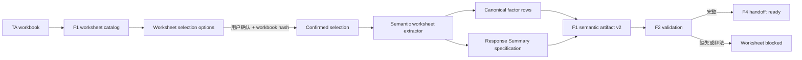

# F2 语义化 Artifact 与 F4 Handoff 设计

**日期：** 2026-08-06

## 目标

修复不同 TA Excel 模板版本发生整体列位移时，F1 已按表头识别因子表、但 F1 artifact 又按固定 `E:T` 回读，最终导致 F2 `invalid_contract` 的问题。

本设计同时完成以下能力边界：

1. 因子表和 Response Summary 均以 worksheet 内的语义表头或标签为锚点，不依赖固定行列。
2. F2 将 Response Summary 中的 `Lower Spec Limit`、`Upper Spec Limit` 和 `Target σ Level` 纳入 worksheet 级必填校验。
3. F2 为完整 worksheet 生成可直接供 F4 适配的结构化 handoff；不完整 worksheet 不得进入 F4。
4. F1/F2 提供 worksheet 候选 options，并要求用户显式确认后才开始分析，为未来 Skill 交互预留稳定协议。

## 已确认的产品决策

1. 采用统一语义 artifact，不保留“语义 fields + 固定列 actualFields”两套独立数据来源。
2. worksheet 必须由用户显式确认；未确认时只返回候选 options，不继续分析。
3. 某个已选 worksheet 缺少系统规格时，只阻断该 worksheet。其他完整 worksheet 可继续，workbook 汇总状态为 `partiallyBlocked`。
4. 三项系统规格必须来自 `Response Summary Table`，不得误取 `Suggested Spec` 中的同名字段。
5. 旧 artifact 可以被 loader 识别，但缺少系统规格时必须要求重新运行 F1，不得伪造默认规格。

## 问题复现与根因

### 测试样本

测试文件：`test/Test_TP_Step_202600805.xlsx`

复现命令：

```powershell
npm run workflow:f2:excel -- "test/Test_TP_Step_202600805.xlsx"
```

复现 run：`2026-08-06T02-21-40-600Z`

关键事实：

- F1 检测到 `Example_TA` 和 `TP_C_Step_TA`，现有 runner 自动选择后者。
- `TP_C_Step_TA` 的因子表表头位于 `G:V`，数据行为 14-20，共 7 个 factor。
- F1 语义扫描正确识别 `factorName` 位于 G、`partName` 位于 H、`nominalValue` 位于 L。
- 后置 `extractFactorActualFields` 仍固定从 `E:T` 读取。
- 第一行因此被错误投影为 `factorName = null`、`drawingNumber = "Fabric thickness"`、`upperTolerance = "Die cut"` 等无效类型。
- F2 loader 最终在 `f2ArtifactInputSchema.safeParse` 失败，并将所有 schema issue 折叠成 `Feature1-Report.json / invalid_contract`。

### 第二个布局陷阱

Rev G 的表头行中，C、D 列存在辅助文字 `+ Tolerance`，真正的 factor table `+ Tolerance` 位于 M 列。当前实现扫描整行所有匹配项，因此把 C、D、M 都映射为 `upperTolerance`，并将该字段标记为 `duplicate_mapping`。

这说明修复不能只是把固定范围从 `E:T` 改成 `G:V`。根因是：

1. 表头识别结果没有成为后续 artifact 的唯一数据来源。
2. 表头匹配没有限定在由 factor 主锚点确定的局部 header cluster 内。
3. Response Summary 尚未形成结构化 F1→F2 契约。

## 范围

### 包含

- 基于 worksheet used range 的语义表头扫描。
- 基于 `Factor Description (TA Loop)` 主锚点的 factor header cluster 解析。
- 从同一规范化 row 派生兼容字段和报告字段。
- 基于 section anchor 的 Response Summary 标签和值提取。
- F1 artifact v2 与 F2 内部规范化模型。
- F2 worksheet 级系统规格必填校验。
- F2 到 F4 的 ready/blocked handoff 边界。
- worksheet 两阶段显式确认协议。
- 精确到字段路径和 source cell 的错误证据。
- Rev G 真实 workbook 回归与多布局合成测试。

### 不包含

- 按 Excel revision 名称维护模板 profile。
- 修改或回写用户 Excel。
- 从 Markdown 反向解析结构化输入。
- OCR、图像理解或 tolerance path 内容识别。
- 在本阶段修改 F4 计算公式。
- 自动替用户选择 worksheet。

## 总体架构



核心原则是“一次识别，多处投影”：source column、source cell、actual value 和 display value 只能由语义 extractor 生成一次。F2 report、兼容 `actualFields` 和 F4 handoff 都消费该结果，不得重新按坐标读取 workbook。

## Worksheet 显式确认协议

### 阶段 1：返回候选 options

F1 catalog 完成后返回：

```ts
interface WorksheetSelectionPrompt {
  status: "selectionRequired";
  workbook: {
    fileName: string;
    contentHash: string;
  };
  options: Array<{
    selectionIndex: number;
    worksheetName: string;
    toleranceLoopDescription: string;
    worksheetKind: "analysis" | "example_or_template";
    source: WorksheetDiscoverySource;
  }>;
}
```

所有检测到的候选均列出。`Example_TA` 等确定性命名规则只用于标记 `worksheetKind`，不得静默删除候选，也不得代替用户确认。

### 阶段 2：提交确认

```ts
interface ConfirmedWorksheetSelection {
  workbookContentHash: string;
  selectedWorksheetNames: string[];
  confirmed: true;
}
```

规则：

- 未提供 confirmation 时，workflow 停在 `selectionRequired`。
- workbook hash 不一致时返回 `stale_worksheet_selection`。
- 空选择返回 `worksheet_selection_empty`，调用方可将其视为用户取消。
- 未知或重复 worksheet name 返回 `invalid_worksheet_selection`。
- `selectionIndex` 仅供展示，稳定身份使用 worksheet name 和 workbook hash。

CLI 和未来 Skill 使用同一协议。CLI 无选择参数时只输出 options；显式提供 worksheet names 和确认标志后才继续。Skill 只负责向用户展示 options 并回传确认，不承担 workbook 解析规则。

## 因子表语义识别

### 扫描边界

移除分析层的固定 `A:Z`、`1:260` 窗口。extractor 扫描 OOXML worksheet 的稀疏 used range，并继续受 archive size、XML part size、最大 worksheet 数和最大 cell 数等全局安全上限约束。

这保证位置可变，但不允许无界资源消耗。

### Header cluster

每个 header row 的候选解析步骤：

1. 识别 `Factor Description (TA Loop)` 的主锚点候选。
2. 以主锚点为 cluster 起点，在同一行按列递增匹配已知 factor 语义序列。
3. 使用 header alias 做文字归一，但不使用绝对列号。
4. 依据语义覆盖率、顺序一致性和必填 header 完整度选择唯一 cluster。
5. cluster 左侧的辅助标签不参与字段映射，因此 Rev G 的 C、D 列不会与 M 列冲突。
6. 若同一 cluster 内仍存在重复字段、顺序冲突或多个同分候选，返回 `ambiguous_factor_header`，不得按最近列猜测。

受控语义顺序为：

```text
factorName
partName
drawingNumber
dimCharacteristicId
partCategory
nominalValue
upperTolerance
lowerTolerance
longTermSafetyFactor
sigmaLevel
distribution
mean
tolerance
oneSigma
percentContributionToSigma
notes
```

该顺序描述字段关系，不描述 worksheet 坐标。允许整体列位移和整体行位移；可选列缺失时保留明确 unavailable evidence。

### Canonical factor row

每个字段统一保存：

```ts
interface SemanticCellValue {
  semanticField: string;
  status: "available" | "unavailable";
  sourceCell?: string;
  actualValue?: string | number;
  displayValue?: string;
  valueOrigin?: "text_literal" | "numeric_literal" | "formula_cached";
  reasonCode?: string;
}
```

`actualFields` 若因兼容现有 F2 report 而继续存在，只能从 canonical row 投影；固定 `FACTOR_COLUMNS E:T` 映射必须移除。

## Response Summary 提取

### Section 边界

先定位唯一 `Response Summary Table` section anchor，再将搜索范围限制到下一个 section anchor 之前。至少识别 `Suggested Spec` 作为终止边界。

这一步用于区分两组同名标签：

- Response Summary 中用户当前分析采用的规格。
- Suggested Spec 中计算或建议产生的另一组规格。

F2 和 F4 只能消费前者。

### 标签和值

在 section 内识别以下标签：

- `Lower Spec Limit`
- `Upper Spec Limit`
- `Target σ Level`

值取同一行标签右侧最近的非空有效单元格，不假设标签在 O 列、值在 P 列，也不假设行号为 37-39 或 54-56。

三项必填规格保留 `sourceCell`、actual value、display value 和解析状态。`3.0σ` 的实际数值规范化为 `3`。`Additional Mean Shift` 为空时按模板语义取 `0`，但保留 defaulted evidence。

`Additional Mean Shift` 不属于 Response Summary section：旧模板通常位于第 28 行，Rev G 位于第 45 行。extractor 在 factor table 结束行与 Response Summary anchor 之间按同样的标签和值规则查找；标签不存在或值为空时返回有 evidence 的默认 `0`。

### 系统规格模型

```ts
interface WorksheetSystemSpecification {
  lowerSpecLimit: EvidenceNumber;
  upperSpecLimit: EvidenceNumber;
  targetSigmaLevel: EvidenceNumber;
  additionalMeanShift: EvidenceNumber;
}
```

F4 所需派生值：

- `designNominal`：由完整 factor nominal 按 F4 既有语义聚合。
- `targetCpk = targetSigmaLevel / 3`。
- `additionalMeanShift`：使用 Response Summary 值，空白时为有证据的默认 `0`。

## F1 Artifact 与兼容策略

### v2 输出

新 F1 输出语义 artifact v2，worksheet 级包含：

- confirmed selection evidence；
- canonical factor tables；
- Response Summary system specification；
- tolerance path image evidence；
- workbook hash、worksheet、table、row 和 source cell 身份。

### v1 读取

F2 loader 同时识别 v1 和 v2，并规范化到内部模型：

- 合法 v1 factor rows 可继续展示。
- v1 缺少 Response Summary 时，worksheet 产生 `legacy_artifact_missing_system_specification`。
- 用户需要重新运行 F1 才能进入 F4；系统不得从旧 Markdown 猜测三项规格。
- schema 错误必须返回精确 issue path，不再全部折叠为根报告级 `invalid_contract`。

## F2 校验与状态

### 因子级必填

沿用现有 9 项因子必填字段和 tolerance path image 校验。字段值来自 canonical row。

### Worksheet 级必填

每个已确认 worksheet 必须满足：

1. `lowerSpecLimit` 为有限数值。
2. `upperSpecLimit` 为有限数值。
3. `targetSigmaLevel` 为有限正数。
4. `lowerSpecLimit < upperSpecLimit`。

缺失或非法时使用区分明确的 reason code，例如：

- `response_summary_label_missing`
- `response_summary_label_ambiguous`
- `response_summary_value_missing`
- `response_summary_value_invalid`
- `system_specification_range_invalid`

### 状态传播

- worksheet 因任一必填问题变为 `blocked`。
- 完整 worksheet 为 `completed`，并生成 ready handoff。
- 多 worksheet 混合时 workbook 为 `partiallyBlocked`。
- 所有 worksheet 阻断时 workbook 为 `blocked`。
- artifact 无法安全解析时才使用 `inputRejected`；用户字段缺失不是 contract rejection。

F2 JSON 和 Markdown 均展示三项规格、source cell、状态和修正提示。

## F4 Handoff

每个完整 worksheet 生成：

```ts
type F4Handoff =
  | {
      status: "ready";
      workbookContentHash: string;
      worksheetName: string;
      tableId: string;
      factors: CanonicalCalculationFactor[];
      systemSpecification: {
        designNominal: number;
        lowerSpecLimit: number;
        upperSpecLimit: number;
        targetSigmaLevel: number;
        targetCpk: number;
        additionalMeanShift: number;
      };
      evidence: F4InputEvidence;
    }
  | {
      status: "blocked";
      worksheetName: string;
      issues: F2ValidationIssue[];
    };
```

F4 adapter 只接受 `status: "ready"`。F2 不生成半完整 calculation request，也不允许 F4 对缺失规格填入猜测值。

## 错误处理

| 场景 | 结果 |
|---|---|
| 找不到 factor 主锚点 | worksheet `blocked`，`factor_header_missing` |
| factor cluster 不唯一 | worksheet `blocked`，`ambiguous_factor_header` |
| Response Summary section 不唯一 | worksheet `blocked`，`response_summary_section_ambiguous` |
| 误差来自用户未填规格 | worksheet `blocked`，不使用 `inputRejected` |
| v1 artifact 缺系统规格 | worksheet `blocked`，提示重新运行 F1 |
| selection workbook hash 过期 | workflow 停止，`stale_worksheet_selection` |
| artifact 类型或身份损坏 | `inputRejected`，返回精确 issue path |

错误不得包含整行 confidential 内容。允许返回 workbook hash、worksheet name、table ID、source row、source cell 和字段名。

## 测试设计

### Header resolver 单元测试

- 旧模板 factor table 位于 `E:T`。
- Rev G factor table 位于 `G:V`。
- factor table 整体移动到其他行列。
- 主锚点左侧存在多个辅助 `+ Tolerance` 标签。
- cluster 内真实重复字段返回 `ambiguous_factor_header`。
- 多个 factor table 候选可分别形成稳定 table ID。
- used range 超过 Z 列或 260 行时仍可识别，同时资源上限仍生效。

### Response Summary 单元测试

- 31-41 行布局。
- 48-58 行布局。
- section 整体行列位移。
- Suggested Spec 包含同名标签，但不会被读取。
- 三项标签分别缺失、重复、值为空和格式非法。
- `Target σ Level` actual/display 分别为 `3` / `3.0σ`。
- `LSL >= USL` 被阻断。

### 契约与 workflow 测试

- v2 artifact 正常进入 F2。
- v1 artifact 被规范化，并因缺系统规格产生 worksheet issue，而不是根报告 `invalid_contract`。
- schema issue 返回精确字段路径。
- 未确认 selection 时停止在 `selectionRequired`。
- stale hash、空选择、未知名称和重复名称均 fail closed。
- 一个 worksheet blocked、一个 ready 时整体为 `partiallyBlocked`，且只输出一个 ready handoff。

### 真实 workbook 回归

使用 `test/Test_TP_Step_202600805.xlsx` 验证：

- 选择 `TP_C_Step_TA`。
- factor count 为 7。
- 第一行应为 `Fabric thickness`、`Fabric`、nominal `-0.57`、upper tolerance `0.05`、lower tolerance `-0.05`。
- Response Summary 为 LSL `-0.15`、USL `0.05`、Target σ `3`。
- F2 不再返回 `inputRejected` 或布局造成的类型错位。
- 该 workbook 的 7 行 `Drawing Number` 真实为空。按现有 F2/F3 治理边界，Drawing Number 缺失不属于九项因子必填，不阻断 F2 或 F4 handoff；F2 继续产生 `adoReminderRequested` 非阻断治理事件。
- 在九项因子字段、tolerance path image 和三项系统规格均完整时，`TP_C_Step_TA` 应为 `ready` 并生成 F4 handoff。

另使用完整 confidential fixture 验证 ready F4 handoff，避免通过放宽 Drawing Number 规则让真实样本虚假通过。

## 验证命令

实施阶段按以下顺序验证：

```powershell
# focused unit and contract tests
npx vitest run --workspace vitest.workspace.ts packages/workbook-catalog/src/worksheet-analysis-assets.test.ts packages/workbook-catalog/src/required-field-check.test.ts scripts/f1-factor-actuals.test.mjs scripts/f2-artifact-loader.test.mjs

# real workbook regression
npm run workflow:f2:excel -- "test/Test_TP_Step_202600805.xlsx" --worksheets "TP_C_Step_TA" --confirm

# full repository verification
npm test
npm run check:repository
```

命令行参数名称可在实施计划中与现有 runner 风格对齐，但显式确认语义不得省略。

## 实施顺序建议

1. 先为 Rev G header cluster 和 Response Summary 编写失败测试。
2. 提取独立 semantic header resolver，修复 `+ Tolerance` 辅助标签冲突。
3. 让 canonical row 成为唯一数据来源，移除固定 `E:T` 回读。
4. 新增 Response Summary extractor 和 worksheet system specification。
5. 增加 artifact v2、v1 normalization 和精确 schema issue。
6. 扩展 F2 worksheet required check 与状态传播。
7. 增加 selectionRequired / confirmation 两阶段协议。
8. 生成并验证 F4 ready handoff。
9. 运行真实 workbook、完整 fixture 和全仓测试。

## 验收标准

1. 因子表和 Response Summary 的位置变化不会要求修改代码中的行列常量。
2. `fields`、`actualFields`、F2 report 和 F4 handoff 不再存在独立坐标读取路径。
3. Rev G 的 C/D 辅助 `+ Tolerance` 不会造成真正 M 列 `duplicate_mapping`。
4. LSL、USL、Target σ 缺少任一项时，仅阻断对应 worksheet。
5. Suggested Spec 的同名值不会进入 F2/F4。
6. 未经用户显式确认，不分析任何 worksheet。
7. 只有 F2 ready worksheet 可以生成 F4 handoff。
8. 真实测试 workbook 不再 `inputRejected`；Drawing Number 缺失继续作为非阻断治理事件，且不妨碍 ready F4 handoff。
9. focused tests、真实 workbook regression、`npm test` 和 repository check 全部通过。