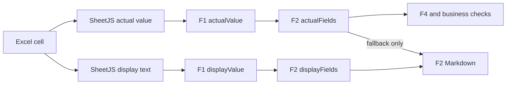

# F2 Excel 显示值一致性修复设计

## 背景

F1 已同时保存 worksheet 单元格的计算值与 Excel 显示文本，但 F2 Markdown 当前直接将 `actualValue` 转成字符串。该行为会将 IEEE-754 浮点尾数暴露给用户，例如将 Excel 中的 `0.178` 输出为 `0.17799999999999999`，并将 Excel 中的 `2.7%` 输出为底层比例 `0.026937809003607087`。

系统规格还有一个独立缺口：F1 的 Response Summary extractor 只读取 OOXML 原始值，没有使用 SheetJS 已解析的 cell display text。因此系统规格的 `displayValue` 本身可能已经包含浮点尾数。

## 目标

1. F2 Markdown 中的 worksheet 数值与 Excel 可见文本保持一致。
2. 系统规格、factor input、公式结果和百分比使用同一展示规则。
3. F2 JSON、F4 handoff 和所有业务判断继续使用原始 `actualValue`，不因展示格式而降低精度。
4. 已有 F1 artifacts 在缺少新增展示字段时仍可被 F2 接受。

## 非目标

- 不修改源 workbook。
- 不重新计算 Excel 公式。
- 不对 `actualValue` 做 rounding 或字符串化。
- 不改变必填字段、F0、F4 或 worksheet selection 规则。
- 不将显示格式解释为单位转换。

## 方案

### F1 系统规格显示文本

`run-f1-full-validation.mjs` 在获得 `worksheetSheet` 后，按系统规格 evidence 的 `sourceCell` 查找 SheetJS cell，并使用现有 `cellDisplayText` 取得 Excel 显示文本。只替换 available evidence 的 `displayValue`；`actualValue`、`sourceLabel`、`sourceCell` 和 `valueOrigin` 保持不变。默认的 Additional Mean Shift 没有 source cell 时继续使用现有 `displayValue`。

### F2 row 双值展示契约

F2 enhanced row 新增可选 `displayFields`。字段集合与 `actualFields` 对齐，但值为 F1 field evidence 中的 `displayValue`；unavailable 或不存在的字段为 `null`。该属性保持可选，以兼容已有 F2 report artifacts 和测试 fixtures。

`createF2UserReport` 从每个 F1 factor row 的 `fields` 投影 `displayFields`，同时原样保留 `actualFields`。所有缺失判断、能力评估和 F4 handoff 继续只读取 `actualFields`。

### Markdown 展示策略

F2 renderer 对 worksheet 表格中的字段按以下顺序选择文本：

1. 非空 `displayFields[field]`；
2. `actualFields[field]` 的精确 fallback；
3. `—`。

系统规格继续使用 evidence 的 `displayValue`。因此：

- `0.17799999999999999` 显示为 `0.178`；
- `1.1000000000000001` 显示为 `1.1`；
- `-0.10000000000000002` 可按 Excel 格式显示为 `-0.100`；
- `0.026937809003607087` 可按 Excel 格式显示为 `2.7%`。

Markdown escaping 和 F1 image links 保持现有行为。

## 数据流

## 兼容性与失败处理

- `displayFields` 为可选属性，旧 F1/F2 fixtures 不需要立即补齐。
- 某个 display value 缺失时只影响该单元格展示，renderer 回退到 actual value。
- 非 available evidence 不伪造显示文本。
- F1 artifact schema 仍校验 actual value 类型和有限性；显示文本不能使无效数值变为有效。

## 测试与验收

1. F1 测试证明系统规格保留 actual value，同时采用 Excel cell display text。
2. F2 contract 测试覆盖可选 `displayFields` 及严格字段集合。
3. F2 user report 测试证明 display fields 从 F1 evidence 投影，业务判断仍使用 actual fields。
4. F2 renderer 测试覆盖普通小数、负数、公式值和百分比显示，并验证 fallback。
5. 运行 focused tests、build、repository governance 和完整 test suite。
6. 重新分析 `Mauna_Loa_TP_Step_20260611.xlsx`，确认报告中不再出现已知浮点尾数，且 `1σ`、`% Cont. to σ` 与 F1/Excel display text 一致。

## 验收标准

- `Shim_TA_3-Sigma` Lower Spec Limit 显示为 `0.178`。
- `Study` Upper Spec Limit 显示为 `1.1`。
- factor 数值不显示 `-0.10000000000000002` 等 IEEE-754 尾数。
- `% Contribution to Sigma` 使用 Excel 百分比文本，例如 `2.7%`。
- 对应 JSON/F4 actual numeric values 与修复前完全一致。
- F1 图片引用、source labels、worksheet 状态和阻塞结果不发生变化。