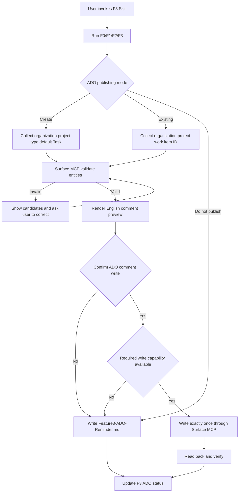

# F3 ADO 发布与本地提醒优化设计

## 目标

将 F3 从“仅生成本地治理报告”扩展为可由项目 Copilot Skill 驱动的完整验收流程：

1. 用户只需表达“使用 F3 分析报告”等自然语言意图。
2. 系统运行 F0/F1/F2/F3，并在启动 Surface MCP 前询问 ADO 发布方式。
3. 系统通过 Surface MCP 校验 organization、project、Work Item type 或已有 Work Item。
4. 写入 ADO comment 前必须展示确认框，只有用户明确确认后才允许写入。
5. 用户不发布到 ADO，或 Surface MCP 缺少所需写入能力时，在 F3 输出目录生成英文 Markdown 提醒文件。
6. ADO comment 和本地提醒内容全部使用英文，并包含固定的 11 列治理表格。

## 范围

### 包含

- 项目级 Copilot Skill。
- ADO 发布模式选择：新建、使用已有 Work Item、不发布。
- organization、project、Work Item type 和 Work Item ID 的 Surface MCP 查询校验。
- 新建 Work Item 的默认类型 `Task`。
- 写入前的独立确认门禁。
- 英文 ADO comment renderer。
- 英文本地 Markdown 回退文件。
- F3 artifact 中的 ADO 状态同步。
- 确定性单元测试和无网络集成测试。

### 不包含

- Azure DevOps MCP 回退。
- 浏览器自动化写入 ADO。
- 无正文或不可验证的空评论写入。
- 修改 Work Item Description。
- 修改 ADO 状态、负责人或其他字段。
- milestone 日期读取、定时器或后台提醒服务。
- F4 计算逻辑修改。

## 核心约束

1. F3 正式路径只依赖 Surface MCP。
2. 所有外部实体必须先查询后使用，不接受未经校验的 organization、project、type 或 Work Item ID。
3. Surface MCP capability 不足时 fail closed，不静默切换其他 MCP。
4. 写入操作只能发生在用户确认当前 comment preview 后。
5. 用户拒绝发布时仍必须保留本地英文提醒，TA 流程继续。
6. 日志与回执不得记录本地绝对路径、Authorization、token 或完整机密输入。
7. F3 core 继续保持无网络、无文件 IO、无时钟和确定性。

## 架构



### 项目 Copilot Skill

新增 `.github/skills/f3-analysis/SKILL.md`，负责多轮交互和 Surface MCP 工具编排。Skill 是唯一负责用户问题、实体回显和确认框的组件，不在纯 TypeScript core 内模拟交互。

Skill 触发语义包括：

- 使用 F3 分析报告
- 使用 F3 分析 Excel
- 使用 F3 治理 DIM ID
- use F3 to analyze this report
- use F3 to govern DIM IDs

### 确定性发布模型

新增独立 F3 ADO publishing model，输入为已经生成的 `DrawingGovernanceResultV2` 和经过 Surface MCP 校验的 ADO target，输出为：

- 英文 comment Markdown；
- 本地提醒 Markdown；
- 受控 preview metadata；
- ADO 状态 patch。

该模型不得调用 MCP 或写文件。

### Runner 与文件边界

F3 runner 继续生成 `Feature3-Report.json` 和 `Feature3-Report.md`。新增受控输出：

```text
f3/
├── Feature3-Report.json
├── Feature3-Report.md
└── Feature3-ADO-Reminder.md
```

`Feature3-ADO-Reminder.md` 在以下情况生成：

- 用户选择不发布；
- 用户在最终确认框选择取消；
- organization、project、type 或 existing Work Item 无法校验；
- Surface MCP 未配置、未授权或 capability 不足；
- ADO 写入失败或回读验证失败。

## 交互流程

### 第一道门禁：选择发布方式

在任何 Surface MCP 实体读取前，Skill 使用选择框询问：

1. `Create a new ADO work item`
2. `Use an existing ADO work item`
3. `Do not publish to ADO`

### 新建 Work Item

依次采集：

- organization；
- project；
- Work Item type，默认 `Task`；
- title，由 F3 根据 workbook 和 dimension description 生成英文默认值，允许用户修改。

Surface MCP 必须查询并确认：

- organization 存在；
- project 属于该 organization；
- Work Item type 在该 project 中可用。

如果输入不存在或疑似拼写错误，Skill 展示从 Surface MCP 返回的候选值并要求用户重新选择。未经校验不得创建。

### 已有 Work Item

依次采集：

- organization；
- project；
- Work Item ID。

Surface MCP 读取目标后回显：

- ID；
- title；
- type；
- state；
- assigned owner。

用户必须确认这是正确目标，才能进入 comment preview。

### 不发布

不启动 ADO 写操作，直接生成 `Feature3-ADO-Reminder.md`，并将 `ado.status` 记录为 `not_requested`。

## ADO 写入确认

在调用任何写工具前必须展示独立确认框，至少包含：

- organization；
- project；
- Work Item ID 和 title；
- factor count；
- governance required count；
- 完整英文 comment preview；
- 写入操作说明。

只有明确选择 `Confirm write` 才允许执行一次写入。选择取消时生成本地提醒，不执行写调用。

写入后必须通过 Surface MCP 回读评论并验证正文 hash 或完整内容一致。回读失败时状态为 `failed`，不得自动重试写操作。

## 英文评论契约

评论标题固定为：

```text
## F3 DIM ID / Drawing Governance Reminder
```

摘要必须包含：

- Workbook；
- Worksheet count；
- Factor count；
- Governance required count；
- Duplicate conflict count；
- Requested actions。

每一行 governance record 必须进入表格，列名和顺序固定为：

1. `Device Level Dim`
2. `Dimension Description`
3. `Part / Subsystem`
4. `Drawing Number`
5. `Dim ID`
6. `Factor Description`
7. `Nominal`
8. `Upper Tolerance (+)`
9. `Lower Tolerance (-)`
10. `σ Level`
11. `Governance issue`

`Governance issue` 将 quality signals 映射为英文：

- `drawing_number_missing` → `Drawing Number missing`
- `dim_id_missing` → `DIM ID missing`
- `dim_id_suspected_invalid` → `DIM ID suspected invalid`
- `dim_id_needs_confirmation` → `DIM ID needs confirmation`
- `duplicate_conflict` → `Duplicate Drawing Number and DIM ID conflict`

无 issue 时输出 `Complete`。

所有 ADO comment 和本地提醒正文必须通过英文-only 检查。标识符、文件名、Worksheet 名、零件名和用户源数据按原值保留，不因英文-only 检查而翻译或改写。

## Surface MCP 能力与降级

Skill 必须在操作前探测所需工具。

查询校验至少需要：

- organization listing；
- project listing；
- Work Item type query；
- Work Item read；
- Work Item comments read。

新建模式额外需要 Work Item create。

写入模式需要能携带完整 Markdown 正文的 comment create 或 update 工具。若 Surface MCP 注册 schema 不包含正文参数，则视为 capability 缺失：

- 不调用该工具；
- 不创建空评论；
- 生成本地英文提醒；
- `ado.status = blocked`；
- `reasonCode = surface_mcp_comment_body_unsupported`。

## 状态模型

沿用现有 ADO 状态：

- `not_requested`：用户选择不发布；
- `draft_ready`：英文 comment 已生成；
- `confirmation_required`：等待最终写入确认；
- `updated`：写入并回读验证成功；
- `blocked`：实体校验或 capability 阻塞；
- `failed`：已尝试写入但失败，或回读不一致。

推荐新增受控 reason codes：

- `organization_not_found`
- `project_not_found`
- `work_item_type_not_found`
- `work_item_not_found`
- `surface_mcp_capability_missing`
- `surface_mcp_comment_body_unsupported`
- `user_declined_write`
- `write_verification_failed`

## 测试策略

### Renderer

- 输出固定的 11 列和顺序。
- 每种 quality signal 映射为英文。
- Markdown 特殊字符正确转义。
- 不泄漏本地绝对路径或 Authorization。
- 模板固定文本不包含中文。

### Publishing model

- 新建模式默认 type 为 `Task`。
- existing target 保存受控引用。
- 不发布时生成同一份本地提醒正文。
- capability 缺失返回 `blocked` 和稳定 reason code。
- 未确认时不得生成 execute request。

### Skill

- 三种模式都有明确步骤。
- organization/project/type/ID 必须先查询校验。
- 最终写入前必须调用确认框。
- 取消和 capability 缺失必须走本地回退。
- 禁止 Azure DevOps MCP 和浏览器回退。

### 回归

- 现有 F3 core 分类和锚点行为不变。
- F2 loader 和 F4 handoff 不受影响。
- F3 JSON/Markdown 现有本地工作流继续通过。
- 完整 build、F3 专项测试和 repository check 通过。

## 验收标准

1. 用户说“使用 F3 分析报告”时，项目 Skill 可被发现并加载。
2. Skill 在 Surface MCP 前询问新建、已有或不发布。
3. 新建模式默认 Work Item type 为 `Task`。
4. 所有 ADO target 输入都通过 Surface MCP 查询校验，拼写错误不会直接进入写入。
5. 最终写入前存在独立确认框，取消不会调用写工具。
6. ADO comment 和本地提醒的固定模板文字全部为英文。
7. 表格严格包含指定的 11 列。
8. 用户不发布时在 F3 输出目录生成 `Feature3-ADO-Reminder.md`。
9. Surface MCP 无正文写入能力时生成本地提醒并返回稳定阻塞状态，不创建空评论。
10. 所有专项测试、build 和 repository check 通过。
