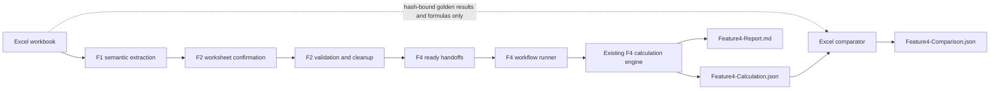

# F4 消费 F2 选定工作表并与 Excel 回归对比设计

**日期：** 2026-08-07

## 目标

在不改变现有 F4 公共 API 和计算语义的前提下，新增一条正式 workflow：

1. 只消费 F2 `Feature2-Report.json` 中的 ready F4 handoff。
2. 只计算用户在 F2 阶段确认的 worksheet，不扫描或计算其他 worksheet。
3. 调用现有 `excel-ta-v1` F4 计算引擎，为后续 F5 等模块输出结构化 JSON。
4. 同时生成 Markdown 报告，方便人工查看。
5. 可选使用原 Excel workbook 作为黄金回归和公式诊断来源；Excel 不得成为 F4 业务计算输入。

首个验收样本为 `Test_TP_Step_202600805.xlsx`，F2 已确认 worksheet 为 `TP_C_Step_TA`。

## 已具备能力

最新 `main` 已完成本功能的上游基础：

- F1 依据语义表头提取因子，不依赖固定 `E:T` 或 `G:V` 坐标。
- F1/F2 采用 worksheet 两阶段显式确认协议。
- F2 包含 worksheet 级系统规格、ready/blocked 状态及 source-cell 证据。
- F2 为每个 ready worksheet 生成 `f4Handoffs`。
- `createCalculationRequestFromF4Handoff` 可将单个 handoff 转换为现有 `CalculationRequest`。
- `createCalculation` 已实现 `excel-ta-v1` 计算及 trace records。
- Windows Excel COM 回归工具已支持 hash 校验、临时副本、白名单写入/读取和数值容差。

本设计不重复实现以上能力。

## 数据与信任边界



### 计算输入

F4 runner 只允许读取 F2 report 的 `f4Handoffs`。runner 不得：

- 打开 Excel 获取 factor 或 system specification 输入。
- 重新读取 F1 artifact 构造计算请求。
- 接受额外 worksheet 名称来扩大 F2 已确认范围。
- 自动选择 workbook 中未出现在 F2 report 的 worksheet。

F2 report 中的每个 handoff 已绑定 workbook content hash、worksheet name、table ID、factor source rows、系统规格和来源单元格。runner 必须再次通过 `f2UserReportSchema` 和 `f4HandoffReadySchema` 校验输入。

### Excel 回归输入

Excel 仅在显式提供 `--workbook` 时参与比较。比较器必须：

- 验证 workbook SHA-256 与 F2 report hash 相同。
- 复制到临时目录后通过 Excel COM 重算。
- 只访问 F2 handoff 指定的 worksheet。
- 只读取受控的结果单元格、显示文本和公式。
- 不把 Excel 中的 factor 或规格值传入计算引擎。
- 在结束时关闭 COM 对象并删除临时副本。

## F4 Workflow

新增命令：

```powershell
npm run workflow:f4 -- --f2-report <Feature2-Report.json> [--workbook <golden.xlsx>]
```

不增加 `--worksheet` 参数。F2 report 中的 handoff 集合就是用户确认且可计算的 worksheet 集合，F4 按 handoff 顺序逐个计算。

默认受控元数据：

- `projectReference`：由 workbook hash 派生的非敏感稳定引用。
- `runReference`：本次 F4 run ID。
- `criticality`：`none`，除非未来由上游受控 contract 提供。

runner 为每个 handoff 调用：

1. `createCalculationRequestFromF4Handoff`
2. `createCalculation`

任一 handoff 失败时，runner 不输出伪造结果。run 状态为 `failed`，错误只包含安全的 worksheet 引用和受控错误代码。

## 输出契约

每次运行创建独立目录：

```text
test/demo-output/f4-runs/<workbook>/<run-id>/
  Feature4-Calculation.json
  Feature4-Report.md
  Feature4-Comparison.json       # 仅提供 --workbook 时
  manifest.json
  validation/
```

### Feature4-Calculation.json

机器可读文件包含：

- contract/version 信息。
- F2 report 路径与 workbook hash。
- run ID 和生成时间。
- 按 F2 handoff 顺序排列的 worksheet calculation results。
- 每个 result 保留现有 `CalculationCompletedResult` 全部字段与 trace records。
- worksheet 数量和 completed/failed 汇总。

该文件是 F5 等后续模块的正式输入；Markdown 不得被反向解析为数据源。

### Feature4-Report.md

人工报告按 worksheet 展示：

- worksheet、table ID、factor 数量和推荐方法。
- system mean、WC、RSS Sigma。
- Cp/Cpk、Z、DPM、Yield 和能力状态。
- factor mean、half tolerance、sigma、贡献率。
- 若启用 Excel 回归，展示通过/失败摘要及差异链接。

### Feature4-Comparison.json

比较结果按 worksheet 和指标记录：

- metric name。
- F4 value。
- Excel recalculated value 与 display text。
- absolute difference、relative difference、tolerance、passed。
- Excel source cell 和 formula。
- 对应 F4 formula ID。

## Excel 指标映射

比较器使用受控语义标签定位模板输出，禁止仅针对样本硬编码绝对坐标。首批比较：

- factor mean、half tolerance、sigma、contribution。
- system mean。
- WC upper/lower。
- RSS Sigma。
- Cp、lower/upper Cpk、Cpk。
- lower/upper Z。
- lower/upper/total DPM。
- out-of-spec ratio、Yield。

同一语义标签不存在、重复或指向非公式结果时，该指标返回明确诊断，不允许猜测最近单元格。

数值判定：

```text
absoluteDifference <= tolerance * max(1, abs(f4Value), abs(excelValue))
```

默认 tolerance 为 `1e-12`。Excel 显示文本的四舍五入差异单独报告，不影响原始数值判定。

## 差异处理

workflow 不自动修改计算引擎。出现超限差异时：

1. 输出 F4 值、Excel 值、差异、结果单元格、Excel 公式和 F4 formula ID。
2. 判断是显示舍入、模板缓存、单位、公式语义还是 F4 实现问题。
3. 只有证据确认 F4 语义错误后，先增加可复现的失败回归测试。
4. 最小修改 `calculation-kernel`，并运行现有 F4 单元测试与 Excel 黄金回归。

这避免把 workbook 缓存错误或模板异常自动写入 F4 引擎。

## 错误处理

- F2 report 不符合契约：`invalid_contract`。
- report 没有 ready handoff：`prerequisite_not_ready`。
- handoff 与 report workbook hash 不一致：`evidence_mismatch`。
- Excel hash 不一致：`hash_mismatch`。
- worksheet 或输出标签不唯一：`excel_mapping_error`。
- Excel COM 不可用：计算 JSON/Markdown 仍可保留，comparison 标记 `excel_unavailable`。
- 任何错误不得输出 workbook 单元格原始非白名单内容。

## 测试与验收

1. runner 契约测试证明只消费 `f4Handoffs`，不接受额外 worksheet 选择。
2. 多 handoff 测试证明按 F2 顺序计算且 worksheet 之间隔离。
3. 无 handoff、hash 不一致和无效 report 均安全拒绝。
4. JSON 输出通过现有 calculation schema 校验，可被后续模块读取。
5. Markdown 包含所有受控摘要，不包含未授权 workbook 内容。
6. `TP_C_Step_TA` 从本次 F2 report 成功生成 F4 calculation 和 Markdown。
7. Excel 比较只读取该 worksheet 的受控结果与公式，原 workbook 前后 hash 不变。
8. 数值在 `1e-12` 容差内通过；超限差异产生完整公式诊断。
9. 原有 F1、F2、F4 公共 API 与测试保持通过。
10. 所有运行产物位于 Git 忽略的 `test/demo-output` 下。

## 非目标

- 不改变 F2 worksheet 交互协议。
- 不让 F4 直接读取 Excel 计算输入。
- 不修改原 workbook。
- 不自动修正 F4 公式。
- 不改变现有 `createCalculation`、What-if 或 interpretation API。
- 不在本阶段新增图形界面。