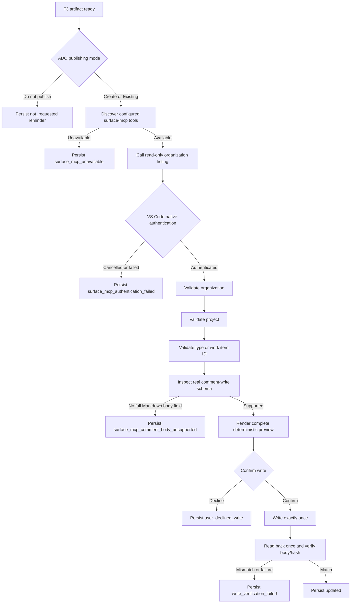

# F3 Surface MCP 自动连接与认证设计

## 目标

当用户运行 F3 并选择将治理结果发布到 ADO 时，F3 Skill 应按需连接项目配置的 `surface-mcp`，通过首次只读工具调用触发 VS Code 原生认证，并在用户完成认证后继续当前发布流程。

本设计解决以下问题：

1. 其他用户首次测试 F3 时无需预先手动启动 Surface MCP。
2. 未认证用户能够收到 VS Code 或系统浏览器提供的原生登录提示。
3. 连接、认证和 comment body capability 故障能够被准确区分。
4. 认证成功后仍保留实体验证、完整预览、最终确认、单次写入和回读验证门禁。

## 范围

### 包含

- F3 ADO 发布路径中的按需 Surface MCP 连接。
- 由只读 organization 查询触发的 VS Code 原生 OAuth 或等价宿主认证。
- 连接、认证、工具发现和 comment body schema 的分阶段检查。
- 认证取消、失败或服务不可用时的受控本地 fallback。
- 新 reason code、Skill 协议、writer 校验和自动化测试。
- 面向首次使用者的项目级配置与故障诊断说明。

### 不包含

- Skill 自行采集用户名、密码、PAT、token、cookie 或验证码。
- 在 `.vscode/mcp.json`、`.mcp.json`、命令行、日志或 artifact 中保存凭据。
- Azure DevOps MCP、REST、浏览器自动化或 shell HTTP 回退。
- 绕过 VS Code MCP trust、OAuth consent 或企业条件访问策略。
- 自动接受最终 ADO 写入确认。
- 修改 F1、F2、F3 本地治理计算语义。

## 核心原则

1. **按需连接：**只有用户在发布模式门禁中选择 `Create a new ADO work item` 或 `Use an existing ADO work item` 后才允许触发 Surface MCP。
2. **宿主认证：**Skill 只调用 Surface MCP 工具；认证 UI、token 获取和安全存储完全由 VS Code 与 Surface MCP 管理。
3. **只读引导：**首次连接/认证调用必须是 organization listing 或等价无副作用查询。
4. **同轮继续：**原生认证完成并返回只读结果后，Skill 在当前发布流程继续实体验证，不要求用户重跑 F1/F2/F3。
5. **失败关闭：**连接、认证、schema 或验证任一步失败都禁止写入 ADO，并生成本地 reminder。
6. **最小权限：**选择 `Do not publish to ADO` 时不得连接 Surface MCP，也不得触发认证。
7. **写入不变：**认证成功不等于授权写入；完整预览与独立 `Confirm write` 仍然是强制门禁。

## 架构与顺序



强制顺序为：

```text
publishing mode
→ tool discovery
→ read-only connection/authentication trigger
→ organization
→ project
→ type or work item ID
→ comment write schema
→ complete preview
→ final confirmation
→ one write
→ one readback verification
```

任何写工具不得出现在最终确认之前。任何 Surface MCP entity call 不得出现在发布模式选择之前。

## 自动连接与认证契约

### 项目配置

共享配置继续由 `.vscode/mcp.json` 提供：

```json
{
  "servers": {
    "surface-mcp": {
      "type": "http",
      "url": "https://surfacemcp.microsoft.com"
    }
  },
  "inputs": []
}
```

配置中不得加入静态 Authorization header。`.mcp.json` 可作为其他 MCP host 的兼容配置，但 VS Code F3 流程以 `.vscode/mcp.json` 为准。

### 工具发现

用户选择发布后，Skill 检查当前真实工具注册表，而不是仅检查配置文件存在。必须至少发现以下逻辑能力或可映射工具：

- organization listing；
- project listing；
- Work Item type query（create mode）；
- Work Item read；
- comments read；
- comment write/update。

如果 `surface-mcp` 配置存在但当前会话没有暴露任何 Surface MCP 工具，状态为 `surface_mcp_unavailable`，不得误报为 comment body schema 不支持。

### 认证触发

工具可发现后，Skill 立即调用 organization listing。该调用必须满足：

- 只读；
- 无 ADO mutation；
- 不携带由模型生成或用户输入的 credential；
- 允许 VS Code 打开原生 consent、账户选择或系统浏览器 OAuth；
- 等待工具调用返回后再继续。

用户必须直接在 VS Code、系统浏览器或企业认证界面输入秘密。Skill 不得通过 `vscode_askQuestions`、chat、terminal input relay 或 CLI 请求密码、token、验证码或 MFA 内容。

### 认证结果

- 调用成功并返回 organization 数据：视为当前 Surface MCP 会话已认证，可以进入 organization validation。
- 用户取消、拒绝 consent、登录失败、条件访问失败或 authentication-required 错误：记录 `surface_mcp_authentication_failed`。
- 服务无法启动、DNS/网络不可达、server/tool registration 丢失：记录 `surface_mcp_unavailable`。
- 不允许自动重试认证调用；用户修复环境后可从现有 F3 artifact 重新启动发布流程。

## Capability 与 schema gate

连接和认证成功后，Skill 必须检查真实 comment write/update 工具 schema。有效 schema 必须包含能够承载完整 Markdown 的字符串字段，例如 `body`、`content` 或语义等价字段。

以下情况记录 `surface_mcp_comment_body_unsupported`：

- 工具只允许创建空 comment；
- 工具只有 comment ID、work item ID 等定位字段，没有正文输入字段；
- 正文字段无法承载完整 Markdown；
- schema 无法确认正文是否会被完整写入。

该 reason code 只能用于真实 schema 缺口，不能用于服务器不可用或认证失败。

## 本地状态模型

新增受控 reason code：

| 场景 | status | reasonCode | workItemReference |
| --- | --- | --- | --- |
| 用户最初选择不发布 | `not_requested` | 无 | 无 |
| Surface MCP 不可发现、无法启动或不可达 | `blocked` | `surface_mcp_unavailable` | 无 |
| 原生认证取消或失败 | `blocked` | `surface_mcp_authentication_failed` | 无 |
| comment schema 不支持完整 Markdown | `blocked` | `surface_mcp_comment_body_unsupported` | 仅目标已验证时可选 |
| 用户拒绝最终写入 | `blocked` | `user_declined_write` | 仅目标已验证时可选 |
| 写入后回读不匹配或失败 | `failed` | `write_verification_failed` | 已验证目标 |
| 写入和回读验证成功 | `updated` | 无 | 已验证目标 |

连接或认证失败发生在 Work Item 验证之前，因此不得持久化 URL 或 work item reference。

## Skill 交互

### 发布模式门禁

继续使用独立的 Question call 1：

- `Create a new ADO work item`
- `Use an existing ADO work item`
- `Do not publish to ADO`

选择前不连接 Surface MCP。选择不发布后立即执行 `not_requested` fallback 并停止。

### 认证提示

不新增收集 credential 的问题框。VS Code 原生认证界面本身就是认证交互。

在调用只读工具前，Skill 可发送简短进度说明，告知用户：

- 正在连接 `surface-mcp`；
- 如果出现 VS Code 或浏览器登录页面，请在那里完成认证；
- 不要在 chat 中发送任何秘密。

### 最终写入门禁

Question call 2 保持独立且位于完整预览之后，唯一确认选项仍为：

- `Confirm write`

认证成功不得替代或隐式满足最终写入确认。

## 修改范围

### Skill 与协议

- `.github/skills/f3-analysis/SKILL.md`
  - 增加连接与认证阶段。
  - 明确只读 organization listing 是首个 Surface MCP 调用。
  - 规定等待原生认证返回和禁止采集秘密。
  - 分离 unavailable、authentication failed、body unsupported fallback。

- `.github/skills/f3-analysis/references/ado-publishing.md`
  - 增加完整状态顺序、错误分类和认证契约。
  - 更新 status/reason matrix。

### Writer 与 CLI

- `scripts/write-f3-ado-reminder.mjs`
  - 将 `surface_mcp_unavailable` 和 `surface_mcp_authentication_failed` 加入 controlled reason codes。

- `scripts/f3-cli-args.mjs`
  - 如果 reason code 在此处有独立枚举，同步新增值。

### 测试

- `scripts/f3-skill.test.mjs`
  - 验证连接/认证阶段位于 Question call 1 之后、entity validation 之前。
  - 验证首个连接调用是只读 organization listing。
  - 验证认证由 VS Code 原生界面处理，Skill 禁止请求秘密。
  - 验证三类 failure reason 互不混用。
  - 验证最终 Question call 2 与单次写入顺序不变。

- `scripts/write-f3-ado-reminder.test.mjs`
  - 验证两个新增 reason code 可持久化到 JSON/Markdown。
  - 验证连接/认证失败不能携带 work item reference。

- `scripts/f3-cli-args.test.mjs` 和 `scripts/f3-report.test.mjs`
  - 根据真实 contract 补充新增 reason code 的解析与渲染覆盖。

## 测试策略

### RED

先增加以下失败断言：

1. Skill 包含明确的 connection/authentication phase。
2. `surface_mcp_unavailable` 与 `surface_mcp_authentication_failed` 被 writer 接受。
3. 两种 pre-validation failure 均拒绝 work item reference。
4. `surface_mcp_comment_body_unsupported` 只在 schema gate 使用。
5. 发布模式选择之前不得出现任何 Surface MCP entity call。

### GREEN

以最小修改更新 Skill、reference 和 reason code 校验，不引入网络实现或 credential handling 代码。

### 回归

至少运行：

```powershell
npm exec -- vitest run --workspace vitest.workspace.ts scripts/f3-skill.test.mjs scripts/write-f3-ado-reminder.test.mjs scripts/f3-cli-args.test.mjs scripts/f3-report.test.mjs
npm run build -- --force
npm test
```

如果仓库没有单一 `npm test` 脚本，则运行 package.json 中现有的完整 Vitest workspace 命令。

## 验收标准

1. 新用户选择 ADO 发布后，F3 的首个 Surface MCP 调用会按需启动连接并触发 VS Code 原生认证。
2. 用户完成认证后，同一流程继续 organization、project 和目标验证。
3. 用户无需重跑 F1/F2/F3，现有 accepted F3 artifact 可直接重启发布流程。
4. 选择不发布时不会连接 Surface MCP，也不会出现认证提示。
5. Skill 不采集、记录或传递任何 credential。
6. 服务不可用、认证失败和 body schema 不支持分别产生准确 reason code。
7. 任何连接或认证失败都不会写入 ADO，也不会持久化未经验证的 work item ID。
8. 认证成功后仍必须展示完整 11 列英文 preview，并要求独立 `Confirm write`。
9. 写入只执行一次，随后只回读一次并验证完整正文或 hash。
10. 所有 F3 专项测试、build 和完整回归测试通过。

## 风险与限制

1. Skill 无法直接控制 VS Code OAuth UI；它只能通过真实 Surface MCP 工具调用触发宿主认证。
2. 如果 Surface MCP 服务没有声明 OAuth challenge，VS Code 无法凭 Skill 文本强制生成认证界面，此时应归类为服务不可用或认证失败，而不是绕过认证。
3. 企业 VPN、条件访问、tenant 权限和 Surface MCP 服务端 capability 不由本仓库控制。
4. MCP 工具名称可能变化，因此 Skill 以逻辑能力和真实 schema 为准，不硬编码未经验证的工具名。
5. 自动化测试只能验证 Skill 协议、顺序和本地 fallback；真实 OAuth UI 需要在启用 Surface MCP 的 VS Code 环境中执行人工验收。
