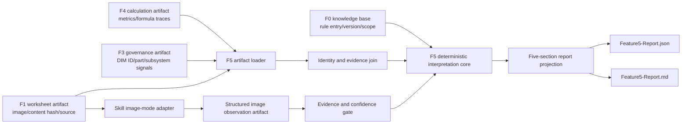

# F5 数据解读设计

**日期：** 2026-08-10  
**开发分支：** `user/xumax/F5_Initial`

## 目标

F5 消费 F0、F1、F3、F4 的受控输出，将每个已选择 TA worksheet 的计算结果、图像证据、DIM ID 治理信息和知识库规则合成为一致、可追溯的工程解读报告。F5 只陈述可验证事实、规则判断、工程关注信号和未排序备选项，不替代 ME 评审者作出工程决策。

F5 在现有 F5.1 确定性解读内核上产品化，不重写 F4 计算，不复制 F0 阈值，不把模型观察伪装为图纸事实。

## 已确认边界

1. F5 报告固定显示五个章节。
2. F5 实际生成前三个章节：公差链有效性、能力与规格对比、主要贡献因子。
3. 合理公差范围、设计优化与并列方案由 F6 负责；F5 对这两个章节只输出受控占位状态，不执行 What-if、反向求解、成本评估、排序或推荐。
4. 图片能力分阶段交付：先完成确定性多输入编排与证据门禁，再接入 image mode 观察适配器。
5. 用户可通过“使用F5分析报告”调用 skill。

## 非目标

- 不修改或回写源 Excel。
- 不重新计算 F4 指标。
- 不在 F5 内维护 Cpk、RSS sigma 或规格可行性阈值副本。
- 不进行图纸 OCR、3D variation analysis 或无证据的几何结论。
- 不实现 F6 的公差优化、方案量化、方案排序或推荐。
- 不因 F3 中缺失、可疑或冲突 DIM ID 阻塞已有 F4 数值解读。
- 不在 F5 skill 中隐式发布 ADO；F3 ADO 发布仍需用户单独明确调用和确认。

## 方案选择

采用“F5.1 确定性内核 + F5 artifact 编排与报告层 + 可选 image evidence adapter”的方案。

未采用以下方案：

- 直接扩展单个 F5.1 文件并一次接入全部能力：会把合同迁移、图片推理、报告和 skill 行为耦合在一起。
- 重写独立 F5 服务：会复制已通过测试的 F0 规则调用、F4 trace 验证和陈述分类逻辑。
- 让自由文本模型直接读取所有 artifact 并生成报告：无法稳定验证规则版本、来源范围和跨 artifact 一致性。

## 总体架构



### 组件职责

1. **F5 artifact loader**：读取并严格验证 F1、F3、F4 artifact；加载受控 F0 规则版本；按 workbook hash、worksheet 和 table 身份关联输入。
2. **F5 deterministic interpretation core**：复用 F5.1 的 FACT 投影、F0 规则评估和 F4 formula trace 校验；增加结构证据、治理信号和章节状态。
3. **Image evidence adapter**：由 F5 skill 使用 image mode 读取 F1 唯一图片 artifact，并生成结构化观察，不直接生成最终 RULE。
4. **Evidence gate**：依据图片 hash、worksheet、观察置信度、人工复核状态和必需字段决定生成 FACT/SIGNAL，或转为澄清卡片。
5. **Report projector**：将结构化结果确定性投影为五章节 JSON 与 Markdown，并保留证据链接。
6. **F5 skill**：识别用户入口、运行或复用上游 workflow、执行图片观察步骤、调用 F5 workflow、展示报告，不绕过任何前置门禁。

## 输入合同

F5 request 使用受控 artifact 引用，而不是复制整份上游 JSON：

```ts
{
  contractVersion: "v1";
  inputClassification: "confidential";
  f1ArtifactRoot: string;
  f3ArtifactRoot: string;
  f4ArtifactRoot: string;
  knowledgeBaseVersion: "interpretation-rules-v1";
  selectedWorksheetNames?: string[];
  imageObservationArtifact?: string;
}
```

### F0 输入

F0 当前没有独立 `workflow:f0`。F5 通过 `@ai-assist/knowledge-base` 加载明确版本的受控规则集，并在结果中记录：

- `entryId`
- `knowledgeBaseVersion`
- `effectiveVersion`
- `applicability`/覆盖范围
- `sourceAlias`
- `sheetName`
- `sourceRange`
- `sourceFileHash`
- `owner`、`confidence` 和变更摘要（若条目提供）

任何 `RULE` 或能力结论缺少必需知识库引用时不得输出为结论。

### F1 输入

F1 提供：

- workbook content hash 和 worksheet 身份；
- worksheet `imageAssets`、`tolerancePathImage` 或 composed snapshot；
- 图片相对路径、content hash 和来源工作表；
- 可用的 factor table/source cell 证据；
- 已解析的方向字段（若存在）。

F1 保持图片唯一物理所有权。F5 仅保存引用和观察，不复制图片。

### F3 输入

F3 提供：

- Drawing Number/Part Number 与 DIM ID 状态；
- part category、drawing 分组和精确源位置；
- `missing`、`suspected_invalid`、`duplicate_conflict` 等治理信号；
- F1 `imageReference` 的透传引用。

F3 治理状态用于证据完整性与结构性风险 `SIGNAL`，不改变 F4 数值，也不自动判定公差链无效。

### F4 输入

F4 必须是 `status: completed` 的 `excel-ta-v1` 结果，并提供：

- factors 的 mean、halfTolerance、sigma、contribution 和 source；
- system 的 design nominal、mean、worst-case 边界和 RSS sigma；
- capability 的规格限、目标 sigma、目标 Cpk、Cp/Cpk/Z/DPM/yield/status；
- recommendation method；
- 每个 F5 事实所需的唯一 formula trace 和受控 formula ID。

F5 继续 fail closed：trace 缺失、重复或 formula ID 不匹配时，不生成对应事实结论。

## 跨 Artifact 一致性

F5 loader 必须执行以下关联门禁：

1. F1、F3、F4 属于同一 workbook content hash。
2. worksheet 名称精确匹配，不做模糊映射。
3. F3/F4 worksheet 必须属于用户选择且在 F1 中存在。
4. F3 `imageReference.contentHash` 必须与 F1 对应图片 hash 相同。
5. F4 factor source 的 worksheet/table/row 必须能关联到同 worksheet 的受控源证据。
6. 同一 worksheet 的 artifact 版本或 hash 冲突时整页 `input_rejected`，其他一致 worksheet 可继续处理。
7. 选择集为空、重复或包含未知 worksheet 时整个请求 fail closed。

结果按 worksheet 隔离：一页证据不足不阻塞其他页，但被拒绝页不得生成部分工程结论。

## 陈述类型

### FACT

只表示可追溯的输入或计算结果：

- F4 公式输出及 formula trace；
- F3 治理状态计数与精确行引用；
- 已通过 image evidence gate 的可观察图像元素。

图像观察必须标记 `provenanceKind: image_observation`，不得声明为 CAD/图纸真值。

### RULE

表示 F0 阈值或适用性检查。每条 RULE 必须包含知识库条目、版本、覆盖范围、来源证据和相关 FACT 引用。F5 不硬编码新的工程阈值。

### SIGNAL

表示需要 ME 关注但尚未形成工程结论的事项，例如：

- 贡献集中或大公差贡献；
- 可观测的中段尺寸链放大；
- 跨子系统标记；
- 非几何变量；
- 过长尺寸链；
- F3 标识治理缺口；
- 图片观察低置信度或互相冲突。

每条 SIGNAL 必须声明 `requiresEngineeringReview: true`，并列出触发事实；没有事实时改为澄清卡片。

### OPTION

F5 只允许输出知识库已有的未排序改善方向或 F6 入口提示，必须使用 `rank: null`。不得包含 `recommended`、`preferred`、分数或预计收益。量化方案由 F6 生成。

## 五章节报告

### 1. 公差链有效性

按以下子项逐项显示状态：

- 公差链闭合；
- 基准链一致性；
- 装配基准面；
- 堆叠起点；
- 加减方向；
- 跨子系统；
- 非几何变量；
- 过长尺寸链。

每项状态只允许：

- `supported`：有完整受控证据，可显示 FACT/SIGNAL；
- `needs_review`：有观察但需要 ME 确认；
- `not_evaluated`：未运行 image adapter；
- `insufficient_evidence`：图片缺失、无法读取、低置信度或必需证据缺失；
- `not_applicable`：有明确适用性证据。

首个确定性交付阶段默认产生 `not_evaluated` 或 `insufficient_evidence` 澄清，不输出闭合/一致性断言。image adapter 接入后也不允许仅凭单张图片把 `needs_review` 自动提升为最终工程判定。

### 2. 能力与规格对比

展示 F4 的 RSS sigma、规格窗口、Cp、Cpk、目标 Cpk、达成/目标 sigma、DPM、yield 和状态。仅在 F4 方法处于 F0 规则覆盖范围且事实完整时生成 RULE。

“规格窗口可行”属于能力结论，必须引用 F0 条目和覆盖范围；T0 或知识库未覆盖时显示“可行性未知”，不得推断可行或不可行。

### 3. 主要贡献因子

按 F4 contribution 降序排列，稳定 tie-break 使用原 factor 顺序。每项展示 factor、零件/图纸/DIM ID、贡献度、公差、sigma 和源证据。

“原因”只允许使用可测量标签：

- `large_tolerance`：由已批准 F0 规则定义并引用对应阈值；
- `mid_chain_amplification`：仅在图片观察和尺寸链位置证据完整时输出 SIGNAL；
- `contribution_concentration`：复用 F0 现有贡献集中规则；
- `identifier_governance_gap`：来自 F3 明确状态。

缺少适用规则时仅排序和显示 FACT，不生成原因结论。

### 4. 合理公差范围

F5 固定显示章节状态 `delegated_to_f6`，说明当前未执行公差反求、能力库可制造性比较或范围建议。可展示进入 F6 所需证据清单，但不得生成数值范围。

### 5. 设计优化与并列方案

F5 固定显示章节状态 `delegated_to_f6`。允许显示未排序 OPTION 语义锚点和“运行 F6”入口，不得展示量化收益、成本、排名或推荐。

## Image Mode 证据协议

本地 `workflow:f5` 不隐式调用模型。F5 skill 负责使用 image mode 读取 F1 图片，并按严格 schema 写入临时受控 observation artifact，再将其路径传给 workflow。

每个 observation 至少包含：

- observation schema/version；
- workbook hash、worksheet、图片 relative path 和 content hash；
- 被观察范围；
- 结构化观察值；
- `confidence: high | medium | low`；
- 可见依据描述；
- `reviewStatus: unreviewed | confirmed | rejected`；
- 生成时间和 adapter version。

门禁规则：

- hash 或 worksheet 不匹配：拒绝 observation；
- 图片不可读或 observation 缺字段：生成澄清；
- `low`：只能生成澄清；
- `medium`：最多生成 `needs_review` SIGNAL；
- `high` 且未人工确认：仍只能生成 FACT/SIGNAL，不生成最终工程判定；
- `rejected`：不得进入报告结论；
- `confirmed`：保留确认者与确认时间，仍受知识库规则适用性约束。

## 澄清卡片与假设清单

澄清卡片必须包含：

- `clarificationId`
- `reasonCode`
- `section`
- `missingEvidence`
- `affectedConclusionIds`
- `blockingScope`
- `questionForReviewer`

推荐 reason code：

- `assembly_datum_face_missing`
- `stack_start_missing`
- `subsystem_classification_missing`
- `direction_evidence_missing`
- `image_not_available`
- `image_observation_low_confidence`
- `artifact_identity_mismatch`
- `knowledge_rule_not_applicable`
- `knowledge_facts_insufficient`
- `f6_not_run`

假设不得隐式应用。每条假设包含来源、影响章节、状态 `proposed | confirmed | rejected` 和 ME 确认信息。未确认假设只能帮助说明缺口，不能把 `insufficient_evidence` 转成结论。

## 输出合同

每次运行输出：

- `Feature5-Report.json`：完整机器可读合同；
- `Feature5-Report.md`：五章节人类评审报告；
- `Feature5-Run-Summary.json`：输入 artifact、worksheet 结果和文件 hash 摘要；
- 可选 `Feature5-Image-Observations.json`：skill 生成且通过校验的结构观察副本或引用清单。

完成结果以根 `featureId: "F5"` 和新 `interpretationVersion` 表示，不破坏旧 F5.1 `objective-interpretation-v1` 结果。旧 F5.1 API 保留为兼容内核；根 F5 使用独立 request/result schema 组合每 worksheet 结果。

输出不得包含 workbook bytes、图片 bytes、任意绝对路径、未受控自由文本规则或模型隐藏推理。

## Skill 入口

新增 `.github/skills/f5-analysis/SKILL.md`，frontmatter 必须包含：

- `name: f5-analysis`
- `user-invocable: true`
- 中文触发短语“使用F5分析报告”和带空格变体“使用 F5 分析报告”
- 英文触发语义，如 `use F5 analysis report`

支持两种入口：

1. **TA workbook**：运行 F1 -> F2；要求用户从 F2 ready worksheets 中选择；对同一选择运行本地 F3 和 F4；可选执行 image observation；最后运行 F5。
2. **已有 F5 artifact**：验证 `Feature5-Report.json` 后直接展示，不重跑上游或重复图片分析。

F5 直接消费 F1/F3/F4 与 F0；F2 仅作为从原 workbook 生成 F3/F4 时的必要上游门禁，不进入 F5 request。

Skill 必须使用仓库验证的命令白名单。新增命令为：

```text
npm run workflow:f5 -- <f1-output-dir> <f3-output-dir> <f4-output-dir>
```

如需选择 worksheet，使用重复的 `--worksheet <name>`。如需 image observation，使用 `--image-observations <artifact-path>`。不得发明其他 workflow 命令。

## 错误处理与隐私

- 非 confidential 输入：`policy_denied`。
- artifact 缺失、schema 无效、hash/worksheet 不一致：对应 worksheet `input_rejected`；选择合同无效时整个请求拒绝。
- F4 非 completed 或 formula trace 不完整：不生成数值解释。
- F0 规则不适用或事实不足：保留 FACT，生成澄清，不生成 RULE/SIGNAL/OPTION。
- image adapter 不可用：确定性章节继续，结构章节显示 `not_evaluated`。
- 报告只使用相对 artifact 链接，不泄漏 Windows 绝对路径。
- typed error 不序列化项目机密值、workbook 单元格内容或图片观察全文。

## 治理迁移

1. 保留 F5.1 `available` 和现有合同，作为根 F5 的内部兼容能力。
2. 根 F5 仅在确定性 workflow、五章节报告、澄清门禁和 skill contract 验收通过后从 `unavailable` 调整为阶段性 `available`。
3. Image adapter 未完成时，Feature Register 明确声明结构性图片判断为 `not_evaluated`，不能把根 F5 描述为完整图纸判断能力。
4. Image adapter 完成并通过匿名 fixture 与人工评审回归后，再扩展根 F5 的验收证据，不覆盖旧版本历史。

## 分阶段交付

### 阶段 1：确定性 F5 产品化

- 定义根 F5 多输入、章节、澄清和输出合同。
- 实现 F1/F3/F4 artifact loader 与一致性关联。
- 复用 F5.1/F0 规则内核生成能力和贡献解释。
- 生成五章节 JSON/Markdown，结构章节 fail closed，F6 章节受控占位。
- 提供 `workflow:f5`、CLI 接口和 full-flow 测试。

### 阶段 2：F5 skill

- 新增可调用 skill 和中文触发短语。
- 支持 workbook 与已有 F5 artifact 两种入口。
- 固定 worksheet 选择、上游命令顺序、错误停止条件和无 ADO 隐式发布规则。
- 增加 skill contract 测试。

### 阶段 3：Image evidence adapter

- 定义 image observation schema 与 adapter version。
- 由 skill 使用 image mode 读取 F1 图片并写入观察 artifact。
- 实现 hash、置信度、人工复核和结论等级门禁。
- 使用匿名图片 fixture 验证闭合、基准、起点、方向等范围只产生允许等级的陈述。

### 阶段 4：治理与文档收口

- 更新功能拆分、架构、端到端流程和 Feature Register。
- 明确 F5/F6 边界、阶段能力和证据限制。
- 执行完整 build、lint、repository check、F5 聚焦测试与端到端回归。

## 测试与验收

1. Contracts 测试拒绝未知字段、绝对路径、错误分类、缺失知识库证据和非法 statement/section 组合。
2. Loader 测试覆盖 F1/F3/F4 hash、worksheet、image reference、factor source 和选择集一致性。
3. F5 内核测试覆盖 RSS matched、规则事实不足、方法不适用、F3 治理缺口和贡献排序。
4. Report 测试确认固定五章节、F6 两个受控占位、相对证据链接和无绝对路径。
5. Clarification 测试确认缺失装配基准面、堆叠起点、子系统或方向时只阻塞依赖结论。
6. Image adapter 测试覆盖缺图、hash 不符、low/medium/high confidence、unreviewed/confirmed/rejected。
7. Skill 测试锁定“使用F5分析报告”触发描述、命令白名单、worksheet 选择和既有 artifact 快速路径。
8. Full-flow 测试从匿名 F1/F3/F4 fixtures 生成一致 JSON/Markdown，并验证多 worksheet 隔离。
9. 回归测试确认 F5.1、F0、F3、F4 现有合同与测试不回退。
10. 最终验证运行 `npm run build -- --force`、F5 聚焦 Vitest、`npm run lint`、`npm run check:repository` 和 `git diff --check`。

## 验收结论

F5 Initial 完成时，用户能够通过“使用F5分析报告”启动受控流程，并得到按 worksheet 隔离、包含五个固定章节的 F5 报告。所有能力与规格 RULE 均可追溯到 F0 条目、版本和覆盖范围；所有数值 FACT 均可追溯到 F4 formula trace；F3 治理与 F1 图片证据不会被提升为无依据工程结论；缺失信息通过澄清卡片和显式假设呈现；F6 专属章节不会在 F5 中越界计算。