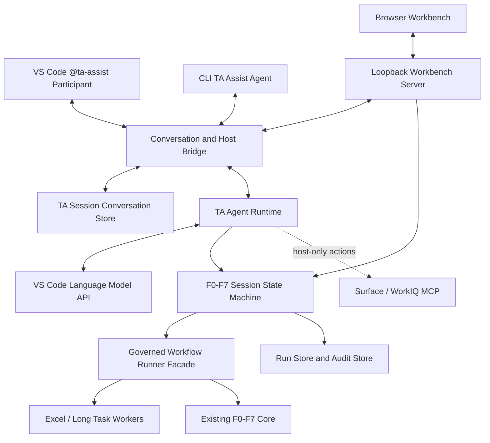
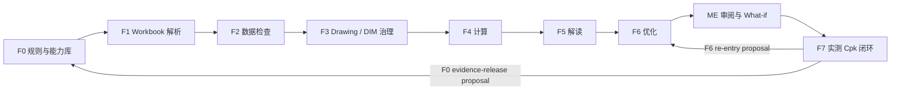

# F8 用户交互工作台设计

**日期：** 2026-08-24
**开发分支：** `user/xumax/F8-user-interact`

## 目标

F8 提供本地优先的 TA Assist 工作台，将当前由 VS Code Skill 和 CLI 承担的 F0-F7 交互迁移到浏览器界面。用户通过同一个 TA Assist Agent 从 VS Code Chat 或 CLI 启动、恢复和查询分析，在工作台完成 workbook 上传、两次 worksheet 选择、输入检查、DIM ID 治理、ADO 决定、计算、解读、优化、工程审阅、临时公差试算和实测 Cpk 闭环。

工作台不是对现有命令行输出的图形包装。F8 新增结构化 session 状态机和共享 runner 边界，使 Web、CLI 和 VS Code Chat Participant 使用同一份受治理状态、对话、决定和 artifact 引用，不解析 stdout、Markdown 或 terminal 屏幕内容来控制流程。

## 已确认决策

1. F8 使用本地浏览器工作台，服务仅监听 loopback。
2. VS Code Chat 与 CLI 使用同一个 TA Assist Agent 语义入口；用户不需要手工执行 workflow 命令。
3. 新增 VS Code Extension 和 `@ta-assist` Chat Participant，承载 VS Code Language Model API、Surface MCP 和工作台 bridge。
4. 网页、CLI 和 VS Code 共享 TA Assist 自有 session 历史；不读取或复制 TA Assist 之外的 GitHub Copilot Chat 历史。
5. F0-F7 全流程均属于最终产品范围，一个阶段也不能省略。
6. F7 由 Ralf 并行开发。F8 第一版保留 F7 流程位置、页面空状态和版本化集成合同，但不执行实测闭环，也不生成模拟工程结果；F7 placeholder 不阻断 F0-F6 + F8 工作台 MVP 发布。
7. 第一版 UI 保持简单，只验证核心主路径，不先建设复杂多项目平台。
8. 源 workbook 永远只读，不覆盖，也不导出修改副本。
9. 用户可在工作台编辑一个临时 `WHAT_IF` Draft，观察 nominal 和公差变化对 Cp/Cpk 的影响。
10. Draft 不自动改变 baseline、F5 结论或 F6 正式方案；只有独立确认后才能提交为 F6 候选。

## 非目标

- 不同步其他 Copilot participant 或普通 Copilot 对话的历史。
- 不使用未公开 VS Code API 向原生 Chat 面板主动插入网页消息。
- 不在第一版实现远程部署、多用户、权限系统或云端存储。
- 不直接从浏览器调用 ADO REST、Azure DevOps MCP 或任意 HTTP fallback。
- 不在浏览器复制 F4 公式或自行计算 Cp/Cpk。
- 不修改、覆盖或回写源 workbook。
- 不在第一版实现多 Scenario A/B/C 管理、Monte Carlo 动画或复杂三维图形。
- 不让自由文本绕过 worksheet、ADO、Context、Targets、Scenario 或 F7 的明确确认。

## 方案选择

采用“本地工作台 + 结构化 session 状态机 + 共享 governed runners + VS Code Chat bridge”。

未采用以下方案：

- **Web 包装 CLI**：stdout 不是稳定协议，无法可靠暂停、恢复、并发确认或定位错误。
- **纯 VS Code Webview**：普通 ME 接入门槛较高，文件、表格和长流程空间不足。
- **网页直接访问 Copilot 或 ADO**：会绕过 VS Code 用户授权、模型选择、MCP 能力和安全边界。

## 总体架构



## 组件边界

### `apps/vscode-extension`

VS Code Extension 负责：

- 注册 `@ta-assist` Chat Participant、slash commands 和 participant detection。
- 接收 VS Code `ChatRequest` 和该 participant 在当前 Chat 中可见的 `ChatContext.history`。
- 使用用户当前选择的 `request.model`，不固定某个模型 ID。
- 将 TA session 的网页/CLI 历史作为补充上下文传给 participant。
- 以进度、Markdown、引用和 command button 流式返回结果。
- 启动或聚焦本地工作台。
- 通过受控 `SurfaceMcpDrawingGovernanceClient` adapter 执行只能在 VS Code 宿主完成的 F3 Surface MCP 和认证流程；WorkIQ 不属于 F3 fallback。
- 将宿主动作结果写回 TA session。

Extension 不负责 F0-F7 计算，不保存第二份业务状态，也不直接解析报告 Markdown。

### `packages/conversation`

Conversation Store 是 TA Assist 历史的唯一事实源，负责：

- 顺序化保存 Web、VS Code、CLI、system 和 tool turn。
- 绑定 `sessionId`、stage、artifact 和 decision reference。
- 提供增量读取和 last-seen cursor。
- 保存结构化 content parts，而非界面专用 HTML。
- 默认不长期保存未经清洗的模型输入、模型内部信息或凭据。

### `packages/agent-runtime`

Agent Runtime 负责：

- 识别分析、状态、证据、导航、Scenario、ADO 和 F7 等意图。
- 从 session snapshot、对话历史和 artifact 摘要组装模型上下文。
- 只暴露当前状态允许的工具。
- 将模型建议转换为待用户点击的 action，不把自然语言当作治理确认。
- 在无可用 VS Code language model 时返回确定性状态和导航能力。

### `packages/workbench`

Workbench package 负责：

- F0-F7 session 状态机。
- command allowlist 和 revision 并发控制。
- pending confirmation、stage attempt 和恢复。
- UI action queue 投影。
- Scenario Draft 生命周期。
- artifact ID 到受控相对路径的映射。
- 受控事件和安全 terminal 摘要。

### Host Bridge

Host Bridge 使用有租约的结构化动作，而不是依赖轮询文字状态：

```ts
interface HostActionRequest {
  readonly actionId: string;
  readonly sessionId: string;
  readonly expectedRevision: number;
  readonly kind: "surface_validate" | "surface_write" | "model_request";
  readonly expiresAt: string;
  readonly confirmationHash?: string;
  readonly expectedTargetVersion?: string;
}

interface HostActionClaim {
  readonly actionId: string;
  readonly hostInstanceId: string;
  readonly leaseId: string;
  readonly leaseExpiresAt: string;
}

interface HostActionResult {
  readonly actionId: string;
  readonly leaseId: string;
  readonly status: "completed" | "blocked" | "failed";
  readonly resultHash: string;
  readonly payload: unknown;
}
```

一个 action 同时只能被一个 Extension instance claim。ADO 的“选择发布方式”和“Confirm write”是两个独立 session 状态；Extension 崩溃、lease 过期或结果丢失时不得自动重写。

### `packages/workflow-runners`

Runner Facade 把现有脚本能力提升为可导入的结构化 API：

```ts
interface GovernedStageRunner<Request, Result> {
  run(request: Request, context: RunContext): Promise<Result>;
}
```

`RunContext` 至少包含 `attemptId`、cancellation、managed output root 和 typed event sink。迁移边界如下：

| Facade | 当前来源 | 关键语义 |
|---|---|---|
| `validateF0Capabilities` | knowledge-base APIs | 验证三个受控版本；不创建 `workflow:f0` |
| `runF1F2Selection` | F2 Excel selection-only handshake | 返回 F1 options 和 workbook hash，不创建完整 F2 |
| `runF1F2Confirmed` | `runF2ExcelWorkflow` | 绑定第一次选择并发布 F1/F2 artifacts |
| `runF3Analysis` | F3 local runner | 仅本地治理，不执行 ADO |
| `runF4Calculation` | F4 runner | 可计算额外 F2-ready worksheet，但 extras 不进入 downstream scope |
| `runF4WhatIfCalculation` | F4 calculation kernel | 只产生 `WHAT_IF` 结果，不发布 baseline |
| `runF5Interpretation` | F5 runner | 使用已确认 downstream scope 和可选 v2 image evidence |
| `runF6Optimization` | F6 runner | 只接受现有受控 inputs 和独立确认 decisions |
| `validateExistingF6` | F6 existing-artifact validator | 只呈现通过 manifest/hash 验证的结果 |
| `runF7Feedback` | F7 owner 发布的 runner | 仅在正式合同登记后接入 |

ADO 单独通过 Host Bridge 的 `prepare/executeAdoAction` 完成，不属于 F3 local runner。

现有 CLI 与 F8 都调用这些 runner。现有 scripts 逐步变为薄 wrapper。Excel 和长任务可以继续在子进程执行，但必须使用结构化 JSON/NDJSON 协议。

### `apps/workbench-server`

Server 只监听 `127.0.0.1`，负责：

- session、upload、command、event 和 artifact endpoint。
- 随机访问 token、Origin 校验和 CSP。
- SSE 增量推送 snapshot、conversation 和 stage event。
- 把长任务提交给 worker，不阻塞 HTTP request 主线程。
- 拒绝浏览器提供任意输出目录或本地读取路径。

### `apps/workbench-web`

Web 只持有 `sessionId`、`revision`、当前 snapshot 和未提交表单。它不读取 filesystem，不计算工程指标，不调用 ADO，也不把 Markdown 当控制协议。

## 对话与历史同步

### 公开 API 能力边界

VS Code Chat Participant 能访问当前 Chat 中曾调用该 participant 的 request/response history，但不能访问全部 GitHub Copilot Chat 历史。公开 API 也不允许 extension 在任意时刻向现有原生 Chat 主动插入一条网页消息。

因此同步定义为：

> Web、CLI 和 VS Code `@ta-assist` 共享同一 TA session 的消息、决定、阶段、artifact 引用和上下文；不复制 TA Assist 之外的 Copilot 对话，也不承诺三个宿主的原生消息列表逐条完全相同。

### 对话合同

```ts
interface ConversationTurn {
  readonly turnId: string;
  readonly sessionId: string;
  readonly sequence: number;
  readonly source: "web" | "vscode" | "cli" | "system";
  readonly role: "user" | "assistant" | "tool";
  readonly content: readonly ConversationContentPart[];
  readonly createdAt: string;
  readonly relatedStage?: "F0" | "F1" | "F2" | "F3" | "F4" | "F5" | "F6" | "F7";
  readonly relatedArtifactIds: readonly string[];
  readonly decisionReference?: string;
}
```

同步行为：

- Web 提问后，消息立即写入 Conversation Store，并通过 SSE 推送到其他工作台页面。
- VS Code participant 处理当前 request 时先分配 TA `turnId`，使用 `commandId` 幂等写入 Store；其 response 也由 participant 在流式返回时写入 Store。
- `ChatContext.history` 只作为当前模型请求的临时上下文，不导入或持久化为 TA history，因为 native turn 没有可用于可靠去重的稳定 ID。
- CLI Agent 使用相同 session 和 Conversation Store。
- VS Code Extension 显示网页未读消息数量，并可打开对应工作台 session。
- Web 和 CLI 读取 TA Store 增量；所有写入使用 `turnId`、`commandId` 和 `sequence` 去重，不依赖时间戳猜测顺序。

## 统一用户入口

产品名称统一为 **TA Assist Agent**。

VS Code 推荐入口：

```text
@ta-assist /analyze
@ta-assist /resume
@ta-assist /workbench
```

同时支持 participant detection，例如：

```text
请帮我分析这份 TA 报告
继续上次的 TA 分析
打开 TA Assist 工作台
```

CLI 使用同一个 Agent 语义入口，不要求最终用户手工执行 `npm run workflow:*`。开发命令可以保留，但不属于产品主路径。

## F0-F7 完整流程



### F0

上传后首先验证受控 knowledge base `v1`、internal tolerance guidance `internal-v1` 和 interpretation rules `interpretation-rules-v1`。F0 是全程依赖，不是可跳过页面。第一版只显示这三个版本、availability 和 validation gaps；更完整的证据覆盖展示需要后续正式 coverage DTO。

### F1

生成 workbook inventory、worksheet options、Loop 图片和 factor 证据。第一次 worksheet 选择绑定 workbook hash 和 option-set hash。

### F2

完成输入完整性和 capability/distribution 检查，投影 ready/blocked worksheet。Blocked 项保留在行动队列，不进入下游计算。

### F3

第二次 worksheet 选择只包含 F2 ready 且 F1 图片身份有效的 worksheet。F3 展示 Drawing Number、DIM ID、重复、可疑和 conflict。`governance_required` 生成待办但不阻断 F4-F6。

ADO 保持 `选择方式 -> Surface 验证 -> 完整 preview -> 独立确认 -> 写一次 -> 回读一次 -> hash 验证`。浏览器不能使用 REST 或替代认证渠道。

### F4

对已确认 scope 使用现有 F4 内核计算 WC、RSS、Cp、CpkL、CpkU、Cpk、yield、DPM、margin 和 contribution。浏览器不复制公式。

### F5

生成 FACT、RULE、SIGNAL、OPTION、assumption 和 clarification。可选图片评估继续覆盖五个受控 scope。行动队列优先展示需要 ME 处理的事项。

### F6

显示 baseline、内置 OP1/OP2/OP3 和 caller-authorized targets。所有方案经 F4 重算，不把 Highest Impact 自动表述为工程推荐或 Highest ROI。

### F7

F8 不自行定义 F7 的业务阈值、measured schema 或 F0 更新语义，只消费 F7 owner 发布并在 feature registry 登记的版本化 request/preview/result schema。F7 identity 至少绑定 workbook hash、worksheet、table ID、source row、drawing revision、Drawing Number 和 DIM ID；F3 identity 缺失、冲突或不唯一时拒绝应用实测数据。

F7 输出只能创建两个不可变 proposal：

- `F6 re-entry proposal`：由用户确认后创建新的 child analysis revision，不覆盖已封存 F6 run。
- `F0 evidence-release proposal`：交给独立 F0 发布流程审核；F7/F8 不直接修改只读 F0 snapshot。

F8 只消费版本化 F7 runner：

```ts
interface F7Runner {
  validateImport(request: F7ImportRequest): Promise<F7ImportPreview>;
  applyMeasuredCapability(request: F7ConfirmedImport): Promise<F7FeedbackResult>;
}
```

在真实 F7 runner 发布前，F8 使用合同 fixture 测试页面、状态和 handoff 边界。产品运行时固定显示 `feature_not_available / in_development`，禁止调用 mock runner 生成用户可见的预测/实测结果。真实 F7 runner 由 F7 component owner 发布、登记并通过合同测试后，再单独启用。

## 用户流程与状态映射

用户界面只显示四个业务阶段，技术阶段在审计轨道可见：

1. 上传文件。
2. 选择范围。
3. 补充信息与治理。
4. 分析、审阅与闭环。

核心 session 状态为：

```text
created
workbook_required
workbook_validating
f0_validating
f0_validated
initial_scope_required
f1_f2_running
downstream_scope_required
f3_running
ado_decision_required
ado_action_pending
f4_running
image_decision_required
f5_running
analysis_context_decision_required
optimization_targets_decision_required
f6_running
review_required
f7_import_required
f7_preview_required
f7_running
feedback_review_required
completed
failed
cancelled
```

每次 command 包含：

```ts
interface F8SessionCommand {
  readonly sessionId: string;
  readonly commandId: string;
  readonly expectedRevision: number;
  readonly command: F8CommandKind;
  readonly payload: unknown;
}
```

`expectedRevision` 提供 CAS 并发保护，`commandId` 提供“命令已接受但响应丢失”场景的幂等。每个运行阶段生成 `attemptId`，worker 结果只有匹配当前 active attempt 时才能提交；晚到结果被记录并丢弃。每个状态只接受显式 allowlist command。

ADO 只在 F3 返回 `governance_required` 时进入；F3 completed 直接进入 F4。受治理顺序固定为：

```text
F0 validation
→ F1/F2 selection and confirmed run
→ downstream selection
→ F3
→ optional ADO
→ F4
→ optional image decision
→ F5
→ Analysis Context decision
→ Optimization Targets decision
→ F6
→ review/What-if
→ F7
```

What-if Draft 是 worksheet-scoped 子资源，不是阻断整个 session 的顶层状态。

## 最终 V1 页面

第一版只建设必要页面：

1. **上传与 Worksheet 选择**：上传 workbook、第一次选表、F1/F2 状态、第二次 ready 选表。
2. **补充与治理**：F3 列表和可选 ADO 决定；F5 完成后再独立收集 Analysis Context 和 Optimization Targets。
3. **分析进度与行动队列**：F0-F7 ledger、阶段进度、blocked 和 review tasks。
4. **Worksheet 审阅与公差试算**：worksheet 队列、只读证据、结论/行动和一个 Draft。
5. **F7 实测闭环**：导入、preview、预测/实测差异和 F0/F6 handoff。

视觉延续已确认的精密测量台方向，但第一版不投入复杂动画或高度定制图表。

## 交互式公差试算

### 治理边界

- Baseline 只读。
- 每个 worksheet 第一版只有一个临时 Draft。
- Draft 标记为 `WHAT_IF`。
- 不修改、覆盖或导出 workbook。
- Draft 不改变 F5/F6 正式结论。
- 第一版只有可表达为现有 `f6-optimization-targets-v1` 的 tolerance Draft 可以申请晋级；晋级时重新显示完整 Targets preview，并执行独立 `Confirm optimization targets`。
- nominal 和 additional mean shift 只允许 What-if，不得晋级当前 F6。完整晋级必须等待 F6 owner 发布 `f6-scenario-input-v1`、runner flag、decision ledger 和 manifest/hash 验证合同。

### 第一版可编辑字段

- factor nominal/mean scenario value
- upper tolerance
- lower tolerance
- additional mean shift

LSL、USL、Target Cpk、Target sigma、factor identity、Drawing Number、DIM ID、source row 和 Loop sign 默认锁定。

Nominal 只有在受控 signed factor mapping 存在时才影响系统 Mean：

$$
\mu_{system} = \sum_{i=1}^{n} s_i\mu_i + \Delta\mu,\quad s_i \in \{-1,+1\}
$$

若方向证据不足，Draft 可以保存 nominal，但不得发布新的 Mean、Cpk 或 Margin，并显示 `DIRECTION_EVIDENCE_REQUIRED`。

### 计算与显示

浏览器先做格式校验，再把 patch 交给 Server 和 F4 What-if runner。建议 250 ms debounce，Enter 立即计算；旧 revision 返回值必须丢弃。

右侧至少对比：

- Mean
- RSS 1σ
- Cp
- CpkL
- CpkU
- Cpk
- Statistical minimum margin
- Worst-case minimum margin

始终标记为 predictive model，不称为实测量产能力。贡献变化不称为物理根因。

### Draft 生命周期

```text
draft
validating
calculated
calculation_failed
saved
promotion_pending
promoted_to_f6_targets
superseded
deleted
```

提交 F6 Targets 前展示 factor 级 tolerance diff、Baseline/Scenario 指标和 F4 calculation reference，并要求独立确认。F6 重新执行现有身份、目标、scenario 和 F4 验证，不信任 UI 显示值。

## 工作台 API

第一版 API：

```text
POST /api/sessions
GET  /api/sessions/:sessionId
POST /api/sessions/:sessionId/files
POST /api/sessions/:sessionId/commands
GET  /api/sessions/:sessionId/events
GET  /api/sessions/:sessionId/conversation
POST /api/sessions/:sessionId/conversation
POST /api/host-actions/:actionId/claim
POST /api/host-actions/:actionId/result
GET  /api/artifacts/:artifactId
```

上传 request 必须声明 `kind`：`workbook`、`analysis_context`、`optimization_targets` 或 `f7_measured_import`。每种 kind 有独立 schema、大小/分类限制、identity binding 和不可变 artifact ID。Context、Targets 和 F7 preview 各自持久化 decision outcome。浏览器不得提交任意本地路径或 output root。Artifact 下载只接受服务器生成的 opaque ID。

## 数据持久化与恢复

新增独立、可恢复的 `SessionStore`，使用原子 snapshot 和 append-only command/event log 保存可变 session。现有 RunStore/AuditStore 保持不可变边界：每个 stage attempt 创建独立 RunStore，完成后封存 AuditStore，再把 run reference、manifest hash 和 terminal result 写回 SessionStore。

SessionStore 保存：

- 原子 session snapshot 和 revision。
- pending confirmation。
- stage attempt 和 terminal state。
- conversation cursor。
- artifact ID 映射。
- Scenario Draft。
- host bridge pending action。

浏览器刷新通过受保护 session cookie 恢复最近 snapshot，不重复运行已完成阶段。Workbook 变化创建新的 input revision，并使旧选择和下游 artifacts 失效，不覆盖旧证据。F7 回到 F6/F0 时创建 child revision，不重开或修改已封存 run。

默认保存：状态、hash、identity、决定、sanitized summary、artifact reference、Scenario diff 和 calculation reference。

默认不保存：凭据、PAT、MFA、ADO 完整 URL、其他 Copilot 历史、模型内部信息、未清洗异常对象和完整 terminal 输出。

## 错误处理

Runner Facade 把普通 Error 和 script reason code 归一化为现有 `TypedError`；未知异常只能成为清洗后的 `internal_error`。UI 投影全部九个 code：

| Code | UI 行为 | Retry |
|---|---|---|
| `validation_error` | 高亮文件、字段或选择 | 修正后重试 |
| `policy_denied` | 显示治理规则和允许动作 | 不可绕过 |
| `evidence_mismatch` | 显示身份/hash/manifest 不匹配 | 不可重试，需重新生成证据 |
| `prerequisite_not_ready` | 显示未完成的前置阶段 | 前置完成后继续 |
| `calculation_not_possible` | 显示缺失的计算证据 | 修正输入后重试 |
| `feature_not_available` | 显示未登记或不可用能力 | 能力发布后继续 |
| `dependency_error` | 显示 Excel、Extension、MCP 或模型依赖 | 依赖恢复后重试 |
| `transient_error` | 保留状态并显示有限重试 | 允许 |
| `internal_error` | 显示安全错误 ID 和恢复动作 | 不自动重试 |

Identity、hash、schema、manifest 和 policy 失败不得降级成 transient error。

试算输入无效时保留上一次有效结果并标记 Draft 有未计算修改。F4 What-if 失败不丢失 Draft，不生成 scenario artifact。

## 安全要求

- Server 只监听 `127.0.0.1`。
- 浏览器认证使用 HttpOnly、SameSite session cookie 和独立 CSRF token；token 不进入 URL、localStorage 或日志。
- CLI/Extension 使用有 scope 的 Bearer/IPC credential，不要求浏览器 Origin；credential 只允许对应 session 和 host action scope。
- 浏览器请求严格校验 Origin、Host 和 CSRF；拒绝 CORS，并防止 DNS rebinding。
- 设置严格 CSP、`X-Content-Type-Options`、frame 限制和 `Cache-Control: no-store`。
- 上传目录、文件名、artifact ID 和输出路径全部由服务器控制。
- 验证文件大小、扩展名、OOXML resource limit、symlink 和 linked ancestor。
- Artifact 下载校验 session authorization，使用 MIME allowlist 和 `Content-Disposition: attachment`。
- 不提供通用 shell、HTTP proxy 或任意文件读取 endpoint。
- Extension 只信任明确列出的工作台 command ID。
- ADO 只通过现有 Surface MCP 协议，绝不使用 REST/browser/shell HTTP fallback。
- 任何高成本、写入或不可逆操作都需要独立用户确认。

## Terminal 镜像

Terminal 只显示安全事件摘要，不是控制源：

```text
[F8] Session created
[F0] Controlled versions validated
[F1/F2] Worksheet discovery completed
[F8] Waiting for initial worksheet selection
[F3] Governance required: 28 items
[F4] Calculation completed: 5 worksheets
[F5] Review tasks generated: 13
[F6] Optimization completed
[F7] Measured capability import requires confirmation
```

Terminal 不输出原始 factor 全表、ADO URL、token、对话原文、未清洗异常或机密绝对路径，也不接收推进 session 的交互输入。

## 测试策略

### Contracts

- session command/snapshot discriminated unions
- revision conflict、commandId 幂等和 attemptId CAS
- conversation turn 和 cursor
- host bridge request/claim/lease/result
- Scenario Draft 和 immutable promotion artifact
- F7 import/preview/result handoff

### State Machine

- F0-F7 顺序与现有 W0-W10 一致
- 两次 worksheet 选择不可合并
- ADO、Context、Targets、Scenario 和 F7 独立确认
- 每个状态的 allowlist/reject list
- 刷新恢复、取消、失败和 retry
- stale revision、重复 command 和多标签页 race

### Runner Facade

- CLI、Web 和 Extension 使用同一结构化 runner
- 不解析 stdout 或 Markdown 控制流程
- 现有 identity/hash/schema/manifest gates 不回退
- F4 baseline 和 What-if 使用同一内核
- F7 contract fixture 与预留 runner contract 一致，产品运行时不得执行 mock runner

### Conversation Bridge

- Web、VS Code、CLI turn 排序和幂等写入
- VS Code participant history 只作临时模型上下文，不导入 Store
- 网页未读 cursor
- 模型不可用时的确定性 fallback
- 自然语言不能绕过确认

### Server Security

- loopback bind、browser cookie/CSRF、host credential、Origin、Host 和 DNS rebinding
- path traversal、symlink、非法 artifact ID
- upload limit 和 ZIP bomb
- 并发 command 和 revision race
- 无任意 shell/file/HTTP endpoint

### UI

- 上传与两次选表
- blocked worksheet 不进入下游
- F3/ADO/Context/Targets
- F0-F7 ledger 和行动队列
- worksheet 三栏证据定位
- 一个 Draft 的编辑、Undo、Reset、Save 和 F4 重算
- F7 import、preview、delta 和 handoff
- 刷新恢复、错误、空状态、键盘和可访问性

### 端到端

使用匿名 fixture 验证：

```text
@ta-assist /analyze
→ 打开工作台
→ 上传 workbook
→ F0 验证
→ 两次 worksheet 选择
→ F3 local-only ADO
→ F4/F5/F6
→ worksheet 证据审阅
→ 修改一个 Draft tolerance
→ 查看 Cp/Cpk 变化并 Reset
→ 查看最终报告
→ 导入 measured Cpk fixture
→ F7 预测/实测比较
→ 生成 F6 re-entry / F0 evidence-release proposals
```

真实模型和真实 ADO 写入不进入普通自动化测试。F7 placeholder 验收只验证 `feature_not_available / in_development`、合同边界和未来 handoff，不验证实测工程结果。

## 分阶段交付

Phase 1-3 是不可发布的内部里程碑。Phase 4 完成 F0-F6 工作台和单 Draft What-if 后可作为 F8 MVP release gate；Phase 5 在真实 F7 runner 发布后单独启用完整闭环。

### Phase 1：Extension、Conversation 与 Session 骨架

- VS Code Chat Participant 和统一 Agent 入口。
- Conversation Store、loopback server、token 和 session revision。
- 简单 Web 对话、上传页面和刷新恢复。

### Phase 2：F0-F3 交互迁移

- F0 validation。
- 两次 worksheet 选择和 F1/F2 artifacts。
- F3 governance、local-only ADO 和 host bridge 接口。

### Phase 3：F4-F6 与工程审阅

- F4 calculation、F5 action queue、F6 optimization。
- 三栏 worksheet 审阅、证据定位和报告入口。

### Phase 4：单 Draft What-if

- nominal、upper/lower tolerance 和 mean shift 的 F4 What-if。
- Undo、Reset 和 Save。
- 仅 tolerance Draft 可转成现有 `f6-optimization-targets-v1` 并重新独立确认；nominal/mean shift 不晋级当前 F6。

### Phase 5：F7 真实闭环（后续启用）

- measured capability import、preview 和 confirmation。
- predictive/measured delta。
- 不可变 F6 re-entry 和 F0 evidence-release proposals。
- 在 F7 component owner 发布并登记真实 runner 后接入；启用前保持明确 placeholder 状态。

## 验收标准

1. VS Code 和 CLI 的 TA Assist Agent 能创建或恢复同一个本地工作台 session。
2. Web、VS Code `@ta-assist` 和 CLI 共享 TA session 历史、决定、阶段和 artifact 上下文。
3. F0-F7 均有真实状态、输入、输出和验证门，不遗漏任何 Feature。
4. 两次 worksheet 选择、ADO、Context、Targets、Scenario 和 F7 确认保持独立。
5. 页面刷新后恢复 session，已完成阶段不重复执行。
6. 用户能在只读 baseline 上创建一个 Draft，调整 nominal/公差并通过 F4 看到 Cp/Cpk 变化。
7. Draft 不修改 workbook；只有 tolerance Draft 可经现有 Targets preview 和独立确认进入 F6，nominal/mean shift 不得晋级当前 F6。
8. 结论可定位到源行、单元格、图片、公式和 F0 rule。
9. ADO 继续满足 Surface-only、写一次、回读一次和 hash 验证。
10. F7 第一版明确显示 `feature_not_available / in_development`，保留导入、preview、result 和 proposal 合同位置，但不执行或伪造结果；后续真实 runner 启用时形成不可变 F6 re-entry / F0 evidence-release proposals，不直接修改已封存 F6 或只读 F0。
11. 浏览器不解析 stdout、Markdown 或 terminal 文本控制流程。
12. Security、contracts、state machine、runner、conversation、UI 和 E2E 测试全部通过。