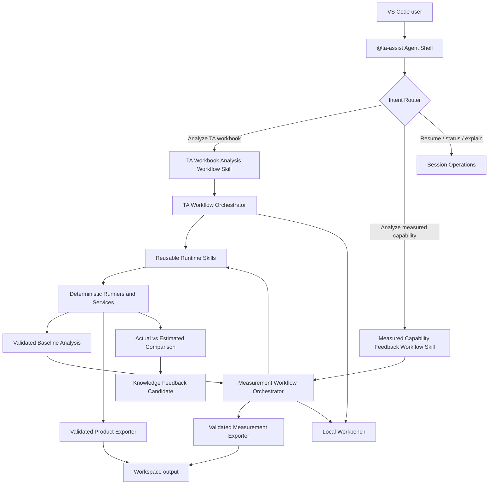

# TA Assist Beta Agent 组合架构设计

**日期：** 2026-09-01  
**状态：** 待用户审阅  
**Beta 主入口：** VS Code Extension + `@ta-assist`  
**架构模式：** Agent 外壳 + Skills 编排 + 确定性 runners  
**用户界面语言：** 英文；自然语言入口同时支持中文和英文

## 1. 背景与目标

当前项目已经具备完整 TA 工作簿分析的确定性执行链、本地 Workbench、VS Code Chat Participant、受治理 ADO 联动，以及独立的实测能力分析原型。现有工程使用 `F0` 至 `F7` 作为功能开发、契约和问题定位标识，但这些编号不是用户业务语言，不应出现在 Beta 的正常用户体验中。

Beta 将项目整理为一个统一的 TA Assist Agent，并向用户提供两个独立业务流程：

1. **TA Workbook Analysis**：完成 TA 工作簿的准备、输入验证、图纸尺寸治理、公差计算、工程解读、优化评估和最终报告生成。
2. **Measured Capability Feedback (Beta)**：关联一份已经完成的 TA 分析，接收原始测量样本，计算实测能力，与预测基线比较，并生成知识反馈候选。

本设计不重写已经验证的工程算法，不替换现有 artifact contracts，不改变 ADO 安全协议，也不在 Beta 前进行全仓库目录迁移。重点是建立清晰的产品入口、业务流程边界、用户语言投影和可审计的用户 output 发布层。

## 2. 已批准决策

1. Beta 以 VS Code Extension 的 `@ta-assist` Chat Participant 为唯一正式入口。
2. 用户通过自然语言启动流程；TA 分析的标准表达为 `@ta-assist 请帮我分析 <文件> 的 TA`。
3. 内部继续保留 `F0-F7`、现有 schema ID、artifact kind、runner 名、审计字段和历史文件名。
4. 正常用户界面、Agent 回复、操作按钮、错误信息、进度、ADO 用户内容和 output 文件名不得显示裸 `F0-F7` 编号。
5. TA 工作簿分析保留完整现有交互和工程执行链，不能通过产品改名弱化或绕过治理门。
6. 实测能力闭环是独立 Skill 和独立 workflow session，不作为 TA 工作簿分析的自动后续步骤。
7. 实测能力闭环必须关联一份已完成且已验证的 TA baseline，主要输入为原始测量样本。
8. Beta 中实测分析只生成 knowledge feedback candidate，不自动更新知识库，不自动执行证据等级升级。
9. 成功验证的分析结果发布到 workspace 根目录下的 `output/`，按流程、工作簿和运行时间分层，禁止覆盖历史运行。
10. 内部受治理输出和用户交付 output 是两个不同边界；用户导出失败不得触发工程分析重跑。

## 3. 不可回归业务不变量

### 3.1 Worksheet 用户联动

TA Workbook Analysis 必须原样保留两次独立 worksheet 确认：

1. 第一次确认固定工作簿解析和输入检查范围，并绑定当前 workbook content hash。
2. 第二次确认只展示输入检查后可进入下游工程分析的 worksheets，并固定图纸治理、计算、解读和优化的精确范围。

以下情况必须继续 fail closed：

- 用户取消确认或提交空选择。
- workbook content hash 在确认后发生变化。
- worksheet 名称重复、缺失、越界或不属于已验证候选集合。
- 第二次选择包含 blocked worksheet。
- 下游 runner 得到的 worksheet 集合与已确认集合不一致。

产品界面可以合并内部进度显示，但不能合并、跳过或自动替用户完成这两次确认。Beta 的正式 `@ta-assist` 路径必须由用户分别提交第一次和第二次 worksheet 确认。现有 `auto_confirm_initial_scope` 仅允许用于测试夹具或明确排除在 Beta 用户流程之外的内部入口；由自动确认产生的 session 不得作为用户 output 的来源。

### 3.2 ADO 联动

图纸尺寸治理中的 ADO 联动必须继续使用现有受治理协议：

```text
选择发布方式
  -> Surface MCP 校验目标
  -> 展示完整预览
  -> 独立最终确认
  -> 一次写入
  -> 一次 readback
  -> 验证内容与目标
```

必须保留以下边界：

- ADO 发布可选，不能自动或隐式触发。
- Surface MCP capability 不可用、用户拒绝、目标无效或 readback 失败时，继续生成现有本地治理清单。
- ADO 结果不改变 worksheet scope、计算输入或已经验证的图纸治理分析结果。
- 不新增 REST、浏览器网络、shell HTTP 或其他写入 fallback。
- 用户可见标题使用完整业务名称，例如 `TA Drawing Traceability Review`，不得显示内部 Feature 编号。
- session 必须持久化 publishing mode、validated target identity、preview hash、final confirmation、write receipt 和 readback verification；恢复时不得重放已经完成的写入。
- 写请求发出后、receipt 持久化前发生中断时，session 进入 `write_outcome_unknown`，不得直接重试写入。恢复流程只允许先通过相同 Surface MCP read channel，按 target identity 和已持久化 preview marker/hash 执行 reconciliation：若确认写入已经存在，则补记 receipt/readback verification；若无法确定，则保持 blocked 并要求人工处理；只有确认目标中不存在该写入后，用户才可以显式创建一个新的写请求。
- ADO Skill 的 execute-write phase 不可重试；write 成功后的 readback/reconciliation 是只读操作，可以在相同 target 和 preview identity 上安全重试。两者必须使用分阶段 metadata，不能由一个笼统的 `retryable` 值表达。

### 3.3 最终总结报告

最终总结报告继续由当前确定性证据链和 final report projection 生成。以下内容保持不变：

- workbook identity、content hash 和 worksheet scope。
- ready 与 blocked worksheet 的位置和原因。
- Drawing Number、DIM ID 和治理状态。
- WC、RSS、Mean、Cp/Cpk、Yield、DPM、贡献率及公式追溯。
- FACT、RULE、SIGNAL、OPTION、assumption、clarification 和 engineering review gate。
- 优化 option、feasibility、impact、ROI evidence gate 和 disposition。
- `PASS`、`CONDITIONAL_PASS`、`INCOMPLETE`、`FAIL` 四态业务语义。

LLM 不得重新计算、改写或总结出另一套工程结论。用户报告和内部报告必须来自同一个结构化 projection。产品 renderer 只允许替换标题、章节显示名、来源显示名和用户文件名；数值、判断、worksheet 顺序、证据状态和 traceability 不得变化。

### 3.4 Output 发布

只有完成 schema、identity、association、containment、manifest 和 hash 验证的已提交工件可以进入用户 output。不能从 staging、失败目录、历史猜测目录或未验证 Markdown 复制结果。

执行状态、业务判定和导出状态相互独立：

- execution completed、业务判定为任一有效四态且导出成功：显示报告和 output 路径。
- execution completed 但导出失败：显示 `Analysis completed; report export needs attention`，允许从相同已验证 artifacts 重试导出。
- 导出重试不能重跑工程计算、重新发布 ADO 或改变 session 决策。
- runner、schema、identity 或 lineage 失败属于 execution failure，不得生成看似成功的用户报告目录。
- 业务 `FAIL` 是有效工程结论，不是 execution failure；必须生成最终总结报告并进入用户 output。

## 4. 目标架构



### 4.1 Agent 外壳

Agent 外壳负责：

- 中英文自然语言意图识别。
- 工作区文件名、绝对路径和无路径上传入口的确定性解析。
- 创建、绑定、恢复和查询 workflow session。
- 在两个用户级 Skills 之间路由。
- 打开 Workbench 并解释当前状态、阻塞原因和下一步操作。

Agent 外壳不得：

- 直接解析 Excel 或测量样本。
- 自行计算 WC、RSS、Cp/Cpk 或模拟结果。
- 绕过状态机执行 runner。
- 自动确认 worksheet、ADO 写入、图片证据、Analysis Context 或 Optimization Targets。
- 自动更新知识库。

### 4.2 用户级 Skills

Beta 只向用户暴露两个 Workflow Skills：

| 用户显示名称 | 内部稳定 ID | 职责 |
| --- | --- | --- |
| TA Workbook Analysis | `ta-workbook-analysis-v1` | 启动完整 TA 工作簿 workflow；不直接实现任何工程计算 |
| Measured Capability Feedback (Beta) | `measured-capability-feedback-v1` | 启动独立实测能力 workflow；不作为 TA workflow 的末尾步骤 |

Workflow Skill 是 Agent 可以调用的业务入口，不等于一个长时间运行的原子 Runtime Skill。它创建或恢复 workflow session，由 Workflow Orchestrator 按固定状态机调用内部 Runtime Skills，并把需要用户参与的 decision checkpoint 返回给 Agent 和 Workbench。

图纸治理、图片证据评估、Optimization Targets 和 ADO publishing 保留为内部 Runtime Skill 或 policy module，不作为普通用户需要理解和选择的独立功能。

### 4.3 Workflow Orchestrator

Workflow Orchestrator 是唯一允许串联 Runtime Skills 的组件，负责：

- 固定 Skill 顺序、条件分支和 worksheet scope 传递。
- 创建持久化 workflow/session identity。
- 保存 worksheet、ADO、image、Analysis Context 和 Optimization Targets decisions。
- 在人工确认点暂停，在相同 revision 和 lineage 上恢复。
- 为每次 Skill invocation 分配 idempotency key、attempt 和受控 artifact references。
- 验证前一 Skill 的结果满足下一 Skill 的输入 contract。
- 区分 execution status、business disposition 和 export status。
- 执行失败恢复，但不重放已经验证的外部写入。

Agent 不得自行选择 Runtime Skill、改变顺序、构造未声明分支或把上一次对话中的自由文本直接作为 Skill 输入。所有调用必须来自当前 workflow state 和已验证 decision record。

### 4.4 可复用 Runtime Skills

TA Workbook Analysis 的内部能力按以下 Runtime Skills 划分：

| 内部开发映射 | Runtime Skill ID | 核心职责 | 副作用与重试语义 |
| --- | --- | --- | --- |
| F0 | `knowledge-and-rules-validation-v1` | 验证受控知识、制程指导和解读规则版本 | 只读；idempotent；可重试 |
| F1 discovery | `workbook-scope-discovery-v1` | 扫描工作簿并生成 worksheet 候选和 workbook identity | 只读 source workbook；按 workbook hash 幂等 |
| F1 confirmed | `workbook-analysis-assets-v1` | 消费第一次已确认范围，生成解析和图片证据 | 只读 source workbook；按 workbook hash 与 selection hash 幂等 |
| F2 | `analysis-input-validation-v1` | 检查必填字段、能力指导、distribution 和 identifier quality | 只读；按 F1 artifact hash 幂等 |
| F3 local | `dimension-traceability-review-v1` | 生成 Drawing Number、DIM ID 治理结果和本地清单 | 本地 artifact；幂等；可重试 |
| F3 external | `ado-governance-publication-v1` | 仅消费已确认 preview 执行一次 Surface MCP 写入和 readback | execute-write 不可重试；readback/reconciliation 可重试；receipt-bound |
| F4 | `tolerance-performance-calculation-v1` | 执行 WC/RSS、Mean、Cp/Cpk、Yield 和 DPM 计算 | 纯确定性；idempotent；可重试 |
| F5 | `engineering-interpretation-v1` | 基于受控证据生成 FACT、RULE、SIGNAL、OPTION 和 clarification | artifact-only；按输入 hashes 幂等 |
| F6 | `improvement-evaluation-v1` | 生成受治理优化 options、feasibility、impact 和 ROI 状态 | artifact-only；按确认 targets 幂等 |
| F6 report | `engineering-summary-report-v1` | 从同一 validated projection 生成最终总结报告 | 不执行新计算；按 semantic digest 幂等 |
| Product export | `ta-product-export-v1` | 将验证后的结果原子发布到用户 `output/` | persist；相同 source run 幂等 |

F0-F6 是内部开发映射，不是 Runtime Skill 的用户显示名。F3 必须拆成本地图纸治理和 ADO 外部发布两个 Skills，因为两者权限、幂等性和失败处理不同。F6 优化与最终报告生成也保持独立能力边界，防止 renderer 隐式重新计算工程结论。

每个 Runtime Skill 必须拥有：

- 唯一 `skillId` 和 contract version。
- 明确的结构化 input/output schema。
- 支持的数据分类和最小权限声明。
- idempotent、retryable 和 external-side-effect metadata。
- 输入 artifact references、content hashes 和 worksheet scope。
- 成功、blocked、failed 的结构化结果；不得依赖 stdout 文本控制 workflow。
- 独立单元测试和至少一个由 Workflow Orchestrator 调用的 contract test。

Measured Capability Feedback 不注册一个名为 F7 的单体 Runtime Skill，而是由以下能力组成：

| Runtime Skill ID | 核心职责 |
| --- | --- |
| `baseline-analysis-resolution-v1` | 解析并重新验证 eligible baseline |
| `measurement-dataset-validation-v1` | 解析每个 factor 的原始样本并生成 row dispositions |
| `measurement-distribution-evaluation-v1` | 拟合候选分布并保存工程师批准 |
| `actual-capability-calculation-v1` | 计算实测 Cp/Cpk 和受控统计结果 |
| `measured-simulation-v1` | 执行确定性 Monte Carlo simulation |
| `measured-vs-estimated-comparison-v1` | 比较实测结果与已绑定预测 baseline |
| `knowledge-feedback-candidate-v1` | 生成仅供审阅的知识反馈候选 |
| `measured-capability-report-v1` | 从已验证统计、比较和候选 projection 生成实测能力总结报告，不执行新计算 |
| `measurement-product-export-v1` | 原子发布实测能力报告和 manifest |

### 4.5 Runtime Skill 与确定性 runner 的边界

Runtime Skill 不是工程算法的第二份实现。固定关系为：

```text
Runtime Skill
  = input schema adapter
  + policy and capability gate
  + deterministic runner/service invocation
  + output schema/hash/identity validation
  + audit result
```

现有工作簿 runner、F4 calculation kernel、F5/F6 artifact validation、F7 statistics 和 simulation services 继续作为工程真源。它们必须：

- 接收结构化、已确认输入。
- 返回 schema-validated 结构化结果和受控 artifacts。
- 保持网络和外部写入边界。
- 记录输入 identity、hash、scope 和 calculation provenance。
- 对相同受控输入产生可复现输出。

`.github/skills/*/SKILL.md` 是 Agent 操作规程，不是生产 Runtime Skill 注册本身；`packages/skill-sdk` 中注册的对象才是 Runtime Skill。两者可以共享业务规则引用，但不能把 Markdown 操作规程当作可执行 contract，也不能让 Runtime Skill 解析 Markdown 决定工程行为。

### 4.6 固定 Workflow 编排

TA Workbook Analysis 固定调用顺序为：

```text
knowledge-and-rules-validation
  -> workbook-scope-discovery
  -> user confirms initial worksheet scope
  -> workbook-analysis-assets
  -> analysis-input-validation
  -> user confirms downstream engineering scope
  -> dimension-traceability-review
  -> optional six-step ADO governed interaction
  -> tolerance-performance-calculation
  -> user decides image evaluation
  -> engineering-interpretation
  -> user confirms or declines Analysis Context
  -> user confirms or declines Optimization Targets
  -> improvement-evaluation
  -> engineering-summary-report
  -> ta-product-export
```

Measured Capability Feedback 固定调用顺序为：

```text
baseline-analysis-resolution
  -> user confirms baseline and factors
  -> measurement-dataset-validation
  -> user reviews exclusions and measurement structure
  -> measurement-distribution-evaluation
  -> user approves distributions
  -> actual-capability-calculation
  -> measured-simulation
  -> measured-vs-estimated-comparison
  -> knowledge-feedback-candidate
  -> measured-capability-report
  -> measurement-product-export
```

Workflow 可以因 blocked factor 或可选 ADO 分支发生受控条件跳转，但不能重排工程依赖。任何新增 Skill、分支或顺序变化都必须更新 workflow contract、迁移规则和端到端验收。

## 5. 自然语言入口与文件解析

### 5.1 TA 工作簿分析

支持示例：

```text
@ta-assist 请帮我分析 Gearbox-TA.xlsx 的 TA
@ta-assist 请分析这个 TA 工作簿
@ta-assist Analyze Gearbox-TA.xlsx
@ta-assist Analyze C:\TA Reports\Gearbox-TA.xlsx
```

文件解析按以下顺序执行：

1. 若消息包含一个 Windows 绝对 `.xlsx` 路径，沿用现有 canonical path、普通文件、非链接、祖先路径、大小和物理身份检查。
2. 若消息包含一个 bare `.xlsx` 文件名，在当前 workspace 内按明确文件名查找。
3. 唯一匹配时，向用户显示文件名和 workspace-relative path 后导入。
4. 多个同名匹配时，要求用户显式选择；不得根据最近打开、编辑器焦点、搜索顺序或历史 session 猜测。
5. 没有匹配或消息未提供文件时，打开仅允许 `.xlsx` 的文件选择器。
6. 多个文件、URL、非 `.xlsx`、控制字符、不可访问文件或链接路径必须拒绝。

`继续分析当前 session`、`显示当前报告`、`为什么分析被阻塞` 等请求必须路由到当前 session 操作，不能创建新的分析。

### 5.2 实测能力闭环

支持示例：

```text
@ta-assist 请基于之前的 TA 分析评估这份实测数据
@ta-assist 启动实测能力闭环分析
@ta-assist Analyze measured capability data for the completed TA analysis
```

Agent 必须先解析可用 baseline。Eligible baseline 必须满足 execution completed，final report projection 已通过 schema、hash 和 lineage 验证，且 source artifacts 仍可读取并重新验证。`PASS`、`CONDITIONAL_PASS`、`INCOMPLETE` 和业务 `FAIL` 都可以作为 baseline；业务判定不替代 execution eligibility：

- 只有一个满足条件的 baseline 时显示摘要并要求用户确认关联。
- 多个 baseline 时要求用户选择。
- 没有已完成且已验证的 baseline 时阻断，并引导用户先完成 TA Workbook Analysis。
- 不允许仅凭“最近一次”静默选择 baseline。
- measurement session 绑定一个不可变 baseline run；启动、恢复、计算和导出前都重新验证该关联。
- baseline 被删除、替换或验证失效时，measurement session 转为 blocked，不得静默重绑。

## 6. 用户可见阶段

### 6.1 TA Workbook Analysis

用户进度显示五个业务阶段：

| 用户阶段 | 内部覆盖 |
| --- | --- |
| Prepare workbook | 规则资源校验、工作簿解析、第一次 worksheet 确认 |
| Validate analysis inputs | 必填字段、能力指导、distribution 和 identifier quality、第二次 worksheet 确认 |
| Review dimension traceability | Drawing Number、DIM ID、本地治理清单和可选 ADO |
| Calculate and interpret tolerance performance | 确定性 WC/RSS、capability 和证据受限工程解读 |
| Evaluate improvement options and publish report | 优化方案、可行性与 ROI 门、最终报告和用户 output |

内部 runner progress 可以继续携带 Feature ID，但 Web 和 Agent 必须通过共享产品语言投影输出上述阶段。

### 6.2 Measured Capability Feedback

用户进度显示六个阶段：

1. Select baseline analysis
2. Upload measured capability data
3. Validate measurement mapping
4. Analyze actual capability
5. Compare actual and estimated performance
6. Review knowledge feedback candidate

该流程不得显示在 TA Workbook Analysis 的进度条末尾，也不得由 TA 报告完成事件自动启动。

## 7. 产品语言隔离

新增共享产品语言模块，建议路径为 `packages/product-language`。它集中定义：

- workflow 名称和描述。
- 用户进度阶段和状态。
- action、button 和 confirmation copy。
- Agent 回复模板。
- 用户错误摘要与建议操作。
- artifact 用户显示名称和下载文件名。
- 内部 Feature ID、state 和 artifact kind 到用户语言的映射。

普通用户界面禁止直接拼接内部 ID，例如 `${featureId} running`、`F0 Rule`、`F1 Evidence` 或 `F7 in development`。用户表面的 prohibited identifier patterns 至少包括 `F[0-7]`、`Feature[ _-]?[0-7]`、内部 artifact kind、内部 state，以及包含这些值的 run reference。产品层生成独立 opaque product run reference。技术支持模式可以在明确开启后显示内部 reference，但必须默认关闭、与正常产品体验隔离，并且不得改变用户 output。

以下内部信息继续保留，不进行全仓库重命名：

- contracts 和 schema version。
- state machine 内部状态。
- artifact kind 和受治理内部文件名。
- runner 输入输出字段。
- audit 和 diagnostic reference。
- 现有历史 artifacts 的兼容读取。

## 8. 用户 Output 契约

### 8.1 TA 工作簿分析

```text
output/
  ta-analysis/
    <workbook-safe-name>/
      <YYYYMMDD-HHmmss>/
        TA-Engineering-Analysis-Report.md
        TA-Improvement-Options.md
        TA-Analysis-Run-Summary.json
        evidence/
        export-manifest.json
```

### 8.2 实测能力闭环

```text
output/
  measured-capability-feedback/
    <workbook-safe-name>/
      <run-directory>/
        Measured-Capability-Feedback-Report.md
        Actual-vs-Estimated-Comparison.json
        Knowledge-Feedback-Candidate.json
        export-manifest.json
```

### 8.3 命名与安全规则

- 工作簿目录去除扩展名，并使用唯一、版本化的 `productSafeNameV1`；它必须定义 Unicode normalization、Windows reserved names、尾随点/空格、空结果、最大长度和安全化后碰撞规则。
- `<run-directory>` 固定为 UTC `YYYYMMDD-HHmmss-<product-run-suffix>`，其中 suffix 从 opaque product run reference 确定性生成；manifest 中记录完整 ISO UTC 时间。
- 相同 source run 的重试必须定位同一目录。若已有 `export-manifest.json` 和全部文件 hash 完全匹配，直接返回成功；任何差异都 fail closed，不创建第二份逻辑导出。
- output root、所有祖先和目标必须通过 lexical containment、physical containment 和 linked-path 检查。
- exporter 在同一 output root 中使用 staging 目录；全部内容和 manifest 验证后原子 rename，并在 rename 前重新执行 linked-path 和 physical-containment 检查。
- 用户文件名固定使用上文契约，不由 workbook 内容、LLM 或自由文本决定。
- evidence 只包含最终报告真实引用且已验证的证据副本；不能扫描目录猜测附件。
- TA output 中三个命名文件和 `export-manifest.json` 为 required；`evidence/` 为 conditional，只有存在最终报告引用的已验证证据时创建。Measurement output 中四个命名文件均为 required。
- manifest 必须枚举 output 目录中的每个 regular file，记录 relative path、media type、byte size 和 SHA-256；链接、额外文件、重复 canonical path 和未登记文件均使导出失败。

### 8.4 Export manifest

用户 `export-manifest.json` 使用产品语言，不列出裸 `F0-F7`。最低字段为：

```json
{
  "contractVersion": "ta-assist-product-export-v1",
  "workflow": "TA Workbook Analysis",
  "generatedAt": "2026-09-01T00:00:00.000Z",
  "workbook": {
    "fileName": "Gearbox-TA.xlsx",
    "contentHash": "<sha256>"
  },
  "worksheetScope": ["Analysis-A"],
  "executionStatus": "completed",
  "businessDisposition": "FAIL",
  "exportStatus": "completed",
  "productRunReference": "<opaque-reference>",
  "files": [
    {
      "displayName": "TA Engineering Analysis Report",
      "fileName": "TA-Engineering-Analysis-Report.md",
      "sha256": "<sha256>"
    }
  ]
}
```

`productRunReference` 是产品层生成的 opaque reference，不得包含内部 Feature、state、artifact kind 或绝对路径。内部 source run binding 保存在受控 runtime export record 中，不复制到用户 manifest。用户 manifest 不复制内部 manifest 的 Feature 命名；内部 manifest 保持原位置和原 contract。

### 8.5 报告同源性

内部 final report 和用户报告必须通过以下关系绑定：

- 消费同一个 validated report projection，不解析内部 Markdown。
- 产品 renderer 不执行工程计算或 disposition 计算。
- validated projection 定义允许变化的 JSON Pointer allowlist，只能包含标题、章节显示名、来源显示名和用户文件名。
- 删除 allowlist 字段后，对 canonical JSON serialization 计算 `semanticDigest`；内部 report record 和受控 product export record 必须记录相同的 `projectionContractVersion` 与 `semanticDigest`。
- export manifest 记录用户文件 SHA-256；受控 export record 另行保存 source report hash/reference。
- 测试必须包含字段级 diff、golden rendering，以及对每个非 allowlist 字段的 mutation test；数值、worksheet 顺序、disposition、finding、assumption、clarification、gate 或 evidence reference 的任一变化均失败。

## 9. 实测能力闭环契约

### 9.1 Baseline 绑定

Measured Capability Feedback session 至少保存：

```ts
interface MeasurementFeedbackLink {
  readonly baselineSessionId: string;
  readonly baselineRunReference: string;
  readonly workbookContentHash: string;
  readonly factors: readonly MeasurementFactorLink[];
}

interface MeasurementFactorLink {
  readonly factorId: string;
  readonly worksheetName: string;
  readonly drawingNumber: string;
  readonly dimId: string;
  readonly baselineCalculationReference: string;
}
```

绑定必须通过现有 artifact identity、hash、worksheet association 和 calculation provenance 校验。一个 measurement session 绑定一个 baseline run，但可以包含多个独立 factor links。`(Drawing Number, DIM ID)` 是正式尺寸身份；映射缺失或不唯一时，受影响 factor 不得进入比较。

### 9.2 原始测量样本

Beta 只接受原始测量样本，不接受 Cp/Cpk 等汇总统计作为计算输入。用户可以按 factor 上传 UTF-8 `.csv`/`.tsv` 文件或直接粘贴表格文本；文件 adapter 只负责大小、编码和扩展名检查，并将文本送入同一个现有 measurement parser。输入上限为 1 MiB、每个 factor 最多 500 条 observations，delimiter 仅允许 tab、comma 或 semicolon。显式 header 必须从 `value`、`sequence`、`timestamp`、`subgroup`、`batch` 中选择且必须包含唯一 `value`；无 header 的单列输入按 `value` 解析。每个 accepted、missing 或 rejected row 保留稳定原始行号和 reason。确定性统计服务完成：

- 数据类型、样本量、缺失值和有限数校验。
- unit 与 baseline 一致性校验。
- specification limits 来源与身份校验。
- measurement source metadata、dataset content hash 和导入时间保存。
- 排除样本及理由的显式记录。
- distribution fit 和工程师批准记录。
- Cp/Cpk、分布和 Monte Carlo 结果计算。
- 实测结果与预测 baseline 的差异比较。

系统不得把用户提供的手算 Cpk 当作最终真源，也不得在规格、单位或 identity 缺失时推测结果。identity、unit 或 specification 不一致时，对相关 factor fail closed；其他已经独立验证的 factors 可以继续。若没有任何 eligible factor，整个 workflow blocked，且不得生成成功报告。

### 9.3 Knowledge feedback candidate

反馈结果只生成候选：

```text
pending_review -> approved | rejected
```

Beta 不实现从 `approved` 到知识库真实写入的自动转换。任何未来知识库更新必须是独立受治理动作，并验证 measured evidence、来源、覆盖范围和审批身份。

## 10. 错误处理与恢复

- 文件名歧义：要求选择，不猜测。
- workbook hash 变化：废弃旧确认并重新开始范围确认。
- baseline 多义或失效：要求重新选择，不沿用历史引用。
- measurement mapping、unit、spec 或 DIM identity 不一致：只阻断受影响 factor，并在报告中显示明确原因。
- runner、schema、hash 或 containment 失败：不发布成功 output。
- ADO 失败：按现有协议保存本地清单，TA 分析继续。
- output 导出失败：保留成功分析，允许对相同 source run 重试幂等导出。
- Agent 或 Workbench 重启：通过持久化 session 恢复到最后一个已提交状态，不重复外部写入。

所有用户错误必须使用业务语言和可执行下一步，不暴露绝对路径、child-process 信息、原始 confidential values、credentials 或内部 stack trace。

## 11. Beta 项目结构边界

Beta 保留现有目录，新增最少必要模块：

```text
apps/
  vscode-extension/       # Agent shell、intent routing、workspace 文件解析、session binding
  workbench-server/       # TA workflow host、安全、持久化、受治理动作和 product export
  workbench-web/          # TA Workbook Analysis UI
  f7-local-api/           # Measured Capability Feedback workflow service
  f7-web/                 # Measured Capability Feedback UI

packages/
  agent-runtime/          # 用户意图、对话回复和导航
  workbench/              # Beta Workflow Orchestrator、状态机和内部 projections
  workflow-runners/       # 确定性工作簿分析 runners
  f7-statistics/          # 确定性实测统计
  f7-simulation/          # 确定性模拟
  contracts/              # 内部 schemas 和 lineage contracts
  product-language/       # 新增：共享用户显示语言和 artifact 显示名称
```

`packages/orchestrator`、`packages/skills` 和 `packages/skill-sdk` 当前仍是公共 smoke 基座：adapter capability 仅覆盖 `echo`，orchestrator 仅支持线性 public steps，尚不具备 confidential artifact references、durable decision checkpoint、条件分支和外部副作用 receipt/readback contract。因此它们不在 Beta 前承接生产流程迁移。

Beta 阶段由现有 `packages/workbench` 状态机继续担任 Workflow Orchestrator。状态机调用稳定的 Runtime Skill facade interfaces；Beta facade 在内部直接调用现有 workflow runners，并完成输入适配、策略门和结果验证，但暂不通过 `packages/skill-sdk` 注册或 dispatch。这样 Beta 已形成真实的 Orchestrator-to-Skill 边界，同时不复制 runner，也不切换已经跑通的工程实现。

Beta 后扩展 Skill SDK，至少支持：

- confidential artifact reference 和 schema-bound input/output。
- durable pause/resume 和 user-decision checkpoint。
- conditional branch 和 worksheet-scoped partial blocking。
- typed runner adapter capability。
- external side-effect confirmation、idempotency key、receipt 和 readback verification。
- persist/export 权限和受控 output publication。

具备上述能力后，再将 facade interfaces 注册为 production Runtime Skills，并逐个把 facade 内部的 direct runner dispatch 替换为 `runRegisteredSkill`。Workflow Orchestrator 继续调用相同 facade interface，因此迁移不改变状态机边界。每次迁移必须保持 state、decision、artifact lineage 和输出 hash 语义，并通过新旧 dispatch 等价测试；不得一次性切换完整流程。

## 12. 实现范围与优先级

### 12.1 P0：Beta 发布阻塞项

1. 建立共享产品语言模块，并移除正常 UI、Agent 回复、错误和用户下载中的裸 Feature 编号。
2. 将内部 Feature ledger 投影成 TA Workbook Analysis 的五个用户阶段。
3. 从 TA 主进度中移除不可执行的实测能力占位项。
4. 扩展自然语言入口，支持 workspace 内唯一 bare `.xlsx` 文件名、歧义选择和无路径文件选择器。
5. 收紧 intent 优先级，确保 resume、status、report、blocker 和当前 session 分析不会创建新 session。
6. 保留并回归 worksheet 两次确认、§3.2 定义的六步 ADO governed interaction 和现有最终总结报告。
7. 为 F0-F6 对应 Runtime Skills 和 product export 定义稳定 facade interfaces、metadata 和 contract tests；Beta 状态机通过 facade 调用既有 runners。
8. 新增已验证 product exporter、固定 `output/ta-analysis/...` 文件契约，以及 retry、existing-identical、existing-conflict 和 staging-crash recovery 测试。
9. 将现有实测能力 API/Web 作为第二个 Agent workflow 入口，并绑定已完成 TA baseline。
10. 为实测流程提供独立 workflow identity、持久化、resume 和 status，并保证重启后不丢失最后已提交状态。
11. 为实测 Runtime Skills 定义稳定 facade interfaces，并新增受控 `.csv`/`.tsv` measurement file adapter 和 `output/measured-capability-feedback/...` 发布契约。
12. 完成 VSIX、Workbench assets、本地 server 和两个自然语言入口的发布验收。

### 12.2 P1：Beta 稳定性

- 建立跨 workflow 的聚合 session 索引和筛选体验。
- 提供不含 confidential payload 的 Beta diagnostic export。
- 增加明确开启的 support mode，显示内部 Feature 和 artifact references。
- 增加 product export 压力测试、批量历史浏览和非阻塞 UX 优化。

### 12.3 非目标

- 不在 Beta 前彻底重命名内部 Feature IDs、states、schemas 或 artifacts。
- 不迁移完整生产流程到当前 smoke-only Skill registry，也不复制 runner 工程逻辑到 Skill facade。
- 不合并两个 Web 前端为一个新前端框架。
- 不自动更新知识库。
- 不自动写回源 workbook。
- 不增加 ADO REST 或其他网络 fallback。
- 不改变 F4 工程数学、F5 证据分类或 F6 优化策略。
- 不在 Beta 中接受任意 measurement `.xlsx` 模板或外部 Cp/Cpk 汇总值作为计算输入。

### 12.4 实施计划拆分

本设计必须拆成两个独立实施计划和发布门：

1. **TA Assist Agent Shell 与 TA Workbook Analysis 产品化**：实现自然语言入口、workspace 文件解析、共享产品语言、五阶段投影、F0-F6 Runtime Skill facades、worksheet 两次确认回归、六步 ADO governed interaction 回归、最终报告同源性、TA product exporter 和 VSIX 验收。
2. **Measured Capability Feedback Beta**：实现独立持久化 workflow、eligible baseline binding、实测 Runtime Skill facades、按 factor 的原始 measurement input、统计与模拟 service 接入、actual-vs-estimated comparison、knowledge feedback candidate 和 measurement product exporter。

第二个计划只依赖第一个计划发布的 validated baseline reference contract、产品语言接口和 product export primitives。两个计划都必须能够独立测试和拒绝发布；TA 分析完成事件不得自动启动实测能力流程。

## 13. 测试与验收

### 13.1 自然语言与文件解析

- 中文和英文的一句话请求能够启动 TA Workbook Analysis。
- 绝对路径、workspace 唯一文件名和无路径文件选择器均可用。
- 同名文件、多文件、URL、非 `.xlsx`、链接路径和控制字符 fail closed。
- `继续分析当前 session` 不创建新 session。
- 实测能力请求只进入 Measured Capability Feedback，不进入 TA workbook upload。

### 13.2 不可回归交互

- 两次 worksheet 确认仍是两个独立 command 和两个独立持久化决策。
- hash 变化、取消、空选择和下游越界均阻断。
- ADO 保持 §3.2 定义的六步 governed interaction，并持久化 target identity、preview hash、confirmation、write receipt 和 readback verification。
- ADO 拒绝、能力不足或验证失败继续生成现有本地治理清单。

### 13.3 Skill 与 Workflow contracts

- Agent 只能启动、恢复或查询 Workflow Skill，不能直接跳转调用内部 Runtime Skill。
- TA Workflow Orchestrator 按 §4.6 固定顺序调用全部 required Runtime Skill facades。
- 每个 Runtime Skill facade 具有唯一 ID、schema、classification、permission、idempotent、retryable 和 side-effect metadata。
- F3 本地图纸治理与 ADO publication 使用两个独立 Skills；前者失败和后者拒绝不能互相伪装。
- ADO publication 不可自动重试，恢复时通过持久化 receipt/readback 状态阻止重复写入。
- 写后中断进入 `write_outcome_unknown`；只有只读 reconciliation 确认未写入后，用户才可创建新的写请求。
- Runtime Skill facade 与现有 runner 的相同 fixture 产生等价结构化结果，不出现第二套工程计算。
- Beta Workflow Orchestrator 实际调用 facade interface，facade 内部调用现有 runner；contract test 不得只做未接入生产路径的旁路验证。
- `.github/skills/*/SKILL.md` 不作为 production Runtime Skill contract 或工程输入解析来源。

### 13.4 报告与 output

- 最终报告继续使用当前 validated F2-F6 lineage 和 final report projection。
- 产品报告与内部 projection 的数值、scope、disposition、finding 和 evidence 状态一致。
- TA output 目录和固定文件名符合契约，历史运行不被覆盖。
- 实测 output 与 baseline identity、worksheet 和 DIM identity 绑定。
- 每个用户文件 SHA-256、media type 和 byte size 与 `export-manifest.json` 一致，目录内不存在未登记文件。
- 相同 source run 的导出重试幂等；内容不一致时 fail closed。
- internal report record 与 product export record 的 `projectionContractVersion` 和 `semanticDigest` 一致。
- 失败分析不产生成功 output；成功分析的导出失败可独立重试。
- output 中不包含绝对路径、credentials、未引用证据或未验证 artifacts。

### 13.5 用户语言

自动扫描以下用户表面，正常模式不得出现裸 `F0` 至 `F7`：

- VS Code participant 名称、命令描述和回复。
- Workbench 页面、进度、按钮、错误、帮助文字和 ADO 控件。
- 用户最终报告、优化报告、实测报告和 export manifest。
- 用户下载文件名和 output 目录名。

内部 runtime、contracts、tests、audit、diagnostic support mode 和历史 artifact compatibility 不适用该禁令。

### 13.6 实测能力闭环

- 没有已完成 baseline 时阻断。
- 多个 baseline 时要求选择，不静默选择最近一次。
- workbook hash 或 baseline lineage 不一致时整个 workflow blocked；worksheet、Drawing Number、DIM ID、unit 或 spec 不一致时相关 factor fail closed，无 eligible factor 时整个 workflow blocked。
- `.csv`、`.tsv` 和直接粘贴进入同一 parser；未知 header、混合 delimiter、超过 1 MiB 或超过 500 observations 被拒绝。
- 原始样本校验、排除记录、distribution approval、Cp/Cpk 和模拟结果可复现。
- knowledge feedback 只产生候选，不自动更新知识库。

## 14. 发布完成定义

Beta 可以发布必须同时满足：

1. 用户可以通过 `@ta-assist 请帮我分析 <文件> 的 TA` 启动完整 TA Workbook Analysis。
2. 用户完成两次 worksheet 选择、可选 ADO 交互和所有受治理确认后，获得最终总结报告。
3. 报告发布到约定的 `output/ta-analysis/...` 目录，命名稳定、导出幂等且 manifest/hash 可验证。
4. 用户可以独立启动 Measured Capability Feedback (Beta)，选择 baseline 并上传原始测量样本。
5. 实测报告发布到约定的 `output/measured-capability-feedback/...` 目录。
6. 正常用户表面不显示 `F0-F7`，内部审计和历史兼容保持有效。
7. 源 workbook、受治理输入 artifacts、ADO 协议和工程计算行为没有回归。
