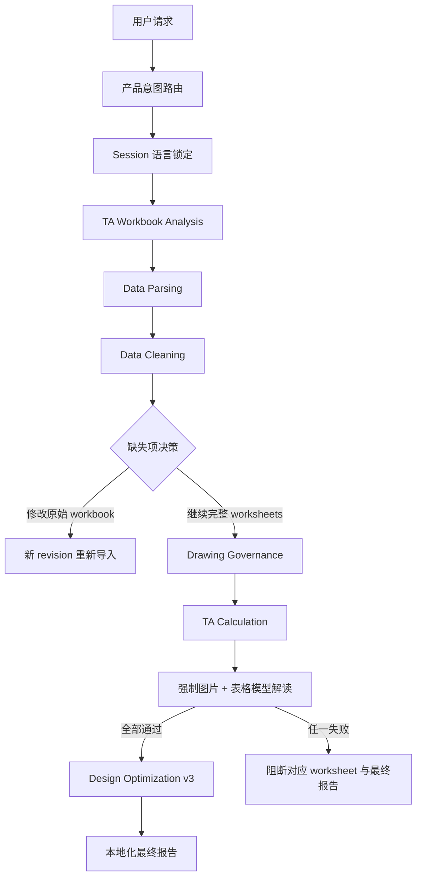

# Issue #106 用户体验与 Agent 触发优化设计

日期：2026-09-07
状态：待用户复审
工作分支：`issue/106-ux-agent-triggering`

## 1. 背景

Issue #106 同时暴露了用户体验、Agent 入口、数据治理、图片解读和优化策略之间的契约缺口：

1. 交互语言只在当前消息中检测，没有成为可恢复的 session 状态。
2. 输入检查可以识别 blocked worksheet，但没有用新手可理解的方式说明缺失项并收集继续或修改的决策。
3. 自定义文本输入缺少输入目的、格式和示例。
4. 用户可见表面仍可能泄漏内部阶段代号。
5. ADO 表格没有独立 worksheet 来源列。
6. 最终报告的多 worksheet 编号、语言和表格展示不符合产品要求。
7. Factor 左侧的 `A/B/C...` 标识没有贯穿结构化证据，图片和表格也没有作为同一个受治理多模态请求交给模型。
8. 当前固定百分比优化方案与新的三步优化顺序冲突。

这些问题不能只通过修改提示词或 Markdown 模板解决。语言、用户决策、多模态输入和优化结果都必须进入版本化 contract，并由状态机和 artifact validator 执行。

## 2. 已确认决策

1. Drawing Number 或 DIM ID 缺失时提醒用户，但不阻断 TA 计算；缺少其他必填尺寸、公差信息或尺寸堆叠图片时阻断对应 worksheet。
2. 新分析产物和最终报告都删除旧 `OP1/OP2/OP3` 固定百分比方案；历史产物保持只读兼容。
3. Agent 思考、回复、问题和最终报告使用启动当前 workflow 的用户语言，并在整个 session 中锁定。
4. 固定系统 UI 本期完整支持中文和英文；其他语言的 Agent 回复和报告保持用户语言，固定 UI 明确回退英文。
5. 根据 Cpk 反推的 LSL/USL 仅作为待审批 specification change 建议，不修改源 Excel，也不冒充制造能力改善。
6. 图片与表格上下文解读是每个 worksheet 的强制能力。图片、表格、Factor 映射或模型能力任一不满足时，阻断对应 worksheet 的解读和最终报告，不允许降级显示 `unavailable`。

## 3. 目标

1. 建立 session 级语言与本地化契约，覆盖 Agent、VS Code、Workbench、模型解读和最终报告。
2. 让每个用户输入控件和阻断决策对首次使用者说明“输入什么、为什么需要、示例是什么、下一步会发生什么”。
3. 使用产品能力名称完成意图路由、进度和结果展示，内部代号只保留在机器契约和开发诊断中。
4. 将 F2 findings 投影为逐 worksheet 的可审计用户决策。
5. 将 Factor ordinal 和真实图片组成 worksheet 隔离的受治理多模态模型请求。
6. 在不删除内部 provenance 的前提下，调整 ADO 和最终报告的用户投影。
7. 用版本化的顺序优化策略替换旧固定百分比方案，并通过现有计算内核验证所有数值建议。

## 4. 非目标

1. 不重写 Excel 解析器、F4 计算公式或 Monte Carlo 内核。
2. 不修改源 workbook，不自动补全缺失工程数据。
3. 不取消 worksheet 两次确认、ADO 最终写入确认或其他治理门。
4. 不把模型输出提升为确定性计算结果，不允许模型生成或重算工程数值。
5. 不删除 JSON、manifest、run summary 或 audit artifact 中的 source/evidence provenance。
6. 不强行合并 Copilot project Skills、产品 Runtime Skills 和 Workbench 状态机的 registry。
7. 不迁移或覆盖历史输出 artifact。

## 5. 总体架构



### 5.1 分层职责

- **产品意图路由层**：区分 workbook analysis、real-measurement analysis、session operation、knowledge question、clarification 和 unsupported。未知输入不得默认创建分析 session。
- **Session 层**：保存语言、workbook revision、worksheet scope、用户决策和 artifact lineage。
- **确定性执行层**：继续负责解析、校验、计算、scenario 重算、artifact identity 和 hash。
- **模型解读层**：只消费经过验证的 worksheet 图片、完整 Factor 表格和确定性计算上下文，产出受约束的工程上下文解读。
- **产品投影层**：负责本地化 UI、完整能力名称、ADO 展示和最终报告；不得修改底层工程事实。

## 6. Agent 触发与产品语言

### 6.1 顶层意图

顶层分类返回结构化结果：

- `workbook_analysis`
- `measured_analysis`
- `session_operation`
- `knowledge_question`
- `clarification_required`
- `unsupported`

分类器先区分 workflow，再把已绑定 session 的操作交给 runtime intent detector。默认结果不再是 `analyze`。当两个 workflow 都可能匹配时，返回候选产品能力并要求用户选择。

项目 Skill 的 `description` 使用互斥触发语料，尤其区分：

- 真实量测数据分析与既有反馈应用。
- 一般 Cpk 知识问题与真实量测 workflow。
- 通用 Monte Carlo 编程与 TA measured-distribution simulation。

自动触发测试使用中英文正例、反例和歧义语料，不依赖内部阶段代号作为主要入口。

### 6.2 Session 语言锁定

Session 新增不可隐式变化的 `interactionLanguage`：

- 至少保存 BCP 47 language tag、UI catalog language 和锁定来源 turn。
- 由启动当前独立产品 workflow 的首个有效用户请求写入一次。
- 确认词、worksheet 名、路径、quoted text、artifact 内容、工具输出和模型回复不得改变该值。
- 只有用户明确请求切换语言，或创建新的独立 workflow，才能改变语言。
- session resume、Workbench 刷新和 VS Code 重启后继续使用相同语言。

中文和英文使用对应 UI catalog。其他语言将 Agent prompt 和报告语言保持为用户语言，固定按钮、表单标签和系统错误使用英文 catalog，并明确记录 fallback。

### 6.3 产品能力名称

用户可见问题、进度、按钮、错误、Agent 回复和报告必须从唯一的本地化 capability-name catalog 读取完整产品名称：

- Knowledge Library / 知识库
- Data Parsing / 数据解析
- Data Cleaning / 数据清洗
- Drawing Governance / 图纸治理
- TA Calculation / 公差分析计算
- Result Interpretation / 结果解读
- Design Optimization / 设计优化
- Feedback Application / 反馈应用

内部 feature ID、artifact kind、runner 和 schema 名只允许出现在机器 payload、日志和开发诊断中。测试必须对每个用户表面断言 catalog 中的精确名称，不能只检查内部代号未出现。

## 7. 新手输入与缺失项决策

### 7.1 用户输入元数据契约

建立唯一的 input metadata registry。每个需要用户提供或自定义值的控件，包括文本、数字、文件、单选、多选和可编辑选择器，都必须注册本地化的：

- `title`
- `whatToEnter`
- `purpose`
- `example`
- `validationHint`

VS Code 将目的放在 `prompt`，示例放在 `placeHolder`。Web 必须显示持久 helper text，并通过 `aria-describedby` 与输入关联，不能只依赖输入后会消失的 placeholder。选择类控件还必须说明每个动作的后果、后续步骤和恢复方式。

该 registry 至少覆盖 ADO Task 标题、existing work item、analysis context、optimization target、workbook 文件、worksheet scope、缺失项决策、session 恢复和对话输入。自动化测试枚举实际注册的用户输入集合，并要求与 metadata registry 精确相等，确保后续新增控件不会漏掉说明。系统不得要求新手理解 action ID、artifact ID 或内部阶段名。

### 7.2 Worksheet 缺失项弹窗

Data Cleaning 完成后，若存在 finding，Workbench 显示逐 worksheet 决策弹窗：

- worksheet 名称。
- Drawing Number、DIM ID、其他必填字段和尺寸堆叠图片的状态。
- 缺失字段的用户可理解名称；内部 source row 可用于展开详情和审计。
- 哪些 worksheet 可以继续，哪些已阻断，以及原因。

用户动作固定为：

1. **修改原始 TA Excel**：进入 `replace_workbook`，创建新 revision，并使旧 hash 上的确认失效。
2. **继续分析计算输入和图片完整的 worksheets**：提交当前 revision 的 downstream-ready worksheet 精确集合。

`downstream-ready` 明确定义为计算必填项和尺寸堆叠图片完整。Drawing Number/DIM ID finding 显示为治理提醒，不从 downstream-ready 集合中移除；因此 identifier-only finding 的 worksheet 仍可选择。缺少计算必填项或图片的 worksheet 不得被选择。

Session 保存 `continue_ready` 或 `replace_workbook` 决策、revision、finding digest 和确认的 worksheet set。取消弹窗不触发任何下游执行。

## 8. ADO Worksheet 来源

现有治理记录已经包含可靠的 `source.worksheetName`，无需修改工程来源模型。Markdown、HTML、Workbench preview 和 readback validator 从该字段生成首列 `Worksheet Source`。

ADO 表格从 11 列升级为 12 列，其他列内容、顺序、全局 subsystem 分组和行排序保持不变。同步更新：

- Markdown 和 HTML renderer。
- group row 的 `colspan`。
- header count 和 factor row count validator。
- canonical HTML/hash readback contract。
- Drawing Governance Skill 和 ADO publishing protocol。

ADO 仍执行完整预览、独立最终确认、一次写入和一次 readback。新增列不能绕过或弱化现有治理。

## 9. 强制图片与表格上下文解读

### 9.1 Factor ordinal

Data Parsing 从 Factor Description 左侧相邻单元格读取原始显示值，保存为 `factorOrdinal`。该值不得由 source row 推导，也不得自动补写。

`factorOrdinal` 作为版本化字段贯穿：

```text
F1 parsed row
  -> F2 validated row
  -> F3 governance row
  -> F5 context snapshot
  -> Workbench model envelope
  -> model interpretation artifact
```

新 workflow 要求每个 active Factor 有唯一、非空且可显示的 ordinal。空白、重复或无法与结构化 Factor 一一对应时，worksheet 在 Result Interpretation 前被阻断，并提示用户修改 workbook。

### 9.2 每 worksheet 多模态输入

每个 worksheet 独立构建一个受治理模型请求，至少包含：

1. 当前 worksheet 经 F1 identity 和 SHA-256 验证的真实图片 bytes 与 media type。
2. 当前 worksheet 的全部 active Factor rows，而不是只传 Top contributors。
3. 每行的 `factorOrdinal`、Factor Description、Part/Subsystem、Nominal、Upper/Lower Tolerance、direction/sign、unit、table identity 和 source row。
4. 当前 worksheet 经验证的 system specification、adjusted mean、sigma、Cp/Cpk、contribution 和确定性结论。
5. 允许模型回答的问题范围与禁止重算数值的约束。

图片必须按 `worksheetName + contentHash + revision` 精确选择，不允许使用第一个同类 artifact，也不允许跨 worksheet 合并 prompt 或图片。

Host action 使用版本化多模态 contract。VS Code extension 在发送模型请求前重新验证 artifact containment、media type、content hash 和 worksheet identity，再构造 image part 与 text part。

### 9.3 模型输出

模型必须结合图片和表格上下文给出：

- 图片中可见的序号、箭头、尺寸链和几何关系。
- `A/B/C...` 与结构化 Factor 的逐项映射。
- 图片方向与 Factor description、nominal sign 的一致性。
- 图片和表格之间直接可见的冲突、歧义或遗漏。
- 结合确定性计算结果的工程风险解释。
- 必须由 ME 确认的事项。

输出继续区分可见 FACT、上下文 SIGNAL、确定性 RULE 和 required CLARIFICATION。模型不得 OCR 后替代结构化数值，不得计算 WC/RSS/Cpk/Yield，不得补造不可见 geometry 或 Factor 映射。

模型输出的 Factor mapping 必须满足确定性集合约束：输出 ordinal 集合与当前 worksheet 全部 active Factor ordinal 集合精确相等；每个 ordinal 恰好出现一次，并绑定唯一的结构化 Factor identity。遗漏、重复、额外 ordinal、同 worksheet 错配或跨 worksheet 引用均使 artifact 无效。若图片无法可靠识别任一 active ordinal，必须阻断该 worksheet，不能以 `ambiguous` 或空 mapping 完成强制解读。

### 9.4 强制完成门

Result Interpretation 只有在以下条件全部满足时才完成：

- 图片存在且 identity/hash 验证通过。
- Factor table 完整且 ordinal 唯一映射。
- 多模态模型能力可用。
- 模型返回内容通过 schema、worksheet identity、Factor mapping 精确集合和引用完整性验证。
- 每个 selected worksheet 都有独立、有效的 interpretation artifact。

任一条件失败时：

- 阻断对应 worksheet 的 Result Interpretation。
- 不为该 worksheet 生成 Design Optimization。
- 不生成整个 workbook 的最终报告。
- UI 显示具体缺失项和可恢复动作。
- 不使用 `unavailable`、空章节或确定性 fallback 冒充图片与表格解读。

允许保存失败前已验证的内部 artifacts 供诊断，但不得发布为完成报告。

## 10. Design Optimization v3

### 10.1 版本边界

新执行写入 `f6-optimization-v3` 和新的 sequential policy ID。历史 `f6-optimization-v2` 保持只读验证和展示，不重写、不迁移。Existing-artifact validator 使用 discriminated union 区分版本。

### 10.2 固定三步顺序

每个 worksheet 按以下顺序生成建议：

#### 第一步：中心偏移判断

确定性计算：

$$M_{spec}=\frac{LSL+USL}{2}$$

将 adjusted mean 与 $M_{spec}$ 按 F4 数值精度规则比较：

- 相等：报告不显示中心偏移提醒。
- 不相等：显示偏移量，并由模型结合图片与完整 Factor 表格解释优先检查的 Factor nominal 或 specification side。

任何 proposed nominal/specification 数值必须由确定性 solver 生成并交给 F4 scenario 重算。模型只能给出工程语义和可行性解释。

#### 第二步：Contributor 公差建议

按 contribution 降序和稳定 source identity tie-break 输出 Factor 排名。只提示优先收紧哪些 Factor 的公差以及原因，不自动给出具体公差值或百分比。

所有新 v3 optimization JSON、Markdown、run summary、manifest、composed report 和用户投影均不得包含 `OP1`、`OP2`、`OP3`、旧 ratio matrix 或替代性的任意百分比方案。若用户需要具体 Factor tolerance target，必须通过独立、已确认的 Optimization Targets 输入进入 F4-backed scenario。

#### 第三步：单侧规格反推

使用 worksheet 的 Target Cpk 和 F4 baseline $\mu,\sigma$：

$$LSL_{target}=\mu-3\sigma Cpk_{target}$$

$$USL_{target}=\mu+3\sigma Cpk_{target}$$

路由规则：

- 仅 lower Cpk fail：只反推 LSL。
- 仅 upper Cpk fail：只反推 USL。
- 两侧 fail：分别反推两侧。
- 已通过的一侧不得改变。
- $\sigma \le 0$、Target Cpk 非法、反推后区间非法或 F4 重算未达到目标时，不输出具体值并返回 clarification。

每个反推值必须通过 F4 specification override 重算。报告将其标记为 `Specification change - approval required`，说明它改变需求边界，不等同于改善制程能力，也不修改源 workbook。

## 11. 最终报告

### 11.1 编号

按受治理 worksheet 顺序生成：

- `3-1. Worksheet: <name>`
- `3-1.1 ...`
- `3-2. Worksheet: <name>`
- `3-2.1 ...`

最终报告只在全部 selected worksheets 完成强制多模态解读和 Design Optimization 后生成，并按受治理 selected worksheet 顺序连续编号，不按 worksheet 名重新排序。Blocked worksheet 只出现在执行状态和阻断摘要中；存在任何 blocked selected worksheet 时不生成最终报告，因此 blocked worksheet 不进入 `3-1/3-2` 序列。

### 11.2 语言

报告 renderer 接收 session 锁定语言，不从 worksheet、模型 prose、最后一次确认或 artifact 内容重新检测。中文和英文使用确定性 catalog；其他语言的标题和说明由受约束模型按锁定语言生成，并保留结构化 section identity 供 validator 检查。

### 11.3 展示列

所有用户可见最终报告投影，包括 Markdown、HTML、Workbench preview 和导出表面，其表格都删除 `Source`、`Evidence`、`来源`、`证据` 及同义 provenance 展示列。ADO 治理表格中的 `Worksheet Source` 是明确例外。内部 JSON 继续保留完整 source references、evidence references、scenario evidence、formula trace、hash 和 manifest linkage。

图片 + 表格模型解读是最终报告必备章节。Final report composer 只消费已验证 interpretation artifact，不再次调用模型，也不机械重构模型解读。

## 12. 错误处理与恢复

- Workbook replacement 创建新 revision；旧 revision 的 scope、语言以外输入决策和模型 artifact 不得复用。
- 模型 timeout、能力缺失、图片 hash mismatch、Factor link mismatch 或 schema failure 都返回 worksheet 级结构化 blocker。
- 用户修复 workbook 后，从 Data Parsing 开始新的 revision；确定性、无副作用且 identity 未变化的步骤可以按现有幂等规则恢复。
- ADO 写入状态与模型解读状态相互独立；模型失败不得重放 ADO 写入。
- 最终报告只有在所有 selected worksheets 通过强制多模态解读和 Design Optimization 后才能发布。

## 13. 测试策略

### 13.1 语言与交互

- 首轮英文、后续中文 worksheet 名或确认词：Agent、问题和报告仍为英文。
- 首轮中文、模型返回英文：产品投影仍为中文。
- session resume、Web 刷新和 VS Code 重启后语言不变。
- 日文等其他语言保持模型回复和报告语言，固定 UI 回退英文。
- 枚举所有用户输入控件，验证其集合与 input metadata registry 精确相等，并验证内容、目的、示例、动作后果、恢复方式及 accessibility 关联。
- 用户可见 DOM、Agent 消息和报告使用 capability-name catalog 的精确本地化名称，且不出现裸内部阶段代号。

### 13.2 F2 决策

- 混合 ready/blocked、全部 blocked、identifier-only、图片缺失和多字段缺失。
- Drawing Number/DIM ID 只提醒，其他必填项或图片缺失阻断。
- “继续”只能提交 downstream-ready 精确集合；identifier-only finding 仍可选；“修改”使旧 revision/hash 的确认失效。
- 取消不启动下游 workflow。

### 13.3 ADO

- 跨 worksheet 同 subsystem 时每行仍显示正确 worksheet 来源。
- Markdown 和 HTML 精确 12 headers、`colspan=12`、稳定排序和转义。
- 完整 preview、write-once、readback body/hash verification 保持通过。

### 13.4 多模态解读

- 真实 workbook layout 中读取 `A/B/C...`，覆盖空白、重复、跳号和多字符标签。
- Factor ordinal 从 F1 到 model artifact 字段级一致。
- 两个 worksheet 使用不同图片，模型请求中的 bytes、media type、hash 和 Factor rows 分别正确。
- Prompt 包含全部 active rows，而不是只包含 contributors。
- 缺图、错图、hash mismatch、ordinal 不可靠、模型不可用和 invalid response 均阻断最终报告。
- 有效图片和映射时不得产生 `unavailable`。
- 模型输出 ordinal 集合必须与全部 active Factor ordinal 精确相等且一一映射；遗漏、重复、歧义、错配、跨 worksheet 引用或模型生成数值时 validator 拒绝结果并阻断报告。

### 13.5 优化与报告

- adjusted mean 等于 midpoint 时无提醒；不等时输出中心偏移说明。
- contributor 排名稳定，且所有新 v3 artifacts、composed report 和用户投影不包含旧 OP 和百分比矩阵。
- lower-only、upper-only、both-fail 和 both-pass 的 specification solver。
- 反推值经 F4 重算达到 Target Cpk，并保持未失败一侧不变。
- 单 worksheet 与多 worksheet 的连续 `3-1/3-2` 编号。
- 中文/英文报告与 session language 一致。
- Markdown、HTML、Workbench preview 和导出报告没有 source/evidence 展示列；ADO Worksheet Source 例外；内部 JSON provenance 仍完整。
- v2 历史 artifact 可读，v3 新 artifact 可写，hash tamper 继续 fail closed。

## 14. 实施顺序

1. 先增加失败测试，固定语言、意图、F2 决策和多模态完成门。
2. 增加 session 语言与本地化 catalog，统一用户可见产品名称和用户输入元数据。
3. 增加顶层 workflow intent router 与 Skill 互斥触发测试。
4. 增加 F2 findings decision projection 和 revision-bound 用户决策。
5. 增加 Factor ordinal contract，并贯穿 F1/F2/F3/F5/model envelope。
6. 增加按 worksheet 隔离的多模态 host contract、图片验证和强制 interpretation artifact。
7. 将 ADO renderer、preview、协议和 readback 升级为 12 列。
8. 增加 specification solver 和 `f6-optimization-v3` sequential policy。
9. 更新最终报告编号、本地化和无 provenance 展示列 projection。
10. 运行定向单元测试、contract tests、full-flow、Playwright、build 和 governed output verification。

## 15. 验收标准

1. 用户启动 workflow 后，Agent、问题、进度和报告语言不会隐式变化。
2. 每个用户输入控件对新手说明输入内容、目的、示例、格式、动作后果和恢复方式。
3. 缺失项弹窗逐 worksheet 展示 finding，并只允许计算输入和图片完整的 worksheet 继续；identifier-only finding 不阻断。
4. Drawing Number/DIM ID 缺失只进入治理提醒，不阻断计算。
5. ADO 每行有独立 Worksheet Source，且现有写入与 readback 治理不回归。
6. 每个 selected worksheet 都有经验证的图片 + 完整表格上下文模型解读；无法完成时不生成最终报告。
7. Factor ordinal 与图片映射可追溯、worksheet 隔离且通过 hash/identity 验证。
8. 新优化产物按中心偏移、contributor 排名、单侧 specification 反推的顺序输出，不含旧 OP。
9. 规格反推值由 F4 重算验证并明确标记待审批，不写回 workbook。
10. 多 worksheet 报告正确编号，使用锁定语言，且最终 Markdown 不展示 source/evidence 列。
11. 历史 v2 artifact 保持只读兼容，新 v3 artifact 具备明确版本语义。
12. 用户可见表面只使用完整产品能力名称；内部标识仍可用于机器 contract 和诊断。