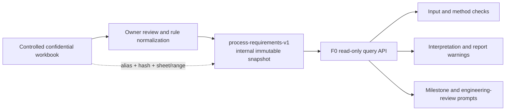

# F0 TA Process and Requirements Knowledge Base Design

**Date:** 2026-09-09

## Goal

Add a fourth, independently versioned F0 knowledge domain for governed TA process and
requirements. It converts reviewed requirements from the controlled TA template into immutable,
queryable rules that later modules can use as notices, warnings, and escalation evidence.

The knowledge domain informs engineering work. It does not approve a design, replace Microsoft
ME/DM review, change calculation mathematics, infer missing workbook facts, or turn guidance into
an automatic pass/fail decision.

## Source and Classification

The reviewed source is the `TA Process and Requirements` worksheet in the attached workbook.

- Source alias: `controlled-ta-template-beta`
- Source workbook SHA-256: `44c8249abca1638af5803e0bddc0de2a468fae64093b3e8f0648862923db8418`
- Source revision: `Beta`
- Source worksheet and range: `TA Process and Requirements!A1:T59`
- Source classification: `confidential`
- Distribution marking: externally restricted

The original workbook and verbatim worksheet text must remain outside Git in the controlled
document system. The repository may contain only source alias, hash, version, worksheet/range,
and reviewed structured rules. Before publication, the knowledge owner must explicitly confirm
that each derived rule is suitable for `internal` classification. A rule that cannot be safely
declassified from its confidential source is omitted and reported as unavailable knowledge.

The attachment is read-only design evidence. Runtime code must not accept an arbitrary workbook
path, uploaded workbook, URL, or worksheet text as an F0 knowledge source.

## Chosen Approach

Publish an independent `process-requirements-v1` static snapshot inside
`@ai-assist/knowledge-base`. This follows the existing internal tolerance and interpretation-rule
patterns while keeping the public `v1`, `internal-v1`, and `interpretation-rules-v2` snapshots
unchanged.

Two alternatives were considered:

1. Add the rules to public `v1`. This is rejected because the source is confidential and the
   public snapshot explicitly permits only anonymous public content.
2. Parse the worksheet during every analysis. This is rejected because it makes governed behavior
   depend on mutable user input and would expose confidential source text to downstream modules.
3. Maintain confidential evidence and a separate public summary snapshot. This may be useful
   later, but it adds a second review and release lifecycle without being required for the initial
   downstream warning use case.

## Architecture



The contracts package owns strict schemas. The knowledge-base package owns seed data, integrity
validation, immutable loading, context evaluation, and provenance. The F0 workflow runner verifies
the new snapshot version with the other F0 domains. Downstream modules provide facts and render
returned messages; they do not duplicate thresholds or activation conditions.

## Knowledge Model

### Manifest and source metadata

The snapshot manifest records:

- version `process-requirements-v1`;
- classification `internal`;
- release date and change summary;
- source, entry, and entry-type counts;
- source metadata hash, entries hash, and complete content hash.

Source metadata records a stable alias, source SHA-256, source revision, worksheet/range,
`sourceClassification: "confidential"`, reviewed output classification, owner, and review date.
It does not contain an absolute path, original filename, author names, restricted-recipient names,
document number, or worksheet prose.

### Entries

Each entry contains:

```ts
interface ProcessRequirementEntry {
  entryId: string;
  entryType: "requirement" | "warning" | "escalation" | "milestone" | "instruction" | "definition";
  topic:
    | "scope"
    | "inputs"
    | "outputs"
    | "analysis-method"
    | "sigma-target"
    | "priority"
    | "review"
    | "tolerance-loop"
    | "factor-modeling"
    | "workbook-operation"
    | "terminology";
  title: string;
  message: string;
  normativeStrength: "must" | "should" | "may" | "informational";
  applicability: ProcessRequirementApplicability;
  relatedEntryIds: string[];
  provenance: ProcessRequirementProvenance;
}
```

`applicability` uses explicit, optional fields rather than free-text matching:

- actor: ODM, subsystem supplier, Microsoft internal, or all;
- analysis method: 1D RSS, 3D variation analysis, or all;
- characteristic class: CTS, CTF, or other;
- priority: P0 through P3;
- lifecycle stage: ASR, before tooling, after tooling trial/build, or DFM;
- tolerance count threshold and 3D geometry sensitivity;
- subject marker such as camera FOV;
- factor representation such as position, profile, pin/hole float, or mean shift;
- result condition such as requirement gap present;
- workbook area such as Auto Summary or Part/Sub Required Dimensions.

Unknown or omitted context never activates a conditional warning. Instead, the result reports the
facts required to evaluate that rule.

## Initial Reviewed Rule Coverage

The first snapshot should normalize the following knowledge without copying the full source prose:

### Method and escalation

- More than 10 tolerances or potential 3D geometry sensitivity warns that a 1D linear analysis may
  be inappropriate and requires consultation with Dimensional Management for 3D analysis.
- Camera FOV clearance is not evaluated with 1D TA and requires Dimensional Management support.

### Input, output, and target requirements

- Inputs identify the characteristic, complete tolerance loop, factor description, dimension ID,
  part category, nominal, tolerance, sigma level, and distribution with suitable evidence.
- CTS characteristics require a 6-sigma target; CTF characteristics require a 4-sigma target.
- Outputs identify requirement gaps, sensitivity/contribution drivers, upstream dimensional
  flow-down, and proposed resolutions.
- When a TA result does not meet its requirement, the summary includes the resolution and a linked
  ADO bug, work item, or task.

### Scope, priority, and review milestones

- ODM P0/P1 analyses are shared for Microsoft review at ASR.
- ODM P2/P3 analyses are shared before tooling starts.
- After tooling trial and builds, ODM analyses are updated with real-part data and shared for review.
- Subsystem suppliers share all CTS and CTF characteristics during DFM review.
- Priority guidance is returned as review evidence only; final priority remains aligned with the
  Microsoft ME/DM engineer and includes NUD risk consideration.

### Modeling and workbook instructions

- Establish and evidence the tolerance loop before factor entry.
- Model uncontrolled pin/hole clearance explicitly; distribution and directional mean shift depend
  on the physical locating behavior.
- Position and profile tolerances are entered as plus/minus half of the indicated total value.
- A long-term/safety multiplier is optional, normally 1.0 to 2.0, with 1.3 to 1.5 identified as the
  typical range; it is guidance, not an automatically selected value.
- Select sigma level and distribution using known process capability rather than an unsupported
  assumption.
- Populate upper/lower specification limits and target sigma, then review factor contributions for
  plausibility and unexpected drivers.
- Auto Summary permits manual edits only in Comments and Other; refresh generated data after TA
  sheet changes, and TA tab names must not contain spaces.
- Part/Sub Required Dimensions is generated, refreshed after TA sheet changes, not manually edited,
  and is not an exhaustive list of drawing requirements.

### Definitions

Reviewed definitions for Cp, Cpk, Dimensional Management, RSS, sigma level, standard deviation,
tolerance analysis, tolerance loop/path, 3D variation analysis, and worst case are available through
the same versioned snapshot. Definitions are informational and never activate warnings.

## Query API

The package exposes two read-only operations:

```ts
const knowledge = loadProcessRequirements({ version: "process-requirements-v1" });

knowledge.listProcessRequirements({ topics: ["inputs", "outputs"] });

knowledge.evaluateProcessRequirements({
  actor: "odm",
  analysisMethod: "one-dimensional-rss",
  toleranceCount: 14,
  hasThreeDimensionalSensitivity: true,
  characteristicClass: "cts",
  priority: "P0",
  lifecycleStage: "asr",
  requirementGapPresent: true,
});
```

The evaluation result contains:

- exact knowledge-base version and status (`matched`, `insufficient-facts`, or `not-applicable`);
- immutable matched notices ordered by escalation, warning, requirement, milestone, instruction;
- stable entry IDs, topics, normative strength, and related facts;
- missing facts needed by potentially relevant conditional rules;
- evidence containing source alias, hash, revision, worksheet/range, and effective version.

The API never returns source prose, source paths, recipient names, approval decisions, or a generic
pass/fail field. Invalid or unknown enum values fail with the existing typed `validation_error`.
Unsupported versions fail closed.

## Downstream Use

- Workbook input validation queries input and workbook-operation requirements and reports missing
  evidence without inventing values.
- Applicability checks query method warnings before a 1D result is interpreted. Camera FOV and
  3D-sensitive cases surface escalation evidence prominently.
- Calculation continues to be owned by the existing calculation kernel. Process requirements may
  resolve CTS/CTF targets but cannot alter formulas or silently override user-selected targets.
- Interpretation and optimization reports cite matched entry IDs and provenance when presenting
  warnings, required reviews, or missing process evidence.
- Real-measurement workflows use the post-tooling update requirement as a workflow notice, not as
  proof that measured data exists.

The initial implementation adds the query capability and F0 runner validation. Each downstream
integration remains an explicit, tested change so existing calculations and report conclusions do
not change merely because the knowledge snapshot is present.

## Validation and Failure Behavior

Snapshot creation rejects:

- source or released-content classification mismatches;
- duplicate entry IDs, invalid enums, empty messages, or unknown fields;
- source count, entry count, type count, version, or content-hash mismatches;
- missing related entries, self-reference, or cycles where ordering depends on related entries;
- conditional entries with no activation facts;
- entries whose provenance does not resolve to the registered source;
- absolute paths, URLs, workbook prose, or unreviewed confidential text in released entries.

Queries return deep-cloned, deeply frozen DTOs. Ambiguous or incomplete context cannot trigger a
conditional directive and must return missing-fact evidence. If the process-requirements snapshot
cannot load, F0 capability validation fails; downstream modules must state that process guidance is
unavailable rather than continue with an apparently governed conclusion.

## Testing

1. Contract tests accept every entry type and reject malformed, extra, or confidential-source fields.
2. Validation tests verify counts, hashes, references, classification, deterministic ordering, and
   immutable snapshots.
3. Query tests cover the greater-than-10 and 3D warnings, camera FOV escalation, CTS/CTF targets,
   actor/priority milestones, requirement-gap ADO notice, instructions, definitions, insufficient
   facts, and not-applicable results.
4. Security tests prove arbitrary paths, workbook bytes, URLs, and unreviewed source prose cannot be
   loaded at runtime.
5. F0 runner tests require the exact fourth version and fail on a missing or mismatched manifest.
6. Existing public, internal tolerance, interpretation, calculation, and report tests remain green.
7. Focused package build, typecheck, lint, and Vitest suites pass before repository-wide validation.

## Out of Scope

- Tracking the original Excel workbook in Git.
- Runtime import or automatic synchronization from EDM, PLM, OneDrive, or an uploaded workbook.
- Automatic priority assignment, engineering approval, ADO item creation, or report blocking.
- Reimplementing F4 calculations or changing existing calculation results.
- Automatically distributing confidential source wording to prompts, logs, reports, or UI.
- Publishing a public process-requirements snapshot.

## Acceptance Criteria

The design is complete when a reviewed `process-requirements-v1` snapshot can be loaded locally,
queried with structured facts, and cited by stable ID and source hash; applicable notices and
escalations are deterministic; missing knowledge is explicit; the original workbook and prose never
enter Git or runtime outputs; and the existing three F0 knowledge domains retain their behavior.