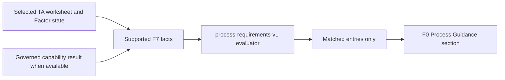

# F7 Dynamic F0 Process Guidance Design

**Date:** 2026-09-10

## Goal

Replace the static disclosure and input-readiness content in the F7 assumption-results view with
governed notices triggered by `F0 TA Process and Requirements` and facts supported by the current
TA worksheet and analysis state.

The integration informs the engineer. It does not infer missing worksheet facts, select defaults,
change tolerance calculations, or turn process guidance into an additional pass/fail decision.

## Scope

Remove these rendered sections from `TAResultsInterpretation`:

- Verification Requirements
- Evidence Disclosure
- Assumption Disclosure
- Rule provenance
- Input Readiness

Add one `F0 Process Guidance` section after `Suggested Action Sequence`. The section displays all
matched F0 entry types: escalation, warning, requirement, milestone, and instruction. Definitions
remain list-only in F0 and are not rendered as triggered guidance.

The existing TA Result Summary, Overall assessment, Root Cause Analysis, Engineering Risk, and
Suggested Action Sequence remain unchanged.

## Chosen Architecture

The F7 interpretation layer calls the existing immutable `process-requirements-v1` evaluator
directly. A pure `buildF0ProcessGuidance` function converts supported F7 session and calculation
facts into an evaluation request and returns a small rendering model.

This approach keeps the behavior testable without changing F7 API contracts or duplicating F0
thresholds and messages. The local API continues to own workbook parsing and session state. F0
continues to own rule applicability, severity ordering, controlled wording, and provenance.

Alternatives rejected:

1. Adding guidance to the F7 local API would require broader contract, schema, and route changes
   without improving the current read-only use case.
2. Reimplementing F0 conditions in F7 would duplicate governed thresholds and allow rule drift.

## Governed Fact Mapping

F7 supplies only facts that are supported by the current workflow or analysis result:

- `actor: "all"` identifies rules explicitly reviewed for every TA actor; it is not an inferred
  organization or supplier role.
- `analysisMethod: "one-dimensional-rss"` is fixed by the assumption-results calculation path.
- `toleranceCount` is the number of Factor candidates represented by the selected TA worksheet.
- `requirementGapPresent` is `true` when the calculation kernel's governed capability status is
  `FAIL` and `false` when it is `PASS`. The kernel defines Cpk equal to its resolved target as
  `FAIL`, so that equality boundary activates requirement-gap guidance even when the interpretation
  headline uses `meets-target` wording.

Other evaluator facts are omitted unless a future F7 contract supplies explicit controlled values.
In particular, F7 does not infer actor role, lifecycle stage, priority, CTS/CTF classification,
camera FOV subject, three-dimensional sensitivity, factor representation, or workbook area from
names, target values, source-cell labels, or free text.

The UI ignores `missingFacts`. Unknown context therefore never activates a conditional rule and
never produces a missing-information notice.

## View Model and Failure Behavior

The guidance model contains:

- evaluation status;
- F0 version `process-requirements-v1`;
- matched entries in evaluator order;
- each entry's ID, type, title, message, topic, and normative strength.

Guidance based only on worksheet facts remains available when the assumption calculation is not
yet available. Once a governed capability result exists, F7 reevaluates with
`requirementGapPresent` included.

The evaluator is the only source of activation conditions and messages. If loading or evaluation
fails, the builder fails closed and returns an unavailable guidance state. It does not synthesize
replacement rules, reuse interpretation-rule disclosures, or expose source hashes and ranges. The
UI omits the complete F0 Process Guidance section for this unavailable state.

## Presentation

The new section appears directly after `Suggested Action Sequence` and uses this hierarchy:

1. Section title: `F0 Process Guidance`.
2. Context line: guidance is triggered by the current worksheet and analysis state.
3. Compact version marker: `process-requirements-v1`.
4. Matched entry list in the order returned by F0.

Each entry shows a type label, controlled title, and controlled message. Escalations receive the
strongest red treatment, warnings use amber, and requirement, milestone, and instruction entries
use restrained distinct labels. Each entry ID is shown as compact traceability metadata.

The section does not display missing facts, unmatched rules, evidence hashes, source ranges,
assumption disclosure, verification boilerplate, or dataset input-readiness lists. If there are no
matched entries, the section is omitted rather than displaying a generic empty-state message.

The layout remains a single readable flow on narrow screens. Labels and messages wrap without
changing the width of surrounding result content.

## Data Flow

## Testing

Use test-driven development with focused builder and component tests.

Builder coverage:

- seven Factors do not activate the complex-stack escalation;
- eleven Factors activate `method-escalation-complex-stack`;
- governed capability `FAIL` activates `requirement-gap-ado-notice`, including Cpk equal to target;
- governed capability `PASS` does not activate `requirement-gap-ado-notice`;
- universal F0 entries are returned from the evaluator without duplicated messages;
- missing facts are not converted into guidance entries;
- unavailable calculation still permits worksheet-supported matches;
- evaluator failure produces an unavailable state without invented guidance.

Component coverage:

- all matched entry types render in evaluator order;
- escalation and warning tones are distinguishable through semantic attributes and styles;
- the version marker and current-context statement render;
- Verification Requirements, Evidence Disclosure, Assumption Disclosure, Rule provenance, and
  Input Readiness no longer render;
- no unmatched or missing-fact notices render;
- an empty matched-entry result omits the section.

Run the focused F7 tests first, followed by the complete `f7-web` Vitest project, typecheck/build,
ESLint for touched files, and browser verification at desktop and mobile widths.

## Acceptance Criteria

1. The screenshot's static disclosure and readiness content is absent.
2. Every displayed replacement item is a matched entry returned by
   `process-requirements-v1` for supported current facts.
3. F7 contains no copied F0 thresholds or controlled rule messages.
4. Missing facts and unmatched rules remain hidden.
5. F0 guidance cannot change RSS, capability calculations, or the existing result judgment.
6. The section remains readable and non-overlapping on desktop and mobile.