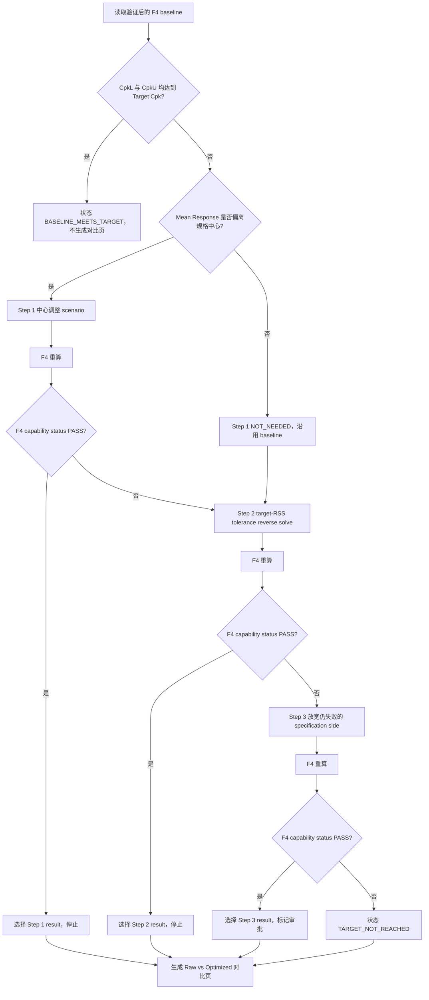

# F6 顺序优化 V4 与优化前后对比页设计

**日期：** 2026-09-14
**状态：** 已批准，待实施计划
**范围：** F6 Design Optimization、最终 Markdown/PDF 报告及其治理校验

## 1. 背景

当前 F6 能识别 Mean Response 相对规格中心的偏移、对 Factor 贡献率排序、提出单侧规格放宽建议，并运行固定的 Top 3 tolerance sensitivity scenarios。然而，这些动作不是一个以上一步结果为输入、达到目标即停止的顺序优化闭环：中心步骤只评估不重算，规格建议先于公差方案生成，公差方案使用固定比例而不是反求达到 Target Cpk 所需的 tolerance。

最终 F6 工程报告目前也不展示内部 Top 3 scenario 结果。用户无法从正式报告直接比较 Raw Data 与最终选定的 Optimized Data，也无法看到优化为何停在某一步。

## 2. 目标

1. 仅对 baseline `CpkL` 或 `CpkU` 未达到 worksheet Target Cpk 的 worksheet 运行顺序优化。
2. 严格按“中心调整、Factor tolerance 收紧、规格放宽”执行；任一步经 F4 重算达到目标后，后续步骤不再执行。
3. 所有优化数值与 capability 结果均由现有 F4 calculation engine 重算，Agent 不生成或重算工程数值。
4. 为每个 baseline Cpk 不达标的 worksheet 在最终报告中增加一页 Raw Data 与 Optimized Data 对比。
5. 保持 F1-F5、F7、F4 数学定义、源 workbook、现有项目结构和五文件 F6 发布流程不变。
6. 保留历史 F6 V2/V3 artifact 的只读验证，不原地改变其 contract 语义。

## 3. 非目标

- 不修改源 workbook 或 TA worksheet。
- 不改变 F4 的公式、distribution、sigma、Cpk、Yield 或 DPM 定义。
- 不把 specification relaxation 描述为设计能力或制造能力改善。
- 不根据模型自由文本直接写入 nominal、tolerance、LSL 或 USL 数值。
- 不让 PDF renderer 重新计算任何 capability 指标。
- 不改变 F1、F2、F3、F4、F5、F7 的工作流顺序或 artifact contract。
- 不删除现有固定 OP1/OP2/OP3 sensitivity policy。

## 4. 已批准的产品决策

### 4.1 Step 1 的工程目标

Step 1 的目标定义为：使最终 Mean Response 对齐 specification midpoint，而不是只修改 system `designNominal` 字段。

F4 中 capability 使用以下 Mean Response：

$$
\mu = \sum_i \mu_i + \text{Additional Mean Shift}
$$

而 system `designNominal` 不直接进入 Cpk 的 mean 计算。因此，仅修改 system `designNominal` 不得被声明为 Cpk 改善方案。

Step 1 优先通过具有 signed direction evidence 且允许设计调整的 Factor nominal override 实现。若没有足够证据确定 Factor、方向或分配方式，则该路径返回结构化 `engineering_confirmation_required`，不得猜测 nominal 数值。对于明确属于 process/system offset 的输入，可使用 `additionalMeanShift` scenario，但必须与 Factor nominal design change 分开分类和展示。

### 4.2 新写入版本

新运行输出 `f6-optimization-v4`，使用 `f6-sequential-optimization-policy-v2`。历史 `f6-optimization-v2` 和 `f6-optimization-v3` 继续只读验证，不迁移、不覆盖、不改变原有 schema。

### 4.3 固定 Top 3 policy

现有 `f6-top3-tolerance-policy-v1` 的 OP1/OP2/OP3 保留为内部 sensitivity/fallback evidence，继续保持固定 Factor 排序、固定比例与 F4 provenance。它们不再自动成为正式 Optimized Data。正式推荐优先采用达到 Target Cpk 的 target-RSS reverse-solve 结果。

## 5. 方案选择

采用“版本化顺序状态机 + F4-backed scenario chain + 单一选定结果 + 独立报告对比页”。

不采用以下替代方案：

- **原地扩展 V3：** V3 已固定四步 tuple、policy ID、OP1/OP2/OP3 数量和比例。改变含义会破坏历史 artifact 的可验证性。
- **只修改报告：** 当前 V3 没有 Step 1 centering result，也没有 target-RSS optimized result，renderer 无法可靠构造对比数据。
- **Agent 自行循环试算：** 会破坏确定性、trace、schema 和可复算性。所有 scenario 必须由受控代码构造并交给 F4。

## 6. 顺序优化状态机

每个 worksheet 独立执行，禁止跨 worksheet 共享 Factor、scenario 或选定结果。



### 6.1 触发与达标判定

- 触发条件读取 F4 baseline 的 `lowerCpkStatus`、`upperCpkStatus` 和 Target Cpk。
- 每一步是否达标以 F4 scenario 返回的 capability status 为最终依据，不使用 renderer 比较，也不只按数学等值判断。
- 为避免求解结果在 Target Cpk 等值边界被 F4 的严格状态规则判为失败，solver 使用版本化、确定性的最小 guard band，然后仍由 F4 复算确认。
- PASS worksheet 不运行任何优化 step，不生成空的优化页。

### 6.2 Step 1：Mean Response Centering

输入为 baseline calculation、spec midpoint、受治理的 Factor identity、signed direction evidence 和允许的调整类别。

目标：

$$
\mu_{target}=\frac{LSL+USL}{2}
$$

允许的执行路径：

1. `factor_nominal_centering`：调整一个或多个已确认 Factor nominal，使重算后的 Mean Response 对齐规格中心。
2. `system_mean_shift_centering`：仅当输入明确表示 system/process offset 时，将 resulting `additionalMeanShift` 作为 F4 scenario override。
3. `engineering_confirmation_required`：Factor、方向、分配方式或 adjustment class 不明确时停止自动 centering，但允许进入 Step 2；报告清楚显示 Step 1 未执行的原因。

每个 completed centering scenario 保存 baseline/result metrics、Factor 或 system overrides、方向证据引用、F4 calculation reference 和 formula trace。不得把 system design nominal 的展示值变化当作 capability centering。

### 6.3 Step 2：Target-RSS Tolerance Reverse Solve

Step 2 必须消费 Step 1 completed result；若 Step 1 为 `NOT_NEEDED` 或无法执行，则消费 baseline。不得并行从 baseline 预先生成结果。

目标 RSS 为：

$$
\sigma_{RSS,target}=\frac{\min(\mu-LSL,\ USL-\mu)}{3(Cpk_{target}+\epsilon)}
$$

其中 $\epsilon$ 是版本化 numeric guard band，不由用户或 Agent 任意配置。

执行规则：

- 按当前 F4 variance contribution 对 Factors 稳定排序。
- 默认选择 Top 3；不足 3 个时选择全部可用 Factors。
- 未选中的 Factors 冻结。
- 默认采用 `proportional-to-contribution` 分配 target RSS。
- 每个 tolerance band 保持原中心不变，仅收紧 band width。
- 若固定 Factors 已消耗目标 RSS、结果不可表示、供应商能力证据不支持，返回结构化 `NOT_FEASIBLE` 或 `ENGINEERING_REVIEW_REQUIRED`。
- 生成 Factor tolerance overrides 后必须交给 F4 重算；只有 F4 status PASS 的结果可成为 Step 2 selected result。

OP1/OP2/OP3 可在 target reverse solve 失败或需要敏感度信息时运行，但输出位于 `sensitivityScenarios`，不得覆盖正式 Step 2 status 或 selected result。

### 6.4 Step 3：Specification Relaxation

Step 3 只在 Step 2 的 F4 result 仍不达标时执行，并消费该结果。若 Step 2 无法形成可计算 scenario，则消费最后一个通过身份验证的可计算结果，并记录来源 step。

- 仅放宽仍失败的 side。
- `CpkL` 失败时才降低 LSL；`CpkU` 失败时才提高 USL。
- passing side 保持不变。
- 每项结果标记 `changeClass: requirement_change`、`approvalRequired: true`、`capabilityImprovementClaim: false`。
- 规格求解结果必须再经 F4 scenario 验证。
- Step 3 result 即使达到目标，也只能作为需要 requirement owner/ME 审批的建议，不能自动改变 baseline、源 workbook 或最终 release disposition。

## 7. F6 V4 Contract

### 7.1 Worksheet 结构

每个 V4 worksheet 至少包含：

```text
worksheetName
tableId
baselineIdentity
baselineResult
trigger
steps[]
selectedResult
sensitivityScenarios[]
runStatus
```

`steps` 固定为三个有序元素：

1. `meanResponseCentering`
2. `toleranceReverseSolve`
3. `specificationRelaxation`

每个 step 使用显式状态：

- `NOT_NEEDED`
- `COMPLETED_TARGET_MET`
- `COMPLETED_TARGET_NOT_MET`
- `ENGINEERING_CONFIRMATION_REQUIRED`
- `ENGINEERING_REVIEW_REQUIRED`
- `NOT_FEASIBLE`
- `NOT_RUN_EARLIER_STEP_MET_TARGET`
- `CALCULATION_FAILED`

### 7.2 Selected Result

`selectedResult` 只允许以下状态：

- `baseline_meets_target`
- `step1_centered`
- `step2_tolerance_optimized`
- `step3_specification_relaxed_pending_approval`
- `no_validated_optimized_result`

它必须引用一个完整、已验证的 scenario snapshot，而不是仅引用 option label。snapshot 保存 system metrics、capability metrics、Factor result rows、overrides、F4 calculation version/reference 和 formula trace。

### 7.3 顺序一致性校验

Schema `superRefine` 和 runner validator 必须拒绝：

- 前一步达到目标后仍执行后续步骤；
- Step 2 未引用 Step 1 result 或其明确 fallback source；
- Step 3 未引用 Step 2 result 或最后一个有效 result；
- `selectedResult` 与 stopping step 不一致；
- PASS baseline 携带 optimization steps 或 comparison page data；
- requirement change 未标记审批；
- renderer 所需对比数据缺失或与 scenario hash 不一致；
- sensitivity OP1/OP2/OP3 被错误标记为 selected result。

## 8. 最终报告设计

### 8.1 页面规则

- baseline Cpk 达标：保留现有 worksheet 分析页，不增加优化页。
- baseline Cpk 不达标：在对应 worksheet 分析页后紧接一张 `Optimization Comparison` slide。
- 没有有效 optimized result：仍生成对比页，Optimized 一侧显示 `No validated optimized result`、失败 step 和 reason code，不填猜测数值。
- Markdown 与 PDF 来自同一个 validated report projection。

### 8.2 对比页内容

页面顶部显示：worksheet、Target Cpk、baseline failed sides、最终 stopping step、建议类别和审批状态。

**Optimization Path** 显示三个 step 的状态、关键 action 和 F4 result。未运行步骤显示 `Not run because an earlier step met target`，避免用户误以为遗漏。

**System Raw vs Optimized** 表显示：

- Design Nominal
- Mean Response
- Additional Mean Shift
- Mean-to-Spec-Center Offset
- LSL / USL
- RSS One Sigma
- CpkL / CpkU / Cpk
- Predicted Yield / DPM
- Worst-Case Lower / Upper
- Capability Status

**Changed Factors** 表只显示发生变化的 Factor：

- Factor Name、table ID、source row
- Nominal before/after
- Lower/Upper Tolerance before/after
- Sigma before/after
- Contribution before/after
- Changed By Step

未变化 Factors 以数量摘要表示；完整 rows 保留在 Optimization JSON 中。所有显示值来自 selected scenario snapshot，renderer 只格式化，不计算 delta、Cpk 或 Yield。

### 8.3 PDF Renderer

Markdown 使用唯一、稳定的 optimization comparison heading/marker。PDF renderer 将其转换为独立 `.slide-optimization`，并在下一 worksheet 前正确关闭该 slide。

页面采用固定 1920 x 1080 输出尺寸，与当前报告一致。布局包括顶部决策摘要、左侧三阶段路径、右侧 system comparison、底部 changed Factors。表格行数超过固定容量时，在 projection 层拆成 continuation slide，不通过缩小字体隐藏内容。

打印与发布继续使用本地受控 Edge/Chrome、inline validated images、PDF signature、SHA-256 和 manifest-last 规则。

## 9. 数据流与责任边界

```text
Validated F2/F3/F4/F5 + governed model interpretation
  -> F6 V4 worksheet trigger
  -> sequential optimizer builds one controlled scenario at a time
  -> existing F4 scenario adapter recalculates
  -> V4 contract validates step lineage and selected result
  -> final report projection builds analysis page + optional comparison page
  -> Markdown and PDF render from the same projection
  -> hashes, run summary and manifest validate the five-file publication
```

职责划分：

- F4：唯一数值计算权威。
- F6 solver：确定性反求 target mean、target RSS、Factor tolerance 和 failed-side spec limits。
- F6 optimizer：控制顺序、停止条件、fallback 和 selected result。
- F6 contract/validator：验证身份、lineage、状态与 provenance。
- Final report projection：选择并组织已验证数据。
- PDF renderer：格式化与分页，不执行工程计算。
- Agent/model：解释证据和展示建议，不提供受治理数值。

## 10. 交互体验

标准 workbook workflow 不新增阻塞式参数问答。系统优先使用受治理 evidence 自动执行可确定步骤。

只有 Step 1 nominal adjustment 缺少 Factor、方向或允许调整证据时，结果才显示需要工程确认；该状态不阻止 Step 2 对 tolerance feasibility 的评估。用户后续通过现有受治理 Optimization Targets/what-if 入口确认 nominal target 时，可产生新的 revision，不回写历史 run。

报告和工具界面统一显示：

- 当前 baseline 是否触发优化；
- 当前执行到哪一步；
- 为什么停止；
- 哪些值发生变化；
- 哪些建议需要 ME、supplier 或 requirement owner 审批。

## 11. 错误处理与治理

- 输入 identity、worksheet、table、source row、unit 或 hash 不一致：对应 worksheet fail closed。
- 单一 scenario 计算失败：记录 step-scoped reason；不得用模型估算替代。
- Step 1 evidence 不足：结构化降级到 Step 2，不把 evidence gap 伪装为数值失败。
- Step 2 target 不可达：保留 infeasibility 原因并进入 Step 3。
- Step 3 F4 验证失败：selected result 为 `no_validated_optimized_result`。
- PDF comparison slide 缺数据、溢出、渲染或 hash 验证失败：整个 F6 publication fail closed。
- 所有输入输出继续按 confidential 处理，不发送到网络服务。

## 12. 兼容与迁移

- `f6ReadableOptimizationResultSchema` 增加 V4 reader；V2/V3 reader 不变。
- 新 writer alias 切换到 V4，只有新运行写 V4。
- existing-artifact mode 根据 artifact 记录的版本使用对应 validator；不得把 V2/V3 自动转换为 V4。
- 五文件 `f6-artifact-set-v3` 可保持不变，因为文件数量、名称和 hash 发布规则不变；若 manifest 当前把 optimization schema version 固定为 V3，则只升级该内部 contract 字段，不增加文件。
- 当前 CLI 参数和 F6 workflow phase order 保持不变。
- 当前 OP1/OP2/OP3 contract 作为 V4 `sensitivityScenarios` 的版本化子结构复用，不改变其固定比例。

## 13. 测试策略

### 13.1 Contract

- V4 接受三步有序状态和完整 selected result。
- 拒绝错误 step 顺序、错误 lineage、提前停止后继续执行、错误 selected result 和未审批的 spec relaxation。
- V2/V3 fixtures 继续通过 readable schema，但不能通过 V4 writer schema。

### 13.2 Solver 与 Optimizer

- baseline PASS 不运行优化。
- offset worksheet 经 Factor nominal centering 后达到目标，Step 2/3 不运行。
- Step 1 后仍失败，target-RSS reverse solve 经 F4 达标，Step 3 不运行。
- 固定 Factors 消耗全部 target RSS 时 Step 2 返回不可达并进入 Step 3。
- lower-only、upper-only 和 both-sides specification relaxation 均从 Step 2 result 计算并经 F4 验证。
- signed direction evidence 缺失时 nominal adjustment 不执行，但 Step 2 可继续。
- OP1/OP2/OP3 保持固定、可复算，且不能成为正式 selected result。
- Target Cpk equality boundary 使用 guard band 后由 F4 status 验证。

### 13.3 Report 与 PDF

- PASS worksheet 不生成 comparison slide。
- 每个 baseline FAIL worksheet 恰好生成一张 comparison slide；changed Factors 超限时生成确定数量的 continuation slides。
- Raw、Optimized、step path、approval state 和 reason code 与 V4 selected result 完全一致。
- `no_validated_optimized_result` 不显示伪造 optimized 数值。
- PDF slide 数量、顺序、page break、无重叠、无截断、非空 canvas 和内部 worksheet 导航均通过 Playwright/像素检查。
- Markdown/PDF hash、PDF signature、run summary、manifest 和 current governed verifier 全部通过。

### 13.4 回归

- 现有 F1-F5、F7 测试不变并通过。
- F4 kernel 与 scenario adapter 现有测试不变并通过。
- 历史 V2/V3 existing-artifact validation 继续通过。
- 当前五文件发布、受控路径、atomic publication 和 manifest-last 行为保持不变。

## 14. 主要修改边界

- `packages/contracts`：V4 optimization contract、reader union、lineage 校验。
- `packages/workbook-catalog`：V4 sequential optimizer、centering solve、target-RSS solve orchestration 和 selected result。
- `packages/workflow-runners`：V4 writer 调用与 run summary projection。
- `scripts`：artifact loader、final report projection、verifier、full-flow fixtures/tests 和 skill contract tests。
- `packages/product-export`：独立 optimization comparison slide 和 PDF visual validation。
- `.github/skills/design-optimization`：更新 V4 顺序策略、报告展示和验证要求。

不修改 F4 calculation formulas，不移动 monorepo package/app，不进行无关重构。

## 15. 完成标准

1. 每个 baseline Cpk 不达标 worksheet 严格按 Step 1、Step 2、Step 3 顺序执行，并在首次 F4 PASS 后停止。
2. Step 1 不再把仅修改 system design nominal 当作 Cpk centering。
3. Step 2 使用 target-RSS reverse solve 生成正式 tolerance recommendation，并保留 band center。
4. Step 3 只放宽仍失败的 specification side，并明确要求审批。
5. 所有最终数值可追溯到 F4 scenario、baseline identity、formula trace 和 artifact hash。
6. 每个问题 worksheet 的正式 Markdown/PDF 均包含 Raw Data 与 selected Optimized Data 对比页。
7. 无有效优化结果时报告明确显示原因，不输出推测值。
8. 历史 V2/V3、F1-F5、F7、源 workbook 和五文件发布行为不受破坏。
9. Focused tests、相关 package tests、typecheck、lint、完整测试、真实 governed F6 sample 和 current F6 verifier 全部通过。
