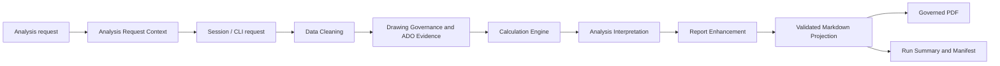

# F6 Governed Report Context and Requirements Design

## 1. 目标

在不改变 TA 计算公式、优化顺序和五文件发布合同的前提下，增强 F6 PDF 报告的时间语义、Drawing Governance/ADO 可追溯性、Process and Requirements 检查、统计图表达和视觉一致性。

本设计解决以下问题：

1. `Report Generated At` 改为分析需求实际发起时间，并使用发起方当时的 UTC offset。
2. Blocked worksheet 的 Required Action 使用完整产品能力名称，不显示内部阶段代号。
3. 所有 `MISSING` 使用红色粗体；个位数字 DIM ID 使用黄色粗体提示。
4. Process and Requirements 从 Factor guidance 摘要升级为确定性的 worksheet 检查清单。
5. Statistical Range 每行绘制 LSL/USL，显示黑色 lower-to-upper 范围，不显示 margin。
6. Tolerance Path Image 图文比例改为 6:4。
7. 报告颜色统一使用用户提供的 image3 RGB 调色板。

## 2. 非目标

- 不改变 F4 的计算公式、Cp/Cpk/yield/DPM 计算或状态判定。
- 不改变 F6 Step 1/2/3 优化顺序、停止条件或 requirement-change 审批规则。
- 不在 PDF renderer 中推断或计算新的工程数值。
- 不自动创建或更新 ADO work item。
- 不修改历史 F6 run；历史产物继续只读验证。
- 不改变 `f6-artifact-set-v3` 的五文件集合、hash、受控图片路径或 manifest-last 发布顺序。

## 3. 总体架构



报告只消费已验证的数据：

- 请求时间与时区来自 `AnalysisRequestContext`。
- ADO 状态、操作、组织、项目和 ID 来自结构化 Drawing Governance 证据；报告链接由这些已验证字段确定性构造。
- 输入/输出完整性来自 F2/F4。
- Missing Drawing/DIM 状态来自 F3。
- 统计范围和 capability 来自 F4/F6 projection。
- PDF renderer 只负责结构和样式，不补造证据。

## 4. Analysis Request Context

### 4.1 新增受控上下文

新增严格结构：

```ts
interface AnalysisRequestContext {
  requestedAt: string;       // ISO-8601 instant
  utcOffsetMinutes: number;  // requester offset at requestedAt
  source: "web" | "vscode" | "cli";
}
```

约束：

- `requestedAt` 必须是有效 ISO instant。
- `utcOffsetMinutes` 必须在 `-840` 到 `840` 分钟之间。
- Web/VS Code 在收到用户发起分析的 turn 时自动记录。
- 服务端时间是 instant authority；客户端只提供当时 UTC offset，不能覆盖 instant。
- CLI 可显式提供请求上下文；未提供时，以命令接收时刻和本机 offset 建立上下文并将来源标记为 `cli`，不得从语言或地区猜测。
- 同一次分析流程重试时保持原始 `requestedAt`，不得改成 F6 run 时间。

### 4.2 报告显示

首页字段保留现有位置，标签改为 `Analysis Requested At`。格式示例：

```text
2026-09-16 08:30:12 (UTC-7)
```

报告可另外保留 manifest/run summary 的生成时间，但不在首页用它冒充需求发起时间。

### 4.3 兼容策略

- 新 run 必须包含 `AnalysisRequestContext`。
- 历史 run 缺失该字段时，validator 继续按历史 artifact version 只读接受。
- 不回写历史 run。

## 5. ADO Traceability Contract

### 5.1 结构化字段

Drawing Governance 的 ADO outcome 扩展为：

```ts
interface AdoTraceability {
  status: "not_requested" | "draft_ready" | "confirmation_required" |
          "updated" | "blocked" | "failed";
  operation?: "created" | "updated";
  organization?: string;
  project?: string;
  workItemId?: number;
  reasonCode?: string;
}
```

约束：

- `operation`、`organization`、`project` 和 `workItemId` 只能来自 Surface readback 后的受控结果。
- 用户提供的 ADO URL 只用于临时验证，不持久化、不写入 artifact，也不传入 CLI。
- 临时 URL 中的组织、项目和 ID 必须与 Surface readback 一致。
- 新报告仅从已验证并持久化的 `organization`、`project` 和 `workItemId` 构造 HTTPS 链接。
- 旧的自由格式 reference 仅用于历史兼容，不用于新报告生成超链接。
- 任一结构化字段缺失或不一致时不得生成链接。

### 5.2 报告规则

- 已创建或更新：显示 `Created/Updated Work Item #<id>` 和可点击链接。
- `not_requested`：显示 `MISSING - ADO traceability was not initiated.`
- blocked/failed：显示 `WARNING` 和受控原因，不显示伪造 URL。
- 同时列出尚未记录到 ADO 的缺失 Drawing Number/DIM ID，使用 worksheet Factor ordinal 和名称定位。

## 6. Required Action 文案

Blocked worksheet 不再显示内部阶段简称。采用完整产品能力名称：

```text
Resolve Data Cleaning evidence before Calculation Engine,
Analysis Interpretation, and Report Enhancement.
```

术语映射：

| 内部来源 | 用户可见名称 |
|---|---|
| F2 | Data Cleaning |
| F4 | Calculation Engine |
| F5 | Analysis Interpretation |
| F6 | Report Enhancement |

报告中不显示内部 feature ID。

## 7. Process and Requirements 检查模型

### 7.1 输出结构

每个 ready worksheet 显示最多七条精简检查：

1. Analysis Method
2. Input Completeness
3. Output Completeness
4. Tolerance Validity
5. Drawing and DIM Governance
6. ADO Traceability
7. Target Sigma

状态只有：

- `COMPLETE`
- `WARNING`
- `MISSING`

显示优先级为 `MISSING > WARNING > COMPLETE`。每条检查先显示状态，再显示一句正式结论。全部满足时只显示 `Complete`，不重复展开字段。

### 7.2 Analysis Method

| 条件 | 输出 |
|---|---|
| Factor 数量 `< 4` | `WARNING - Consider Worst Case as the primary assessment method.` |
| Factor 数量 `4-10` | `COMPLETE - Statistical stack size is suitable for the current assessment.` |
| Factor 数量 `> 10` | `WARNING - Consider 3D Variation Analysis for the current stack complexity.` |

文案不得在同一句中同时出现 `one-dimensional` 和数字 `10`。

### 7.3 Input Completeness

检查：

- Factor description
- Part name/category
- Drawing Number
- DIM ID
- Nominal
- Upper/lower tolerance
- Sigma level
- Distribution
- Required evidence

全部满足：

```text
COMPLETE - Required TA inputs are complete.
```

存在缺失时：按 Factor ordinal 汇总缺失字段，不重复完整表格。

### 7.4 Output Completeness

检查：

- Lower Specification Limit
- Upper Specification Limit
- Target Sigma Level

全部满足：

```text
COMPLETE - Specification limits and target sigma are available.
```

缺失时逐项标记 `MISSING`；范围无效时标记 `WARNING`。

### 7.5 Tolerance Validity

确定性规则：

- `upperTolerance <= lowerTolerance`：`WARNING`，列出 Factor。
- F2 已有 `factor_tolerance_range_invalid`：`WARNING`，列出 Factor/row。
- 受控 process guidance 不覆盖：`WARNING`，不得称为 process failure。
- 其余：`COMPLETE - Factor tolerance ranges are valid.`

### 7.6 Drawing and DIM Governance

- Drawing Number/DIM ID 缺失：`MISSING`，按 Factor ordinal 汇总。
- DIM ID 为单个数字：`WARNING - DIM ID requires engineering review.`
- governance status 不完整：`WARNING`。
- 全部满足：`COMPLETE - Drawing and DIM traceability is complete.`

### 7.7 ADO Traceability

按第 5 节规则显示。缺失尺寸记录必须来自 F2/F3 的受控 rows，不从图片 OCR 或 interpretation prose 推断。

### 7.8 Target Sigma Recommendation

优先级已确认：

1. Battery related：6σ
2. Gap/Step：3σ
3. Other：4σ

分类依据：

- 优先使用受控 `analysisObject.kind`。
- Battery 需要新增受控 domain classification，不能只靠 worksheet 名称猜测。
- 历史数据没有 domain classification 时，可显示 `WARNING - Product-domain classification is missing; default recommendation is 4σ.`，不得静默推断 Battery。

结果表达：

- 当前值等于推荐值：`COMPLETE`。
- 当前值缺失：`MISSING`。
- 当前值与推荐值不同：`WARNING`，同时显示 current 和 recommended。

## 8. Factor Table 标记

### 8.1 MISSING

所有可见 `MISSING`：

- 红色
- 粗体
- 保持文本可复制
- 不依赖颜色作为唯一信号

CSS 使用语义 class，不做全局字符串替换，防止修改正文中非状态文本。

### 8.2 单数字 DIM ID

仅 DIM ID cell 满足 `^\d$` 时：

- 黄色粗体
- 添加可见 review indicator 或 `title`/accessible label
- 不把多位合法数字、字母数字 ID 误标记

## 9. Statistical Results

每个 3σ、4σ、6σ、Worst Case row：

- 绘制相同位置的 LSL/USL 竖线。
- LSL/USL 标签只在图顶部显示一次。
- 计算范围使用黑色文字：`lower to upper`。
- 不显示 margin 文本。
- PASS/FAIL 状态保留。
- 图形位置继续使用同一 numeric domain，不能改变工程数值。

## 10. Tolerance Path Image

图文比例改为 6:4：

- 图片宽度 60%。
- interpretation 文本宽度 40%。
- 图片保持 `object-fit: contain`，不得裁切。
- 模型免责声明每个 worksheet 只保留一处斜体。

## 11. Image3 调色板

报告只使用 image3 中标注的 RGB 颜色。核心 token：

| Token | RGB | Hex | 用途 |
|---|---:|---:|---|
| Rich Black | `0, 0, 0` | `#000000` | 主标题、表头、主要边线 |
| White | `255, 255, 255` | `#FFFFFF` | 高对比文字 |
| Light Gray | `242, 242, 242` | `#F2F2F2` | 浅背景 |
| Mid Gray | `210, 210, 210` | `#D2D2D2` | 次级边线 |
| Dark Gray | `80, 80, 80` | `#505050` | 次级文字 |
| Orange | `255, 147, 73` | `#FF9349` | Process/Warning panel |
| Yellow | `254, 240, 0` | `#FEF000` | DIM ID review、warning accent |
| Green | `155, 240, 11` | `#9BF00B` | Proposed/complete accent |
| Aqua | `48, 229, 208` | `#30E5D0` | Contributor/data accent |
| Cyan | `80, 230, 255` | `#50E6FF` | Statistical/capability accent |
| Purple | `213, 157, 255` | `#D59DFF` | Secondary analysis accent |
| Dark Red | `167, 41, 41` | `#A72929` | Missing/failure |

使用原则：

- 页面不能由单一色相主导。
- `MISSING` 使用 Dark Red + 粗体。
- Warning 使用 Orange/Yellow，并保留文字状态。
- Complete/Proposed 使用 Green。
- Current specification 使用 Dark Red；Proposed specification 使用 Green。
- 所有组合满足可读性；浅色背景上使用 Rich Black 正文。

## 12. 错误处理与安全

- 请求上下文缺失或无效：新 workflow fail closed；历史 artifact 按历史 contract 只读处理。
- ADO 组织、项目或 ID 缺失/不一致：拒绝生成超链接并显示受控 warning。
- Process check 缺少必要事实：显示 `MISSING`，不猜测。
- Battery classification 缺失：显示 warning 并使用明确的 default recommendation，不冒充确定分类。
- PDF 渲染、hash、signature 或原子发布失败：整个 F6 run 失败。
- 模型 interpretation、图片或 PDF bytes 不发送到网络服务。

## 13. 测试策略

### 13.1 Contract Tests

- `AnalysisRequestContext` 时间、offset 边界、严格字段和历史兼容。
- ADO operation/organization/project/ID 一致性、临时 URL 验证和 URL 不持久化。
- Battery/Gap/Step/Other 分类优先级。

### 13.2 Projection Tests

- 首页使用原始 request instant 与 offset，不使用 F6 run time。
- Required Action 无内部阶段代号。
- 七项 Process checks 的 COMPLETE/WARNING/MISSING 分支。
- ADO created/updated/not-requested/blocked/failed 分支。
- Battery 优先 6σ，Gap/Step 3σ，Other 4σ。
- 所有工程数值来自 F2/F3/F4/F6 受控数据。

### 13.3 Renderer Tests

- 所有 MISSING cell 红色粗体。
- 单数字 DIM ID 黄色粗体。
- 每个 range row 有 LSL/USL line，范围文字为黑色且无 margin。
- Tolerance Path Image 图文为 6:4。
- CSS 颜色只引用 image3 token。
- worksheet 仍保持一页，长文本不重叠、不裁切。

### 13.4 End-to-End Gate

- Build 与 F6 focused/full-flow tests。
- 生成真实 governed PDF。
- 验证五文件、hash、`%PDF-` signature 和 manifest-last。
- Playwright 截图检查 overview、ready worksheet、blocked worksheet、ADO linked/missing 状态。
- PDF 页数必须等于 overview 一页加 worksheet 数量。

## 14. 实施顺序

1. 新增 request context 与 ADO traceability contracts/test。
2. 从 Web/VS Code/CLI 入口传递 request context。
3. 从 Drawing Governance readback 保存结构化 ADO 证据。
4. F6 loader/projection 消费新字段并生成检查清单。
5. Renderer 实现状态标记、range lines、6:4 图文和 image3 palette。
6. 运行 contract、projection、renderer、full-flow 和 governed PDF 验收。

每一步先写失败测试，再做最小实现；不得在 renderer 中补造缺失工程数据。